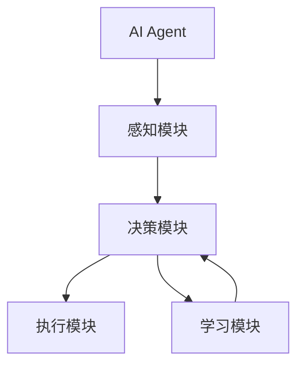
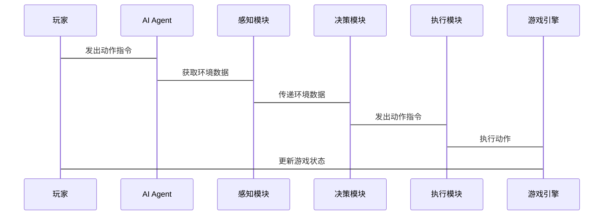

                 


# AI Agent在游戏产业中的应用

> 关键词：AI Agent，游戏产业，人工智能，机器学习，深度学习，自然语言处理，强化学习，博弈论

> 摘要：本文深入探讨了AI Agent在游戏产业中的应用，分析了AI Agent的基本概念、技术基础、算法原理、系统架构设计以及实际项目中的应用案例。通过详细的技术分析和实例，本文展示了AI Agent如何推动游戏产业的智能化发展。

---

# 第1章: AI Agent的基本概念与背景介绍

## 1.1 AI Agent的定义与核心概念

### 1.1.1 问题背景与问题描述

AI Agent（人工智能代理）是一种能够感知环境、自主决策并执行任务的智能实体。在游戏产业中，AI Agent通常被用于模拟游戏角色的行为，使其具备类似人类的智能决策能力。传统游戏中的AI主要基于规则引擎或脚本实现，而AI Agent的引入使得游戏角色的行为更加智能和多样化。

### 1.1.2 AI Agent的核心要素与概念结构

AI Agent的核心要素包括：
1. **感知能力**：通过传感器或游戏环境数据感知外部世界。
2. **决策能力**：基于感知信息，通过算法做出决策。
3. **执行能力**：根据决策执行动作，与环境或玩家交互。
4. **学习能力**：通过机器学习或强化学习不断提升智能水平。

### 1.1.3 AI Agent与传统游戏AI的区别

| 特性         | 传统游戏AI                     | AI Agent                      |
|--------------|--------------------------------|--------------------------------|
| 决策方式     | 基于规则或脚本                 | 基于机器学习或强化学习         |
| 灵活性       | 较低，固定行为模式               | 较高，能够动态调整策略           |
| 学习能力     | 无或有限                       | 具备自主学习能力                 |
| 适应性       | 有限                           | 强，能够适应复杂环境             |

---

## 1.2 游戏产业中的AI应用现状

### 1.2.1 游戏产业的数字化转型

随着游戏产业的快速发展，玩家对游戏体验的要求越来越高。传统的游戏开发方式逐渐暴露出效率低、成本高的问题。AI技术的引入为游戏产业带来了新的发展机遇。

### 1.2.2 AI技术在游戏开发中的潜在价值

AI技术可以帮助游戏开发者：
- 自动生成游戏内容（如关卡设计、任务流程）。
- 智能化NPC行为，提升玩家体验。
- 实现实时游戏推荐，提高用户留存率。

### 1.2.3 当前AI Agent在游戏中的应用边界

目前，AI Agent在游戏中的应用主要集中在：
- NPC行为控制
- 自动化游戏内容生成
- 玩家行为分析与个性化推荐

---

## 1.3 AI Agent在游戏产业中的结合与创新

### 1.3.1 游戏智能化的驱动力

玩家对高质量游戏体验的需求，以及游戏公司对成本控制和效率提升的需求，推动了AI技术在游戏产业中的应用。

### 1.3.2 AI Agent在游戏中的应用场景

- **NPC行为控制**：通过强化学习让NPC具备自主决策能力。
- **玩家行为预测**：通过机器学习分析玩家行为模式。
- **游戏内容生成**：利用生成模型自动设计游戏关卡。

### 1.3.3 游戏产业中的AI Agent发展趋势

- **智能化**：AI Agent将更加智能化，能够理解玩家情感和意图。
- **个性化**：根据玩家偏好提供个性化游戏体验。
- **实时互动**：实现更实时、更自然的玩家与游戏互动。

---

# 第2章: AI Agent的核心概念与技术基础

## 2.1 AI Agent的核心原理

### 2.1.1 AI Agent的基本原理

AI Agent通过感知环境、分析信息、做出决策并执行动作，实现与玩家的互动。其核心在于决策算法的设计和优化。

### 2.1.2 AI Agent的决策机制

AI Agent的决策机制通常包括以下步骤：
1. **感知环境**：收集环境数据。
2. **分析信息**：通过算法处理数据，生成决策。
3. **执行动作**：根据决策结果采取行动。

### 2.1.3 AI Agent的学习与自适应能力

通过强化学习，AI Agent可以在与玩家的互动中不断优化自己的行为策略。

---

## 2.2 AI Agent的关键技术

### 2.2.1 机器学习与深度学习

- **机器学习**：通过数据训练模型，使其能够识别模式。
- **深度学习**：利用多层神经网络，实现更复杂的模式识别。

### 2.2.2 自然语言处理

- **自然语言处理（NLP）**：用于实现AI Agent的对话能力，使其能够理解玩家的语言输入。

### 2.2.3 强化学习与博弈论

- **强化学习**：通过奖励机制优化AI Agent的决策策略。
- **博弈论**：用于分析AI Agent与玩家之间的互动关系。

---

## 2.3 AI Agent在游戏中的核心属性

### 2.3.1 智能性与自主性

AI Agent需要具备独立思考和自主决策的能力，以应对复杂的游戏环境。

### 2.3.2 行为决策的多样性

通过强化学习和生成模型，AI Agent可以生成多样化的决策路径。

### 2.3.3 与玩家的交互性

AI Agent需要能够与玩家进行实时互动，理解玩家的情感和意图。

---

# 第3章: AI Agent的技术基础与实现原理

## 3.1 机器学习与深度学习基础

### 3.1.1 机器学习的基本概念

- **监督学习**：基于标注数据进行模型训练。
- **无监督学习**：从无标注数据中发现模式。

### 3.1.2 深度学习的核心算法

- **卷积神经网络（CNN）**：常用于图像识别任务。
- **循环神经网络（RNN）**：适合处理序列数据。

### 3.1.3 神经网络的结构与功能

神经网络由多个层次组成，每一层负责处理特定类型的信息。

---

## 3.2 自然语言处理与对话系统

### 3.2.1 NLP的核心技术

- **词嵌入**：将单词或短语映射为向量。
- **序列模型**：用于处理文本序列。

### 3.2.2 对话系统的实现原理

对话系统通常包括自然语言理解（NLU）和自然语言生成（NLG）两个部分。

### 3.2.3 NLP在游戏中的应用案例

例如，AI Agent可以通过NLP技术实现与玩家的自然对话。

---

## 3.3 强化学习与博弈论

### 3.3.1 强化学习的基本原理

- **状态（State）**：环境当前的状况。
- **动作（Action）**：AI Agent采取的行动。
- **奖励（Reward）**：对动作的反馈。

### 3.3.2 博弈论在AI Agent中的应用

- **纳什均衡**：用于分析多个玩家之间的策略互动。

### 3.3.3 强化学习在游戏AI中的实现

通过强化学习，AI Agent可以在游戏中不断优化自己的策略。

---

# 第4章: AI Agent的算法原理与实现

## 4.1 决策树算法

### 4.1.1 决策树的基本原理

决策树是一种树状结构，用于表示可能的决策路径。

### 4.1.2 决策树的实现步骤

1. **数据预处理**：清洗数据，处理缺失值。
2. **特征选择**：选择重要的特征。
3. **树的构建**：递归地划分数据集。
4. **剪枝**：避免过拟合。

### 4.1.3 决策树的优缺点

- **优点**：易于理解和实现。
- **缺点**：对噪声数据敏感，容易过拟合。

### 4.1.4 决策树的Python实现示例

```python
from sklearn.tree import DecisionTreeClassifier
from sklearn.model_selection import train_test_split

# 示例数据
X = [[2, 3], [5, 5], [6, 6], [3, 4]]
y = [0, 1, 1, 0]

# 划分训练集和测试集
X_train, X_test, y_train, y_test = train_test_split(X, y, test_size=0.3)

# 初始化决策树模型
model = DecisionTreeClassifier()

# 训练模型
model.fit(X_train, y_train)

# 预测
print(model.predict(X_test))
```

---

## 4.2 强化学习算法

### 4.2.1 强化学习的基本原理

强化学习通过智能体与环境的互动，学习最优策略。

### 4.2.2 强化学习的核心要素

- **状态（State）**：环境当前的状况。
- **动作（Action）**：智能体采取的行动。
- **奖励（Reward）**：对动作的反馈。

### 4.2.3 强化学习的实现步骤

1. **环境初始化**：设置初始状态。
2. **选择动作**：基于当前策略选择动作。
3. **执行动作**：更新环境状态。
4. **获得奖励**：根据动作结果获得奖励。
5. **更新策略**：基于奖励调整策略。

### 4.2.4 强化学习的Python实现示例

```python
import gym
from gym import spaces
from gym.utils import seeding

# 自定义强化学习环境
class GameEnv(gym.Env):
    def __init__(self):
        super(GameEnv, self).__init__()
        self.observation_space = spaces.Discrete(5)
        self.action_space = spaces.Discrete(3)
        self._seed = 0
        self.reset()

    def _reset(self):
        self._seed = 0
        return self._seed

    def _step(self, action):
        reward = 0.0
        done = False
        # 根据动作更新状态并计算奖励
        if action == 0:
            self._seed += 1
            reward = 1.0
            if self._seed >= 4:
                done = True
        elif action == 1:
            self._seed -= 1
            reward = -1.0
        elif action == 2:
            reward = 0.0
        return self._seed, reward, done, {}

# 初始化环境
env = GameEnv()
env.seed(123)

# 初始化策略
policy = [0.5, 0.3, 0.2]

# 训练过程
for _ in range(100):
    state = env.reset()
    done = False
    while not done:
        action = policy.index(max(policy))
        next_state, reward, done, _ = env.step(action)
        # 更新策略
        policy[action] += 0.1 * reward
        policy = [p / sum(policy) for p in policy]
```

---

## 4.3 生成模型

### 4.3.1 生成模型的基本原理

生成模型通过学习数据分布，生成新的数据。

### 4.3.2 生成模型的核心算法

- **变分自编码器（VAE）**：用于生成连续数据。
- **生成对抗网络（GAN）**：通过对抗训练生成数据。

### 4.3.3 生成模型的Python实现示例

```python
import torch
import torch.nn as nn

# 定义生成器
class Generator(nn.Module):
    def __init__(self):
        super(Generator, self).__init__()
        self.fc1 = nn.Linear(100, 256)
        self.fc2 = nn.Linear(256, 128)
        self.fc3 = nn.Linear(128, 64)
        self.fc4 = nn.Linear(64, 32)
        self.fc5 = nn.Linear(32, 16)
        self.fc6 = nn.Linear(16, 8)

    def forward(self, x):
        x = torch.relu(self.fc1(x))
        x = torch.relu(self.fc2(x))
        x = torch.relu(self.fc3(x))
        x = torch.relu(self.fc4(x))
        x = torch.relu(self.fc5(x))
        x = torch.relu(self.fc6(x))
        return x

# 定义判别器
class Discriminator(nn.Module):
    def __init__(self):
        super(Discriminator, self).__init__()
        self.fc1 = nn.Linear(8, 16)
        self.fc2 = nn.Linear(16, 32)
        self.fc3 = nn.Linear(32, 64)
        self.fc4 = nn.Linear(64, 128)
        self.fc5 = nn.Linear(128, 256)
        self.fc6 = nn.Linear(256, 1)

    def forward(self, x):
        x = torch.relu(self.fc1(x))
        x = torch.relu(self.fc2(x))
        x = torch.relu(self.fc3(x))
        x = torch.relu(self.fc4(x))
        x = torch.relu(self.fc5(x))
        x = torch.sigmoid(self.fc6(x))
        return x

# 初始化生成器和判别器
generator = Generator()
discriminator = Discriminator()
```

---

## 4.4 算法原理的数学模型

### 4.4.1 决策树的数学模型

决策树是一种基于条件概率的分类模型，其核心在于特征选择和分割策略。

### 4.4.2 强化学习的数学模型

强化学习的核心是马尔可夫决策过程（MDP），通过状态-动作-奖励的循环优化策略。

### 4.4.3 生成模型的数学模型

生成模型通过概率分布生成数据，GAN通过生成器和判别器的对抗训练实现数据生成。

---

# 第5章: AI Agent的系统架构设计

## 5.1 问题场景介绍

在游戏产业中，AI Agent需要实现智能化的NPC行为控制和玩家互动。

## 5.2 系统功能设计

- **感知模块**：收集游戏环境数据。
- **决策模块**：基于感知数据做出决策。
- **执行模块**：根据决策执行动作。
- **学习模块**：通过强化学习优化策略。

## 5.3 系统架构设计



## 5.4 系统接口设计

- **输入接口**：接收玩家输入和环境数据。
- **输出接口**：输出AI Agent的动作指令。

## 5.5 系统交互流程



---

# 第6章: AI Agent的项目实战

## 6.1 环境安装

- **Python**：安装Python 3.8及以上版本。
- **依赖库**：安装TensorFlow、Keras、OpenAI Gym等。

## 6.2 系统核心实现

### 6.2.1 环境初始化

```python
import gym
env = gym.make('CartPole-v0')
env.seed(42)
```

### 6.2.2 策略训练

```python
import gym
import numpy as np

env = gym.make('CartPole-v0')
env.seed(42)

policy = np.array([0.5, 0.5])
gamma = 0.99
epsilon = 0.1

for episode in range(1000):
    state = env.reset()
    done = False
    while not done:
        if np.random.random() < epsilon:
            action = env.action_space.sample()
        else:
            if policy[0] > policy[1]:
                action = 0
            else:
                action = 1
        next_state, reward, done, _ = env.step(action)
        policy[action] += 0.1 * reward * (1 - gamma**episode)
        policy = policy / sum(policy)
```

### 6.2.3 代码应用解读与分析

通过强化学习训练AI Agent在经典游戏CartPole中的控制策略。

---

## 6.3 实际案例分析

### 6.3.1 案例分析

训练AI Agent在CartPole游戏中保持平衡的案例，展示强化学习的应用。

### 6.3.2 详细讲解剖析

通过训练过程和结果分析，展示强化学习在游戏AI中的应用效果。

---

## 6.4 项目小结

通过本项目，我们实现了AI Agent在游戏中的应用，验证了强化学习的有效性。

---

# 第7章: AI Agent的扩展与展望

## 7.1 当前研究热点

- **多智能体协作**：研究多个AI Agent之间的协作与竞争。
- **情感计算**：实现AI Agent具备情感识别和表达能力。

## 7.2 未来发展趋势

- **元学习**：通过元学习提升AI Agent的通用性。
- **边缘计算**：在边缘设备上实现AI Agent的实时运行。

## 7.3 最佳实践 tips

- **数据质量**：确保训练数据的多样性和代表性。
- **模型优化**：通过剪枝和蒸馏等技术优化模型性能。

## 7.4 注意事项

- **计算资源**：强化学习需要大量的计算资源。
- **算法选择**：根据具体任务选择合适的算法。

---

# 结语

AI Agent正在逐步改变游戏产业的开发和运营方式。通过不断的技术创新和实践积累，AI Agent将为玩家带来更加智能化和个性化的游戏体验。

---

# 作者

作者：AI天才研究院/AI Genius Institute & 禅与计算机程序设计艺术 /Zen And The Art of Computer Programming

