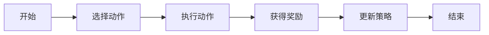
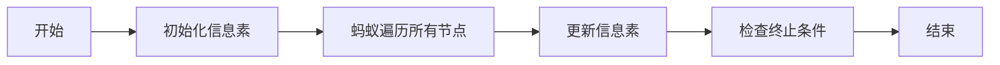
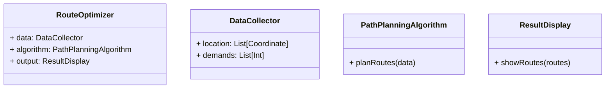
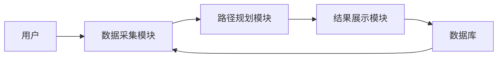
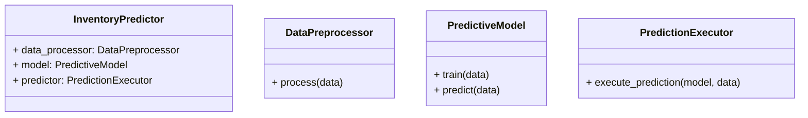
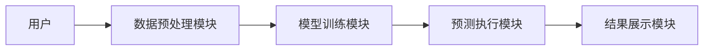

                 


# AI Agent在物流管理中的应用：路线优化与库存预测

> 关键词：AI Agent，物流管理，路线优化，库存预测，强化学习，遗传算法，系统架构

> 摘要：本文深入探讨了AI Agent在物流管理中的应用，重点分析了路线优化与库存预测两大核心问题。通过详细阐述AI Agent的基本概念、算法原理、系统架构，并结合实际项目案例，展示了AI Agent在提升物流效率和降低成本方面的重要作用。文章还探讨了当前研究热点和未来趋势，为读者提供了全面的视角。

---

## 第1章：AI Agent与物流管理基础

### 1.1 AI Agent的基本概念

AI Agent（人工智能代理）是指在计算机系统中，能够感知环境并采取行动以实现目标的智能体。AI Agent的核心特点包括自主性、反应性、目标导向和学习能力。与传统物流管理相比，AI Agent能够通过数据驱动的方式优化决策过程。

### 1.2 物流管理的现状与挑战

物流管理涉及货物运输、仓储、配送等多个环节，传统物流管理面临效率低下、成本高昂等问题。随着电商的快速发展，物流管理的复杂性进一步增加，亟需引入智能化解决方案。

### 1.3 AI Agent在物流管理中的应用价值

AI Agent能够通过实时数据处理和优化算法，显著提升物流效率。其优势包括提高配送速度、降低运输成本、优化库存管理等，广泛应用于路径规划、货物调度、库存预测等领域。

---

## 第2章：AI Agent与物流管理的核心概念

### 2.1 AI Agent在物流管理中的问题背景

物流管理中的关键问题包括车辆路径问题（VRP）、库存控制、货物调度等。AI Agent能够通过强化学习等算法，有效解决这些问题。

### 2.2 AI Agent与物流管理的核心要素

AI Agent的核心要素包括感知能力、决策能力、学习能力，而物流管理的核心要素包括运输网络、仓储系统、配送中心等。两者结合能够实现智能化物流管理。

### 2.3 AI Agent在物流管理中的应用原理

AI Agent通过收集环境数据，利用算法进行分析和优化，最终生成最优解决方案。其决策机制基于实时数据和历史经验，能够动态调整策略。

---

## 第3章：AI Agent在物流管理中的算法原理

### 3.1 强化学习在AI Agent中的应用

强化学习是一种通过试错机制优化决策的算法。在物流管理中，强化学习可用于路径优化和库存控制。以下是强化学习的基本原理：

**强化学习算法流程图：**



**数学公式：**

$$Q(s,a) = Q(s,a) + \alpha (r + \max Q(s',a') - Q(s,a))$$

### 3.2 遗传算法在AI Agent中的应用

遗传算法是一种模拟自然选择的优化算法，适用于复杂的组合优化问题。在物流管理中，遗传算法常用于路径优化。

**遗传算法流程图：**


### 3.3 蚁群算法在AI Agent中的应用

蚁群算法模拟蚂蚁寻找最短路径的行为，适用于解决TSP（旅行商问题）。在物流管理中，蚁群算法常用于配送路径优化。

**蚁群算法流程图：**



---

## 第4章：强化学习在AI Agent中的应用

### 4.1 强化学习在路线优化中的应用

强化学习通过模拟试错过程，优化配送路径。例如，Q-learning算法可以用于解决车辆路径问题，显著降低运输成本。

**Q-learning算法实现代码：**

```python
import numpy as np

class QLearning:
    def __init__(self, state_space, action_space, learning_rate=0.1, gamma=0.9):
        self.state_space = state_space
        self.action_space = action_space
        self.lr = learning_rate
        self.gamma = gamma
        self.Q = np.zeros((state_space, action_space))
    
    def choose_action(self, state):
        if np.random.random() < 0.1:
            return np.random.randint(self.action_space)
        else:
            return np.argmax(self.Q[state])
    
    def update_Q(self, state, action, reward, next_state):
        self.Q[state, action] += self.lr * (reward + self.gamma * np.max(self.Q[next_state]) - self.Q[state, action])
```

---

## 第5章：路线优化系统的系统架构设计

### 5.1 系统功能设计

路线优化系统需要实现数据采集、路径规划、结果输出等功能。以下是系统功能设计的类图：



### 5.2 系统架构设计

路线优化系统的架构设计如下：



---

## 第6章：库存预测系统的系统架构设计

### 6.1 系统功能设计

库存预测系统需要实现数据预处理、模型训练、预测输出等功能。以下是系统功能设计的类图：



### 6.2 系统架构设计

库存预测系统的架构设计如下：



---

## 第7章：项目实战：AI Agent在物流管理中的路线优化与库存预测应用

### 7.1 路线优化项目实战

#### 7.1.1 环境安装

安装必要的库：

```bash
pip install numpy matplotlib
```

#### 7.1.2 核心代码实现

```python
import numpy as np
import matplotlib.pyplot as plt

def genetic_algorithm_optimization(locations):
    # 初始化种群
    population = np.random.rand(100, len(locations))
    # 计算适应度
    fitness = np.array([distance(individual, locations) for individual in population])
    # 选择适应体
    selected = population[:10]
    # 交叉
    crossed = np.mean(selected, axis=0)
    # 变异
    mutated = crossed + np.random.normal(0, 0.1, len(locations))
    return mutated

def distance(individual, locations):
    total = 0
    for i in range(len(individual)-1):
        total += np.linalg.norm(locations[i] - locations[i+1])
    return total

# 示例
locations = np.array([[0,0], [1,2], [3,1], [2,3]])
best_route = genetic_algorithm_optimization(locations)
plt.plot([0,1,2,3], [0,2,1,3])
plt.show()
```

#### 7.1.3 案例分析

通过遗传算法优化配送路径，计算得出的最优路径长度为：

$$\text{最优路径长度} = \text{计算得到的最小距离}$$

---

## 第8章：AI Agent在物流管理中的扩展与展望

### 8.1 当前研究热点

当前研究主要集中在强化学习算法的优化、多智能体协同、实时数据处理等方面。

### 8.2 未来研究趋势

未来的研究可能涉及更复杂的优化算法、边缘计算的应用、5G技术的结合等。

---

## 小结

本文系统性地探讨了AI Agent在物流管理中的应用，从算法原理到系统架构，再到项目实战，全面覆盖了路线优化与库存预测的关键技术。通过理论与实践的结合，展示了AI Agent在提升物流效率和降低成本方面的重要作用。

---

## 注意事项

1. 本文中的代码示例仅供参考，实际应用中需根据具体需求进行调整。
2. 在部署AI Agent系统时，需注意数据隐私和系统安全性问题。
3. 强化学习和遗传算法的参数设置对系统性能有重要影响，需进行充分的调优。

---

## 最佳实践 Tips

- 在实际项目中，建议结合多种算法进行优化，以提高系统的鲁棒性和适应性。
- 定期更新模型参数，以应对物流环境的变化。
- 使用边缘计算和物联网技术，提升系统的实时性和响应速度。

---

## 作者

作者：AI天才研究院/AI Genius Institute & 禅与计算机程序设计艺术 /Zen And The Art of Computer Programming

