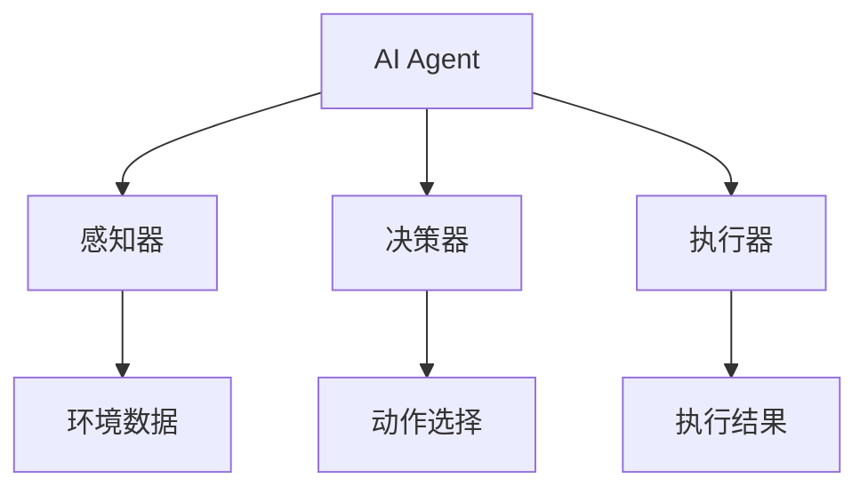
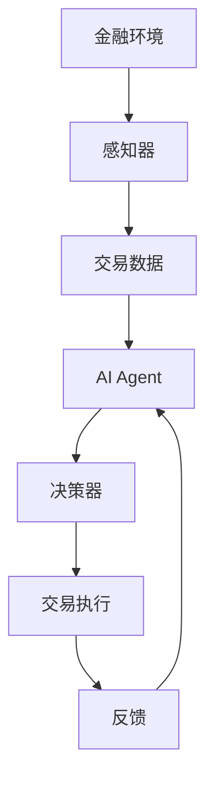
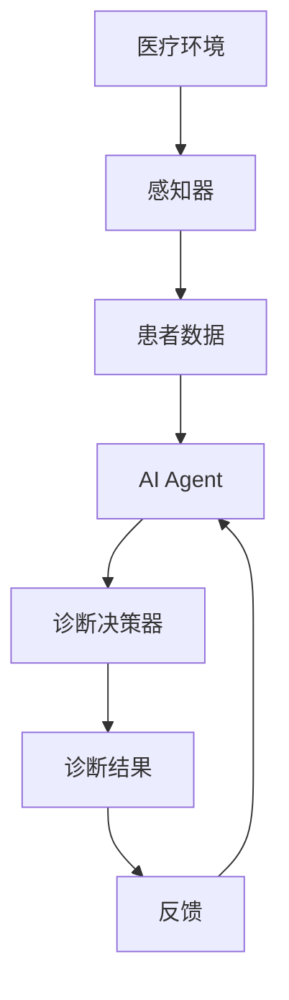
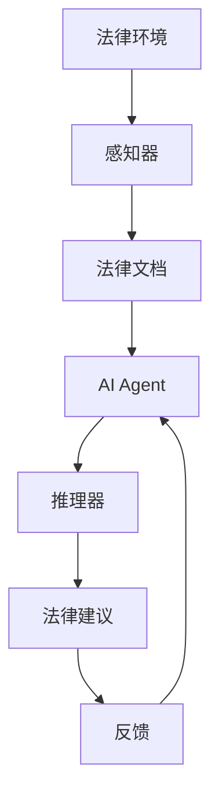
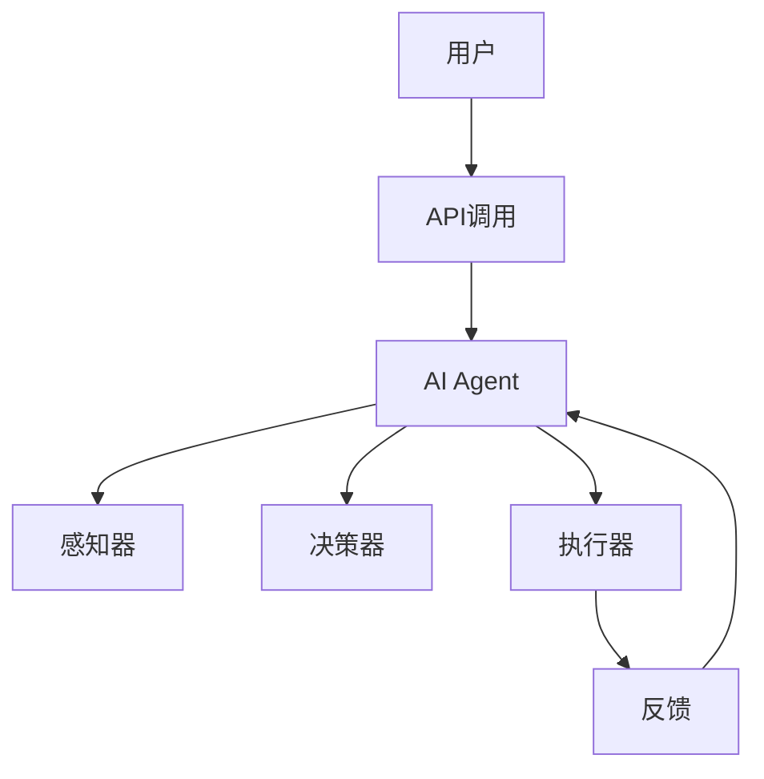
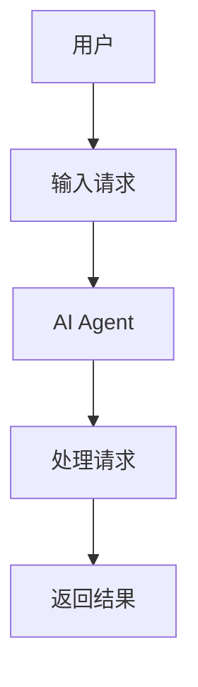

                 


# AI Agent在特定领域的应用：金融、医疗、法律等

## 关键词：AI Agent，人工智能，金融，医疗，法律，技术应用，系统架构

## 摘要：本文系统地探讨了AI Agent在金融、医疗、法律等领域的应用，从核心概念、算法原理到系统架构，结合实际案例，深入分析了AI Agent在各领域的优势与挑战。文章内容包括AI Agent的基础知识、行业应用、系统实现和未来展望，旨在为读者提供全面的技术视角和实践指导。

---

## 第一部分: AI Agent 的基础与核心概念

### 第1章: AI Agent 的基本概念与背景

#### 1.1 AI Agent 的定义与特点
- **1.1.1 什么是AI Agent**  
  AI Agent（人工智能代理）是一种能够感知环境、自主决策并执行任务的智能实体。它通过传感器获取信息，利用算法处理数据，并通过执行器与环境交互。

- **1.1.2 AI Agent的核心特点**  
  - 自主性：能够独立运作，无需人工干预。  
  - 反应性：能够实时感知环境并做出反应。  
  - 目标导向：基于预设目标执行任务。  
  - 学习能力：通过经验或数据优化行为。

- **1.1.3 AI Agent与传统AI的区别**  
  AI Agent强调与环境的动态交互，而传统AI更多关注静态问题求解。

#### 1.2 AI Agent 的技术背景
- **1.2.1 人工智能的发展历程**  
  从符号AI到机器学习，再到深度学习，AI技术的演进为AI Agent的发展奠定了基础。

- **1.2.2 为什么AI Agent成为热点**  
  - 技术进步：深度学习和强化学习的突破推动了AI Agent的发展。  
  - 应用需求：在金融、医疗等领域，对智能化决策的需求日益增长。  
  - 技术可行性：计算能力的提升使复杂任务的实现成为可能。

- **1.2.3 AI Agent的应用场景**  
  包括金融交易、医疗诊断、法律咨询、智能客服等领域。

#### 1.3 AI Agent 的核心能力
- **1.3.1 感知能力**  
  通过传感器或API获取环境数据，例如金融市场数据、患者医疗记录等。

- **1.3.2 决策能力**  
  利用算法（如强化学习、贝叶斯网络）做出最优决策，例如选择最优的投资组合。

- **1.3.3 执行能力**  
  通过执行器（如API调用、自动化工具）完成任务，例如执行交易指令或生成法律建议。

#### 1.4 AI Agent 的伦理与挑战
- **1.4.1 伦理问题**  
  数据隐私、决策透明性、责任归属等是AI Agent应用中的主要伦理问题。

- **1.4.2 技术挑战**  
  包括环境复杂性、数据不足、算法可解释性等问题。

- **1.4.3 应用边界**  
  AI Agent适用于结构化和半结构化任务，但在完全不确定或涉及高度情感的任务中仍需人类干预。

### 第2章: AI Agent 的核心概念与联系

#### 2.1 AI Agent 的核心原理
- **2.1.1 感知机制**  
  通过传感器或API获取环境数据，并进行预处理和特征提取。

- **2.1.2 决策机制**  
  利用算法（如强化学习、决策树）基于当前状态选择最优动作。

- **2.1.3 执行机制**  
  通过执行器将决策转化为实际操作，并反馈执行结果。

#### 2.2 AI Agent 的核心要素
- **2.2.1 知识表示**  
  将知识以符号、规则或概率模型的形式表示，例如医疗领域的疾病症状网络。

- **2.2.2 行为规划**  
  基于目标生成行动序列，例如金融领域的投资策略生成。

- **2.2.3 交互接口**  
  提供与用户或系统交互的界面，例如自然语言处理接口。

#### 2.3 AI Agent 与相关技术的联系
- **2.3.1 与知识图谱的关系**  
  知识图谱为AI Agent提供背景知识，例如医疗知识图谱用于辅助诊断。

- **2.3.2 与强化学习的关系**  
  强化学习算法用于训练AI Agent的决策能力，例如在金融交易中的策略优化。

- **2.3.3 与自然语言处理的关系**  
  NLP技术用于处理文本交互，例如在法律咨询中的合同分析。

#### 2.4 AI Agent 的实体关系图


### 第3章: AI Agent 的算法原理

#### 3.1 感知与学习算法
- **3.1.1 感知算法**  
  利用深度学习模型（如CNN、RNN）处理多模态数据。

- **3.1.2 学习算法**  
  强化学习（Q-Learning）用于动态环境中的决策优化。

#### 3.2 决策与执行算法
- **3.2.1 决策算法**  
  基于马尔可夫决策过程（MDP）进行状态转移和动作选择。

- **3.2.2 执行算法**  
  通过图灵测试模型验证AI Agent的交互能力。

#### 3.3 算法实现步骤
1. 数据预处理：清洗和特征提取。
2. 模型训练：使用强化学习算法训练AI Agent。
3. 接口设计：定义感知和执行的API。
4. 系统集成：将AI Agent嵌入目标系统。

#### 3.4 算法实现示例
```python
import numpy as np

# 强化学习算法实现
class AI-Agent:
    def __init__(self, state_space, action_space):
        self.state_space = state_space
        self.action_space = action_space
        self.Q = np.zeros((state_space, action_space))
    
    def perceive(self, state):
        # 感知环境状态
        return state
    
    def decide(self, state):
        # 根据Q-learning算法选择动作
        if np.random.random() < 0.1:
            return np.random.randint(self.action_space)
        else:
            return np.argmax(self.Q[state])
    
    def learn(self, state, action, reward, next_state):
        # Q-learning更新规则
        self.Q[state][action] = self.Q[state][action] + 0.1*(reward + np.max(self.Q[next_state]))
```

---

## 第二部分: AI Agent 在特定领域的应用

### 第4章: 金融领域的AI Agent应用

#### 4.1 金融领域的应用场景
- 金融交易：股票、外汇交易中的价格预测和策略生成。  
- 风险管理：信用评估、市场风险监控。  
- 客户服务：智能客服、投资建议。

#### 4.2 金融AI Agent的核心算法
- **4.2.1 价格预测算法**  
  使用LSTM进行时间序列预测，公式：  
  $$ P(t) = \alpha \cdot P(t-1) + \beta \cdot V(t) + \epsilon $$  

- **4.2.2 风险评估算法**  
  基于XGBoost的信用评分模型，公式：  
  $$ Score = \sum_{i=1}^{n} w_i \cdot feature_i $$  

#### 4.3 金融AI Agent的系统架构


### 第5章: 医疗领域的AI Agent应用

#### 5.1 医疗领域的应用场景
- 疾病诊断：辅助医生进行疾病识别和诊断。  
- 病历管理：自动化病历记录和分类。  
- 药物研发：加速新药发现和临床试验设计。

#### 5.2 医疗AI Agent的核心算法
- **5.2.1 疾病诊断算法**  
  基于卷积神经网络（CNN）的医学图像分析，公式：  
  $$ f(x) = \sigma(Wx + b) $$  

- **5.2.2 药物研发算法**  
  使用强化学习优化分子结构，公式：  
  $$ Reward = r(s, a) $$  

#### 5.3 医疗AI Agent的系统架构


### 第6章: 法律领域的AI Agent应用

#### 6.1 法律领域的应用场景
- 合同审查：自动识别合同中的法律风险。  
- 案例分析：辅助律师进行案例研究和法律推理。  
- 法律咨询：为用户提供法律建议和解答。

#### 6.2 法律AI Agent的核心算法
- **6.2.1 合同审查算法**  
  使用自然语言处理（NLP）模型进行文本分析，公式：  
  $$ Score = \sum_{i=1}^{n} w_i \cdot feature_i $$  

- **6.2.2 法律推理算法**  
  基于规则推理和案例库的相似度匹配，公式：  
  $$ Similarity = 1 - \frac{d(x,y)}{max(d)} $$  

#### 6.3 法律AI Agent的系统架构


---

## 第三部分: AI Agent 的系统架构与实现

### 第7章: 系统架构设计

#### 7.1 问题场景介绍
- **目标**：设计一个通用的AI Agent框架，支持多种领域应用。  
- **挑战**：领域知识差异大，系统需要高度模块化。

#### 7.2 系统功能设计
- **领域模型**：构建领域的知识图谱，例如医疗知识图谱。  
- **决策引擎**：实现多种决策算法，例如强化学习和规则推理。  
- **执行模块**：支持多种执行方式，例如API调用和自动化操作。

#### 7.3 系统架构设计


#### 7.4 系统接口设计
- **输入接口**：接收环境数据和用户请求。  
- **输出接口**：返回决策结果和执行反馈。

#### 7.5 系统交互设计


### 第8章: 项目实战

#### 8.1 环境安装
- 安装Python、TensorFlow、Keras等依赖库。

#### 8.2 系统核心实现
- **感知模块**：读取输入数据并进行预处理。  
- **决策模块**：基于强化学习算法生成决策。  
- **执行模块**：将决策转化为实际操作。

#### 8.3 代码实现示例
```python
import tensorflow as tf
from tensorflow.keras import layers

# 感知模块
class Perceptor:
    def __init__(self, input_shape):
        self.model = self.build_model(input_shape)
    
    def build_model(self, input_shape):
        model = tf.keras.Sequential()
        model.add(layers.Dense(64, activation='relu', input_shape=input_shape))
        model.add(layers.Dense(1, activation='sigmoid'))
        return model

# 决策模块
class DecisionMaker:
    def __init__(self, state_space, action_space):
        self.Q = np.zeros((state_space, action_space))
    
    def decide(self, state):
        return np.argmax(self.Q[state])
```

#### 8.4 案例分析
- **金融案例**：训练AI Agent进行股票交易，回测收益率。  
- **医疗案例**：在医疗数据集上训练疾病诊断模型，计算准确率和召回率。

#### 8.5 项目小结
- 项目实现了AI Agent的基本功能，验证了其在特定领域的可行性。  
- 未来可以进一步优化算法和扩展应用场景。

---

## 第四部分: 未来趋势与挑战

### 第9章: 未来发展趋势
- **技术趋势**：多模态AI Agent、可解释性AI、自适应学习。  
- **应用趋势**：向更多领域扩展，例如教育、交通等。

### 第10章: 应用挑战与解决方案
- **技术挑战**：算法可解释性、数据隐私、计算资源。  
- **解决方案**：采用解释性算法、联邦学习、边缘计算。

---

## 附录: AI Agent开发资源

### A.1 开发工具
- TensorFlow、PyTorch、Scikit-learn等。

### A.2 数据集
- Kaggle、UCI、医疗数据集等。

### A.3 术语表
- AI Agent：人工智能代理。  
- 强化学习：基于奖励机制的学习方法。  
- 知识图谱：结构化的知识表示。

---

## 作者：AI天才研究院/AI Genius Institute & 禅与计算机程序设计艺术 /Zen And The Art of Computer Programming

