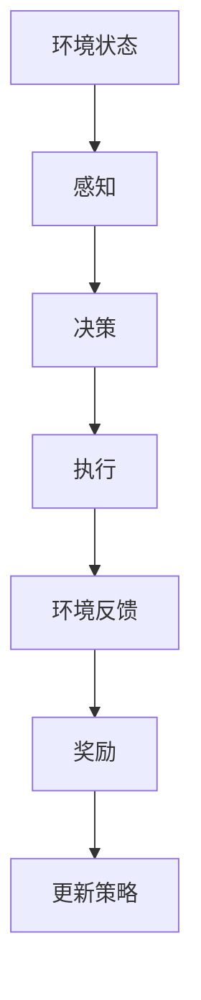
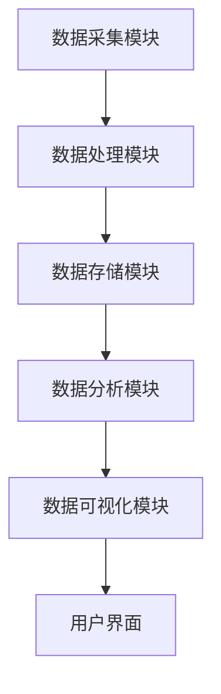

                 


# AI Agent在环境监测与保护中的角色

## 关键词：
AI Agent，环境监测，环境保护，人工智能，强化学习，系统架构

## 摘要：
本文深入探讨了AI Agent在环境监测与保护中的关键作用。通过分析AI Agent的基本概念、核心原理、算法实现、系统架构以及实际应用案例，详细阐述了AI Agent如何通过智能化手段提升环境监测的效率和准确性。文章结合强化学习算法和系统架构设计，展示了AI Agent在环境数据采集、分析、决策和执行中的广泛应用，并提供了具体的项目实战和最佳实践建议，为读者提供了一个全面的技术视角。

---

## 第1章: AI Agent与环境监测的背景介绍

### 1.1 AI Agent的基本概念
AI Agent（人工智能代理）是指能够感知环境、自主决策并执行任务的智能实体。AI Agent的核心特征包括自主性、反应性、目标导向和社会能力。它能够通过传感器或数据源获取信息，利用算法进行分析和决策，并通过执行器或接口与外部环境交互。

### 1.2 环境监测的基本概念
环境监测是指通过传感器、仪器或其他技术手段，对环境中的各种因素（如温度、湿度、空气质量、水质等）进行实时或周期性采集和分析的过程。环境监测的主要目标是评估环境质量、预测环境变化趋势，并为环境保护和治理提供科学依据。

### 1.3 AI Agent在环境监测中的结合点
AI Agent与环境监测的结合主要体现在以下几个方面：
1. **数据采集与处理**：AI Agent可以通过传感器网络实时采集环境数据，并利用机器学习算法进行数据清洗和预处理。
2. **智能决策与反馈**：AI Agent能够根据环境数据的变化，自主决策并触发相应的反馈机制，例如发出警报或启动治理设备。
3. **预测与优化**：AI Agent可以通过历史数据和模型预测环境变化趋势，并优化监测策略，提高监测效率。

---

## 第2章: AI Agent与环境监测的核心概念与联系

### 2.1 AI Agent的核心原理
AI Agent的工作原理可以分为三个主要模块：感知模块、决策模块和执行模块。

#### 2.1.1 感知模块
感知模块负责从环境中获取数据，通常包括传感器、摄像头或其他数据采集设备。AI Agent通过感知模块获取实时环境信息，并将其输入到决策模块中。

#### 2.1.2 决策模块
决策模块是AI Agent的核心部分，负责对感知到的数据进行分析和处理，并生成决策指令。决策模块通常基于机器学习算法（如强化学习、监督学习等）进行训练，以提高决策的准确性和效率。

#### 2.1.3 执行模块
执行模块负责根据决策模块生成的指令，执行具体的动作。例如，AI Agent可以控制阀门开关、启动警报系统或调整设备参数。

### 2.2 环境监测的核心原理
环境监测的核心原理包括数据采集、数据分析和数据可视化。通过传感器网络采集环境数据后，利用算法进行分析和建模，最终生成环境监测报告。

### 2.3 AI Agent与环境监测的系统架构
AI Agent与环境监测的系统架构可以分为以下几个部分：
1. **环境数据采集模块**：负责采集环境数据。
2. **AI Agent模块**：负责数据处理、分析和决策。
3. **环境数据存储模块**：负责存储环境数据和决策结果。
4. **环境数据可视化模块**：负责将环境数据以可视化形式呈现给用户。

#### 2.3.1 系统实体关系图（ER图）
以下是环境监测系统的核心实体关系图：

```mermaid
er
  actor: 环境监测系统
  entity: 环境数据
  entity: AI Agent
  entity: 监测设备
  relation: 环境监测系统 -> 环境数据: 采集
  relation: AI Agent -> 环境数据: 处理
  relation: AI Agent -> 监测设备: 控制
  relation: 监测设备 -> 环境数据: 传输
```

---

## 第3章: AI Agent的算法原理与实现

### 3.1 强化学习算法在AI Agent中的应用
强化学习是一种通过试错机制优化决策的算法。在环境监测中，强化学习可以用于优化监测策略和资源分配。

#### 3.1.1 强化学习的基本原理
强化学习的核心在于通过奖励机制，使AI Agent在与环境的交互中不断优化决策。具体流程如下：



#### 3.1.2 强化学习的数学模型
强化学习的数学模型通常包括状态、动作、奖励和策略四个部分。以下是强化学习中常用的价值函数更新公式：

$$ Q(s, a) = Q(s, a) + \alpha (r + \gamma \max Q(s', a') - Q(s, a)) $$

其中：
- \( Q(s, a) \) 表示状态 \( s \) 下动作 \( a \) 的价值。
- \( \alpha \) 是学习率。
- \( r \) 是奖励值。
- \( \gamma \) 是折扣因子。
- \( Q(s', a') \) 是下一个状态下的最大价值。

#### 3.1.3 强化学习的Python实现
以下是强化学习算法的简单实现代码：

```python
class Agent:
    def __init__(self, state_space, action_space):
        self.state_space = state_space
        self.action_space = action_space
        self.Q = defaultdict(lambda: np.zeros(len(action_space)))

    def take_action(self, state):
        # 根据策略选择动作
        return np.random.choice(self.action_space, p=self.Q[state]/np.sum(self.Q[state]))

    def update_Q(self, state, action, reward, next_state):
        # 更新Q值
        self.Q[state][action] += 0.1 * (reward + 0.9 * max(self.Q[next_state]) - self.Q[state][action])
```

---

## 第4章: 系统分析与架构设计

### 4.1 系统功能设计
环境监测系统的功能模块包括数据采集、数据处理、数据存储、数据分析和数据可视化。

#### 4.1.1 数据采集模块
数据采集模块负责从传感器或其他数据源获取环境数据，并将其传输到数据处理模块。

#### 4.1.2 数据处理模块
数据处理模块负责对采集到的环境数据进行预处理，包括数据清洗、归一化和特征提取。

#### 4.1.3 数据存储模块
数据存储模块负责将处理后的环境数据存储到数据库中，以便后续分析和查询。

#### 4.1.4 数据分析模块
数据分析模块利用机器学习算法对环境数据进行分析，生成环境监测报告。

#### 4.1.5 数据可视化模块
数据可视化模块将环境数据以图表形式呈现，帮助用户直观了解环境状况。

### 4.2 系统架构设计
环境监测系统的架构设计可以分为以下几个部分：



---

## 第5章: 项目实战与案例分析

### 5.1 项目实战
以下是环境监测系统的安装和实现步骤：

1. **环境安装**：
   ```bash
   pip install numpy pandas scikit-learn matplotlib
   ```

2. **核心代码实现**：
   ```python
   import numpy as np
   import pandas as pd
   from sklearn.metrics import mean_squared_error

   # 数据采集模块
   def collect_data():
       # 模拟环境数据采集
       data = pd.DataFrame({
           '温度': np.random.uniform(0, 100, 100),
           '湿度': np.random.uniform(0, 100, 100)
       })
       return data

   # 数据处理模块
   def process_data(data):
       data['时间'] = pd.date_range('2023-01-01', periods=len(data))
       return data

   # 数据分析模块
   def analyze_data(data):
       # 预测温度趋势
       model = linear_model.LinearRegression()
       model.fit(pd.get_dummies(data['时间']).values, data['温度'])
       predictions = model.predict(pd.get_dummies(data['时间']))
       return mean_squared_error(data['温度'], predictions)

   # 数据可视化模块
   def visualize_data(data):
       plt.plot(data['时间'], data['温度'])
       plt.xlabel('时间')
       plt.ylabel('温度')
       plt.show()
   ```

### 5.2 案例分析
以水质监测为例，AI Agent可以通过强化学习算法优化监测策略，例如动态调整监测频率和监测点位，从而提高监测效率和准确性。

---

## 第6章: 最佳实践与小结

### 6.1 最佳实践
1. **数据质量**：确保环境数据的准确性和完整性，避免噪声干扰。
2. **算法选择**：根据具体场景选择合适的算法，例如强化学习适用于动态环境。
3. **系统优化**：定期优化系统架构，提高系统的稳定性和扩展性。

### 6.2 小结
本文详细探讨了AI Agent在环境监测与保护中的关键作用，从算法原理到系统架构，再到实际应用案例，全面阐述了AI Agent如何通过智能化手段提升环境监测的效率和准确性。未来，随着AI技术的不断发展，AI Agent在环境监测中的应用前景将更加广阔。

---

## 作者：AI天才研究院 & 禅与计算机程序设计艺术

---

以上就是《AI Agent在环境监测与保护中的角色》的技术博客文章，涵盖背景介绍、核心概念、算法原理、系统架构、项目实战和最佳实践等内容。

