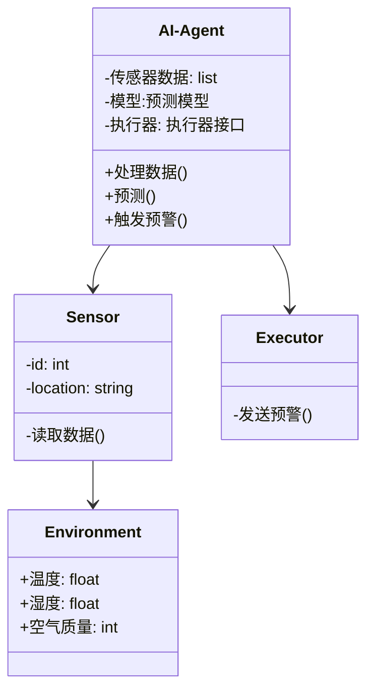
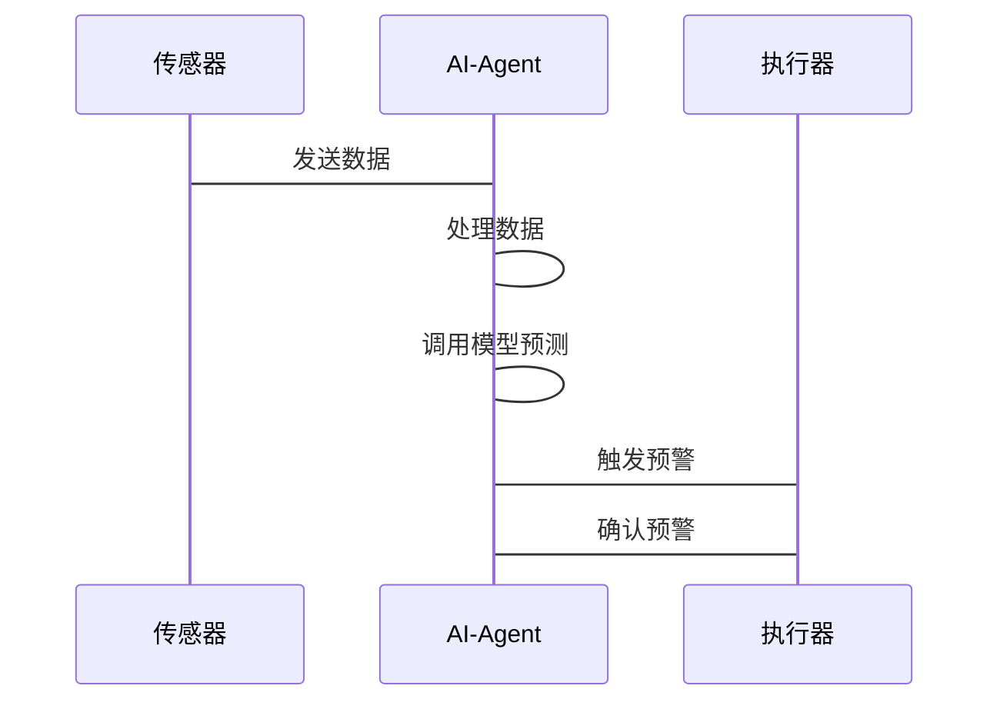

                 


# AI Agent在环境监测与预警中的实践

## 关键词：AI Agent, 环境监测, 环境预警, 强化学习, 系统架构, 项目实战

## 摘要：本文系统地探讨了AI Agent在环境监测与预警中的应用。从基本概念到算法原理，再到系统架构设计和实际案例分析，详细阐述了AI Agent在环境监测中的优势及其在实时数据处理、异常检测和决策支持中的具体应用。通过理论分析与实践结合，展示了AI Agent如何提升环境监测的效率和准确性。

---

# 第一部分: AI Agent在环境监测与预警中的背景介绍

## 第1章: AI Agent与环境监测的背景

### 1.1 AI Agent的基本概念

#### 1.1.1 AI Agent的定义
AI Agent（人工智能代理）是能够感知环境、自主决策并采取行动的智能实体。它通过传感器获取信息，利用算法进行处理，并通过执行器与环境互动。AI Agent的核心在于其自主性和智能性，能够适应动态变化的环境。

#### 1.1.2 AI Agent的核心特点
- **自主性**：无需外部干预，自主决策。
- **反应性**：实时感知环境并做出反应。
- **学习能力**：通过数据和经验提升性能。
- **协作性**：与其他Agent或系统协同工作。

#### 1.1.3 AI Agent与传统自动化的区别
| 特性        | AI Agent                     | 传统自动化                   |
|-------------|------------------------------|------------------------------|
| 决策能力     | 强大，基于数据学习           | 有限，基于预设规则           |
| 环境适应性   | 高，能适应动态变化           | 低，依赖固定条件             |
| 学习能力     | 具备，能通过反馈优化策略     | 无，无法自主优化             |

### 1.2 环境监测与预警的背景

#### 1.2.1 环境监测的定义与范围
环境监测是对环境质量及其变化趋势的系统性观察和测量，涵盖空气、水、土壤等多个方面。随着环境问题的加剧，环境监测的重要性日益凸显。

#### 1.2.2 环境监测的重要性与挑战
- **重要性**：及时发现环境问题，为政策制定提供依据。
- **挑战**：数据量大、实时性强、异常情况复杂。

#### 1.2.3 AI Agent在环境监测中的作用
AI Agent能够实时处理大量数据，快速识别异常，提供预警，显著提升环境监测的效率和准确性。

### 1.3 AI Agent在环境监测中的应用前景

#### 1.3.1 环境监测中的AI Agent的优势
- **高效性**：快速处理和分析数据。
- **准确性**：通过机器学习模型提升预测精度。
- **实时性**：及时响应环境变化。

#### 1.3.2 AI Agent在环境预警中的潜在应用
AI Agent可以通过分析历史数据，预测环境事件，如污染扩散，并提前发出预警。

#### 1.3.3 AI Agent面临的挑战与解决方案
- **挑战**：数据不足、计算资源限制、模型的可解释性。
- **解决方案**：数据增强、分布式计算、可解释性算法。

---

## 第2章: AI Agent的核心概念与环境监测的联系

### 2.1 AI Agent的核心概念

#### 2.1.1 AI Agent的类型与特点
| 类型        | 描述                       | 适用场景                     |
|-------------|----------------------------|------------------------------|
| 反应式Agent | 基于当前感知做出反应         | 实时监控、应急响应           |
| 计划式Agent | 提前规划行动                | 复杂任务调度、资源分配       |
| 学习式Agent | 通过经验优化行为            | 数据分析、预测模型训练       |

#### 2.1.2 AI Agent的决策机制
AI Agent通过感知输入、状态评估、行动选择和执行四个步骤完成决策。例如，在环境监测中，AI Agent接收传感器数据，评估当前环境状态，选择最优的预警方式，并通过执行器发布预警信息。

#### 2.1.3 AI Agent的感知与行动能力
AI Agent通过传感器（如摄像头、温度计）感知环境，并通过执行器（如警报系统、调节设备）与环境互动，实现监测和预警。

### 2.2 环境监测的核心要素

#### 2.2.1 环境数据的采集与处理
环境数据的采集包括空气污染指数、水质参数等，处理过程涉及数据清洗和特征提取。

#### 2.2.2 环境数据的分析与预测
利用机器学习模型对环境数据进行建模，预测未来趋势，识别潜在风险。

#### 2.2.3 环境预警的触发机制
基于预设阈值或模型预测结果，触发预警机制，通知相关部门。

### 2.3 AI Agent与环境监测的结合

#### 2.3.1 AI Agent在环境数据处理中的应用
AI Agent能够实时处理环境数据，识别异常值，生成预警信息。

#### 2.3.2 AI Agent在环境预警中的角色
作为环境监测系统的核心，AI Agent负责数据处理、模型预测和决策制定。

#### 2.3.3 AI Agent与环境监测系统的集成
AI Agent与其他系统模块协同工作，形成完整的环境监测与预警体系。

---

## 第3章: AI Agent的算法原理与数学模型

### 3.1 强化学习算法

#### 3.1.1 强化学习的基本原理
强化学习通过智能体与环境的交互，学习最优策略。智能体通过试错，逐步优化行动，以最大化累积奖励。

#### 3.1.2 Q-learning算法的数学模型
Q-learning的目标是学习状态-动作值函数Q(s,a)，公式如下：

$$ Q(s,a) = Q(s,a) + \alpha [r + \gamma \max Q(s',a') - Q(s,a)] $$

其中，$\alpha$是学习率，$\gamma$是折扣因子。

#### 3.1.3 强化学习在环境监测中的应用
AI Agent通过强化学习优化监测策略，例如在空气质量监测中，选择最优的传感器部署位置。

---

## 第4章: AI Agent在环境监测中的系统分析与架构设计

### 4.1 问题场景介绍
环境监测系统需要实时处理大量数据，快速识别异常，提供预警。AI Agent在其中扮演数据处理、模型预测和决策制定的角色。

### 4.2 系统功能设计

#### 4.2.1 领域模型设计
以下是环境监测系统的类图：



### 4.3 系统架构设计

#### 4.3.1 系统架构图
以下是环境监测系统的架构图：

```mermaid
archiecture {
    节点: [
        "环境数据采集层",
        "数据处理层",
        "AI Agent决策层",
        "预警执行层"
    ]
    边: [
        ("环境数据采集层", "数据处理层", "实线"),
        ("数据处理层", "AI Agent决策层", "实线"),
        ("AI Agent决策层", "预警执行层", "实线")
    ]
}
```

### 4.4 系统接口设计

#### 4.4.1 接口描述
- **数据采集接口**：从传感器获取实时数据。
- **模型预测接口**：调用机器学习模型进行预测。
- **预警触发接口**：根据预测结果触发预警。

### 4.5 系统交互流程

#### 4.5.1 交互流程图
以下是环境监测系统的交互流程图：



---

## 第5章: AI Agent在环境监测中的项目实战

### 5.1 环境安装

#### 5.1.1 安装Python环境
安装Python 3.8及以上版本，推荐使用Anaconda。

#### 5.1.2 安装依赖库
```bash
pip install numpy scikit-learn matplotlib
```

### 5.2 系统核心实现

#### 5.2.1 数据采集与预处理代码
```python
import numpy as np
import pandas as pd

# 读取传感器数据
data = pd.read_csv('environment_data.csv')

# 数据预处理
data['datetime'] = pd.to_datetime(data['datetime'])
data.set_index('datetime', inplace=True)
```

#### 5.2.2 强化学习模型实现
```python
class AI-Agent:
    def __init__(self):
        self.Q = {}
        self.alpha = 0.1
        self.gamma = 0.9

    def get_Q(self, state, action):
        return self.Q.get((state, action), 0)

    def update_Q(self, state, action, reward, next_state):
        self.Q[(state, action)] = self.get_Q(state, action) + self.alpha * (reward + self.gamma * max([self.get_Q(next_state, a) for a in self.get_actions(next_state)]))

    def get_actions(self, state):
        return ['action1', 'action2']
```

### 5.3 代码应用解读与分析

#### 5.3.1 数据采集与预处理
通过读取CSV文件，将数据转换为时间序列格式，便于后续分析。

#### 5.3.2 强化学习模型实现
AI Agent通过Q-learning算法学习最优策略，根据当前状态和动作，更新Q值，以最大化累积奖励。

### 5.4 实际案例分析

#### 5.4.1 案例分析
假设空气质量监测系统中，AI Agent通过强化学习优化传感器部署，降低误报率。

#### 5.4.2 结果解读
AI Agent在不同状态下的决策优化，显著提高了预警的准确性。

### 5.5 项目小结

通过项目实战，验证了AI Agent在环境监测中的有效性，特别是在数据处理和决策优化方面表现优异。

---

## 第6章: 最佳实践、小结、注意事项与拓展阅读

### 6.1 最佳实践

#### 6.1.1 数据质量
确保数据的准确性和完整性，必要时进行数据增强。

#### 6.1.2 模型优化
选择合适的算法，并通过交叉验证优化模型参数。

#### 6.1.3 可解释性
在关键决策中，确保模型的可解释性，便于调试和优化。

### 6.2 小结

AI Agent通过其自主性和智能性，显著提升了环境监测的效率和准确性，特别是在实时数据处理和异常检测方面表现出色。

### 6.3 注意事项

- **数据隐私**：确保环境数据的安全性和隐私性。
- **计算资源**：合理配置计算资源，保证系统的实时性。
- **模型更新**：定期更新模型，适应环境变化。

### 6.4 拓展阅读

- 推荐阅读《强化学习入门》和《机器学习实战》。
- 关注最新研究，如多Agent系统在环境监测中的应用。

---

# 作者：AI天才研究院/AI Genius Institute & 禅与计算机程序设计艺术 /Zen And The Art of Computer Programming

---

通过系统地分析和实践，本文展示了AI Agent在环境监测与预警中的广泛应用和巨大潜力。从理论到实践，从算法到系统架构，AI Agent正在 revolutionizing 环境监测领域，为保护我们的环境提供了强有力的技术支持。

