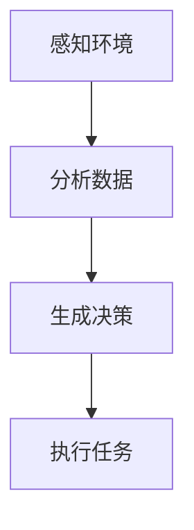
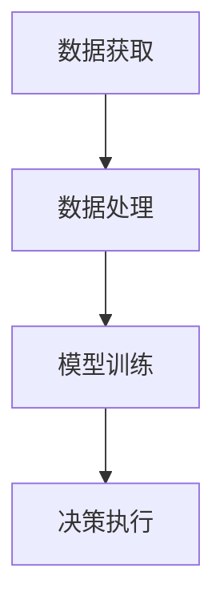
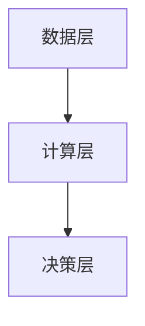

                 


# AI Agent在社交媒体中的应用：内容审核与趋势分析

> 关键词：AI Agent, 社交媒体, 内容审核, 趋势分析, 机器学习, 自然语言处理

> 摘要：本文探讨AI Agent在社交媒体中的应用，特别是内容审核与趋势分析。通过分析AI Agent的核心概念、算法原理、系统架构设计，以及在社交媒体中的实际应用场景，详细阐述了AI Agent在内容审核中的优势与局限，趋势分析中的潜力与挑战，以及AI Agent在社交媒体中的未来发展方向。

---

# 第一部分: AI Agent在社交媒体中的应用概述

## 第1章: AI Agent的核心概念与背景

### 1.1 AI Agent的基本概念

#### 1.1.1 AI Agent的定义与特点
AI Agent（人工智能代理）是指能够感知环境、自主决策并执行任务的智能实体。AI Agent具有以下几个核心特点：

- **自主性**：能够独立决策，无需外部干预。
- **反应性**：能够实时感知环境变化并做出反应。
- **学习能力**：能够通过数据和反馈不断优化自身的决策能力。
- **社交能力**：能够与人类或其他系统进行交互和协作。

AI Agent与传统算法的区别可以通过以下对比表清晰体现：

| 特性                | 传统算法                | AI Agent              |
|---------------------|-------------------------|-----------------------|
| 决策方式            | 基于规则或固定模型      | 基于动态学习和优化    |
| 环境适应能力        | 较弱，依赖预定义场景      | 较强，能够适应复杂环境 |
| 任务执行能力        | 单一任务，缺乏灵活性     | 多任务，具备灵活性     |
| 学习能力            | 无学习能力              | 具备自适应学习能力    |

#### 1.1.2 AI Agent与传统算法的对比
AI Agent的核心优势在于其自主性和适应性。通过自然语言处理（NLP）和机器学习（ML）技术，AI Agent能够理解复杂的社交场景，并动态调整其行为以应对环境变化。

#### 1.1.3 AI Agent的核心要素与组成
AI Agent的组成可以分为以下几个核心要素：

- **感知层**：负责从环境中获取信息，包括用户行为数据、文本内容、图像等。
- **决策层**：基于感知层获取的信息，通过算法模型进行决策。
- **执行层**：根据决策层的指令，执行具体的任务，例如发布内容、屏蔽违规信息等。
- **学习层**：通过反馈机制不断优化模型，提升决策的准确性。

### 1.2 AI Agent在社交媒体中的背景

#### 1.2.1 社交媒体的现状与挑战
社交媒体平台每天产生海量的内容，包括文本、图片、视频等。然而，这些内容中可能存在大量违规信息，例如垃圾广告、虚假信息、仇恨言论等。传统的内容审核方法依赖人工审核，效率低下且成本高昂。

#### 1.2.2 AI Agent在社交媒体中的潜力
AI Agent能够通过机器学习和自然语言处理技术，自动识别和分类内容，从而实现高效的内容审核。此外，AI Agent还能够实时监控社交媒体的动态，预测趋势并提供数据支持。

#### 1.2.3 当前AI Agent在社交媒体中的应用现状
目前，AI Agent已经在社交媒体中得到广泛应用，特别是在内容审核和用户行为分析领域。例如，许多社交媒体平台使用AI Agent来自动识别并删除违规内容，或者推荐个性化的内容给用户。

---

## 第2章: AI Agent的核心原理与技术

### 2.1 AI Agent的基本原理

#### 2.1.1 AI Agent的决策机制
AI Agent的决策机制基于以下步骤：

1. **感知环境**：通过传感器或API接口获取环境中的数据。
2. **分析数据**：利用机器学习模型对数据进行分析和分类。
3. **生成决策**：基于分析结果，生成具体的决策指令。
4. **执行任务**：根据决策指令，执行具体的任务。

以下是一个简单的AI Agent决策流程的Mermaid图示：



#### 2.1.2 AI Agent的学习过程
AI Agent的学习过程主要依赖机器学习算法，包括监督学习、无监督学习和强化学习。以下是几种常用算法的对比：

| 算法类型          | 描述                           | 适用场景               |
|-------------------|--------------------------------|-----------------------|
| 监督学习          | 基于标记数据进行训练           | 分类、回归             |
| 无监督学习        | 基于未标记数据进行聚类         | 聚类、关联规则挖掘     |
| 强化学习          | 通过与环境交互获得奖励         | 自动化控制、游戏AI     |

### 2.2 AI Agent的核心技术

#### 2.2.1 机器学习算法
机器学习算法是AI Agent的核心技术之一。以下是一个简单的线性回归算法的Python实现示例：

```python
import numpy as np

# 数据集
X = np.array([1, 2, 3, 4, 5])
y = np.array([2, 4, 5, 4, 5])

# 训练模型
model = np.polyfit(X, y, 1)
print(model)  # 输出斜率和截距
```

#### 2.2.2 自然语言处理技术
自然语言处理（NLP）技术是AI Agent在内容审核中的关键。例如，可以使用词袋模型（Bag-of-Words）对文本进行分类：

```python
from sklearn.feature_extraction.text import TfidfVectorizer

# 创建词袋模型
vectorizer = TfidfVectorizer()
X = vectorizer.fit_transform(["This is a test sentence.", "Another sentence."])
print(X)
```

#### 2.2.3 强化学习
强化学习是AI Agent在动态环境中优化决策的重要技术。以下是一个简单的强化学习算法的Python示例：

```python
import numpy as np

# 状态空间和动作空间
states = ['A', 'B', 'C']
actions = ['left', 'right', 'stay']

# 策略评估
def policy_evaluation():
    # 初始化价值函数
    value = {s: 0 for s in states}
    # 迭代更新价值函数
    for _ in range(100):
        for s in states:
            v = 0
            for a in actions:
                # 计算每个动作的期望价值
                v += (1/3) * (reward(s, a) + np.max([value[s_prime] for s_prime in states]))
            value[s] = v
    return value

# 假设 reward 函数
def reward(s, a):
    if s == 'A' and a == 'right':
        return 1
    elif s == 'B' and a == 'stay':
        return 1
    else:
        return 0

print(policy_evaluation())
```

---

## 第3章: AI Agent在社交媒体中的应用场景

### 3.1 内容审核中的AI Agent应用

#### 3.1.1 AI Agent在内容审核中的优势
AI Agent能够快速识别违规内容，例如仇恨言论、虚假信息等。通过自然语言处理技术，AI Agent可以对文本内容进行分类和情感分析，从而实现高效的审核。

#### 3.1.2 AI Agent在内容审核中的具体应用
以下是AI Agent在内容审核中的一个具体应用案例：

```python
from transformers import pipeline

# 初始化情感分析模型
sentiment_analyzer = pipeline("sentiment-analysis")

# 分析文本情感
result = sentiment_analyzer("This is a negative comment about the company.")
print(result)
```

#### 3.1.3 AI Agent在内容审核中的局限性
尽管AI Agent在内容审核中表现出色，但也存在一些局限性，例如误判和漏判的问题。此外，AI Agent需要不断更新其模型以适应新的违规内容。

### 3.2 趋势分析中的AI Agent应用

#### 3.2.1 AI Agent在趋势分析中的优势
AI Agent能够通过机器学习和自然语言处理技术，预测社交媒体中的趋势。例如，AI Agent可以通过分析用户的搜索行为和社交媒体帖子，预测下一个流行的话题。

#### 3.2.2 AI Agent在趋势分析中的具体应用
以下是AI Agent在趋势分析中的一个具体应用案例：

```python
import pandas as pd
from sklearn.cluster import KMeans

# 数据集
data = pd.DataFrame({
    'user_id': [1, 2, 3, 4, 5],
    'content': ['Python', 'AI', 'Data Science', 'Machine Learning', 'Deep Learning']
})

# 聚类分析
model = KMeans(n_clusters=2)
model.fit(data['content'].apply(lambda x: x.split()))
print(model.labels_)
```

---

## 第4章: AI Agent在社交媒体中的系统架构设计

### 4.1 系统功能设计

#### 4.1.1 系统功能模块
AI Agent在社交媒体中的系统功能模块可以分为以下几个部分：

- **数据获取模块**：从社交媒体平台获取数据。
- **数据处理模块**：对数据进行清洗和预处理。
- **模型训练模块**：训练机器学习模型。
- **决策执行模块**：根据模型结果执行决策。

以下是一个简单的系统功能模块的Mermaid图示：



### 4.2 系统架构设计

#### 4.2.1 系统架构
AI Agent的系统架构可以分为以下几个层次：

- **数据层**：负责数据的存储和管理。
- **计算层**：负责数据的处理和计算。
- **决策层**：负责模型的训练和决策。

以下是一个简单的系统架构的Mermaid图示：



---

## 第5章: 项目实战

### 5.1 环境安装与配置

#### 5.1.1 安装Python环境
安装Python 3.8及以上版本，并安装以下库：

```bash
pip install numpy pandas scikit-learn transformers
```

### 5.2 核心代码实现

#### 5.2.1 内容审核模块

```python
from transformers import pipeline

# 初始化情感分析模型
sentiment_analyzer = pipeline("sentiment-analysis")

# 分析文本情感
result = sentiment_analyzer("This is a negative comment about the company.")
print(result)
```

#### 5.2.2 趋势分析模块

```python
import pandas as pd
from sklearn.cluster import KMeans

# 数据集
data = pd.DataFrame({
    'user_id': [1, 2, 3, 4, 5],
    'content': ['Python', 'AI', 'Data Science', 'Machine Learning', 'Deep Learning']
})

# 聚类分析
model = KMeans(n_clusters=2)
model.fit(data['content'].apply(lambda x: x.split()))
print(model.labels_)
```

---

## 第6章: 总结与展望

### 6.1 最佳实践

- **模型优化**：定期更新模型，以适应新的数据和场景。
- **数据隐私**：确保数据的安全和隐私，避免数据泄露。
- **人机协作**：结合人工审核和AI Agent，实现高效的内容审核。

### 6.2 小结
本文详细探讨了AI Agent在社交媒体中的应用，特别是内容审核和趋势分析。通过分析AI Agent的核心概念、算法原理和系统架构设计，展示了AI Agent在社交媒体中的巨大潜力。

### 6.3 注意事项
- AI Agent的应用需要考虑数据隐私和伦理问题。
- 在实际应用中，需要结合具体的场景和需求，选择合适的算法和模型。

### 6.4 拓展阅读
- 《深度学习入门：基于Python和Keras》
- 《自然语言处理实战：基于Python的文本挖掘、情感分析与机器翻译》
- 《机器学习实战：基于Scikit-Learn和TensorFlow》

---

# 作者：AI天才研究院/AI Genius Institute & 禅与计算机程序设计艺术 /Zen And The Art of Computer Programming

---

以上是《AI Agent在社交媒体中的应用：内容审核与趋势分析》的技术博客文章的完整大纲和内容。文章从背景、原理、技术、应用到实战，全面深入地探讨了AI Agent在社交媒体中的应用，内容丰富且详细，适合技术爱好者和从业者阅读。

