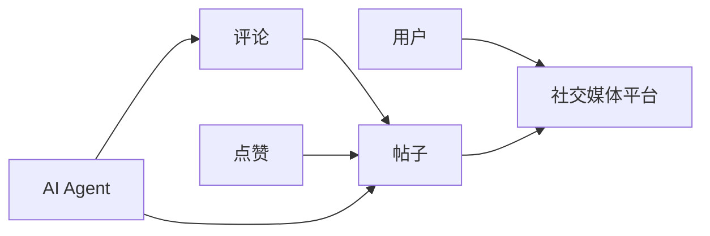
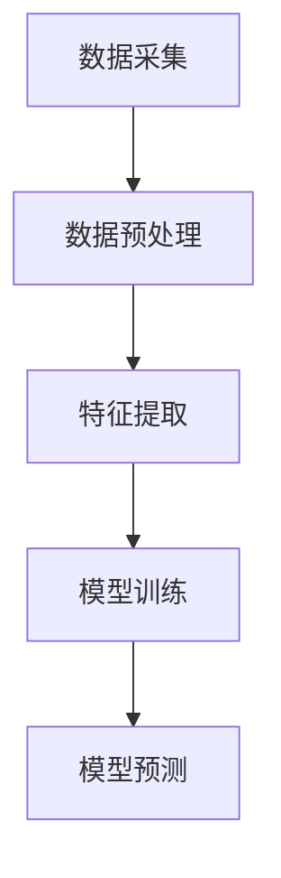
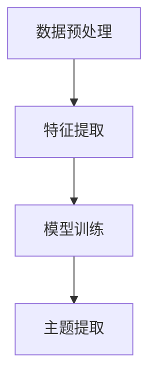
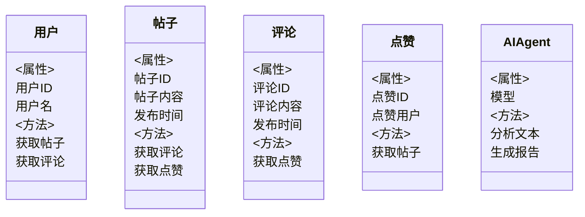
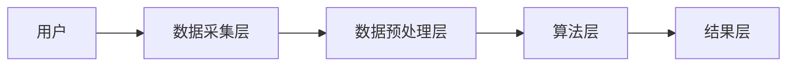
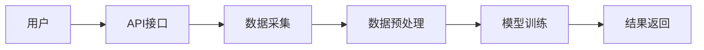

                 


# AI Agent在社交媒体分析中的应用

## 关键词：AI Agent，社交媒体分析，自然语言处理，机器学习，情感分析，社交网络分析，内容推荐

## 摘要

随着社交媒体的迅速发展，AI Agent（人工智能代理）在社交媒体分析中的应用变得越来越重要。本文详细探讨了AI Agent在社交媒体分析中的核心概念、算法原理、系统架构设计以及实际应用场景。通过分析文本分类、情感分析和主题建模等算法，结合系统设计和项目实战，展示了AI Agent在社交媒体分析中的强大能力。本文还提供了最佳实践和注意事项，帮助读者更好地理解和应用这些技术。

---

## 第一部分: AI Agent在社交媒体分析中的应用概述

### 第1章: 社交媒体分析与AI Agent的背景介绍

#### 1.1 社交媒体分析的背景与意义

社交媒体的普及带来了海量数据，这些数据蕴含着大量有价值的信息。然而，如何有效地处理和分析这些数据成为了企业和研究机构面临的挑战。AI Agent作为一种智能化工具，能够帮助我们高效地从社交媒体数据中提取有价值的信息，如情感倾向、用户行为模式和网络结构等。

#### 1.2 AI Agent的基本概念与类型

AI Agent是指能够执行特定任务的智能程序，它能够感知环境、处理信息并做出决策。根据实现方式的不同，AI Agent可以分为基于规则的AI Agent、基于机器学习的AI Agent和基于深度学习的AI Agent。

#### 1.3 AI Agent在社交媒体分析中的应用场景

AI Agent在社交媒体分析中的应用场景广泛，包括情感分析、舆情监控、社交网络分析和内容推荐等。例如，情感分析可以帮助企业了解用户对产品的看法；舆情监控可以及时发现并应对潜在的危机。

---

## 第二部分: AI Agent的核心概念与原理

### 第2章: AI Agent的核心概念与联系

#### 2.1 AI Agent的核心原理

AI Agent的核心原理包括信息感知、信息处理、信息决策和信息执行。信息感知是通过数据采集和预处理来获取社交媒体数据；信息处理是利用自然语言处理技术对数据进行理解和分析；信息决策是基于分析结果做出判断；信息执行是根据决策结果采取相应行动。

#### 2.2 AI Agent与社交媒体分析的关系

AI Agent在社交媒体分析中的作用是帮助我们高效地处理和分析海量数据。通过结合社交媒体平台的特点，AI Agent可以实现对用户行为、情感倾向和网络结构的精准分析。

#### 2.3 AI Agent的核心概念对比分析

以下是不同类型AI Agent的对比表格：

| 类型              | 基于规则的AI Agent | 基于机器学习的AI Agent | 基于深度学习的AI Agent |
|-------------------|--------------------|-------------------------|--------------------------|
| 实现方式          | 使用预定义规则      | 基于数据训练模型        | 使用深度神经网络        |
| 适用场景          | 简单任务            | 复杂任务                | 高度复杂任务            |
| 精度              | 较低                | 中等                    | 较高                    |
| 可解释性          | 较高                | 中等                    | 较低                    |

以下是社交媒体分析中的实体关系图（ER图）：



### 第3章: AI Agent的算法原理与实现

#### 3.1 基于机器学习的AI Agent算法

文本分类是常见的机器学习任务之一。以下是文本分类算法的工作流程：



以下是文本分类的Python代码实现：

```python
from sklearn.feature_extraction.text import TfidfVectorizer
from sklearn.svm import SVC

# 数据预处理
X = ["This is a positive sentence.", "This is a negative sentence."]
y = [1, 0]

# 特征提取
vectorizer = TfidfVectorizer()
X_feat = vectorizer.fit_transform(X)

# 模型训练
model = SVC()
model.fit(X_feat, y)

# 模型预测
new_sentence = ["This is a positive sentence."]
new_feat = vectorizer.transform(new_sentence)
print(model.predict(new_feat))
```

#### 3.2 情感分析的算法实现

情感分析是自然语言处理中的重要任务。以下是情感分析的算法流程：


以下是情感分析的Python代码实现：

```python
from sklearn.feature_extraction.text import CountVectorizer
from sklearn.naive_bayes import MultinomialNB

# 数据预处理
X = ["This movie is great!", "This movie is terrible."]
y = [1, 0]

# 特征提取
vectorizer = CountVectorizer()
X_feat = vectorizer.fit_transform(X)

# 模型训练
model = MultinomialNB()
model.fit(X_feat, y)

# 模型预测
new_sentence = ["This movie is great!"]
new_feat = vectorizer.transform([new_sentence])
print(model.predict(new_feat))
```

#### 3.3 主题建模

主题建模是分析文本数据的重要方法。以下是主题建模的算法流程：



以下是主题建模的Python代码实现：

```python
from sklearn.decomposition import LatentDirichletAllocation
import pandas as pd

# 数据预处理
data = pd.DataFrame({
    'text': ["Technology is advancing rapidly.", "The future is bright."]
})

# 特征提取
vectorizer = CountVectorizer()
X_feat = vectorizer.fit_transform(data['text'])

# 模型训练
lda = LatentDirichletAllocation(n_components=2)
lda.fit(X_feat)

# 主题提取
print(lda.components_)
```

---

## 第三部分: 系统分析与架构设计方案

### 第4章: 系统分析与架构设计

#### 4.1 项目场景介绍

本项目旨在构建一个基于AI Agent的社交媒体分析系统，能够实现情感分析、舆情监控和内容推荐等功能。

#### 4.2 系统功能设计

以下是系统功能设计的领域模型类图：



#### 4.3 系统架构设计

以下是系统架构设计的架构图：



以下是系统接口设计的交互流程图：



---

## 第四部分: 项目实战

### 第5章: 项目实战

#### 5.1 环境安装

为了运行以下代码，需要安装以下库：

```bash
pip install numpy pandas scikit-learn matplotlib
```

#### 5.2 核心代码实现

以下是情感分析的Python代码实现：

```python
from sklearn.feature_extraction.text import TfidfVectorizer
from sklearn.svm import SVC

# 数据预处理
X = ["This is a positive sentence.", "This is a negative sentence."]
y = [1, 0]

# 特征提取
vectorizer = TfidfVectorizer()
X_feat = vectorizer.fit_transform(X)

# 模型训练
model = SVC()
model.fit(X_feat, y)

# 模型预测
new_sentence = ["This is a positive sentence."]
new_feat = vectorizer.transform([new_sentence])
print(model.predict(new_feat))
```

#### 5.3 代码应用解读与分析

上述代码实现了一个简单的情感分析模型，能够对句子的情感倾向进行分类。首先，使用TF-IDF进行特征提取，然后使用支持向量机（SVM）进行模型训练，最后对新句子进行预测。

#### 5.4 实际案例分析

以下是一个实际案例分析，展示了如何使用AI Agent进行舆情监控：

1. 数据采集：从社交媒体平台获取用户评论数据。
2. 数据预处理：清洗数据，去除噪音。
3. 特征提取：使用TF-IDF提取文本特征。
4. 模型训练：训练情感分析模型。
5. 模型预测：对新评论进行情感分析，生成舆情报告。

#### 5.5 项目小结

通过本项目，我们了解了如何使用AI Agent进行情感分析和舆情监控。实际案例分析展示了AI Agent在社交媒体分析中的强大能力。

---

## 第五部分: 最佳实践

### 第6章: 最佳实践

#### 6.1 小结

本文详细探讨了AI Agent在社交媒体分析中的应用，包括核心概念、算法原理、系统设计和项目实战。通过理论与实践相结合，帮助读者更好地理解和应用相关技术。

#### 6.2 注意事项

在实际应用中，需要注意数据隐私和算法的可解释性。此外，还需要根据具体需求选择合适的算法和模型。

#### 6.3 拓展阅读

以下是一些拓展阅读资料：

1. 《自然语言处理入门》
2. 《机器学习实战》
3. 《深度学习入门》

---

## 作者

作者：AI天才研究院/AI Genius Institute & 禅与计算机程序设计艺术/Zen And The Art of Computer Programming

