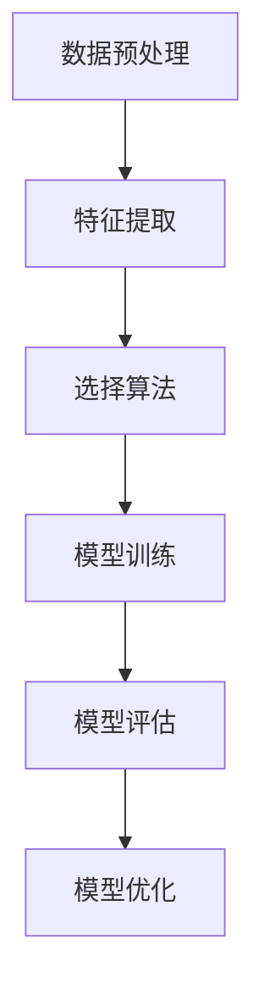
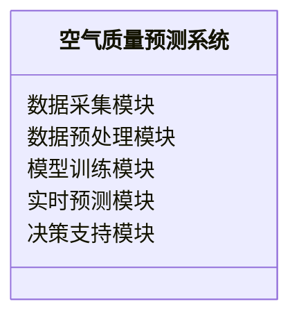
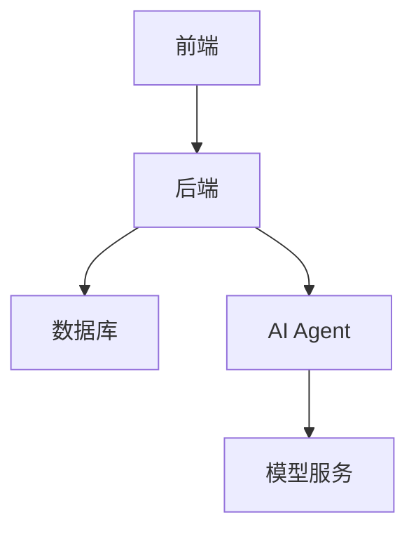
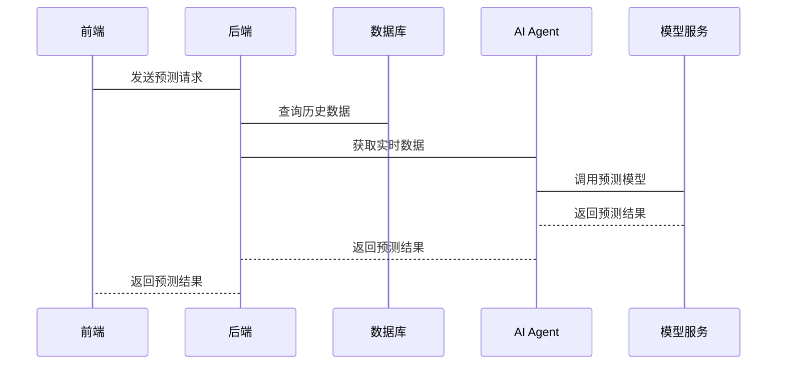

                 


# AI Agent在空气质量预测中的应用

## 关键词：空气质量预测、AI Agent、机器学习、深度学习、环境监测

## 摘要：本文探讨了AI Agent在空气质量预测中的应用，分析了空气质量预测的重要性，详细介绍了AI Agent的基本概念和工作原理，并结合机器学习和深度学习算法，展示了如何通过AI Agent实现高效的空气质量预测。文章还讨论了系统的架构设计和实际案例，最后总结了AI Agent在空气质量预测中的优势和未来发展方向。

---

## 第1章: 空气质量预测问题背景

### 1.1 空空气质量问题的背景

#### 1.1.1 空空气质量问题的现状

空气质量问题是全球关注的焦点。随着工业化进程的加快，空气污染问题日益严重，不仅影响了人们的健康，还对环境造成了极大的破坏。空气质量问题主要源于工业排放、交通尾气、燃煤等人类活动，这些因素导致空气中的有害物质浓度急剧上升。

空气质量问题的严重性体现在以下几个方面：
- 对人类健康的威胁：空气污染物如PM2.5、NO2等会引发呼吸系统疾病、心血管疾病等。
- 对环境的影响：酸雨、臭氧层破坏等环境问题加剧。
- 对经济的影响：空气污染会影响农业、工业生产，降低产品质量，增加生产成本。

#### 1.1.2 空空气质量问题对企业和社会的影响

空气质量问题不仅影响环境，还对企业和社会造成了深远的影响。对企业而言，空气质量问题可能导致生产成本增加、产品品质下降，甚至面临环保法规的处罚。对社会而言，空气质量问题加剧了公共健康危机，增加了医疗支出，降低了人民的生活质量。

#### 1.1.3 空空气质量预测的必要性

空气质量预测是应对空气污染的重要手段。通过预测空气质量，可以提前采取措施，减少污染物的排放，降低空气污染的影响。例如，当预测到某地区空气质量将恶化时，政府可以采取限产、限行等措施，减少污染物排放，从而改善空气质量。

### 1.2 AI Agent的基本概念

#### 1.2.1 AI Agent的定义

AI Agent（人工智能代理）是指能够感知环境并采取行动以实现目标的智能实体。AI Agent可以是软件程序、机器人或其他智能系统，其核心特征包括自主性、反应性、目标导向性和社交能力。

#### 1.2.2 AI Agent的核心特征

AI Agent的核心特征包括：
- **自主性**：AI Agent能够自主决策，无需外部干预。
- **反应性**：AI Agent能够感知环境并实时响应。
- **目标导向性**：AI Agent的行为以实现特定目标为导向。
- **社交能力**：AI Agent能够与其他系统或人类进行交互和协作。

#### 1.2.3 AI Agent与传统算法的区别

AI Agent与传统算法的主要区别在于其自主性和目标导向性。传统算法通常需要明确的规则和输入，而AI Agent能够自主决策，适应环境变化，具有更强的灵活性和适应性。

### 1.3 AI Agent在空气质量预测中的应用前景

#### 1.3.1 空空气质量预测中的主要挑战

空气质量预测面临以下主要挑战：
- 数据复杂性：空气质量受多种因素影响，如气象条件、污染物排放等，数据复杂且动态变化。
- 数据缺失：由于传感器故障或其他原因，空气质量数据可能存在缺失。
- 预测精度：如何提高预测精度是空气质量预测的核心挑战。

#### 1.3.2 AI Agent在空气质量预测中的优势

AI Agent在空气质量预测中的优势包括：
- **自主性**：AI Agent能够自主感知环境并采取行动，无需人工干预。
- **实时性**：AI Agent能够实时处理数据，快速响应环境变化。
- **适应性**：AI Agent能够适应数据变化和环境变化，提高预测精度。

#### 1.3.3 AI Agent的应用场景与边界

AI Agent在空气质量预测中的应用场景包括：
- 实时监测与预测：通过AI Agent实时监测空气质量数据，预测未来空气质量变化。
- 污染源追踪：通过AI Agent分析污染物来源，制定治理措施。
- 应急响应：当预测到空气质量严重恶化时，AI Agent可以触发应急响应机制，减少污染物排放。

AI Agent的应用边界包括：
- 数据依赖性：AI Agent的性能依赖于数据质量和数量。
- 技术限制：AI Agent的预测能力受到算法和硬件的限制。
- 道德与法律问题：AI Agent的应用需遵守相关法律法规，确保数据隐私和安全。

---

## 第2章: 空空气质量预测的核心概念与联系

### 2.1 核心概念原理

#### 2.1.1 空空气质量预测的关键要素

空气质量预测的关键要素包括：
- **污染物浓度**：如PM2.5、SO2、NO2等。
- **气象条件**：如温度、湿度、风速、风向等。
- **污染物排放**：工业排放、交通尾气等。
- **地理因素**：地形、地貌等对空气质量的影响。

#### 2.1.2 AI Agent在空气质量预测中的作用机制

AI Agent在空气质量预测中的作用机制如下：
1. **数据采集**：AI Agent通过传感器或其他数据源采集空气质量数据。
2. **数据处理**：AI Agent对数据进行清洗、预处理，提取特征。
3. **模型训练**：AI Agent利用机器学习算法训练模型，预测空气质量。
4. **实时预测**：AI Agent根据实时数据，预测未来空气质量变化。
5. **决策支持**：AI Agent提供决策支持，优化污染治理措施。

#### 2.1.3 空空气质量数据的特征分析

空气质量数据的特征包括：
- **时间序列性**：空气质量数据具有时间依赖性，昨日的空气质量影响今日的预测。
- **空间异质性**：不同地点的空气质量差异显著。
- **非线性关系**：空气质量与污染物排放、气象条件之间的关系复杂，通常是非线性关系。

### 2.2 核心概念对比表格

以下是不同空气质量预测模型的对比：

| 模型类型       | 优点                           | 缺点                           |
|----------------|--------------------------------|--------------------------------|
| 线性回归       | 简单易懂，计算速度快           | 无法捕捉复杂非线性关系         |
| 支持向量机     | 能够处理非线性关系             | 参数敏感性高                   |
| 随机森林       | 能够处理高维数据，抗过拟合       | 解释性较差                     |
| 神经网络       | 能够捕捉复杂非线性关系           | 训练时间长，计算资源消耗大       |

### 2.3 ER实体关系图

以下是空气质量预测系统的ER实体关系图：

```mermaid
erd
  天气数据表
    - 天气ID (PK)
    - 温度
    - 湿度
    - 风速
    - 风向

  污染物数据表
    - 污染物ID (PK)
    - PM2.5浓度
    - SO2浓度
    - NO2浓度

  地点表
    - 地点ID (PK)
    - 地点名称
    - 经度
    - 纬度

  预测结果表
    - 预测ID (PK)
    - 预测时间
    - 预测值
    - 预测模型
```

---

## 第3章: 算法原理讲解

### 3.1 机器学习算法基础

#### 3.1.1 线性回归

线性回归是一种简单而常用的回归算法，用于预测连续型变量。其基本假设是因变量与自变量之间存在线性关系。线性回归模型的数学表达式如下：

$$ y = \beta_0 + \beta_1 x + \epsilon $$

其中，$y$ 是因变量，$x$ 是自变量，$\beta_0$ 是截距，$\beta_1$ 是回归系数，$\epsilon$ 是误差项。

#### 3.1.2 支持向量机

支持向量机（SVM）是一种监督学习算法，适用于分类和回归问题。SVM的核心思想是将数据映射到高维空间，找到一个超平面，使得正负样本的分类间隔最大化。SVM的数学模型如下：

$$ y = \text{sign}(w \cdot x + b) $$

其中，$w$ 是权重向量，$x$ 是输入向量，$b$ 是偏置项。

#### 3.1.3 随机森林

随机森林是一种基于决策树的集成学习算法，通过构建多棵决策树并进行投票或平均，提高模型的准确性和稳定性。随机森林的数学模型如下：

$$ y = \text{mode}(\{f_i(x)\}) $$

其中，$f_i$ 是第$i$棵决策树的预测函数，$\text{mode}$ 表示众数。

### 3.2 深度学习算法基础

#### 3.2.1 神经网络

神经网络是一种受生物神经网络启发的深度学习模型，由输入层、隐藏层和输出层组成。神经网络的数学模型如下：

$$ y = \sigma(w x + b) $$

其中，$x$ 是输入向量，$w$ 是权重矩阵，$b$ 是偏置向量，$\sigma$ 是激活函数（如ReLU、sigmoid等）。

#### 3.2.2 长短期记忆网络

长短期记忆网络（LSTM）是一种特殊的循环神经网络（RNN），用于处理时间序列数据。LSTM通过门控机制（输入门、遗忘门、输出门）控制信息的流动。LSTM的数学模型如下：

$$
\begin{cases}
i = \sigma(w_i x + u_i h_{t-1} + b_i) \\
f = \sigma(w_f x + u_f h_{t-1} + b_f) \\
o = \sigma(w_o x + u_o h_{t-1} + b_o) \\
g = \tanh(w_g x + u_g h_{t-1} + b_g) \\
h_t = i g + f h_{t-1} \\
\end{cases}
$$

其中，$i$ 是输入门，$f$ 是遗忘门，$o$ 是输出门，$g$ 是候选细胞状态，$h_t$ 是当前细胞状态。

#### 3.2.3 图神经网络

图神经网络（GNN）是一种处理图结构数据的深度学习模型，广泛应用于社交网络、推荐系统等领域。GNN的核心思想是通过聚合邻居节点的信息，更新当前节点的表示。GNN的数学模型如下：

$$ h_v^{(l+1)} = \sigma(\sum_{u \in N(v)} w_{vu} h_u^{(l)} + b_v) $$

其中，$h_v^{(l)}$ 是节点$v$在第$l$层的表示，$N(v)$ 是节点$v$的邻居节点集合，$w_{vu}$ 是权重，$b_v$ 是偏置项，$\sigma$ 是激活函数。

### 3.3 AI Agent的算法实现

#### 3.3.1 基于强化学习的AI Agent

强化学习是一种通过试错机制来优化决策的算法。AI Agent通过与环境交互，学习最优策略，以最大化累积奖励。强化学习的核心算法包括Q-Learning、Deep Q-Network（DQN）等。

#### 3.3.2 基于监督学习的AI Agent

监督学习是一种基于标注数据进行学习的算法。AI Agent通过学习输入与输出之间的映射关系，预测空气质量。常用的监督学习算法包括线性回归、决策树、随机森林等。

#### 3.3.3 基于无监督学习的AI Agent

无监督学习是一种基于无标注数据进行学习的算法。AI Agent通过发现数据中的隐藏结构，进行聚类、异常检测等任务。常用的无监督学习算法包括K-means、DBSCAN、t-SNE等。

---

## 第4章: 算法流程图

### 4.1 机器学习算法

以下是机器学习算法的流程图：



### 4.2 深度学习算法

以下是深度学习算法的流程图：


---

## 第5章: 系统分析与架构设计

### 5.1 系统功能设计

以下是空气质量预测系统的功能模块：



### 5.2 系统架构设计

以下是空气质量预测系统的架构设计：



### 5.3 系统接口设计

以下是空气质量预测系统的接口设计：



---

## 第6章: 项目实战

### 6.1 环境安装

空气质量预测系统的环境安装如下：

- **Python**：安装Python 3.x
- **TensorFlow**：安装TensorFlow库
- **Keras**：安装Keras库
- **Scikit-learn**：安装Scikit-learn库
- **Jupyter Notebook**：安装Jupyter Notebook

### 6.2 系统核心实现源代码

以下是空气质量预测系统的核心代码：

```python
import numpy as np
import pandas as pd
from sklearn.model_selection import train_test_split
from sklearn.linear_model import LinearRegression
from sklearn.metrics import mean_squared_error

# 数据加载
data = pd.read_csv('air_quality.csv')

# 数据预处理
X = data.drop('target', axis=1)
y = data['target']

# 数据分割
X_train, X_test, y_train, y_test = train_test_split(X, y, test_size=0.2, random_state=42)

# 模型训练
model = LinearRegression()
model.fit(X_train, y_train)

# 模型预测
y_pred = model.predict(X_test)

# 模型评估
mse = mean_squared_error(y_test, y_pred)
print(f'均方误差：{mse}')
```

### 6.3 代码应用解读与分析

以上代码实现了空气质量预测系统的数据加载、数据预处理、模型训练、模型预测和模型评估。代码使用了Scikit-learn库中的线性回归算法，通过均方误差评估模型的性能。

### 6.4 实际案例分析

以下是一个实际案例的分析：

假设我们有一个空气质量数据集，包含以下特征：PM2.5、SO2、NO2、温度、湿度、风速、风向。目标是预测空气质量指数（AQI）。

通过上述代码，我们可以训练一个线性回归模型，输入特征数据，输出预测的AQI值。模型的均方误差越小，预测精度越高。

### 6.5 项目小结

空气质量预测系统的核心是数据预处理和模型训练。通过合理选择算法和优化模型，可以提高预测精度。在实际应用中，还需要考虑数据的实时性、模型的可解释性和系统的可扩展性。

---

## 第7章: 总结与展望

### 7.1 总结

本文详细介绍了AI Agent在空气质量预测中的应用，分析了空气质量预测的背景、核心概念和算法原理，并通过系统设计和项目实战展示了AI Agent的实际应用。通过本文的介绍，读者可以全面理解AI Agent在空气质量预测中的优势和应用场景。

### 7.2 展望

未来，随着AI技术的不断发展，AI Agent在空气质量预测中的应用将更加广泛和深入。以下是一些可能的发展方向：
- **多模态数据融合**：结合气象数据、交通数据、地理数据等多模态数据，提高预测精度。
- **实时预测与反馈**：通过实时数据流处理，实现更精准的实时预测和动态调整。
- **个性化预测服务**：根据用户需求，提供个性化的空气质量预测服务，如健康建议、出行建议等。
- **模型优化与解释性**：通过模型优化和可解释性分析，提高模型的透明度和可信度。

---

## 作者：AI天才研究院/AI Genius Institute & 禅与计算机程序设计艺术 /Zen And The Art of Computer Programming

