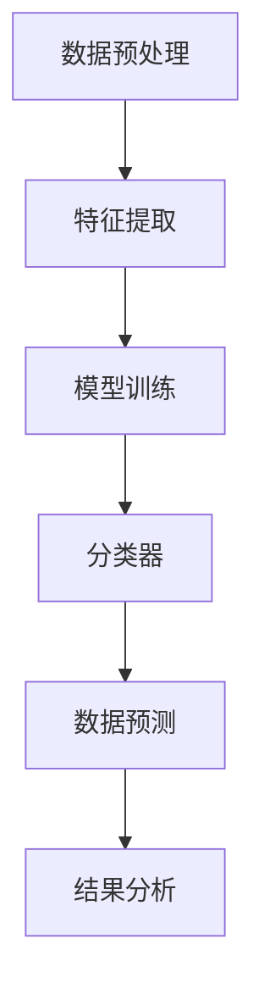
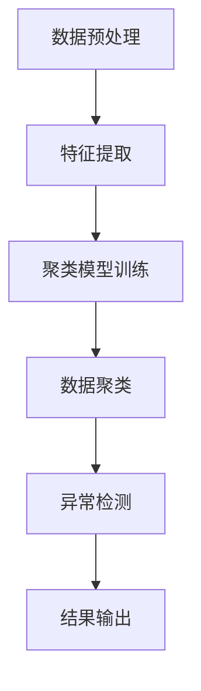
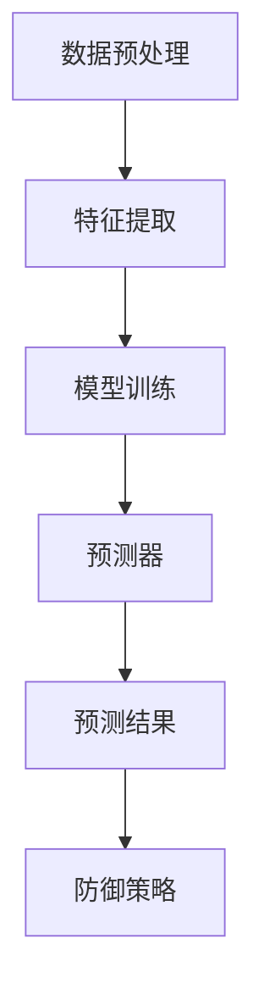
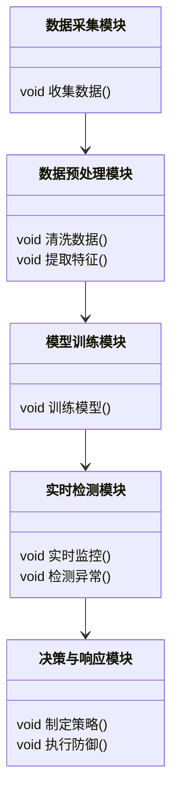

                 


# AI Agent在网络安全中的威胁检测

> 关键词：AI Agent，网络安全，威胁检测，机器学习，入侵检测系统，异常行为分析

> 摘要：本文深入探讨了AI Agent在网络安全威胁检测中的应用，从基本原理到实际案例，全面分析了如何利用人工智能代理技术提升网络安全威胁检测的效率和准确性。通过详细的技术分析和系统设计，本文展示了AI Agent在网络安全中的巨大潜力。

---

## 第1章 AI Agent与网络安全威胁检测概述

### 1.1 AI Agent的基本概念

AI Agent（人工智能代理）是指能够感知环境并采取行动以实现特定目标的智能实体。它能够通过学习和推理，自主决策并执行任务。AI Agent的核心特征包括自主性、反应性、目标导向和社交能力。

在网络安全领域，AI Agent可以用于实时监控网络流量、检测异常行为、识别潜在威胁等。

### 1.2 网络安全威胁检测的背景与挑战

网络安全威胁检测是保护网络系统免受攻击的关键任务。随着网络攻击的复杂性和数量的增加，传统的威胁检测方法（如基于规则的检测）逐渐暴露出效率低、误报率高等问题。

AI Agent的引入为网络安全威胁检测提供了新的解决方案。它能够通过机器学习算法自动学习网络流量的特征，识别异常行为，并实时响应。

### 1.3 AI Agent与威胁检测的结合

AI Agent在威胁检测中的应用主要体现在以下几个方面：
1. **异常行为分析**：通过学习正常网络行为模式，识别异常行为，从而发现潜在威胁。
2. **入侵检测系统（IDS）**：利用AI Agent增强入侵检测系统的智能化水平，提高检测准确率。
3. **威胁行为预测**：基于历史数据和机器学习模型，预测未来的威胁行为，提前采取防御措施。

---

## 第2章 AI Agent的基本原理

### 2.1 AI Agent的结构与功能

AI Agent的结构通常包括以下几个模块：
1. **感知模块**：负责收集环境中的数据，如网络流量、日志信息等。
2. **推理模块**：对收集的数据进行分析和推理，识别异常行为。
3. **决策模块**：根据推理结果，生成相应的决策。
4. **执行模块**：执行决策，如发送警报、阻断恶意流量等。

### 2.2 AI Agent的工作流程

AI Agent的工作流程可以分为以下几个步骤：
1. **数据收集**：通过传感器或日志系统获取网络流量数据。
2. **数据预处理**：对收集的数据进行清洗和特征提取。
3. **模型训练**：使用机器学习算法训练模型，识别正常和异常行为。
4. **实时检测**：基于训练好的模型，实时监控网络流量，检测潜在威胁。
5. **决策与响应**：根据检测结果，采取相应的行动，如阻断恶意连接或通知管理员。

### 2.3 AI Agent的核心算法

AI Agent的核心算法主要包括：
1. **监督学习算法**：如决策树、随机森林，用于分类任务。
2. **无监督学习算法**：如聚类算法（K-means、DBSCAN），用于异常检测。
3. **强化学习算法**：如Q-Learning，用于动态环境下的决策任务。

以下是一个简单的监督学习算法（决策树）的流程图：



---

## 第3章 基于AI Agent的网络安全威胁检测

### 3.1 异常行为分析

异常行为分析是AI Agent在威胁检测中的重要应用之一。通过对网络流量的分析，AI Agent可以识别出与正常行为模式不符的异常行为，从而发现潜在的威胁。

#### 异常行为分析的实现步骤：
1. **数据收集**：收集网络流量数据，包括源IP、目的IP、时间戳、数据包大小等。
2. **数据预处理**：清洗数据，去除噪声，提取关键特征。
3. **模型训练**：使用无监督学习算法（如聚类算法）训练模型。
4. **异常检测**：基于训练好的模型，识别异常行为。

以下是一个基于聚类算法的异常行为分析流程图：



---

### 3.2 入侵检测系统（IDS）的智能化

传统的入侵检测系统（IDS）通常基于规则匹配，具有一定的局限性。通过引入AI Agent，可以显著提高IDS的智能化水平。

#### 基于AI Agent的IDS实现：
1. **数据收集与预处理**：收集网络流量数据，进行数据清洗和特征提取。
2. **模型训练**：使用监督学习算法（如随机森林）训练分类模型。
3. **实时检测**：基于训练好的模型，实时检测网络流量中的异常行为。
4. **决策与响应**：根据检测结果，采取相应的防御措施。

以下是一个基于随机森林算法的入侵检测系统架构图：


---

### 3.3 威胁行为预测与预防

通过基于AI Agent的威胁行为预测，可以提前发现潜在的攻击行为，从而采取预防措施。

#### 威胁行为预测的实现步骤：
1. **数据收集**：收集历史网络攻击数据，包括攻击类型、时间、源IP等。
2. **数据预处理**：清洗数据，提取关键特征。
3. **模型训练**：使用强化学习算法（如Q-Learning）训练预测模型。
4. **威胁预测**：基于训练好的模型，预测未来的威胁行为。
5. **防御策略**：根据预测结果，制定相应的防御策略。

以下是一个基于Q-Learning算法的威胁行为预测流程图：



---

## 第4章 系统架构设计

### 4.1 系统功能设计

基于AI Agent的网络安全威胁检测系统的功能模块包括：
1. **数据采集模块**：负责收集网络流量数据。
2. **数据预处理模块**：对数据进行清洗和特征提取。
3. **模型训练模块**：基于机器学习算法训练模型。
4. **实时检测模块**：实时监控网络流量，检测异常行为。
5. **决策与响应模块**：根据检测结果，采取相应的防御措施。

以下是一个系统的领域模型类图：



---

## 第5章 项目实战

### 5.1 环境搭建

为了实现基于AI Agent的网络安全威胁检测系统，我们需要以下环境：
1. **操作系统**：Linux或Windows
2. **编程语言**：Python
3. **机器学习库**：Scikit-learn、TensorFlow
4. **网络接口**：Python的socket库或网络抓包工具（如Wireshark）

---

### 5.2 核心代码实现

以下是基于随机森林算法的异常行为检测代码示例：

```python
from sklearn.ensemble import RandomForestClassifier
from sklearn.model_selection import train_test_split
import pandas as pd

# 加载数据
data = pd.read_csv('network_traffic.csv')

# 数据预处理
X = data.drop('label', axis=1)
y = data['label']

# 划分训练集和测试集
X_train, X_test, y_train, y_test = train_test_split(X, y, test_size=0.2)

# 训练模型
model = RandomForestClassifier()
model.fit(X_train, y_train)

# 预测结果
y_pred = model.predict(X_test)

# 输出结果
print("Accuracy:", accuracy_score(y_test, y_pred))
```

---

## 第6章 总结与展望

### 6.1 本章小结

本文详细探讨了AI Agent在网络安全威胁检测中的应用，从基本原理到实际案例，全面分析了如何利用人工智能代理技术提升网络安全威胁检测的效率和准确性。

### 6.2 未来展望

随着人工智能技术的不断发展，AI Agent在网络安全中的应用将更加广泛。未来的研究方向包括：
1. **多模态数据融合**：结合网络流量、日志、行为特征等多种数据源，提高检测准确率。
2. **自适应算法优化**：通过动态调整算法参数，提高模型的适应性。
3. **分布式部署**：在多节点网络中实现AI Agent的分布式部署，提高检测效率。

---

## 作者：AI天才研究院 & 禅与计算机程序设计艺术

---

以上是《AI Agent在网络安全中的威胁检测》的技术博客文章的详细内容。希望对您有所帮助！

