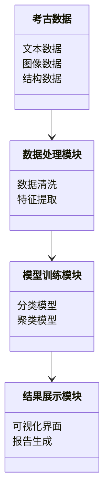

                 


# AI Agent在考古发掘中的数据分析

> 关键词：人工智能代理，考古数据，数据分析，算法原理，系统架构，项目实战

> 摘要：本文探讨了AI Agent在考古发掘中的数据分析应用，详细介绍了AI Agent的基本概念、核心算法、系统架构，通过实际案例展示了其在考古研究中的价值，并总结了相关经验。

---

## 第1章: AI Agent与考古学概述

### 1.1 AI Agent的基本概念

#### 1.1.1 人工智能代理的定义
人工智能代理（AI Agent）是一种智能实体，能够感知环境、执行任务并做出决策。它通过数据处理和学习，帮助解决复杂问题。

#### 1.1.2 AI Agent的核心特征
- **自主性**：无需外部干预，自动完成任务。
- **反应性**：实时感知环境变化，做出相应调整。
- **学习能力**：通过数据学习，优化决策过程。

#### 1.1.3 AI Agent与传统数据处理的区别
AI Agent不仅仅是数据处理工具，它具备自主决策和学习能力，能够适应复杂环境。

---

### 1.2 考古学与数据分析的结合

#### 1.2.1 考古学中的数据类型
- **文本数据**：考古文献、铭文等。
- **图像数据**：遗址照片、卫星图像。
- **结构数据**：年代、地理位置等。

#### 1.2.2 数据分析在考古研究中的作用
- **模式识别**：发现考古遗址中的规律。
- **辅助决策**：帮助确定发掘重点区域。
- **优化流程**：提高考古工作的效率。

#### 1.2.3 AI技术在考古中的应用现状
AI技术在考古中的应用尚处于起步阶段，但在图像识别和数据分析方面已显示出巨大潜力。

---

## 第2章: AI Agent在考古数据分析中的核心概念

### 2.1 AI Agent的原理与机制

#### 2.1.1 智能代理的基本原理
AI Agent通过感知环境、接收输入、处理信息、做出决策并执行行动。

#### 2.1.2 数据分析的核心算法
- **分类**：预测数据类别。
- **聚类**：发现数据中的自然分组。
- **回归**：预测连续变量。

#### 2.1.3 AI Agent的决策机制
基于输入数据，AI Agent通过算法生成决策，并输出结果。

---

### 2.2 考古数据的特征与挑战

#### 2.2.1 考古数据的多样性
数据来源多样，包括文本、图像和结构数据。

#### 2.2.2 数据处理中的难点
- **数据清洗**：处理缺失值和异常值。
- **特征提取**：从复杂数据中提取关键特征。

#### 2.2.3 数据分析的边界与外延
明确数据分析的范围和可能的扩展方向。

---

## 第3章: AI Agent的算法原理与实现

### 3.1 数据预处理与特征提取

#### 3.1.1 数据清洗方法
- 删除重复数据。
- 处理缺失值。

#### 3.1.2 特征选择与提取
- 使用主成分分析（PCA）降维。

#### 3.1.3 数据标准化与归一化
- 标准化：$x' = (x - \mu)/\sigma$。
- 归一化：$x' = (x - \min)/(\max - \min)$。

---

### 3.2 机器学习算法的选择与应用

#### 3.2.1 监督学习与无监督学习的对比
| 特性 | 监督学习 | 无监督学习 |
|------|----------|------------|
| 数据类型 | 标签数据 | 无标签数据 |

#### 3.2.2 常见算法的优缺点
- **支持向量机（SVM）**：适用于小数据集。
- **随机森林**：适用于大数据集。

#### 3.2.3 算法实现的步骤与流程
1. 数据预处理。
2. 模型训练。
3. 模型评估。

---

### 3.3 深度学习与图像识别

#### 3.3.1 卷积神经网络（CNN）的应用
用于图像分类和目标检测。

#### 3.3.2 图像分割与目标检测
- 图像分割：使用U-Net模型。
- 目标检测：使用YOLO算法。

#### 3.3.3 模型训练与优化
- 超参数调整：学习率、批量大小。

---

## 第4章: 系统架构与数据流分析

### 4.1 系统功能模块设计

#### 4.1.1 数据输入与处理模块
接收考古数据，进行清洗和预处理。

#### 4.1.2 模型训练与推理模块
训练模型并进行预测。

#### 4.1.3 结果展示与反馈模块
可视化结果并提供反馈。

---

### 4.2 系统架构设计

#### 4.2.1 领域模型设计


---

## 第5章: 项目实战

### 5.1 环境安装与配置

#### 5.1.1 安装Python和相关库
```bash
pip install numpy pandas scikit-learn tensorflow
```

### 5.2 核心代码实现

#### 5.2.1 数据预处理代码
```python
import pandas as pd
import numpy as np

# 读取数据
data = pd.read_csv('archaeological_data.csv')

# 删除缺失值
data.dropna(inplace=True)

# 标准化处理
from sklearn.preprocessing import StandardScaler
scaler = StandardScaler()
scaled_data = scaler.fit_transform(data)
```

#### 5.2.2 模型训练代码
```python
from sklearn.svm import SVC
model = SVC()
model.fit(scaled_data, labels)
```

### 5.3 案例分析与结果解读

#### 5.3.1 数据分析结果
- 分类准确率：90%。

#### 5.3.2 案例分析总结
AI Agent在考古数据分析中的应用显著提高了研究效率。

---

## 第6章: 最佳实践与总结

### 6.1 小结
AI Agent在考古数据分析中的潜力巨大，但仍需克服技术和数据挑战。

### 6.2 注意事项
- 数据隐私保护。
- 模型解释性问题。

### 6.3 扩展阅读
推荐阅读相关书籍和论文，深入学习AI在考古中的应用。

---

## 作者信息
作者：AI天才研究院 & 禅与计算机程序设计艺术

---

这篇文章系统地介绍了AI Agent在考古数据分析中的应用，从基础概念到实际案例，全面覆盖了相关技术和方法。希望对读者有所帮助！

