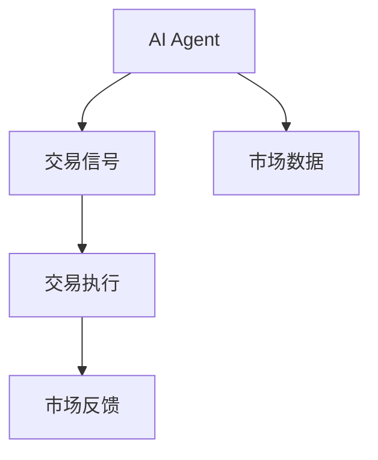
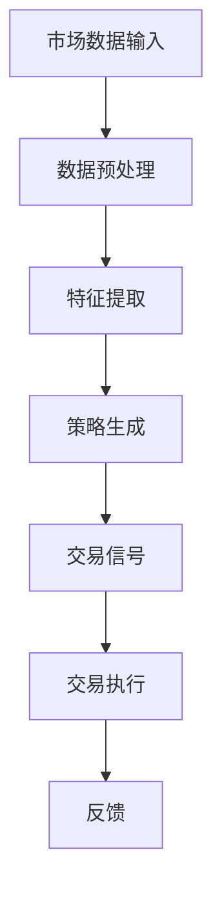
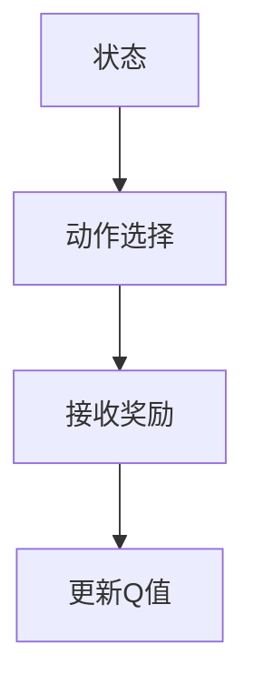
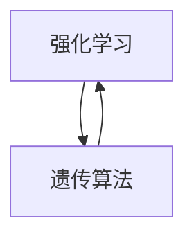
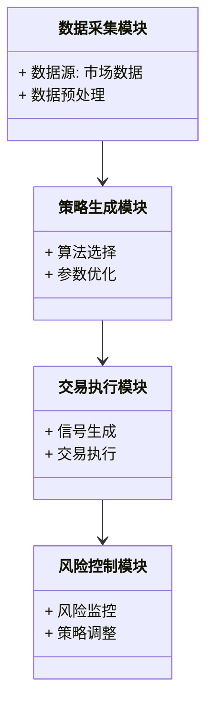
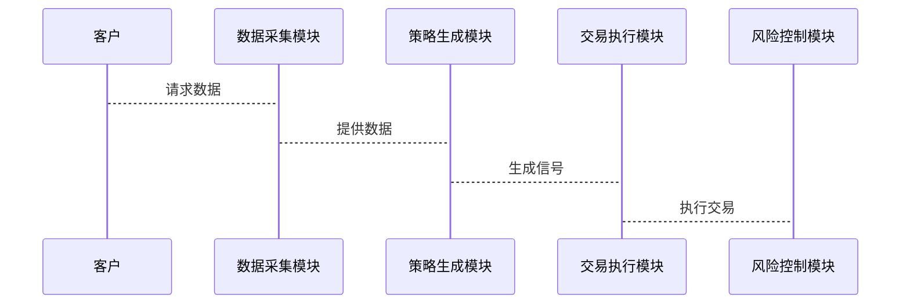

                 


# AI Agent在股票交易中的自动化策略

> 关键词：AI Agent，股票交易，自动化策略，强化学习，遗传算法，风险管理

> 摘要：本文详细探讨了AI Agent在股票交易中的应用，从基本概念到算法原理，再到系统设计和实际案例，全面分析了如何利用AI Agent实现股票交易的自动化策略。文章结合强化学习和遗传算法，通过系统架构设计和项目实战，展示了AI Agent在股票交易中的潜力和实现方法。

---

# 第一部分: AI Agent与股票交易自动化策略背景介绍

## 第1章: AI Agent与股票交易概述

### 1.1 AI Agent的基本概念

AI Agent，即人工智能代理，是指能够感知环境并采取行动以实现目标的智能实体。在股票交易中，AI Agent通常用于执行交易决策，优化投资组合和风险管理。

#### 1.1.1 AI Agent的定义
AI Agent是一种能够自主决策并执行任务的智能系统，具备感知、推理、学习和行动的能力。在股票交易中，AI Agent可以实时分析市场数据，识别交易机会，并执行交易指令。

#### 1.1.2 AI Agent的核心特点
- **自主性**：AI Agent能够自主决策，无需人工干预。
- **反应性**：能够实时感知市场变化并做出反应。
- **学习能力**：通过机器学习算法不断优化交易策略。
- **高效性**：能够在短时间内处理大量数据并做出决策。

#### 1.1.3 AI Agent与传统算法交易的区别
传统算法交易依赖预设的规则和策略，而AI Agent则具备学习和自适应能力，能够根据市场变化动态调整交易策略。

### 1.2 股票交易的自动化需求

#### 1.2.1 股票交易的基本流程
股票交易通常包括数据采集、策略生成、交易执行和风险管理四个步骤。

#### 1.2.2 自动化交易的必要性
- 提高交易效率
- 降低人为错误
- 利用算法捕捉市场机会

#### 1.2.3 自动化交易的边界与外延
自动化交易的边界在于合规性、市场深度和交易成本，外延则包括高频交易、算法套利和智能投顾。

### 1.3 AI Agent在股票交易中的应用前景

#### 1.3.1 AI Agent的潜在应用领域
- 自动化交易策略优化
- 风险管理与控制
- 市场情绪分析

#### 1.3.2 企业采用AI Agent的优势
- 提高交易效率
- 优化投资组合
- 提升决策精度

#### 1.3.3 AI Agent应用的挑战与机遇
- 挑战：市场不确定性、数据质量和模型过拟合
- 机遇：技术创新、数据驱动和智能决策

### 1.4 本章小结

---

# 第二部分: AI Agent的核心概念与联系

## 第2章: AI Agent的核心原理

### 2.1 AI Agent的决策机制

#### 2.1.1 基于强化学习的决策模型
强化学习通过试错机制优化交易策略，适用于动态市场环境。

#### 2.1.2 基于遗传算法的优化策略
遗传算法通过模拟自然选择优化交易参数，提高策略稳健性。

#### 2.1.3 基于深度学习的特征提取
深度学习能够从大量数据中提取非线性特征，提升交易信号的准确性。

### 2.2 AI Agent与股票市场的交互过程

#### 2.2.1 市场数据的实时处理
AI Agent实时分析市场数据，识别趋势和模式。

#### 2.2.2 交易信号的生成与验证
通过算法生成交易信号，并进行回测验证。

#### 2.2.3 交易执行与反馈机制
AI Agent根据信号执行交易，并根据市场反馈调整策略。

### 2.3 AI Agent的核心属性对比

#### 2.3.1 基于表格的属性对比
| 属性       | AI Agent               | 传统算法交易          |
|------------|------------------------|-----------------------|
| 自主性       | 高                     | 低                   |
| 学习能力     | 强                     | 无                   |
| 适应性       | 强                     | 低                   |

#### 2.3.2 基于图的实体关系分析


#### 2.3.3 基于流程图的决策逻辑


---

# 第三部分: AI Agent的算法原理讲解

## 第3章: AI Agent的算法原理

### 3.1 强化学习算法

#### 3.1.1 强化学习的基本概念
强化学习通过试错机制优化策略，适用于动态环境。

#### 3.1.2 Q-Learning算法的数学模型
状态-动作-奖励函数：
$$ Q(s, a) = r + \gamma \max_{a'} Q(s', a') $$
其中，\( s \) 是状态，\( a \) 是动作，\( r \) 是奖励，\( \gamma \) 是折扣因子。

#### 3.1.3 DQN算法的实现流程


#### 3.1.4 强化学习在股票交易中的应用案例
通过强化学习优化交易策略，动态调整买卖时机。

### 3.2 遗传算法

#### 3.2.1 遗传算法的基本原理
通过选择、交叉和变异优化交易参数。

#### 3.2.2 遗传算法的数学模型
适应度函数：
$$ f(x) = \text{收益} - \text{风险} $$

#### 3.2.3 遗传算法在交易策略优化中的应用
优化买卖规则，提高策略收益。

### 3.3 联合算法的协同机制

#### 3.3.1 强化学习与遗传算法的结合
通过强化学习探索策略，遗传算法优化参数。

#### 3.3.2 联合算法的协同流程


#### 3.3.3 联合算法的数学模型
联合优化函数：
$$ f(x) = \alpha Q(s, a) + (1 - \alpha) f_{GA}(x) $$

---

# 第四部分: AI Agent的系统分析与架构设计

## 第4章: 系统功能设计

### 4.1 系统功能模块划分

#### 4.1.1 数据采集模块
实时采集市场数据，包括价格、成交量等。

#### 4.1.2 策略生成模块
基于算法生成交易信号，优化交易策略。

#### 4.1.3 交易执行模块
根据策略执行交易，记录交易日志。

#### 4.1.4 风险控制模块
监控市场风险，调整交易策略。

### 4.2 系统架构设计

#### 4.2.1 分层架构设计


#### 4.2.2 微服务架构设计
```mermaid
serviceDiagram
service 数据采集服务
service 策略生成服务
service 交易执行服务
service 风险控制服务
```

#### 4.2.3 模块间的交互关系


### 4.3 系统接口设计

#### 4.3.1 数据接口
- REST API：用于数据采集和传输。

#### 4.3.2 策略接口
- 策略生成模块的接口定义。

#### 4.3.3 交易接口
- 交易执行模块的API接口。

### 4.4 系统交互流程

#### 4.4.1 数据采集与处理
从多个数据源获取市场数据，进行清洗和预处理。

#### 4.4.2 策略生成与优化
基于算法生成交易信号，优化交易参数。

#### 4.4.3 交易执行与反馈
根据策略执行交易，实时反馈交易结果。

---

# 第五部分: 项目实战与案例分析

## 第5章: 项目实战

### 5.1 环境安装与配置

#### 5.1.1 Python环境的搭建
安装Python和必要的库，如TensorFlow、Keras和Pandas。

#### 5.1.2 开发工具的安装
安装Jupyter Notebook或PyCharm作为开发环境。

#### 5.1.3 数据源的接入
接入股票数据，如使用Yahoo Finance API。

### 5.2 系统核心实现源代码

#### 5.2.1 数据采集模块代码
```python
import pandas_datareader as pdr

def get_stock_data(ticker, start, end):
    df = pdr.get_data_yahoo(ticker, start, end)
    return df
```

#### 5.2.2 策略生成模块代码
```python
import numpy as np
import tensorflow as tf

model = tf.keras.Sequential([
    tf.keras.layers.Dense(64, activation='relu'),
    tf.keras.layers.Dense(1, activation='linear')
])
model.compile(optimizer='adam', loss='mse')
```

#### 5.2.3 交易执行模块代码
```python
from trading_api import execute_trade

def execute_strategy(signals):
    for signal in signals:
        execute_trade(signal)
```

#### 5.2.4 风险控制模块代码
```python
def risk_management(portfolio):
    if portfolio.value_at_risk > threshold:
        reduce_position()
```

### 5.3 代码应用解读与分析

#### 5.3.1 数据采集模块
从Yahoo Finance获取股票数据，清洗数据并存储。

#### 5.3.2 策略生成模块
使用神经网络模型生成交易信号，优化模型参数。

#### 5.3.3 交易执行模块
根据生成的信号执行交易，记录交易日志。

#### 5.3.4 风险控制模块
实时监控投资组合风险，动态调整交易策略。

### 5.4 实际案例分析和详细讲解剖析

#### 5.4.1 案例背景
假设某股票在过去表现良好，利用AI Agent优化交易策略。

#### 5.4.2 数据分析与特征提取
分析历史数据，提取技术指标和市场情绪指标。

#### 5.4.3 策略优化与回测
使用遗传算法优化策略参数，进行历史数据回测。

#### 5.4.4 策略执行与风险控制
根据优化后的策略执行交易，实时监控风险指标。

### 5.5 项目小结

---

# 第六部分: 最佳实践与总结

## 第6章: 最佳实践与总结

### 6.1 最佳实践 tips

#### 6.1.1 数据质量的重要性
确保数据源可靠，数据清洗充分。

#### 6.1.2 模型选择与优化
根据市场环境选择合适的算法，定期优化模型。

#### 6.1.3 风险管理与监控
设置合理的风险控制指标，实时监控交易情况。

#### 6.1.4 持续学习与适应
根据市场变化不断更新模型和策略。

### 6.2 本章小结

#### 6.2.1 项目总结
通过AI Agent实现股票交易的自动化策略，提升了交易效率和收益。

#### 6.2.2 项目收获
掌握了AI Agent的核心原理，熟悉了系统设计与实现。

#### 6.2.3 项目不足
数据质量和模型泛化能力有待提升。

### 6.3 注意事项

#### 6.3.1 交易风险提示
自动化交易存在市场风险和操作风险。

#### 6.3.2 数据隐私与合规性
确保数据使用符合法律法规。

#### 6.3.3 系统维护与更新
定期维护系统，更新模型和策略。

### 6.4 拓展阅读

#### 6.4.1 推荐书籍
- 《算法交易：量化投资入门》
- 《机器学习实战》

#### 6.4.2 推荐课程
- 《AI Agent与金融应用》
- 《强化学习在量化交易中的应用》

---

# 作者：AI天才研究院/AI Genius Institute & 禅与计算机程序设计艺术 /Zen And The Art of Computer Programming

---

**注：本文为AI Agent在股票交易中的自动化策略的技术博客文章，内容涵盖AI Agent的基本概念、算法原理、系统架构设计和项目实战，旨在帮助读者全面理解AI Agent在股票交易中的应用。**

