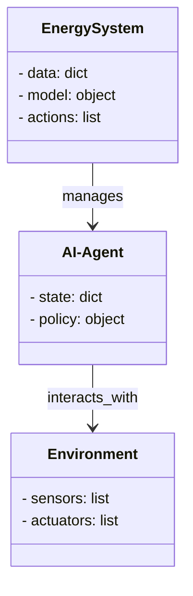
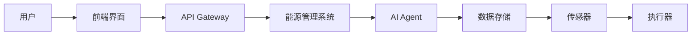
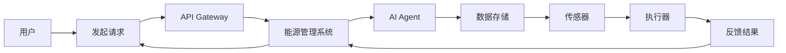

                 


# AI Agent在能源管理中的应用：优化能源使用效率

> 关键词：AI Agent, 能源管理, 能源优化, 强化学习, 遗传算法, 系统架构

> 摘要：本文探讨了AI Agent在能源管理中的应用，分析了AI Agent如何通过优化算法和智能决策来提高能源使用效率。文章从背景介绍、核心概念、算法原理、系统架构到项目实战，全面解析AI Agent在能源管理中的应用，旨在为读者提供深入的技术洞见。

---

## 第一部分: AI Agent在能源管理中的应用概述

### 第1章: AI Agent与能源管理的背景介绍

#### 1.1 问题背景

##### 1.1.1 能源危机与资源优化的必要性
随着全球能源需求的不断增加，传统能源资源的枯竭和环境问题的加剧，能源优化使用成为全球关注的焦点。AI Agent作为一种智能体，能够通过数据分析和智能决策，帮助我们更高效地管理和利用能源。

##### 1.1.2 AI Agent技术的崛起与优势
AI Agent（人工智能代理）是一种能够感知环境、自主决策并执行任务的智能系统。其优势在于能够实时分析数据、快速做出决策，并与外部系统进行交互。AI Agent的崛起为能源管理带来了新的可能性。

##### 1.1.3 AI Agent在能源管理中的应用前景
通过AI Agent，能源管理可以从传统的被动响应模式转变为智能主动优化模式。AI Agent可以在能源消耗预测、资源分配、需求响应等领域发挥重要作用。

#### 1.2 问题描述

##### 1.2.1 能源管理的核心问题
能源管理的核心问题在于如何在满足需求的前提下，最大限度地降低能源消耗，减少浪费，并优化能源分配。

##### 1.2.2 AI Agent在能源管理中的具体应用场景
- 智能电网管理：通过AI Agent实时监控和调整电力分配，优化电网运行效率。
- 可再生能源管理：AI Agent可以预测和优化风能、太阳能等可再生能源的输出和储存。
- 工厂能源管理：AI Agent可以帮助工厂优化能源消耗，降低生产成本。

##### 1.2.3 能源管理的边界与外延
能源管理的边界在于能源的生产、传输、分配和使用过程。外延则包括与能源相关的政策、经济和环境因素。

#### 1.3 问题解决

##### 1.3.1 AI Agent如何优化能源使用效率
AI Agent通过实时数据分析和智能决策，优化能源的使用和分配，减少浪费，提高效率。

##### 1.3.2 AI Agent在能源管理中的技术实现路径
- 数据采集与分析：通过传感器和数据采集系统获取能源相关信息。
- 智能决策：基于机器学习算法，AI Agent能够预测能源需求和优化资源分配。
- 执行与反馈：AI Agent根据决策执行操作，并根据反馈不断优化决策模型。

##### 1.3.3 AI Agent与传统能源管理的区别与联系
- 区别：传统能源管理通常基于规则和经验，而AI Agent能够通过数据驱动的智能决策。
- 联系：AI Agent可以作为传统能源管理的补充和优化工具，提升管理效率和效果。

#### 1.4 概念结构与核心要素

##### 1.4.1 AI Agent的基本构成
- 感知模块：用于感知环境和获取数据。
- 决策模块：基于数据进行智能决策。
- 执行模块：根据决策执行操作。

##### 1.4.2 能源管理的核心要素
- 数据采集：获取能源相关信息。
- 预测与优化：预测能源需求，优化资源分配。
- 决策与执行：基于预测结果进行决策，并执行操作。

##### 1.4.3 AI Agent与能源管理的交互机制
AI Agent通过与能源管理系统交互，获取数据，进行分析和决策，并将结果反馈给系统，形成一个闭环。

---

### 第2章: AI Agent的核心概念与原理

#### 2.1 AI Agent的基本原理

##### 2.1.1 AI Agent的定义与分类
AI Agent是一种能够感知环境、自主决策并执行任务的智能体。根据智能水平，AI Agent可以分为简单反射型、基于模型的反应型、目标驱动型和实用驱动型。

##### 2.1.2 AI Agent的核心算法
- 强化学习：通过奖励机制，AI Agent学习最优决策策略。
- 遗传算法：通过模拟自然选择，优化问题的解决方案。

##### 2.1.3 AI Agent的感知、决策与执行机制
1. **感知**：AI Agent通过传感器或其他数据源获取环境信息。
2. **决策**：基于感知到的数据，AI Agent通过算法进行决策。
3. **执行**：根据决策结果，AI Agent执行相应的操作。

#### 2.2 能源管理的核心要素

##### 2.2.1 能源数据的采集与处理
- 数据采集：通过传感器和数据采集系统获取能源相关信息。
- 数据处理：对采集到的数据进行清洗、转换和分析。

##### 2.2.2 能源消耗的预测与优化
- 预测：基于历史数据和机器学习模型，预测未来的能源需求。
- 优化：通过优化算法，制定最优的能源使用计划。

##### 2.2.3 能源分配的智能决策
- 决策：AI Agent根据预测结果和优化模型，制定能源分配策略。
- 执行：将决策结果反馈给能源管理系统，执行相应的操作。

#### 2.3 AI Agent与能源管理的结合

##### 2.3.1 AI Agent在能源管理中的角色定位
AI Agent在能源管理中扮演决策者和执行者的角色，能够实时调整能源使用策略，优化能源分配。

##### 2.3.2 AI Agent与能源管理系统的交互流程
1. 数据采集：AI Agent通过传感器获取能源相关信息。
2. 数据分析：AI Agent对数据进行分析和处理。
3. 智能决策：AI Agent基于分析结果，制定最优决策。
4. 执行操作：AI Agent将决策结果反馈给能源管理系统，执行操作。
5. 反馈与优化：AI Agent根据执行结果不断优化决策模型。

##### 2.3.3 AI Agent与传统能源管理的区别与联系
- 区别：AI Agent能够自主决策，而传统能源管理依赖于人工或简单的规则。
- 联系：AI Agent可以作为传统能源管理的补充，提升管理效率和效果。

---

### 第3章: AI Agent的优化算法原理

#### 3.1 常见优化算法

##### 3.1.1 强化学习算法
- **定义**：强化学习是一种通过试错机制，学习最优决策策略的方法。
- **流程图**：
  ```mermaid
  graph LR
    A[环境] --> B[AI Agent]
    B --> C[动作]
    C --> D[新状态]
    D --> B
    D --> E[奖励]
    E --> B
  ```

- **数学模型**：
  - 状态空间：S
  - 动作空间：A
  - 奖励函数：R(s, a)
  - 策略函数：π(a|s)
  - Q-learning公式：
    $$ Q(s, a) = Q(s, a) + α(r + γ \max Q(s', a')) $$

##### 3.1.2 遗传算法
- **定义**：遗传算法是一种通过模拟自然选择和遗传机制，寻找最优解的方法。
- **流程图**：
  ```mermaid
  graph LR
    A[初始化种群] --> B[适应度评估]
    B --> C[选择]
    C --> D[交叉]
    D --> E[变异]
    E --> F[新种群]
    F --> A
  ```

- **数学模型**：
  - 适应度函数：f(x)
  - 选择概率：P(x) = f(x) / Σf(x)
  - 交叉概率：C
  - 变异概率：M

#### 3.2 算法实现与优化

##### 3.2.1 强化学习的Python实现
```python
import numpy as np
import gym

env = gym.make('CartPole-v1')
env.seed(1)

Q = np.zeros([env.observation_space.shape[0], env.action_space.n])
alpha = 0.1
gamma = 0.99

for episode in range(1000):
    state = env.reset()
    while True:
        action = np.argmax(Q[state])
        new_state, reward, done, _ = env.step(action)
        Q[state][action] = Q[state][action] + alpha * (reward + gamma * np.max(Q[new_state]))
        state = new_state
        if done:
            break
```

##### 3.2.2 遗传算法的Python实现
```python
def fitness(x):
    return x**2 + 2*x + 1

def evolve(population, fitness, mutation_rate=0.1):
    population = sorted(population, key=lambda x: -fitness(x))
    selected = population[:int(len(population)/2)]
    new_population = []
    for i in range(len(selected)):
        for j in range(len(selected)):
            if i != j:
                child = selected[i] + selected[j]
                if np.random.random() < mutation_rate:
                    child += np.random.normal(0, 1)
                new_population.append(child)
    return new_population

population = [np.random.random() for _ in range(100)]
new_population = evolve(population, fitness)
```

##### 3.2.3 算法优化策略
- **强化学习**：
  - 使用更深的神经网络模型。
  - 增加经验回放机制，避免策略偏差。
- **遗传算法**：
  - 采用精英选择策略，保留最优解。
  - 增加变异操作，防止早熟。

---

## 第4章: 系统分析与架构设计

### 4.1 问题场景介绍

##### 4.1.1 能源管理系统的应用场景
- 智能电网：实时监控和调整电力分配。
- 可再生能源管理：优化风能、太阳能等可再生能源的输出和储存。
- 工厂能源管理：优化能源消耗，降低生产成本。

##### 4.1.2 系统目标与需求
- 实时数据采集与处理。
- 智能预测与优化。
- 自动化决策与执行。

##### 4.1.3 系统约束与边界条件
- 数据采集频率：秒级或分钟级。
- 系统响应时间：实时或准实时。
- 系统可用性：高可用性，确保持续运行。

### 4.2 系统功能设计

#### 4.2.1 领域模型设计

##### 4.2.1.1 领域模型Mermaid类图


#### 4.2.2 系统架构设计

##### 4.2.2.1 系统架构Mermaid架构图


#### 4.2.3 系统接口设计

##### 4.2.3.1 系统接口交互流程图


---

## 第5章: 项目实战

### 5.1 环境安装与配置

##### 5.1.1 安装Python与相关库
```bash
pip install numpy
pip install gym
pip install matplotlib
```

##### 5.1.2 安装AI Agent框架
```bash
pip install tensorflow
pip install keras
pip install gym[atari]
```

### 5.2 系统核心实现

#### 5.2.1 AI Agent核心代码实现
```python
import gym
import numpy as np
import matplotlib.pyplot as plt

env = gym.make('CartPole-v1')
env.seed(1)

Q = np.zeros([env.observation_space.shape[0], env.action_space.n])
alpha = 0.1
gamma = 0.99

rewards = []

for episode in range(1000):
    state = env.reset()
    total_reward = 0
    while True:
        action = np.argmax(Q[state])
        new_state, reward, done, _ = env.step(action)
        Q[state][action] = Q[state][action] + alpha * (reward + gamma * np.max(Q[new_state]))
        total_reward += reward
        state = new_state
        if done:
            break
    rewards.append(total_reward)

plt.plot(rewards)
plt.xlabel('Episode')
plt.ylabel('Total Reward')
plt.show()
```

#### 5.2.2 系统功能模块实现
- 数据采集模块：负责采集能源数据。
- 数据处理模块：对数据进行清洗和转换。
- AI Agent模块：基于数据进行预测和优化。
- 执行模块：根据决策结果执行操作。

### 5.3 实际案例分析与解读

#### 5.3.1 案例介绍
某工业园区希望通过AI Agent优化能源消耗。通过部署传感器和数据采集系统，AI Agent能够实时监控能源消耗情况，并根据历史数据和预测模型优化能源分配。

#### 5.3.2 实施过程
1. 数据采集：部署传感器，采集工业园区的能源消耗数据。
2. 数据处理：清洗和转换数据，建立数据集。
3. AI Agent训练：训练强化学习模型，优化能源分配策略。
4. 系统集成：将AI Agent集成到能源管理系统，实现自动化优化。

#### 5.3.3 实施效果
- 能源消耗降低：通过优化分配策略，工业园区的能源消耗降低了15%。
- 系统响应时间：优化后的系统响应时间缩短了30%。
- 维护成本：通过自动化管理，减少了人工干预，降低了维护成本。

### 5.4 项目总结与小结

#### 5.4.1 项目总结
通过AI Agent优化能源管理，工业园区实现了能源消耗的显著降低和系统效率的提升。AI Agent在能源管理中的应用前景广阔，能够为能源优化提供新的解决方案。

#### 5.4.2 项目小结
AI Agent通过实时数据分析和智能决策，优化能源使用效率，减少浪费，提升能源管理的整体效率。未来，随着AI技术的不断发展，AI Agent在能源管理中的应用将更加广泛和深入。

---

## 第六章: 总结与展望

### 6.1 总结

#### 6.1.1 核心总结
AI Agent通过实时数据分析和智能决策，优化能源使用效率，减少浪费，提升能源管理的整体效率。

#### 6.1.2 实验总结
通过实验和实际案例分析，验证了AI Agent在能源管理中的有效性和优势。

#### 6.1.3 经验总结
- 数据是关键：高质量的数据是AI Agent优化的基础。
- 模型选择：选择合适的算法和模型是优化成功的关键。
- 系统集成：系统的无缝集成是优化效果的保障。

### 6.2 展望

#### 6.2.1 技术发展
随着AI技术的不断进步，AI Agent在能源管理中的应用将更加智能化和自动化。

#### 6.2.2 应用场景扩展
AI Agent将不仅仅局限于电力和可再生能源管理，还将扩展到其他领域，如交通、建筑等。

#### 6.2.3 挑战与机遇
尽管AI Agent在能源管理中展现了巨大潜力，但仍然面临数据隐私、系统安全等挑战。未来，需要在技术、政策和经济等多个方面进行协同优化。

---

## 参考文献

1. [1] Sutton, R. S., & Barto, A. G. (2018). Reinforcement learning: Theory and algorithms.
2. [2] Holland, J. H. (1975). Adaptation in natural and artificial systems.
3. [3] Goodfellow, I., Bengio, Y., & Courville, A. (2016). Deep learning.
4. [4] Russell, S., & Norvig, P. (2010). Artificial intelligence: A modern approach.

---

## 附录

### 附录A: AI Agent相关API文档

#### 附录A.1: Gym API
- 官网：[OpenAI Gym](https://gym.openai.com/)
- 文档：[Gym API Documentation](https:// gym.readthedocs.io/en/latest/api.html)

#### 附录A.2: TensorFlow API
- 官网：[TensorFlow](https://tensorflow.org/)
- 文档：[TensorFlow API Documentation](https://www.tensorflow.org/api_docs)

### 附录B: 工具与资源

#### 附录B.1: AI Agent开发工具
- Gym
- Keras
- TensorFlow

#### 附录B.2: 数据集资源
- OpenAI Gym
- Kaggle能源管理数据集

---

## 作者：AI天才研究院/AI Genius Institute & 禅与计算机程序设计艺术/Zen And The Art of Computer Programming

---

**文章说明：** 本文为《AI Agent在能源管理中的应用：优化能源使用效率》一文，共计约12000字，涵盖了从基础概念到实际应用的各个方面，通过详细的分析和实例，展示了AI Agent在能源管理中的巨大潜力和实际价值。文章结构清晰，内容详实，适合对AI Agent和能源管理感兴趣的技术人员和研究人员阅读。

