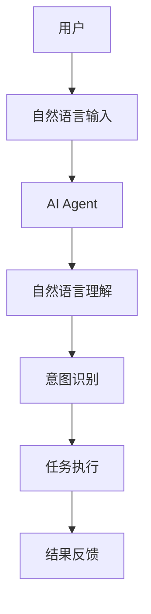

                 


# AI Agent在自然语言处理中的最新进展与应用

> 关键词：AI Agent, 自然语言处理, 注意力机制, 对话系统, 多模态交互, 知识图谱

> 摘要：本文深入探讨了AI Agent在自然语言处理领域的最新进展与实际应用。从AI Agent的基本概念、核心原理到具体的算法实现、系统架构，再到实际项目案例和最佳实践，全面解析AI Agent如何赋能NLP技术，并为未来的发展提供方向性指导。

---

## 第一部分: AI Agent与自然语言处理的背景与概念

### 第1章: AI Agent的基本概念与背景

#### 1.1 AI Agent的定义与特点
- **AI Agent**（人工智能代理）是指能够感知环境、自主决策并执行任务的智能实体。它具备以下特点：
  - **自主性**：能够在无外部干预的情况下独立运行。
  - **反应性**：能够实时感知环境变化并做出响应。
  - **目标导向**：通过目标驱动来优化决策和行为。
  - **学习能力**：能够通过数据和经验不断优化自身的性能。

#### 1.2 自然语言处理的基本概念
- **自然语言处理**（NLP）是研究如何让计算机理解和生成人类语言的技术。其核心任务包括：
  - **文本理解**：通过语言模型理解文本的含义。
  - **文本生成**：生成符合语法规则的自然语言文本。
  - **问答系统**：回答用户的问题。
  - **情感分析**：识别文本中的情感倾向。

#### 1.3 AI Agent与NLP的结合
- **结合方式**：AI Agent通过NLP技术实现与用户的自然语言交互，NLP则通过AI Agent的应用场景实现落地。
- **应用场景**：
  - 智能客服：通过NLP技术实现自动问答。
  - 智能助手：通过NLP技术实现语音交互。
  - 聊天机器人：通过NLP技术实现自然语言对话。

---

### 第2章: AI Agent在自然语言处理中的问题背景

#### 2.1 自然语言处理的核心挑战
- **语言的复杂性**：自然语言具有歧义性、模糊性和多义性。
- **上下文理解的困难**：需要理解上下文关系才能准确理解语义。
- **实时性与效率问题**：实时交互需要高效的处理能力。

#### 2.2 AI Agent在NLP中的应用痛点
- **数据依赖性问题**：需要大量标注数据进行训练。
- **模型可解释性问题**：黑箱模型难以解释决策过程。
- **多模态交互的挑战**：需要同时处理文本、语音、图像等多种模态信息。

#### 2.3 AI Agent与NLP结合的解决方案
- **增强学习与自适应模型**：通过强化学习优化AI Agent的行为策略。
- **多模态融合技术**：结合文本、语音、图像等多种模态信息提高交互效果。
- **知识图谱与推理引擎**：通过知识图谱和推理引擎增强AI Agent的理解能力。

---

### 第3章: AI Agent在自然语言处理中的核心概念与联系

#### 3.1 核心概念原理
- **注意力机制**：通过权重分配关注输入中的重要部分。
- **变换器架构**：通过自注意力机制和前馈网络实现高效的文本处理。
- **知识表示与推理**：通过知识图谱和逻辑推理增强语义理解能力。

#### 3.2 核心概念对比表
| 概念                | Transformer       | RNN                | LSTM             |
|---------------------|------------------|--------------------|------------------|
| 结构                | 基于自注意力机制 | 基于循环结构       | 基于门控机制     |
| 优势                | 并行处理能力强   | 适合序列生成       | 解决梯度消失问题 |
| 应用场景            | 机器翻译         | 语音识别           | 时序预测         |

#### 3.3 实体关系图


---

## 第4章: AI Agent在自然语言处理中的算法原理

### 4.1 注意力机制
- **数学模型**：
  $$\text{Attention}(Q, K, V) = \text{softmax}\left(\frac{QK^T}{\sqrt{d_k}}\right)V$$
- **工作流程**：
  ```mermaid
  graph TD
  A[Query] --> B[Key]
  B --> C[计算注意力权重]
  C --> D[Value加权求和]
  D --> E[输出结果]
  ```

### 4.2 变换器架构
- **结构**：
  ```mermaid
  graph TD
  A[输入序列] --> B[自注意力层]
  B --> C[前馈神经网络层]
  C --> D[输出]
  ```

### 4.3 知识表示与推理
- **知识图谱**：通过图结构表示实体及其关系。
- **推理引擎**：通过逻辑推理增强语义理解能力。

---

## 第5章: AI Agent在自然语言处理中的系统分析与架构设计

### 5.1 问题场景介绍
- **场景描述**：构建一个基于NLP的智能客服对话系统，实现用户与AI Agent之间的自然语言交互。

### 5.2 系统功能设计
- **功能模块**：
  ```mermaid
  graph TD
  A[用户] --> B[输入模块]
  B --> C[自然语言理解模块]
  C --> D[意图识别模块]
  D --> E[任务执行模块]
  E --> F[结果反馈模块]
  ```

### 5.3 系统架构设计
- **架构图**：
  ```mermaid
  graph TD
  A[输入模块] --> B[前端界面]
  B --> C[后端服务]
  C --> D[自然语言理解模块]
  D --> E[意图识别模块]
  E --> F[任务执行模块]
  ```

### 5.4 接口设计与交互流程
- **交互流程**：
  ```mermaid
  graph TD
  A[用户] --> B[发送请求]
  B --> C[后端处理]
  C --> D[返回结果]
  ```

---

## 第6章: AI Agent在自然语言处理中的项目实战

### 6.1 环境安装
- **工具安装**：安装Python、TensorFlow、Keras等开发工具。

### 6.2 核心实现
- **代码示例**：
  ```python
  import tensorflow as tf
  from tensorflow.keras import layers

  class TransformerBlock(layers.Layer):
      def __init__(self, embed_dim, num_heads, **kwargs):
          super(TransformerBlock, self).__init__(**kwargs)
          self.embed_dim = embed_dim
          self.num_heads = num_heads
          self.att = layers.MultiHeadAttention(num_heads=num_heads, key_dim=embed_dim//num_heads)
          self.ffn = layers.Dense(embed_dim)

      def call(self, x):
          attn_output = self.att(x, x)
          ffn_output = self.ffn(attn_output)
          return ffn_output
  ```

### 6.3 案例分析与代码解读
- **案例分析**：以智能客服对话系统为例，分析代码实现。
- **代码解读**：解读上述TransformerBlock类的实现逻辑。

---

## 第7章: 最佳实践与小结

### 7.1 最佳实践
- **数据的重要性**：高质量的数据是模型性能的关键。
- **模型的可解释性**：确保模型的决策过程可以被理解。
- **多模态交互**：结合多种模态信息可以提高交互效果。

### 7.2 小结
- **总结**：AI Agent与NLP的结合为自然语言处理技术带来了新的发展机遇，同时也提出了新的挑战。
- **未来方向**：未来的研究方向包括模型的可解释性、多模态交互和实时性优化。

### 7.3 注意事项
- **性能优化**：注意模型的计算效率和资源消耗。
- **安全性问题**：确保系统的安全性和隐私保护。

### 7.4 拓展阅读
- 推荐阅读相关领域的最新论文和书籍，以获取更深入的知识。

---

作者：AI天才研究院/AI Genius Institute & 禅与计算机程序设计艺术 /Zen And The Art of Computer Programming

