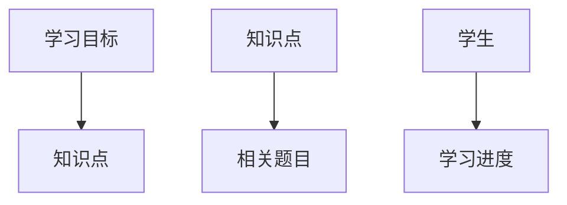
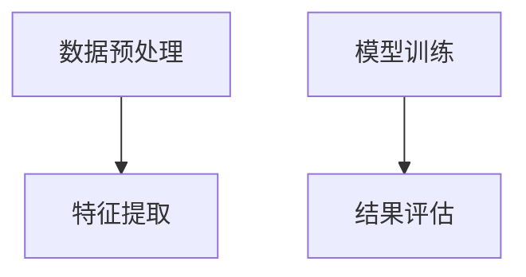
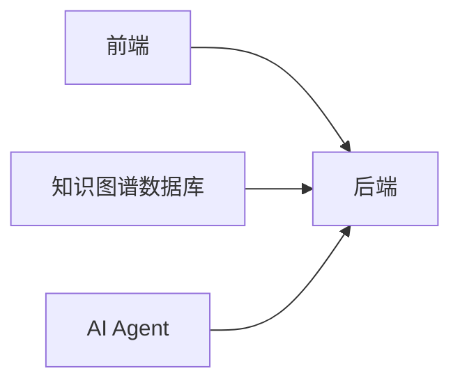
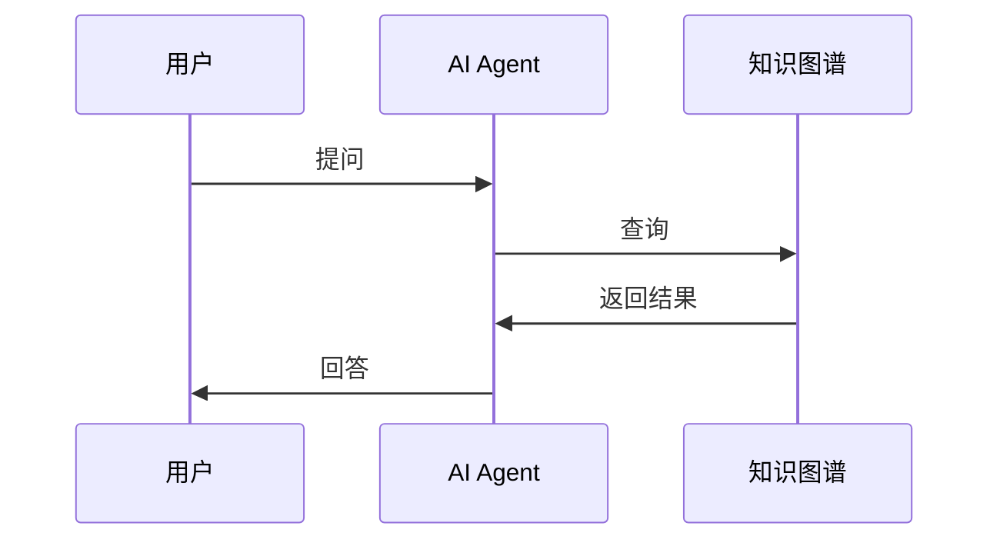

                 


# AI Agent在虚拟教师中的知识图谱应用

## 关键词：
AI Agent, 知识图谱, 虚拟教师, 教育科技, 自然语言处理

## 摘要：
本文探讨了AI Agent在虚拟教师中的知识图谱应用，分析了知识图谱的构建、AI Agent的交互机制及其在教育中的应用。通过详细讲解核心概念、算法原理、系统架构和项目实战，展示了如何利用知识图谱提升虚拟教师的能力，解决教育中的实际问题。

---

## 正文

### 第一章：背景介绍

#### 1.1 问题背景
- **教育领域的挑战**：传统教育模式中，教师资源有限，学生个性化需求难以满足。
- **AI技术的机遇**：AI Agent和知识图谱的应用为教育提供了智能化解决方案。
- **知识图谱的价值**：通过结构化知识，提升信息检索和推理能力。

#### 1.2 问题描述
- **虚拟教师的核心需求**：提供个性化学习支持、实时答疑、学习进度追踪。
- **知识图谱的作用**：构建结构化的知识体系，支持智能查询和推理。
- **AI Agent的角色**：作为中间媒介，连接知识图谱与用户需求。

#### 1.3 问题解决
- **知识图谱构建**：从数据中提取实体和关系，构建教育领域的知识图谱。
- **AI Agent的应用**：通过自然语言处理技术，实现用户意图识别和知识检索。
- **边界与外延**：明确知识图谱的应用范围，如仅限于特定学科或涵盖广泛领域。

---

### 第二章：核心概念与联系

#### 2.1 知识图谱的构建
- **构建过程**：数据预处理、实体识别、关系抽取、知识融合。
- **存储方式**：使用图数据库，如Neo4j，存储节点和边。

#### 2.2 AI Agent与知识图谱的交互
- **查询流程**：接收用户请求，解析意图，调用知识图谱进行推理，生成回答。

#### 2.3 概念对比
| 特性         | 知识图谱                  | 传统数据库              |
|--------------|--------------------------|--------------------------|
| 数据结构     | 图结构，节点和边         | 行数据结构              |
| 存储方式     | 图数据库                 | 关系型数据库            |
| 查询方式     | SPARQL                   | SQL                     |

#### 2.4 实体关系图


---

### 第三章：算法原理

#### 3.1 知识图谱构建算法
- **实体识别**：基于规则和统计方法。
- **关系抽取**：利用模式匹配和机器学习。

#### 3.2 实体识别流程


#### 3.3 代码实现
```python
# 实体识别示例
from spacy.lang.zh import Chinese
import spacy

nlp = spacy.load("zh")
doc = nlp("这是一段中文文本。")
for ent in doc.ents:
    print(ent.text, ent.label_)
```

---

### 第四章：数学模型与公式

#### 4.1 向量空间模型
- **节点表示**：$v_i$ 表示节点i的向量。
- **边表示**：$e_{ij}$ 表示节点i和j之间的关系向量。

#### 4.2 相似度计算
- 余弦相似度：$$\text{similarity}(v_i, v_j) = \frac{v_i \cdot v_j}{\|v_i\| \|v_j\|}$$

#### 4.3 推理机制
- **逻辑推理**：通过规则推导，如 $$\text{如果A，则B}$$。
- **概率推理**：基于贝叶斯定理，计算条件概率。

---

### 第五章：系统分析与架构设计

#### 5.1 问题场景
- 虚拟教师帮助学生解答数学题。

#### 5.2 系统功能设计
- **知识图谱构建模块**：处理数据，构建教育知识图谱。
- **AI Agent交互模块**：解析用户需求，调用知识图谱。

#### 5.3 系统架构图


#### 5.4 接口设计
- RESTful API：提供查询和更新接口，如 `/api/query` 和 `/api/update`。

#### 5.5 交互流程


---

### 第六章：项目实战

#### 6.1 环境搭建
- 安装Python、spaCy、Neo4j。

#### 6.2 核心代码实现
```python
# 知识图谱构建示例
from neo4j import GraphDatabase

def add_node(tx, label, properties):
    tx.run("CREATE (:{} {{ {} }})".format(label, properties))

with driver.session() as session:
    session.write_transaction(add_node, "知识点", {"名称": "数学", "级别": "初中"})
```

#### 6.3 代码解读
- 数据库连接：使用Neo4j驱动，构建知识点节点。
- 实体识别：spaCy用于识别文本中的实体。

#### 6.4 实际案例分析
- 案例：学生询问“二次方程的解法”，虚拟教师通过知识图谱查找相关知识点，生成解答步骤。

#### 6.5 项目小结
- 成功实现了知识图谱构建和AI Agent交互，提升了虚拟教师的智能水平。

---

### 第七章：最佳实践与总结

#### 7.1 最佳实践
- **数据质量**：确保知识图谱数据的准确性和完整性。
- **模型优化**：定期更新和优化AI Agent的推理模型。

#### 7.2 小结
- 本文详细探讨了AI Agent在虚拟教师中的知识图谱应用，展示了其在教育中的巨大潜力。

#### 7.3 注意事项
- 数据隐私保护：确保学生数据的安全。
- 模型局限性：知识图谱可能无法覆盖所有教育场景。

#### 7.4 拓展阅读
- 推荐书籍：《知识图谱：概念、方法与应用》。
- 在线课程：Coursera上的《人工智能基础》。

---

## 作者信息：
作者：AI天才研究院 & 禅与计算机程序设计艺术

