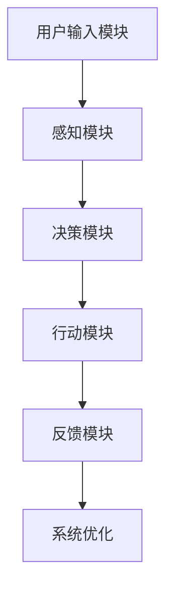

                 


# AI Agent在虚拟现实中的交互设计

> 关键词：AI Agent, 虚拟现实, 交互设计, 智能代理, 虚拟现实系统

> 摘要：本文探讨AI Agent在虚拟现实中的交互设计，涵盖AI Agent的基本概念、在虚拟现实中的应用背景、交互核心概念、交互算法原理、系统架构设计、项目实战及最佳实践。通过详细分析AI Agent与虚拟现实的结合，结合数学模型和算法，提供系统架构设计和实际案例，为读者提供全面的技术指导。

---

# 第1章: AI Agent与虚拟现实概述

## 1.1 AI Agent的基本概念

### 1.1.1 AI Agent的定义

AI Agent（人工智能代理）是指能够感知环境、做出决策并采取行动以实现特定目标的智能实体。AI Agent可以是软件程序或物理设备，通过与环境交互，实现自主决策和问题解决。

$$
\text{AI Agent} = \{\text{感知} \rightarrow \text{决策} \rightarrow \text{行动}\}
$$

### 1.1.2 AI Agent的核心特征

| 特性 | 描述 |
|------|------|
| 自主性 | AI Agent能够自主决策，无需外部干预。 |
| 反应性 | 能够实时感知环境变化并做出反应。 |
| 目标导向 | 具有明确的目标，并采取行动以实现目标。 |
| 学习能力 | 能够通过经验或数据优化自身行为。 |

### 1.1.3 虚拟现实的基本概念

虚拟现实（Virtual Reality，VR）是一种计算机生成的三维虚拟环境，用户可以通过视觉、听觉、触觉等多种感官与之交互。VR系统通常包括头显设备、手柄、传感器等硬件和软件。

---

## 1.2 AI Agent在虚拟现实中的应用背景

### 1.2.1 虚拟现实的发展历程

虚拟现实技术起源于20世纪60年代，经历了从简单图形到高保真 immersive 系统的发展。近年来，随着计算能力和人工智能技术的进步，VR应用领域不断扩大，涵盖游戏、教育、医疗等多个行业。

### 1.2.2 AI Agent在VR中的作用

AI Agent在虚拟现实中的作用主要体现在以下几个方面：

1. **智能交互**：通过AI Agent实现自然的人机交互，例如手势识别、语音对话等。
2. **环境理解**：AI Agent能够理解虚拟环境的结构和物体关系，帮助用户更好地导航和操作。
3. **行为模拟**：AI Agent可以模拟人类或其他角色的行为，增强虚拟环境的沉浸感。

### 1.2.3 当前VR交互设计的挑战

1. **实时性**：AI Agent需要在极低延迟下做出反应，以保证用户体验。
2. **复杂性**：虚拟环境中的物体和事件数量庞大，AI Agent需要高效处理这些信息。
3. **个性化**：用户需求多样化，AI Agent需要具备高度的适应性和定制能力。

---

## 1.3 本章小结

本章介绍了AI Agent和虚拟现实的基本概念，并分析了AI Agent在虚拟现实中的应用背景及面临的挑战。通过这些内容，读者可以理解AI Agent在虚拟现实交互设计中的重要性。

---

# 第2章: AI Agent与虚拟现实交互的核心概念

## 2.1 AI Agent的感知与决策机制

### 2.1.1 感知模块的功能与实现

AI Agent的感知模块通过多种传感器获取环境信息，例如视觉、听觉、触觉等。感知模块的核心任务是将这些信息转换为可计算的数据，供决策模块使用。

$$
\text{感知} = \{\text{视觉输入} \rightarrow \text{特征提取} \rightarrow \text{环境理解}\}
$$

### 2.1.2 决策模块的原理

决策模块基于感知到的信息，结合预设的规则或学习得到的模型，生成行动指令。决策过程通常包括以下几个步骤：

1. **状态识别**：确定当前环境的状态。
2. **目标规划**：根据当前状态，规划实现目标的路径。
3. **决策选择**：从多个选项中选择最优的行动方案。

### 2.1.3 行动模块的实现方式

行动模块负责将决策模块生成的指令转化为具体的动作。例如，在虚拟现实中，AI Agent可以通过控制虚拟角色的行为或操作虚拟物体来实现行动。

---

## 2.2 虚拟现实中的交互方式

### 2.2.1 手势交互

手势交互是虚拟现实中一种直观的交互方式。AI Agent可以通过对手势的识别和理解，实现与用户的自然交互。

$$
\text{手势交互} = \{\text{手部动作} \rightarrow \text{手势识别} \rightarrow \text{动作执行}\}
$$

### 2.2.2 语音交互

语音交互通过语音识别和自然语言处理技术，实现用户与AI Agent之间的语音对话。

$$
\text{语音交互} = \{\text{语音输入} \rightarrow \text{语音识别} \rightarrow \text{语义理解}\}
$$

### 2.2.3 视觉交互

视觉交互通过眼球追踪、面部表情识别等技术，实现更高级别的交互方式。

$$
\text{视觉交互} = \{\text{视觉输入} \rightarrow \text{表情识别} \rightarrow \text{行为反馈}\}
$$

---

## 2.3 AI Agent与虚拟现实交互的结合

### 2.3.1 AI Agent在VR交互中的角色

AI Agent在VR交互中的角色可以是指导者、助手或虚拟角色。例如，在教育VR应用中，AI Agent可以作为虚拟导师，指导用户完成学习任务。

### 2.3.2 VR交互中的AI Agent行为模式

AI Agent在VR交互中的行为模式包括：

1. **被动响应**：根据用户的输入做出反应。
2. **主动引导**：主动提供信息或建议，引导用户完成任务。
3. **协作互动**：与用户或其他虚拟角色协作完成任务。

### 2.3.3 AI Agent与VR交互的协同设计

AI Agent与VR交互的协同设计需要考虑以下几个方面：

1. **用户体验**：设计直观、自然的交互方式，提升用户沉浸感。
2. **实时性**：确保AI Agent能够快速响应用户输入。
3. **适应性**：AI Agent需要具备适应不同用户需求的能力。

---

## 2.4 本章小结

本章详细讲解了AI Agent在虚拟现实中的感知、决策和行动机制，以及在VR交互中的核心概念。通过分析不同的交互方式，读者可以更好地理解AI Agent在虚拟现实中的重要作用。

---

# 第3章: AI Agent在虚拟现实中的交互算法原理

## 3.1 AI Agent的感知算法

### 3.1.1 基于深度学习的物体识别

物体识别是AI Agent感知环境的重要任务。基于深度学习的物体识别算法（如CNN）可以通过训练大量图像数据，实现高精度的物体识别。

$$
\text{物体识别} = \{\text{图像输入} \rightarrow \text{特征提取} \rightarrow \text{物体分类}\}
$$

### 3.1.2 基于强化学习的环境理解

强化学习是一种通过试错机制优化决策的算法。在虚拟现实中，AI Agent可以通过强化学习不断优化对环境的理解。

$$
\text{强化学习} = \{\text{状态} \rightarrow \text{动作} \rightarrow \text{奖励} \rightarrow \text{策略优化}\}
$$

### 3.1.3 感知算法的实现流程

感知算法的实现流程包括以下几个步骤：

1. **数据采集**：通过传感器获取环境数据。
2. **数据预处理**：对数据进行降噪、归一化等处理。
3. **特征提取**：提取数据中的有用特征。
4. **模型训练**：训练感知模型。
5. **模型推理**：将新数据输入模型，获取感知结果。

---

## 3.2 AI Agent的决策算法

### 3.2.1 基于规则的决策系统

基于规则的决策系统通过预设的规则库，实现对环境的判断和决策。

$$
\text{基于规则的决策} = \{\text{规则库} \rightarrow \text{状态输入} \rightarrow \text{决策输出}\}
$$

### 3.2.2 基于强化学习的决策网络

基于强化学习的决策网络通过不断试错，优化决策策略。

$$
\text{强化学习决策} = \{\text{状态输入} \rightarrow \text{动作输出} \rightarrow \text{奖励反馈} \rightarrow \text{策略优化}\}
$$

### 3.2.3 决策算法的优化策略

为了提高决策算法的效率，可以采用以下优化策略：

1. **分层决策**：将决策过程分解为多个层次，分别处理不同的决策任务。
2. **经验回放**：通过回放历史经验，优化决策网络的训练效果。
3. **多目标优化**：在多个目标之间寻找平衡，提高决策的全面性。

---

## 3.3 交互过程中的实时反馈机制

### 3.3.1 反馈机制的定义与作用

实时反馈机制是指在用户与AI Agent交互过程中，系统能够快速响应用户的输入，并给予相应的反馈。反馈机制的作用包括：

1. **提升用户体验**：通过即时反馈，增强用户的沉浸感和交互体验。
2. **优化AI Agent行为**：通过用户的反馈，调整AI Agent的决策策略。

### 3.3.2 基于反馈的算法调整

基于反馈的算法调整包括以下几个步骤：

1. **反馈采集**：获取用户的反馈信息。
2. **反馈分析**：分析反馈信息，确定需要调整的参数。
3. **参数优化**：根据反馈结果，优化算法参数。
4. **算法更新**：将优化后的算法重新部署到系统中。

### 3.3.3 反馈机制的实现方式

反馈机制的实现方式包括：

1. **实时反馈**：在用户操作的同时，系统立即给予反馈。
2. **延迟反馈**：在用户完成操作后，系统给予反馈。
3. **混合反馈**：结合实时和延迟反馈，提供更丰富的反馈信息。

---

## 3.4 本章小结

本章详细讲解了AI Agent在虚拟现实中的感知和决策算法，以及交互过程中的实时反馈机制。通过分析不同的算法原理和实现方式，读者可以更好地理解AI Agent在VR交互中的技术细节。

---

# 第4章: AI Agent与虚拟现实交互的系统架构设计

## 4.1 系统整体架构

### 4.1.1 系统模块划分

AI Agent与虚拟现实交互系统的整体架构可以划分为以下几个模块：

1. **用户输入模块**：接收用户的输入，例如手势、语音等。
2. **感知模块**：通过传感器获取环境数据，进行特征提取和环境理解。
3. **决策模块**：根据感知结果和用户输入，生成决策指令。
4. **行动模块**：根据决策指令，执行具体的动作。
5. **反馈模块**：将用户的反馈信息传递给系统，调整算法参数。

### 4.1.2 各模块之间的关系

各模块之间的关系可以用以下Mermaid图表示：



### 4.1.3 系统架构的优缺点分析

1. **优点**：
   - 模块化设计，便于维护和优化。
   - 各模块独立，便于扩展和升级。
2. **缺点**：
   - 模块之间的通信可能会引入延迟。
   - 系统整体复杂度较高，需要协调多个模块。

---

## 4.2 系统功能设计

### 4.2.1 用户界面设计

用户界面设计需要考虑以下几点：

1. **直观性**：确保用户能够轻松理解界面的操作方式。
2. **沉浸感**：通过视觉、听觉等多感官刺激，增强用户的沉浸感。
3. **可定制性**：允许用户根据自身需求，调整界面布局和操作方式。

### 4.2.2 AI Agent行为设计

AI Agent的行为设计需要考虑以下几点：

1. **行为多样性**：设计多种行为模式，以适应不同的用户需求。
2. **行为一致性**：确保AI Agent的行为在不同情境下保持一致。
3. **行为可预测性**：用户能够预测AI Agent的行为，减少认知负担。

### 4.2.3 交互逻辑设计

交互逻辑设计需要考虑以下几点：

1. **逻辑清晰性**：确保交互逻辑简单明了，用户能够轻松理解和操作。
2. **逻辑完整性**：覆盖所有可能的用户操作，确保系统能够正确响应。
3. **逻辑优化**：通过优化交互逻辑，减少用户的操作步骤，提高效率。

---

## 4.3 系统接口设计

### 4.3.1 用户输入接口

用户输入接口包括：

1. **手势输入接口**：通过手势识别技术，接收用户的输入。
2. **语音输入接口**：通过语音识别技术，接收用户的输入。
3. **视觉输入接口**：通过视觉识别技术，接收用户的输入。

### 4.3.2 AI Agent控制接口

AI Agent控制接口包括：

1. **决策接口**：接收用户的输入，生成决策指令。
2. **行为接口**：控制AI Agent执行具体的行为。
3. **反馈接口**：接收用户的反馈信息，调整AI Agent的行为。

### 4.3.3 系统反馈接口

系统反馈接口包括：

1. **视觉反馈接口**：通过视觉方式，将反馈信息传递给用户。
2. **听觉反馈接口**：通过语音或音效，将反馈信息传递给用户。
3. **触觉反馈接口**：通过震动或力反馈，将反馈信息传递给用户。

---

## 4.4 本章小结

本章详细讲解了AI Agent与虚拟现实交互系统的整体架构、功能设计和接口设计。通过Mermaid图和详细的模块分析，读者可以更好地理解系统的整体结构和各部分的功能。

---

# 第5章: AI Agent与虚拟现实交互的项目实战

## 5.1 项目背景介绍

本项目旨在设计一个基于AI Agent的虚拟现实交互系统，实现用户与虚拟角色的自然交互。项目主要应用于教育领域，通过虚拟导师帮助学生完成学习任务。

---

## 5.2 系统核心实现源代码

以下是系统核心实现的Python代码示例：

```python
import numpy as np
from keras.models import Model
from keras.layers import Dense, Input

# 定义感知模型
input_layer = Input(shape=(100,))
dense_layer = Dense(50, activation='relu')(input_layer)
output_layer = Dense(10, activation='softmax')(dense_layer)
perception_model = Model(inputs=input_layer, outputs=output_layer)

# 定义决策模型
input_layer_decision = Input(shape=(10,))
dense_layer_decision = Dense(5, activation='relu')(input_layer_decision)
output_layer_decision = Dense(1, activation='sigmoid')(dense_layer_decision)
decision_model = Model(inputs=input_layer_decision, outputs=output_layer_decision)

# 定义反馈模型
input_layer_feedback = Input(shape=(1,))
dense_layer_feedback = Dense(1, activation='relu')(input_layer_feedback)
output_layer_feedback = Dense(1, activation='sigmoid')(dense_layer_feedback)
feedback_model = Model(inputs=input_layer_feedback, outputs=output_layer_feedback)
```

---

## 5.3 代码应用解读与分析

1. **感知模型**：感知模型通过输入层和两个全连接层，实现对环境数据的特征提取和分类。
2. **决策模型**：决策模型通过输入层和两个全连接层，实现对决策策略的优化。
3. **反馈模型**：反馈模型通过输入层和两个全连接层，实现对用户反馈的处理和响应。

---

## 5.4 实际案例分析和详细讲解剖析

以教育领域的虚拟导师为例，AI Agent可以通过以下步骤实现与学生的交互：

1. **感知**：AI Agent通过感知模块，识别学生的情感状态和学习进度。
2. **决策**：AI Agent根据感知结果，生成相应的教学策略。
3. **行动**：AI Agent通过视觉、听觉等方式，向学生提供个性化的教学指导。
4. **反馈**：学生通过手势、语音等方式，向AI Agent反馈学习情况。
5. **优化**：AI Agent根据反馈信息，优化自身的教学策略。

---

## 5.5 项目小结

本章通过一个实际项目案例，详细讲解了AI Agent与虚拟现实交互系统的实现过程。通过代码示例和案例分析，读者可以更好地理解AI Agent在VR交互中的实际应用。

---

# 第6章: AI Agent与虚拟现实交互的最佳实践

## 6.1 最佳实践 tips

1. **实时性优化**：通过优化算法和硬件配置，确保系统能够快速响应用户的输入。
2. **用户体验优化**：设计直观、自然的交互方式，提升用户的沉浸感。
3. **系统可扩展性**：通过模块化设计，确保系统能够方便地扩展和升级。
4. **反馈机制优化**：通过实时反馈和用户反馈，不断优化AI Agent的行为策略。

---

## 6.2 小结

本章总结了AI Agent与虚拟现实交互设计中的最佳实践，通过这些实践，可以有效提升系统的性能和用户体验。

---

## 6.3 注意事项

1. **安全性**：确保系统在设计和实现过程中，考虑用户的安全性，避免潜在的安全风险。
2. **兼容性**：确保系统能够兼容不同的硬件和软件环境。
3. **可维护性**：通过模块化设计，确保系统易于维护和优化。

---

## 6.4 拓展阅读

1. **相关书籍**：《虚拟现实与人工智能》、《AI Agent算法原理与实现》。
2. **技术博客**：关注AI Agent与虚拟现实领域的最新技术动态。
3. **开源项目**：参与开源项目，学习和交流经验。

---

# 作者信息

作者：AI天才研究院/AI Genius Institute & 禅与计算机程序设计艺术/Zen And The Art of Computer Programming

---

**全文完**

