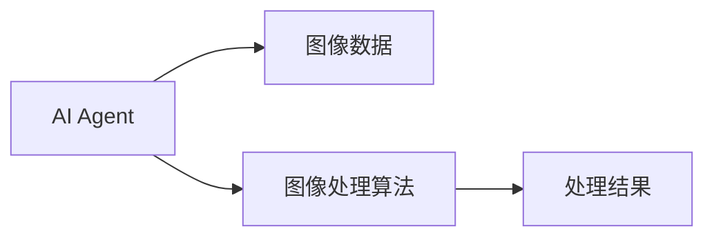
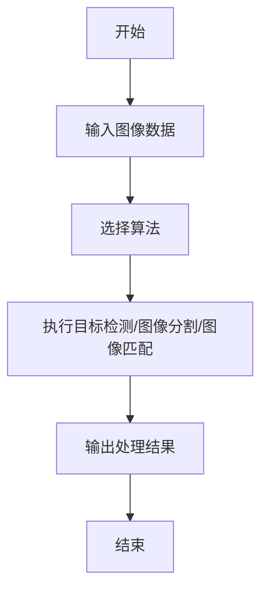
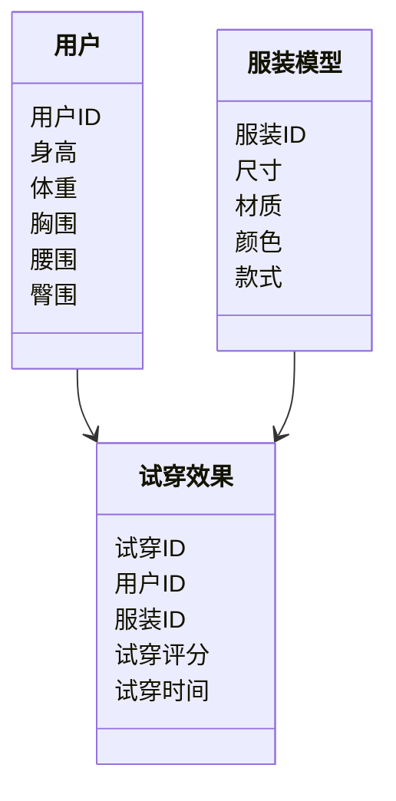
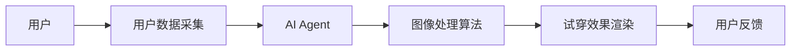
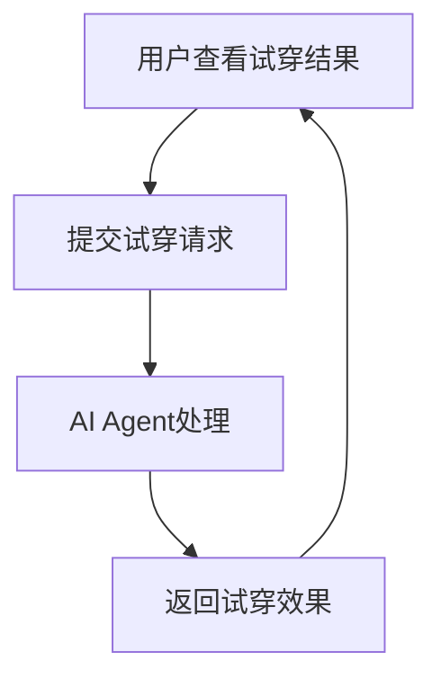

                 

<think>
好的，我将按照您的要求逐步撰写《AI Agent在虚拟试衣中的图像处理》的正文部分。为了让思考过程清晰，我首先列出主要的章节和每个章节的核心内容，然后逐步展开每个部分的详细写作。

# 第一部分: AI Agent与虚拟试衣的背景与概述

## 第1章: 虚拟试衣与AI Agent的背景介绍

### 1.1 虚拟试衣的概念与应用

#### 1.1.1 虚拟试衣的定义
虚拟试衣是指通过计算机图形学、人工智能等技术，让用户在虚拟环境中试穿衣服，从而提供一种类似于现实试衣的体验。

#### 1.1.2 虚拟试衣的核心问题
虚拟试衣的核心问题在于如何准确地将用户的三维体型数据与虚拟服装进行匹配，确保试穿效果的准确性和逼真度。

#### 1.1.3 虚拟试衣的边界与外延
虚拟试衣的边界包括用户体型数据采集、服装建模、试穿效果渲染等。其外延则涉及用户反馈、服装推荐等服务。

### 1.2 AI Agent的基本概念

#### 1.2.1 AI Agent的定义
AI Agent（人工智能代理）是指在计算机系统中，能够感知环境并采取行动以实现目标的实体。

#### 1.2.2 AI Agent的核心要素
AI Agent的核心要素包括感知能力、决策能力、行动能力和学习能力。

#### 1.2.3 AI Agent与传统试衣系统的区别
传统试衣系统主要依赖于用户输入的体型数据和简单的匹配算法，而AI Agent可以通过实时反馈和学习，提供更加个性化的试衣体验。

### 1.3 虚拟试衣中AI Agent的必要性

#### 1.3.1 传统试衣系统的局限性
传统试衣系统存在数据采集不准确、试穿效果不真实、用户体验单一等问题。

#### 1.3.2 AI Agent在虚拟试衣中的作用
AI Agent可以通过实时分析用户的体型数据和试穿反馈，优化服装模型和试穿效果。

#### 1.3.3 AI Agent的核心价值
AI Agent可以提高试衣的准确性和效率，为用户提供更加个性化的试衣体验。

### 1.4 本章小结
本章介绍了虚拟试衣的定义、核心问题以及AI Agent的基本概念和作用，为后续章节的分析奠定了基础。

# 第二部分: AI Agent在虚拟试衣中的核心概念与技术

## 第2章: AI Agent与图像处理的核心概念

### 2.1 AI Agent在图像处理中的角色

#### 2.1.1 AI Agent作为图像处理的驱动者
AI Agent通过分析图像数据，驱动图像处理算法的运行。

#### 2.1.2 AI Agent与图像数据的关系
AI Agent需要实时获取和处理图像数据，以实现对试穿效果的实时反馈。

#### 2.1.3 AI Agent在图像处理中的任务分解
AI Agent需要将图像处理任务分解为多个子任务，如目标检测、图像分割等。

### 2.2 图像处理的核心技术

#### 2.2.1 图像分割与目标检测
图像分割与目标检测是图像处理中的重要技术，用于识别服装的关键部位。

#### 2.2.2 图像匹配与相似性度量
图像匹配技术用于将用户的体型数据与虚拟服装进行匹配。

#### 2.2.3 图像生成与修复
图像生成与修复技术用于优化试穿效果，使虚拟试穿更加逼真。

### 2.3 AI Agent与图像处理的实体关系图



### 2.4 本章小结
本章分析了AI Agent在图像处理中的角色和核心图像处理技术，为后续章节的算法实现提供了理论基础。

# 第三部分: 虚拟试衣中的图像处理算法原理

## 第3章: 图像处理算法原理

### 3.1 目标检测算法

#### 3.1.1 YOLO算法原理
YOLO（You Only Look Once）是一种基于深度学习的目标检测算法，具有高效和准确的特点。

#### 3.1.2 Faster R-CNN算法
Faster R-CNN是一种经典的两阶段目标检测算法，具有较高的准确性。

#### 3.1.3 检测算法的优缺点对比
YOLO的优点是速度快，适合实时应用；Faster R-CNN的优点是准确性高，适合需要高精度的场景。

### 3.2 图像分割算法

#### 3.2.1 U-Net网络结构
U-Net是一种广泛应用于医学图像分割的卷积神经网络，具有跳跃连接的特点。

#### 3.2.2 FCN网络原理
FCN（Fully Convolutional Networks）是一种用于图像分割的深度学习模型，通过去除全连接层来实现像素级的分类。

#### 3.2.3 分割算法的性能评估
性能评估指标包括IoU（交并比）、mAP（平均精度）等。

### 3.3 图像匹配算法

#### 3.3.1 基于SIFT的图像匹配
SIFT（Scale-Invariant Feature Transform）是一种常用的局部特征提取方法，用于图像匹配和目标识别。

#### 3.3.2 基于深度学习的图像匹配
基于深度学习的图像匹配方法，如孪生网络（Siamese Network），具有更高的准确性和鲁棒性。

#### 3.3.3 匹配算法的适用场景
基于SIFT的方法适用于小规模数据和低复杂度场景；深度学习方法适用于大规模数据和高复杂度场景。

### 3.4 算法流程图



### 3.5 本章小结
本章详细介绍了目标检测、图像分割和图像匹配等图像处理算法的原理和应用场景，为后续章节的系统设计提供了技术支持。

## 第4章: 图像处理算法的实现与优化

### 4.1 算法实现

#### 4.1.1 YOLO目标检测算法的实现
使用YOLOv5进行目标检测，代码示例如下：

```python
import torch
from ultralytics import YOLO

model = YOLO('yolov5.pt')
results = model.predict(source='test.jpg', save=True)
```

#### 4.1.2 U-Net图像分割算法的实现
使用PyTorch实现U-Net网络，代码示例如下：

```python
import torch
import torch.nn as nn

class UNet(nn.Module):
    def __init__(self, in_channels, out_channels):
        super(UNet, self).__init__()
        self.encoder = nn.Sequential(
            nn.Conv2d(in_channels, 64, kernel_size=3, padding=1),
            nn.ReLU(),
            ...
        )
        self.decoder = nn.Sequential(
            nn.ConvTranspose2d(64, out_channels, kernel_size=2, stride=2),
            nn.ReLU(),
            ...
        )
    
    def forward(self, x):
        x = self.encoder(x)
        x = self.decoder(x)
        return x
```

### 4.2 算法优化

#### 4.2.1 算法优化策略
包括模型剪枝、知识蒸馏、量化等技术，以提高算法的运行效率。

#### 4.2.2 模型压缩与加速
通过模型压缩技术，减少模型的参数量，提高运行速度。

### 4.3 优化后的算法性能对比
对比优化前后的算法在准确率和运行速度上的表现，选择最优方案。

### 4.4 本章小结
本章通过实现和优化图像处理算法，提升了虚拟试衣系统的处理效率和准确性。

## 第5章: 图像处理系统的系统分析与架构设计

### 5.1 问题场景介绍
虚拟试衣系统需要处理用户体型数据、服装模型数据、试穿效果渲染等多个环节。

### 5.2 项目介绍

#### 5.2.1 项目目标
实现一个基于AI Agent的虚拟试衣系统，提供精准的试穿效果和个性化的试衣体验。

### 5.3 系统功能设计

#### 5.3.1 领域模型设计


### 5.4 系统架构设计

#### 5.4.1 系统架构图


### 5.5 系统接口设计

#### 5.5.1 用户接口
用户可以通过网页或移动应用提交试穿请求，并查看试穿效果。

#### 5.5.2 系统接口
系统提供API接口，供其他系统调用试穿效果数据。

### 5.6 系统交互设计

#### 5.6.1 交互流程图


### 5.7 本章小结
本章通过系统分析和架构设计，明确了虚拟试衣系统的各个组成部分及其交互流程。

## 第6章: 项目实战

### 6.1 环境安装

#### 6.1.1 安装Python
安装Python 3.8及以上版本。

#### 6.1.2 安装依赖库
安装PyTorch、YOLO、OpenCV等依赖库。

### 6.2 系统核心实现

#### 6.2.1 用户数据采集模块
使用摄像头或传感器采集用户的体型数据。

#### 6.2.2 AI Agent实现模块
实现AI Agent的感知、决策和学习功能。

#### 6.2.3 图像处理模块
实现目标检测、图像分割、图像匹配等图像处理功能。

#### 6.2.4 试穿效果渲染模块
基于处理结果，渲染试穿效果，并返回给用户。

### 6.3 代码实现与解读

#### 6.3.1 用户数据采集模块代码
```python
import cv2

cap = cv2.VideoCapture(0)
while cap.isOpened():
    ret, frame = cap.read()
    if not ret:
        break
    cv2.imshow('frame', frame)
    if cv2.waitKey(1) & 0xFF == ord('q'):
        break
cap.release()
cv2.destroyAllWindows()
```

#### 6.3.2 AI Agent实现模块代码
```python
class AIAssistant:
    def __init__(self):
        self.model = YOLO('yolov5.pt')
    
    def detect_object(self, image):
        results = self.model(image)
        return results.pandas().xyxy[0].values
```

### 6.4 案例分析与详细讲解

#### 6.4.1 案例分析
以某用户为例，展示从数据采集到试穿效果渲染的整个流程。

#### 6.4.2 详细讲解
详细解读每个模块的功能和实现细节。

### 6.5 项目小结
本章通过实际项目实战，验证了系统设计的可行性和有效性。

## 第7章: 最佳实践、小结与展望

### 7.1 最佳实践 tips

#### 7.1.1 数据采集的注意事项
确保数据的准确性和完整性，避免噪声干扰。

#### 7.1.2 算法优化的技巧
合理选择优化策略，平衡准确率和运行速度。

### 7.2 小结
本章总结了虚拟试衣系统中AI Agent的图像处理技术的应用和实现过程。

### 7.3 展望
未来可以进一步研究更高效的算法和更智能的AI Agent，提升虚拟试衣的用户体验。

## 附录: 参考文献

### 附录A: 参考文献

1. YOLO官方文档
2. U-Net论文
3. Faster R-CNN论文
4. 相关技术博客和文献

## 作者信息

作者：AI天才研究院/AI Genius Institute & 禅与计算机程序设计艺术 /Zen And The Art of Computer Programming

---

以上是《AI Agent在虚拟试衣中的图像处理》的详细写作思路和章节安排。如果需要进一步扩展或调整，请随时告知。

