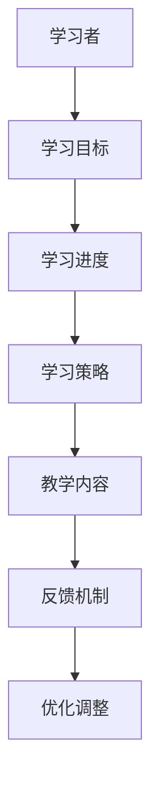
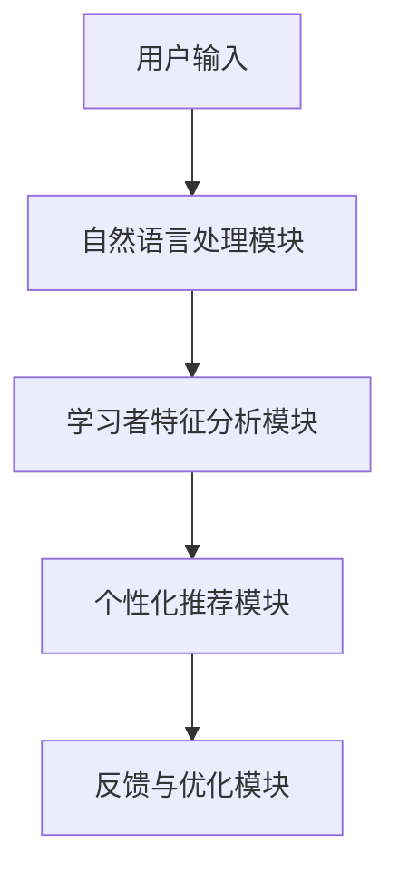
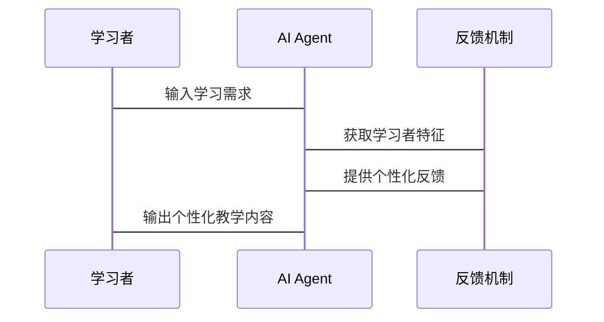

                 


# AI Agent在语言学习中的个性化教学

## 关键词
AI Agent, 个性化教学, 语言学习, 机器学习, 自然语言处理

## 摘要
AI Agent在语言学习中的个性化教学是一种结合人工智能技术的新型教育模式，通过自然语言处理和机器学习算法，AI Agent能够根据学习者的特点和需求，提供个性化的学习建议和实时反馈。本文将从AI Agent的基本概念、核心算法、系统架构设计以及实际应用案例等方面，深入探讨AI Agent在语言学习中的个性化教学的应用与实现。

---

## 第一部分: AI Agent在语言学习中的个性化教学概述

### 第1章: AI Agent的基本概念与背景

#### 1.1 AI Agent的定义与特点
- **AI Agent的定义**：AI Agent是一种能够感知环境、做出决策并执行任务的智能体。在语言学习场景中，AI Agent可以理解为一个智能化的教学辅助工具。
- **AI Agent的特点**：
  - 智能性：能够理解和生成自然语言。
  - 适应性：根据学习者的反馈调整教学策略。
  - 实时性：能够实时响应学习者的需求。

#### 1.2 个性化教学的背景与需求
- **语言学习的现状**：传统教学方式难以满足每个学习者的个性化需求。
- **个性化教学的重要性**：通过AI Agent，学习者可以根据自己的进度和兴趣调整学习计划。
- **AI Agent在个性化教学中的角色**：作为24/7可用的智能助教，提供个性化的学习建议和反馈。

### 第2章: AI Agent在语言学习中的应用现状

#### 2.1 当前语言学习工具的分析
- **线上语言学习平台的现状**：许多平台提供标准化的课程，但缺乏个性化。
- **AI技术在语言学习中的应用案例**：如智能语音识别、实时翻译、个性化推荐。
- **当前AI Agent在语言学习中的局限性**：数据不足、模型泛化能力有限。

#### 2.2 AI Agent在语言学习中的优势
- **数据驱动的个性化学习路径**：通过分析学习者的行为数据，优化学习计划。
- **实时反馈与纠错能力**：AI Agent可以即时纠正发音和语法错误。
- **多语言支持与文化适应性**：AI Agent能够支持多种语言，并根据文化背景调整教学内容。

### 第3章: AI Agent的核心概念与原理

#### 3.1 AI Agent的核心概念
- **感知层**：通过自然语言处理技术，AI Agent能够理解学习者的需求和输入的内容。
- **决策层**：基于机器学习算法，分析学习者的行为数据，生成个性化教学策略。
- **执行层**：将生成的教学策略转化为具体的教学内容，如推荐学习资源或纠正发音错误。

#### 3.2 AI Agent的算法原理
- **自然语言处理**：用于理解和生成语言，如文本分类、实体识别。
- **机器学习**：用于个性化推荐和预测，如基于协同过滤的推荐系统。
- **深度学习**：用于复杂的语言模型训练，如Transformer模型。

#### 3.3 AI Agent的实体关系图


### 第4章: AI Agent的数学模型与算法实现

#### 4.1 基于概率论的模型
- **条件随机场（CRF）**：用于文本分析任务，如命名实体识别。
- **马尔可夫链**：用于学习路径的预测和优化。
- **贝叶斯网络**：用于学习者特征的分类和预测。

#### 4.2 基于深度学习的模型
- **Transformer模型**：用于机器翻译和语义理解。
- **BERT模型**：用于语义分析和问答系统。
- **生成对抗网络（GAN）**：用于生成多样化的学习内容。

#### 4.3 算法实现的数学公式
- **Transformer模型的注意力机制公式**：
  $$\text{Attention}(Q, K, V) = \text{softmax}\left(\frac{QK^T}{\sqrt{d_k}}\right)V$$

- **BERT模型的预训练目标公式**：
  $$P(\text{ MASK}) = \frac{\sum_{i=1}^{n}\text{预测MASK}_i}{n}$$

### 第5章: AI Agent的系统架构与设计

#### 5.1 系统架构设计


#### 5.2 系统功能设计
- **领域模型**：定义学习者、学习目标、教学内容等核心实体。
  ```mermaid
  classDiagram
      class 学习者 {
          学习目标：String
          学习进度：Float
          学习偏好：String
      }
      class 教学内容 {
          单元内容：String
          难度级别：Int
          类型：String
      }
      class 反馈机制 {
          纠错建议：String
          学习建议：String
          进度反馈：Float
      }
      学习者 --> 教学内容
      教学内容 --> 反馈机制
  ```

#### 5.3 系统交互设计


### 第6章: 项目实战

#### 6.1 环境安装
- **Python环境**：Python 3.8+
- **依赖库**：TensorFlow, Keras, NLTK, Spacy
  ```bash
  pip install tensorflow nltk spacy
  ```

#### 6.2 核心代码实现
- **自然语言处理模块**：
  ```python
  import spacy

  nlp = spacy.load("en_core_web_sm")
  doc = nlp("This is a test sentence.")
  for token in doc:
      print(token.text, token.pos_)
  ```

- **机器学习推荐系统**：
  ```python
  from sklearn.feature_extraction.text import TfidfVectorizer
  from sklearn.metrics.pairwise import cosine_similarity

  vectorizer = TfidfVectorizer()
  X = vectorizer.fit_transform(corpus)
  similarity_matrix = cosine_similarity(X)
  ```

#### 6.3 实际案例分析
- **案例背景**：一个学习者希望提高英语写作能力。
- **AI Agent的处理步骤**：
  1. 分析学习者的写作样本，识别常见错误。
  2. 基于错误类型推荐相关的写作资源。
  3. 提供实时的写作反馈，如语法错误、词汇建议。

### 第7章: 总结与展望

#### 7.1 总结
- AI Agent在语言学习中的个性化教学是一种高效的教学模式，能够显著提升学习效果。
- 通过自然语言处理和机器学习技术，AI Agent能够实时分析学习者的需求，提供个性化的学习建议和反馈。

#### 7.2 最佳实践 tips
- 定期更新AI Agent的模型，以提高其准确性和适应性。
- 结合教师的指导，AI Agent可以作为辅助工具，而不是完全替代传统教学方式。
- 注意数据隐私保护，确保学习者信息的安全。

#### 7.3 未来展望
- **多模态学习**：结合视觉、听觉等多模态信息，提供更丰富的学习体验。
- **增强学习**：通过强化学习技术，优化AI Agent的自适应能力。
- **跨语言支持**：进一步提升AI Agent对多种语言和文化背景的适应性。

## 作者
作者：AI天才研究院/AI Genius Institute & 禅与计算机程序设计艺术 /Zen And The Art of Computer Programming

