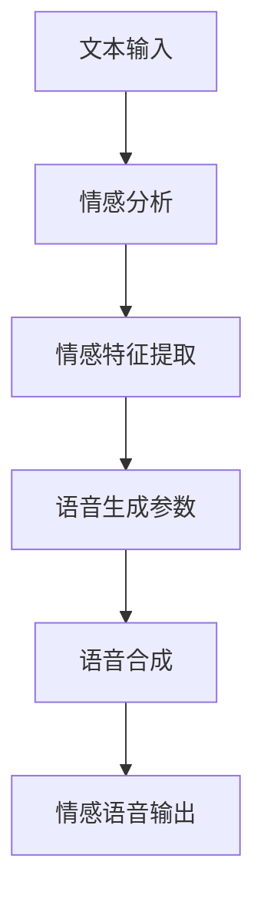
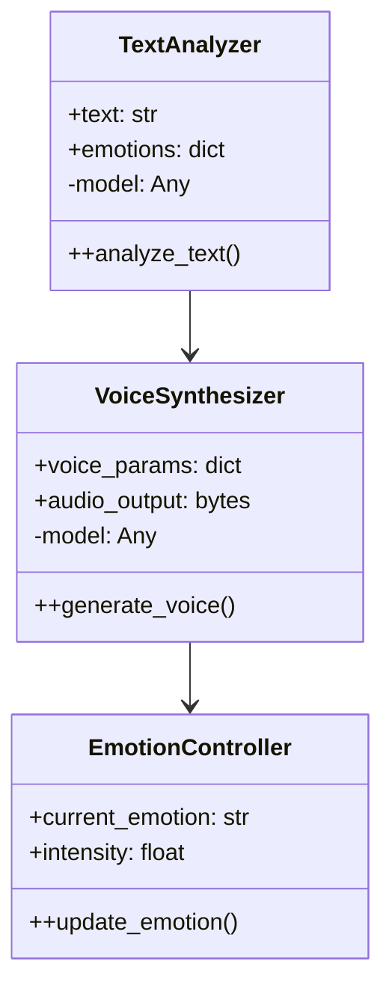
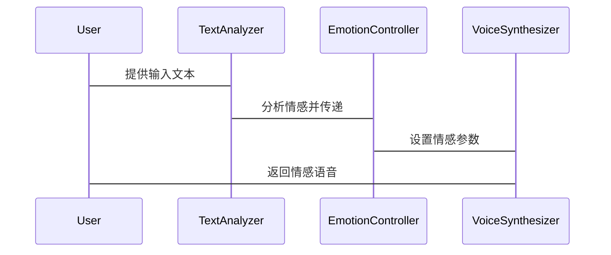

                 


# AI Agent在语音合成中的情感表达

## 关键词：AI Agent，语音合成，情感表达，深度学习，自然语言处理

## 摘要

本文探讨AI Agent在语音合成中的情感表达技术，分析情感识别、生成与表达的核心原理，结合深度学习模型如Transformer和TTS技术，详细介绍情感语音生成的算法流程。通过系统架构设计与项目实战，展示如何实现情感驱动的语音合成，并讨论技术挑战与未来发展方向。

---

## 正文

### 第一部分：背景介绍

#### 第1章：AI Agent与情感表达概述

##### 1.1 AI Agent的基本概念

- **1.1.1 AI Agent的定义与特点**
  - AI Agent是智能体，具备感知、决策、执行能力，可自主完成任务。
  - 特点：自主性、反应性、目标导向、学习能力。

- **1.1.2 AI Agent在语音合成中的作用**
  - 通过分析文本和上下文，生成自然语言指令，驱动语音合成器输出情感化语音。

- **1.1.3 情感表达的重要性**
  - 情感表达让语音更自然，增强人机交互的亲和力和用户体验。

##### 1.2 语音合成与情感表达

- **1.2.1 语音合成的基本原理**
  - 将文本转换为语音，涉及特征提取、语音生成、声学建模。
  - 传统方法：规则驱动；现代方法：深度学习驱动。

- **1.2.2 情感表达在语音合成中的应用**
  - 情感语音生成：根据文本内容生成相应情感的语音。
  - 个性化语音合成：基于用户情感偏好生成定制语音。

- **1.2.3 当前技术的挑战与未来方向**
  - 挑战：情感多样性的捕捉、实时性与稳定性。
  - 未来方向：多模态情感合成、个性化定制、实时交互。

### 第二部分：核心概念与联系

#### 第2章：AI Agent在情感表达中的核心原理

##### 2.1 情感识别与生成

- **2.1.1 情感识别的流程**
  - 文本分析：使用NLP技术提取情感特征。
  - 情感分类：基于训练好的模型预测情感类别。
  - 情感强度评估：量化情感程度。

- **2.1.2 情感生成的算法**
  - 基于规则：设定情感规则生成语音特征。
  - 基于深度学习：通过神经网络生成情感特征。

##### 2.2 情感表达的实现方式

- **2.2.1 声调、语速、音量的调整**
  - 声调：高低变化影响情感表达。
  - 语速：快慢调节传递紧张或放松。
  - 音量：大小变化传达强调或柔和。

- **2.2.2 语调的个性化定制**
  - 根据用户特征调整语调。
  - 结合上下文优化情感表达。

#### 第3章：情感表达与AI Agent的关系

##### 3.1 情感表达的核心要素

- **3.1.1 情感特征提取**
  - 从文本中提取情感相关的特征，如情感词、语调、停顿等。

- **3.1.2 情感状态的转换**
  - 将情感状态转化为语音合成的参数，如基频、响度等。

##### 3.2 情感表达与AI Agent的交互

- **3.2.1 用户情感反馈的处理**
  - 收集用户反馈，优化情感生成模型。

- **3.2.2 情感表达的实时更新**
  - 根据实时反馈调整语音输出，增强交互体验。

### 第三部分：算法原理讲解

#### 第3章：情感语音生成的算法流程

##### 3.1 情感语音生成的流程



##### 3.2 情感语音生成的Python代码实现

```python
import tensorflow as tf
from tensorflow.keras import layers

# 情感特征提取模型
def emotion_feature_extractor(input_text):
    text_input = layers.Input(shape=(None,))
    embedding = layers.Embedding(vocab_size, 100)(text_input)
    lstm = layers.LSTM(64)(embedding)
    dense = layers.Dense(32, activation='relu')(lstm)
    return Model(inputs=text_input, outputs=dense)

# 情感语音生成模型
def emotion_speech_generator(feature_input):
    feature_input = layers.Input(shape=(32,))
    dense1 = layers.Dense(64, activation='relu')(feature_input)
    output = layers.Dense(400, activation='linear')(dense1)
    return Model(inputs=feature_input, outputs=output)
```

##### 3.3 数学模型与公式

- 情感特征提取：使用词嵌入和LSTM提取文本的情感特征。
- 语音生成：通过全连接层生成语音波形参数。
  - 公式：$$ y = f(x) $$，其中 \( x \) 是情感特征，\( y \) 是语音参数。

### 第四部分：系统分析与架构设计方案

#### 第4章：系统功能设计

##### 4.1 系统功能模块



#### 第4.2 系统架构设计

##### 4.2.1 系统架构图


##### 4.2.2 接口设计

- 文本输入接口：接收文本字符串。
- 情感控制接口：调整情感状态。
- 语音输出接口：返回生成的音频数据。

#### 第4.3 交互流程图



### 第五部分：项目实战

#### 第5章：情感语音合成系统实现

##### 5.1 环境安装

```bash
pip install tensorflow==2.10.0
pip install numpy==1.21.2
pip install librosa==0.8.0
pip install pydub==0.26.2
pip install soundfile==0.10.3
```

##### 5.2 核心代码实现

```python
import numpy as np
import librosa
import soundfile as sf

# 情感特征提取与语音生成
def process_emotion_voice(text, model):
    feature = model.emotion_feature_extractor(text)
    voice_params = model.voice_synthesizer(feature)
    return sf.write('output.wav', voice_params, 16000)

# 个性化定制
def personalized_speech(user_info, text, model):
    feature = model.emotion_feature_extractor(text)
    adjusted_feature = model.emotion_controller(feature, user_info)
    voice_params = model.voice_synthesizer(adjusted_feature)
    return sf.write('output.wav', voice_params, 16000)
```

##### 5.3 代码解读与分析

- **process_emotion_voice**：提取情感特征，生成语音参数，保存为wav文件。
- **personalized_speech**：根据用户信息调整情感特征，生成个性化语音。

#### 第5.4 案例分析与应用

- **案例分析**：
  - 输入文本：“我非常高兴见到你。”
  - 情感分析：情感类别为“高兴”，强度为0.9。
  - 语音生成：调整基频和响度，生成高音、快语速的语音。

### 第六部分：最佳实践、小结、注意事项、拓展阅读

#### 第6章：总结与建议

##### 6.1 最佳实践

- 数据质量：确保训练数据多样化，涵盖不同情感和场景。
- 模型优化：使用数据增强和正则化技术提升模型泛化能力。
- 个性化调整：根据用户反馈持续优化情感表达模型。

##### 6.2 小结

- 本文系统阐述了AI Agent在语音合成中的情感表达技术，从算法原理到系统设计，再到项目实战，全面展示实现过程。

##### 6.3 注意事项

- **数据隐私**：处理用户数据时，需遵守隐私保护法规。
- **模型泛化**：确保模型在不同场景下表现稳定。
- **实时性优化**：优化算法以满足实时交互需求。

##### 6.4 拓展阅读

- 深度学习与语音合成：探索更先进的模型架构，如扩散模型。
- 多模态情感表达：结合视觉和听觉信息，提升情感表达的丰富性。
- 个性化定制：研究如何根据用户特征生成个性化语音。

---

## 作者

**作者：AI天才研究院/AI Genius Institute & 禅与计算机程序设计艺术 /Zen And The Art of Computer Programming**

