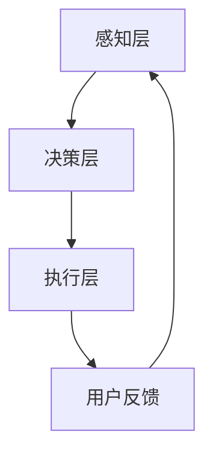
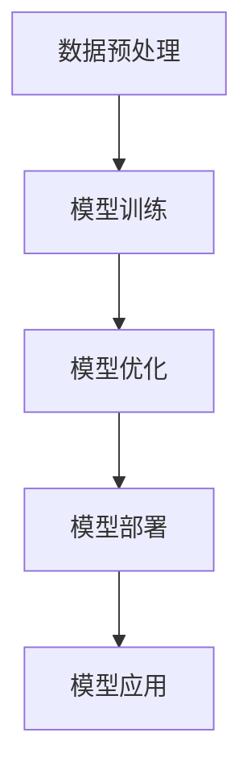
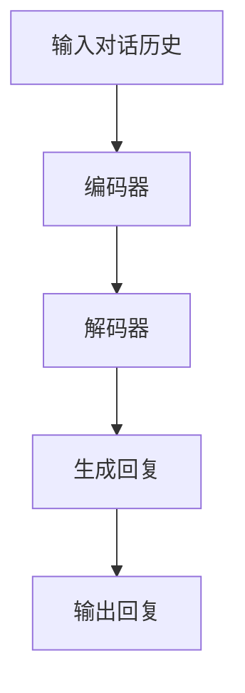
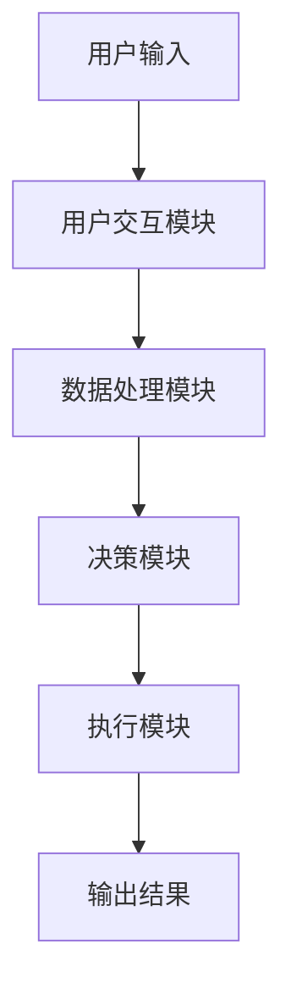

                 

# AI Agent在金融行业的创新应用

## 关键词：AI Agent、金融行业、人工智能、大模型、系统架构、智能投顾、风险管理

## 摘要：  
本文系统地探讨了AI Agent在金融行业中的创新应用，从技术原理到实际场景，结合大模型的最新进展，深入分析了AI Agent在金融领域的核心价值和应用场景。文章首先介绍了AI Agent的基本概念和背景，然后详细讲解了其技术原理和算法实现，接着通过系统架构设计展示了AI Agent在金融行业的实际应用，最后通过项目实战和案例分析，总结了AI Agent在金融行业的最佳实践和未来发展方向。

---

## 第一章：AI Agent的基本概念与背景

### 1.1 AI Agent的定义与核心概念  
AI Agent（人工智能代理）是指能够感知环境、自主决策并执行任务的智能实体。它结合了自然语言处理、机器学习和大模型技术，能够以用户友好的方式提供智能化服务。  

#### 1.1.1 什么是AI Agent  
AI Agent是一种智能化系统，能够通过与用户交互完成特定任务。它具有以下核心特征：  
1. **自主性**：无需人工干预，自动完成任务。  
2. **反应性**：能够实时感知环境并做出反应。  
3. **目标导向**：以特定目标为导向，优化决策过程。  
4. **可扩展性**：能够处理复杂场景和多样化的任务需求。  

#### 1.1.2 AI Agent在金融行业的应用背景  
金融行业是AI Agent的重要应用场景。传统金融业务依赖人工操作，效率低且成本高。AI Agent的引入能够显著提升金融行业的智能化水平，降低运营成本，提高用户体验。  

#### 1.1.3 AI Agent的技术优势与挑战  
- **技术优势**：  
  1. 提高业务处理效率。  
  2. 降低人工成本。  
  3. 提供个性化服务。  
- **技术挑战**：  
  1. 数据隐私与安全问题。  
  2. 复杂场景下的决策准确性。  
  3. 技术实现的可解释性。  

### 1.2 金融行业的数字化转型与AI Agent的作用  
金融行业的数字化转型正在加速，AI Agent作为核心工具，能够帮助金融机构实现业务流程的智能化和自动化。  

#### 1.2.1 金融行业的数字化转型趋势  
- 数据驱动的决策。  
- 智能化的客户服务。  
- 自动化的风险管理。  

#### 1.2.2 AI Agent在金融行业中的价值  
- 提供24/7的智能客户服务。  
- 实现个性化的投资建议。  
- 支持高效的金融交易决策。  

#### 1.2.3 金融行业AI Agent的应用场景  
1. **智能投顾**：为用户提供个性化的投资建议。  
2. **风险管理**：实时监控和评估金融风险。  
3. **智能客服**：通过自然语言处理提供高效服务。  

### 1.3 本书的核心目标与结构安排  
本书旨在系统地介绍AI Agent在金融行业中的创新应用，帮助读者理解其技术原理、实现方法和实际案例。  

#### 1.3.1 本书的核心目标  
- 掌握AI Agent的核心技术原理。  
- 理解AI Agent在金融行业的应用场景。  
- 学习AI Agent的系统设计与实现方法。  

#### 1.3.2 本书的章节安排  
- 第1章：AI Agent的基本概念与背景。  
- 第2章：AI Agent的技术原理与实现基础。  
- 第3章：金融行业AI Agent的系统架构设计。  
- 第4章：AI Agent的核心算法与数学模型。  
- 第5章：金融行业AI Agent的项目实战。  
- 第6章：总结与展望。  

#### 1.3.3 本书的阅读对象  
- 金融行业的技术从业者。  
- 对AI Agent技术感兴趣的读者。  
- 人工智能领域的研究人员。  

---

## 第二章：AI Agent的技术原理与实现基础

### 2.1 AI Agent的技术架构  
AI Agent的核心架构包括感知层、决策层和执行层。  

#### 2.1.1 AI Agent的核心模块  
1. **感知模块**：通过自然语言处理技术感知用户需求。  
2. **决策模块**：基于大模型生成最优决策。  
3. **执行模块**：将决策转化为具体行动。  

#### 2.1.2 AI Agent的技术架构图  

### 2.2 大模型在AI Agent中的作用  
大模型是AI Agent的核心技术，决定了其智能水平和应用场景。  

#### 2.2.1 大模型的基本原理  
大模型通过大量数据训练，掌握语言理解和生成的规律。其基本流程包括：  
1. **数据预处理**：清洗和标注数据。  
2. **模型训练**：使用深度学习算法训练模型。  
3. **模型优化**：通过微调提升性能。  

#### 2.2.2 大模型在AI Agent中的应用  
- **对话生成**：基于上下文生成自然的对话回复。  
- **意图识别**：识别用户的意图并匹配服务。  
- **知识问答**：基于知识库回答用户问题。  

#### 2.2.3 大模型的训练流程图  

### 2.3 AI Agent的核心算法与数学模型  
AI Agent的算法实现涉及自然语言处理、强化学习和决策优化。  

#### 2.3.1 基于大模型的对话生成算法  
对话生成算法的目标是生成与上下文匹配的回复。其数学模型如下：  
$$ P(y|x) = \prod_{i=1}^{n} P(y_i|x_{i-1}, y_{i-1}) $$  

#### 2.3.2 对话生成的数学模型  
1. **编码器-解码器结构**：  
   $$ encoder(x) \rightarrow decoder(y|x) $$  
2. **注意力机制**：  
   $$ attention(x, y) $$  

#### 2.3.3 对话生成的算法流程图  

---

## 第三章：金融行业AI Agent的系统架构设计

### 3.1 金融行业AI Agent的典型场景  
AI Agent在金融行业的应用场景包括智能投顾、风险管理、智能客服等。  

#### 3.1.1 智能投顾  
AI Agent为用户提供个性化的投资建议，基于市场数据和用户需求生成投资策略。  

#### 3.1.2 风险管理  
AI Agent实时监控金融市场动态，评估和预警潜在风险。  

#### 3.1.3 自动交易  
AI Agent根据市场信号自动执行交易指令，优化投资组合。  

### 3.2 金融行业AI Agent的系统架构设计  

#### 3.2.1 系统功能设计  
- **用户交互模块**：接收用户输入并生成回复。  
- **数据处理模块**：处理金融市场数据。  
- **决策模块**：基于数据生成决策。  
- **执行模块**：执行交易指令。  

#### 3.2.2 系统架构图  

#### 3.2.3 系统接口设计  
- **输入接口**：接收用户输入和市场数据。  
- **输出接口**：输出决策结果和执行指令。  

#### 3.2.4 系统交互流程图  

---

## 第四章：AI Agent的核心算法与数学模型

### 4.1 AI Agent的核心算法  
AI Agent的算法实现包括自然语言处理、强化学习和决策优化。  

#### 4.1.1 对话生成算法  
对话生成算法基于大模型，生成与用户对话匹配的回复。其数学模型如下：  
$$ P(y|x) = \prod_{i=1}^{n} P(y_i|x_{i-1}, y_{i-1}) $$  

#### 4.1.2 意图识别算法  
意图识别算法通过分类模型识别用户的意图。其数学模型如下：  
$$ P(c|x) = \frac{P(x|c)P(c)}{P(x)} $$  

---

## 总结与展望

### 6.1 总结  
本文系统地介绍了AI Agent在金融行业中的创新应用，从技术原理到实际场景，结合大模型的最新进展，深入分析了AI Agent在金融领域的核心价值和应用场景。  

### 6.2 未来展望  
随着大模型技术的不断进步，AI Agent在金融行业的应用前景广阔。未来的研究方向包括：  
1. 提高AI Agent的可解释性。  
2. 加强AI Agent的安全性和隐私保护。  
3. 探索AI Agent在更多金融场景中的应用。  

---

## 作者：AI天才研究院/AI Genius Institute & 禅与计算机程序设计艺术 /Zen And The Art of Computer Programming

