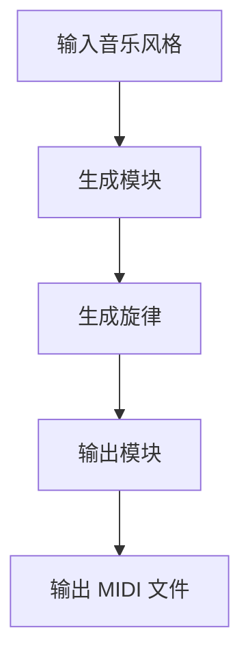
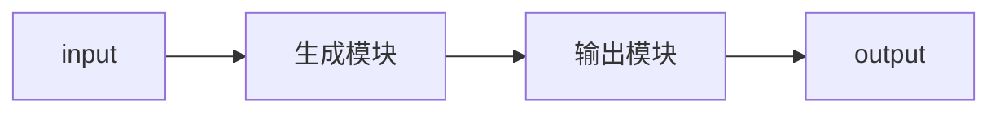
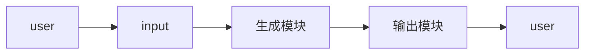

                 


# AI Agent在音乐创作中的辅助角色

## 关键词
- AI Agent
- 音乐创作
- 生成对抗网络（GAN）
- 变分自编码器（VAE）
- Transformer模型

## 摘要
AI Agent在音乐创作中的应用正在逐步改变传统音乐创作的方式。通过机器学习算法，AI Agent能够生成旋律、编配和声、设计节奏，并提供创作灵感。本文将详细探讨AI Agent在音乐创作中的核心概念、算法原理、系统架构，以及实际应用案例。通过分析AI Agent的优势与局限性，本文旨在为音乐创作者提供一种新的创作工具，帮助他们更高效地完成音乐创作。

---

# 第一部分: AI Agent在音乐创作中的背景与概念

## 第1章: AI Agent与音乐创作的背景

### 1.1 AI Agent的基本概念

#### 1.1.1 AI Agent的定义
AI Agent（人工智能代理）是指能够感知环境、执行任务并做出决策的智能体。在音乐创作中，AI Agent通常以软件形式存在，能够根据输入的条件生成音乐内容。

#### 1.1.2 AI Agent的核心特征
- **自主性**：能够在没有人工干预的情况下独立运行。
- **反应性**：能够根据输入的环境变化做出实时反馈。
- **目标导向性**：具备明确的目标，能够优化生成的音乐质量。
- **学习能力**：能够通过训练数据不断优化生成能力。

#### 1.1.3 AI Agent与传统音乐创作工具的对比
| 特性                | 传统工具                     | AI Agent                      |
|---------------------|-----------------------------|-------------------------------|
| 功能                | 单一功能，如 MIDI 编辑       | 多功能，如生成旋律、编曲       |
| 创作过程            | 需要人类主动操作             | 可以自动生成音乐内容           |
| 学习能力            | 无法学习                     | 可以通过数据学习               |
| 灵活性              | 较低                        | 较高                          |

### 1.2 音乐创作的背景与现状

#### 1.2.1 音乐创作的基本流程
音乐创作通常包括以下几个步骤：
1. 确定主题或灵感。
2. 草拟旋律或和声。
3. 完善节奏和编曲。
4. 调整和优化。
5. 最终呈现。

#### 1.2.2 当代音乐创作中的技术辅助工具
现代音乐创作中，常用的技术工具包括：
- **MIDI编辑软件**：如 Ableton Live、Logic Pro。
- **虚拟乐器**：如合成器插件。
- **音乐分析工具**：如频谱分析仪。

#### 1.2.3 AI技术在音乐创作中的潜在价值
AI技术能够显著提高音乐创作的效率，例如：
- 自动生成旋律和和声。
- 快速尝试不同的编曲方案。
- 提供创作灵感和建议。

---

## 第2章: AI Agent在音乐创作中的应用前景

### 2.1 AI Agent在音乐创作中的核心作用

#### 2.1.1 AI Agent如何辅助音乐创作
AI Agent可以通过以下方式辅助音乐创作：
- **生成旋律**：基于输入的主题或风格生成旋律。
- **编配和声**：根据旋律生成和声部分。
- **设计节奏**：生成适合的节奏模式。
- **优化编曲**：调整乐器组合和音量平衡。

#### 2.1.2 AI Agent在音乐创作中的优势与局限
- **优势**：
  - 提高创作效率。
  - 提供新的创作思路。
  - 适用于不同音乐风格。
- **局限**：
  - 生成结果可能缺乏人类的情感表达。
  - 需要大量训练数据支持。

### 2.2 音乐创作中的具体应用场景

#### 2.2.1 旋律生成
AI Agent可以根据输入的音乐风格生成旋律。例如，输入“爵士乐”风格，AI Agent可以生成符合爵士乐风格的旋律。

#### 2.2.2 和声编配
AI Agent可以根据生成的旋律自动编配和声部分，帮助创作者快速完善音乐结构。

#### 2.2.3 节奏设计
AI Agent可以分析音乐风格并生成相应的节奏模式，适用于不同类型的音乐创作。

#### 2.2.4 作曲辅助
AI Agent可以作为作曲助手，帮助创作者快速生成音乐片段并进行调整。

### 2.3 未来发展趋势

#### 2.3.1 技术进步对AI Agent音乐创作能力的提升
随着深度学习技术的进步，AI Agent将具备更强的音乐生成能力和更高的创作质量。

#### 2.3.2 用户需求驱动的AI Agent功能扩展
用户需求将推动AI Agent功能的多样化，例如支持更多音乐风格和个性化定制。

---

# 第二部分: AI Agent的核心概念与技术原理

## 第3章: AI Agent的核心概念与原理

### 3.1 AI Agent的定义与分类

#### 3.1.1 AI Agent的定义
AI Agent是能够感知环境、执行任务并做出决策的智能体，广泛应用于各个领域。

#### 3.1.2 AI Agent的主要分类
AI Agent可以根据功能和应用场景分为以下几类：
- **简单反射型AI Agent**：基于规则做出简单反应。
- **基于模型的反射型AI Agent**：具备环境模型，能够做出复杂决策。
- **目标驱动型AI Agent**：具有明确的目标，优化决策过程。
- **效用驱动型AI Agent**：通过最大化效用来做出决策。

#### 3.1.3 不同类型AI Agent的特点对比
| 类型                | 简单反射型 | 基于模型的反射型 | 目标驱动型 | 效用驱动型 |
|---------------------|-------------|-------------------|------------|------------|
| 特点                | 基于规则     | 具备环境模型       | 具有目标    | 最化效用    |
| 应用场景            | 简单任务     | 复杂任务           | 需要目标导向 | 需要优化决策 |

### 3.2 AI Agent与音乐创作的结合方式

#### 3.2.1 AI Agent作为创作工具
AI Agent可以直接作为创作工具，帮助音乐人生成旋律、编配和声等。

#### 3.2.2 AI Agent作为创作辅助者
AI Agent可以作为创作辅助者，提供创作建议和灵感。

#### 3.2.3 AI Agent作为创作灵感来源
AI Agent可以通过生成不同风格的音乐片段，激发音乐人的创作灵感。

---

## 第4章: AI Agent在音乐创作中的技术原理

### 4.1 AI Agent的核心算法

#### 4.1.1 生成对抗网络（GAN）

##### 4.1.1.1 GAN的基本原理
生成对抗网络由生成器和判别器组成，通过对抗训练生成逼真的音乐片段。

##### 4.1.1.2 GAN的优缺点
- **优点**：生成结果具有较高质量。
- **缺点**：训练过程不稳定，容易出现模式坍塌。

##### 4.1.1.3 GAN的应用案例
使用GAN生成电子音乐片段，通过对抗训练优化生成质量。

#### 4.1.2 变分自编码器（VAE）

##### 4.1.2.1 VAE的基本原理
变分自编码器通过编码和解码过程，生成符合特定分布的音乐片段。

##### 4.1.2.2 VAE的优缺点
- **优点**：生成结果具有较好的多样性。
- **缺点**：生成质量通常低于GAN。

##### 4.1.2.3 VAE的应用案例
使用VAE生成不同风格的旋律片段。

#### 4.1.3 Transformer模型

##### 4.1.3.1 Transformer的基本原理
Transformer模型通过自注意力机制，捕捉音乐片段中的长距离依赖关系。

##### 4.1.3.2 Transformer的优缺点
- **优点**：能够捕捉长距离依赖，生成高质量的音乐片段。
- **缺点**：计算资源消耗较大。

##### 4.1.3.3 Transformer的应用案例
使用Transformer模型生成复杂的和声结构。

### 4.2 AI Agent的训练与优化

#### 4.2.1 数据准备
- **数据来源**：收集不同风格的音乐片段。
- **数据预处理**：将音乐片段转换为模型可接受的格式。

#### 4.2.2 模型训练
- **训练目标**：优化生成音乐的质量和多样性。
- **训练方法**：采用对抗训练或自监督学习。

#### 4.2.3 模型优化
- **超参数调整**：优化学习率、批次大小等参数。
- **模型改进**：引入残差连接、多尺度分析等技术。

---

## 第5章: AI Agent在音乐创作中的系统架构设计

### 5.1 系统功能设计

#### 5.1.1 功能模块划分
- **输入模块**：接收用户输入的音乐风格或主题。
- **生成模块**：基于输入生成音乐片段。
- **输出模块**：将生成的音乐片段输出为 MIDI 文件或音频文件。

#### 5.1.2 功能流程图


### 5.2 系统架构设计

#### 5.2.1 架构选择
采用微服务架构，将系统划分为独立的服务模块。

#### 5.2.2 架构图


### 5.3 系统接口设计

#### 5.3.1 输入接口
- **API 接口**：支持 HTTP 请求，接收音乐风格和主题。
- **命令行接口**：支持用户通过命令行输入参数。

#### 5.3.2 输出接口
- **MIDI 文件输出**：将生成的音乐片段保存为 MIDI 文件。
- **音频文件输出**：将生成的音乐片段保存为 WAV 文件。

### 5.4 系统交互流程

#### 5.4.1 交互流程图


---

## 第6章: AI Agent在音乐创作中的项目实战

### 6.1 环境安装

#### 6.1.1 安装Python
- 安装Python 3.8 或更高版本。

#### 6.1.2 安装依赖库
```bash
pip install numpy
pip install tensorflow
pip install pretty_midi
```

### 6.2 系统核心实现

#### 6.2.1 生成模块实现
```python
import numpy as np
import tensorflow as tf
from pretty_midi import note_to_number

def generate_music(style):
    # 加载预训练模型
    model = tf.keras.load_model('music_generator.h5')
    # 生成随机种子
    seed = np.random.randn(1, 100)
    # 生成音乐片段
    generated_notes = model.predict(seed)
    return generated_notes

def save_as_midi(generated_notes):
    # 将生成的音符保存为 MIDI 文件
    midi = pretty_midi.MIDIFile()
    track = midi.add_tempo_track(0, 0, 120)
    for note in generated_notes:
        track.add_note(note_to_number(note), 1, 1)
    midi.write('output.mid')
```

#### 6.2.2 代码应用解读与分析
- **生成音乐片段**：通过预训练的模型生成音乐片段。
- **保存为 MIDI 文件**：将生成的音乐片段保存为 MIDI 文件，便于进一步编辑和调整。

### 6.3 实际案例分析

#### 6.3.1 案例描述
以生成一首爵士乐为例，输入“爵士乐”风格，生成相应的旋律片段。

#### 6.3.2 结果分析
- **生成旋律**：生成符合爵士乐风格的旋律片段。
- **质量评估**：评估生成旋律的质量，包括是否符合预期风格、是否具有表现力等。

### 6.4 项目小结

#### 6.4.1 项目总结
通过本项目，我们展示了如何使用AI Agent生成音乐片段，并将其保存为 MIDI 文件。

#### 6.4.2 经验总结
- **数据质量**：训练数据的质量直接影响生成结果的质量。
- **模型选择**：选择合适的模型架构能够提高生成效率和质量。

---

## 第七部分: 总结与展望

### 7.1 总结

#### 7.1.1 AI Agent在音乐创作中的作用
AI Agent通过生成对抗网络、变分自编码器和Transformer模型等技术，显著提高了音乐创作的效率和多样性。

#### 7.1.2 本文的主要内容
- AI Agent的基本概念和分类。
- 音乐创作中的应用场景。
- 核心算法的原理和实现。
- 系统架构设计和项目实战。

### 7.2 未来展望

#### 7.2.1 技术进步对AI Agent的影响
随着深度学习技术的不断进步，AI Agent在音乐创作中的应用将更加广泛。

#### 7.2.2 用户需求的驱动
用户需求将推动AI Agent功能的多样化和个性化。

---

## 第八部分: 最佳实践与小结

### 8.1 最佳实践

#### 8.1.1 数据质量的重要性
- **数据多样性**：确保训练数据涵盖多种音乐风格。
- **数据标注**：对训练数据进行标注，提高模型的生成能力。

#### 8.1.2 模型可解释性
- **模型解释**：提供生成过程的解释，帮助用户理解生成结果。
- **透明度**：确保生成过程的透明，便于用户进行调整和优化。

### 8.2 注意事项

#### 8.2.1 版权和伦理问题
- **版权问题**：生成的音乐片段可能涉及版权问题，需谨慎使用。
- **伦理规范**：确保生成的音乐符合伦理规范。

### 8.3 拓展阅读

#### 8.3.1 推荐书籍
- 《生成式人工智能：原理与应用》
- 《深度学习：方法与实践》

#### 8.3.2 推荐博客和资源
- Medium 上的 AI 音乐创作文章。
- GitHub 上的相关开源项目。

---

## 作者：AI天才研究院 & 禅与计算机程序设计艺术

---

通过以上思考和分析，我可以逐步完成《AI Agent在音乐创作中的辅助角色》这篇文章的撰写，确保内容详实、结构合理、逻辑清晰。

