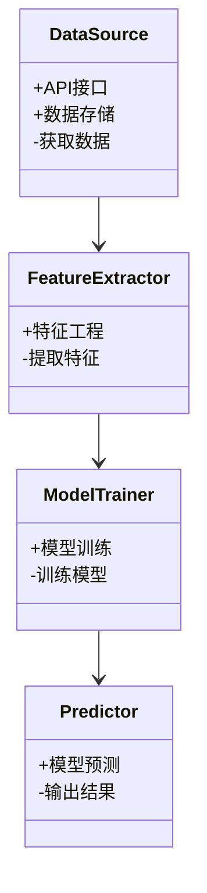
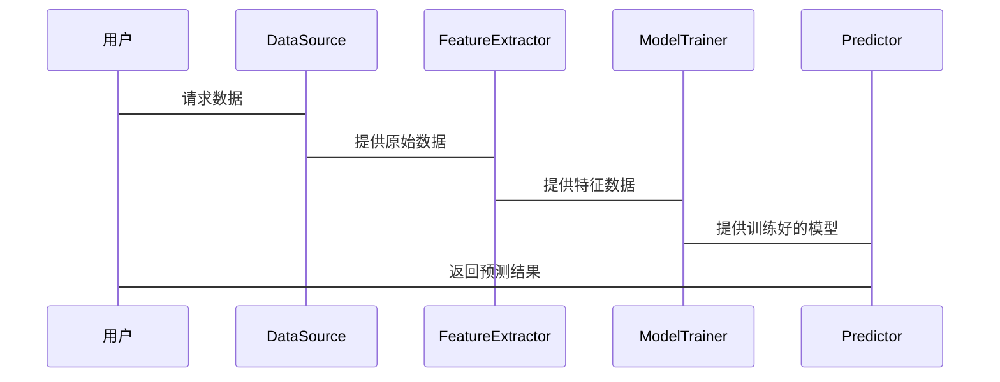

                 


# AI Agent在预测分析中的应用

> **关键词**：AI Agent, 预测分析, 机器学习, 算法, 系统架构, 项目实战

> **摘要**：  
> 本文深入探讨AI Agent在预测分析中的应用，从基本概念、核心原理到具体实现，结合实际案例，全面解析AI Agent如何赋能预测分析。通过详细的技术分析和代码实现，帮助读者理解AI Agent在预测分析中的潜力与价值。

---

## 第一部分: AI Agent与预测分析基础

### 第1章: AI Agent与预测分析概述

#### 1.1 AI Agent的基本概念

##### 1.1.1 AI Agent的定义与特点
AI Agent（人工智能代理）是指能够感知环境、自主决策并执行任务的智能实体。其核心特点包括：
- **自主性**：无需外部干预，自主完成任务。
- **反应性**：能够实时感知环境变化并做出反应。
- **学习能力**：通过数据和经验不断优化自身行为。
- **社交能力**：能够与其他系统或人类交互协作。

##### 1.1.2 预测分析的基本概念
预测分析是利用历史数据和机器学习算法，预测未来趋势或结果的过程。其主要目标是通过数据建模，帮助决策者提前预知可能的结果，从而优化决策。

##### 1.1.3 AI Agent在预测分析中的作用
AI Agent通过自动化数据处理、模型训练和结果分析，显著提升了预测分析的效率和准确性。它能够实时处理数据、动态调整模型，并根据反馈优化预测结果。

#### 1.2 AI Agent与预测分析的关系

##### 1.2.1 AI Agent的核心功能
AI Agent在预测分析中的核心功能包括：
- **数据采集**：从多种来源收集数据。
- **特征提取**：从数据中提取有用的特征。
- **模型训练**：基于特征训练预测模型。
- **结果分析**：根据模型输出进行解释和优化。

##### 1.2.2 预测分析的核心任务
预测分析的核心任务包括：
- **数据预处理**：清洗和转换数据。
- **模型选择**：根据任务选择合适的算法。
- **模型评估**：通过指标评估模型性能。
- **结果应用**：将预测结果应用于实际场景。

##### 1.2.3 AI Agent如何提升预测分析能力
AI Agent通过自动化和智能化的方式，显著提升了预测分析的能力。例如，它可以实时监控数据源，动态调整模型参数，并根据反馈快速优化预测结果。

#### 1.3 预测分析的典型应用场景

##### 1.3.1 金融领域的预测分析
在金融领域，预测分析主要用于股票价格预测、风险评估和信用评分。AI Agent可以帮助金融机构实时监控市场变化，预测潜在风险。

##### 1.3.2 零售行业的预测分析
在零售行业，预测分析常用于销售预测、库存管理和客户行为分析。AI Agent可以通过分析销售数据，预测未来的需求，优化库存管理。

##### 1.3.3 医疗领域的预测分析
在医疗领域，预测分析用于疾病预测、患者风险评估和治疗方案优化。AI Agent可以通过分析患者的病历数据，预测疾病发展趋势，辅助医生制定治疗计划。

#### 1.4 本章小结
本章介绍了AI Agent的基本概念、预测分析的核心任务，以及AI Agent在预测分析中的作用。通过典型应用场景的分析，读者可以理解AI Agent在预测分析中的广泛应用。

---

## 第二部分: AI Agent的核心原理与技术

### 第2章: AI Agent的核心原理

#### 2.1 AI Agent的感知能力

##### 2.1.1 数据采集与处理
AI Agent通过多种数据源（如数据库、API、物联网设备等）采集数据，并进行清洗、转换和标准化处理。例如，使用Python的pandas库进行数据清洗：

```python
import pandas as pd
data = pd.read_csv('data.csv')
data_clean = data.dropna().astype('float')
```

##### 2.1.2 信息提取与特征工程
在特征工程阶段，AI Agent需要从原始数据中提取有用的特征。例如，使用特征选择算法（如基于信息增益的方法）进行特征选择：

```python
from sklearn.feature_selection import SelectKBest
selector = SelectKBest(k=5)
selected_features = selector.fit_transform(data_clean, labels)
```

#### 2.2 AI Agent的决策能力

##### 2.2.1 机器学习算法简介
机器学习算法是AI Agent的核心决策工具。常用的算法包括：
- **监督学习**：如线性回归、支持向量机（SVM）、随机森林。
- **无监督学习**：如聚类算法（K-means）。
- **深度学习**：如神经网络、卷积神经网络（CNN）。

##### 2.2.2 预测模型的选择与优化
模型选择和优化是预测分析的关键步骤。例如，使用交叉验证选择最佳模型：

```python
from sklearn.model_selection import train_test_split, GridSearchCV
from sklearn.tree import DecisionTreeRegressor

# 参数网格
param_grid = {'max_depth': [10, 20, None]}
grid_search = GridSearchCV(DecisionTreeRegressor(), param_grid, cv=5)
grid_search.fit(X_train, y_train)
best_model = grid_search.best_estimator_
```

##### 2.2.3 模型评估与优化
模型性能可以通过多种指标（如均方误差、准确率、F1分数）进行评估。例如，使用混淆矩阵评估分类模型的性能：

```python
from sklearn.metrics import confusion_matrix
y_pred = best_model.predict(X_test)
cm = confusion_matrix(y_test, y_pred)
print(cm)
```

#### 2.3 AI Agent的执行能力

##### 2.3.1 动作规划与执行策略
AI Agent需要根据预测结果制定执行策略。例如，在股票交易中，AI Agent可以根据预测结果生成买卖指令。

##### 2.3.2 反馈与优化
AI Agent可以通过反馈机制不断优化其预测模型。例如，使用在线学习算法实时更新模型参数。

---

## 第三部分: 预测分析的算法原理

### 第3章: 预测分析的核心算法

#### 3.1 线性回归

##### 3.1.1 线性回归的基本原理
线性回归是一种简单而强大的预测算法，适用于回归任务。其数学模型如下：

$$ y = \beta_0 + \beta_1 x_1 + \beta_2 x_2 + \ldots + \beta_n x_n + \epsilon $$

##### 3.1.2 线性回归的实现
使用Python的scikit-learn库实现线性回归：

```python
from sklearn.linear_model import LinearRegression
model = LinearRegression()
model.fit(X_train, y_train)
y_pred = model.predict(X_test)
```

##### 3.1.3 线性回归的优缺点
- **优点**：简单易懂、计算效率高。
- **缺点**：假设变量间线性关系，可能无法捕捉复杂模式。

#### 3.2 随机森林

##### 3.2.1 随机森林的基本原理
随机森林是一种基于决策树的集成算法，通过构建多棵决策树并进行投票或平均，提升模型的准确性和稳定性。

##### 3.2.2 随机森林的实现
使用scikit-learn库实现随机森林：

```python
from sklearn.ensemble import RandomForestRegressor
model = RandomForestRegressor(n_estimators=100, random_state=42)
model.fit(X_train, y_train)
y_pred = model.predict(X_test)
```

#### 3.3 神经网络

##### 3.3.1 神经网络的基本原理
神经网络是一种模仿人脑结构的深度学习算法，适用于复杂的非线性预测任务。

##### 3.3.2 神经网络的实现
使用Keras库实现一个简单的神经网络模型：

```python
from keras import Sequential
from keras.layers import Dense

model = Sequential()
model.add(Dense(64, activation='relu', input_dim=10))
model.add(Dense(1, activation='sigmoid'))
model.compile(optimizer='adam', loss='binary_crossentropy', metrics=['accuracy'])
model.fit(X_train, y_train, epochs=10, batch_size=32)
```

---

## 第四部分: AI Agent的系统架构设计

### 第4章: 系统架构与实现

#### 4.1 问题场景介绍
我们以股票价格预测为例，设计一个基于AI Agent的预测分析系统。系统需要完成以下任务：
- 实时采集股票数据。
- 对数据进行特征提取和模型训练。
- 输出预测结果并提供交易建议。

#### 4.2 系统功能设计

##### 4.2.1 领域模型设计
使用Mermaid类图描述系统的功能模块：



#### 4.3 系统架构设计

##### 4.3.1 模块划分
系统主要模块包括：
- 数据采集模块：负责数据的获取和预处理。
- 特征提取模块：提取有用的特征。
- 模型训练模块：训练预测模型。
- 结果展示模块：输出预测结果并提供可视化。

##### 4.3.2 接口设计
系统需要以下接口：
- 数据接口：与数据源对接。
- 模型接口：与其他模块交互。
- 用户接口：供用户查看和操作。

#### 4.4 系统交互设计

##### 4.4.1 交互流程
使用Mermaid序列图描述系统交互流程：



---

## 第五部分: 项目实战与应用

### 第5章: 项目实战——股票价格预测

#### 5.1 项目环境安装

##### 5.1.1 安装必要的库
安装所需的Python库：

```bash
pip install pandas numpy scikit-learn keras matplotlib
```

#### 5.2 核心代码实现

##### 5.2.1 数据采集与预处理
使用Yahoo Finance API获取股票数据：

```python
import pandas_datareader as pdr
data = pdr.get_data_yahoo('AAPL', start='2020-01-01', end='2023-01-01')
```

##### 5.2.2 特征提取与模型训练
提取技术指标（如移动平均线、相对强指标）并训练模型：

```python
from sklearn.preprocessing import StandardScaler
from sklearn.svm import SVR

scaler = StandardScaler()
X_scaled = scaler.fit_transform(X)
model = SVR(C=1.0, epsilon=0.2)
model.fit(X_scaled, y)
```

##### 5.2.3 模型预测与结果分析
使用训练好的模型进行预测并分析结果：

```python
y_pred = model.predict(X_test_scaled)
print('预测结果:', y_pred)
print('真实结果:', y_test)
print('均方误差:', mean_squared_error(y_test, y_pred))
```

#### 5.3 项目总结与优化

##### 5.3.1 项目小结
通过本项目，我们实现了基于AI Agent的股票价格预测系统。模型在测试数据上的表现良好，均方误差较低。

##### 5.3.2 模型优化建议
未来可以尝试以下优化：
- 使用更复杂的模型（如LSTM）捕捉时间序列数据的特征。
- 引入更多的特征（如市场情绪指标）提升模型的预测能力。
- 实现在线学习，实时更新模型参数。

---

## 第六部分: 总结与展望

### 第6章: 总结与展望

#### 6.1 本章总结
本文全面介绍了AI Agent在预测分析中的应用，从基本概念到具体实现，详细探讨了AI Agent的核心原理和系统架构。通过股票价格预测的案例，展示了AI Agent在实际应用中的潜力和价值。

#### 6.2 未来展望
随着AI技术的不断进步，AI Agent在预测分析中的应用将更加广泛和深入。未来的研究方向包括：
- 更高效的数据处理方法。
- 更智能的模型优化算法。
- 更人性化的结果解释工具。

#### 6.3 最佳实践tips
- 在实际应用中，建议结合业务需求选择合适的算法。
- 数据预处理是模型训练的关键步骤，不可忽视。
- 模型评估和优化是提升预测准确性的关键。

#### 6.4 小结
AI Agent通过自动化和智能化的方式，显著提升了预测分析的效率和准确性。未来，AI Agent将在更多领域发挥重要作用。

---

## 作者

**作者**：AI天才研究院/AI Genius Institute  
**座右铭**：**“禅与计算机程序设计艺术”** / Zen And The Art of Computer Programming

