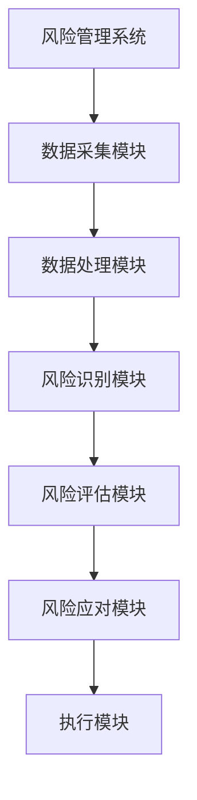
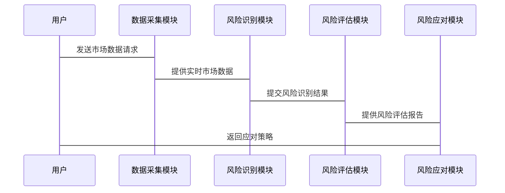

                 


# AI Agent在风险管理中的应用

## 关键词：
风险管理, AI Agent, 强化学习, 系统架构, 项目实战

## 摘要：
本文深入探讨了AI Agent在风险管理中的应用，从核心概念到算法原理，再到系统设计和项目实战，全面解析如何利用AI Agent提升风险管理的效率和准确性。文章首先介绍风险管理的基本概念和AI Agent的定义，然后分析AI Agent的核心原理和在风险管理中的优势。接着，详细讲解强化学习算法及其在风险管理中的应用，并通过Mermaid图展示系统架构和流程。最后，通过实际案例展示AI Agent的实现过程和效果，总结最佳实践和未来发展方向。

---

# 引言

## 1.1 风险管理背景
风险管理是指识别、评估和应对各种潜在风险的过程，旨在降低风险对组织或个人的影响。在现代商业环境中，风险无处不在，从金融市场的波动到网络安全威胁，有效的风险管理是组织稳健运营的关键。

## 1.2 问题描述
传统的风险管理方法依赖于人工分析和经验判断，存在效率低、响应慢、覆盖面有限等问题。特别是在复杂多变的现代商业环境中，传统的风险管理方法难以应对日益增加的不确定性。

## 1.3 AI Agent的定义与特点
AI Agent是一种能够感知环境、自主决策并采取行动的智能实体。其核心特点包括自主性、反应性、目标导向和学习能力。AI Agent能够通过数据驱动的方法，实时分析风险并制定应对策略。

## 1.4 应用范围与边界
AI Agent在风险管理中的应用范围广泛，包括金融投资、网络安全、供应链管理等领域。其边界在于目前技术的限制，如数据质量和模型解释性等问题。

---

# 第二部分：AI Agent的核心概念与原理

## 2.1 AI Agent的核心概念
AI Agent在风险管理中的核心概念包括感知、决策和执行三个模块。感知模块负责收集和分析数据，决策模块基于数据做出风险评估和应对策略，执行模块则负责实施决策。

## 2.2 AI Agent与传统风险管理方法的对比

| 特性                | 传统方法                | AI Agent                |
|---------------------|-------------------------|--------------------------|
| 数据处理            | 依赖人工分析            | 自动化数据处理            |
| 决策速度            | 响应较慢                | 实时响应                  |
| 处理复杂性          | 有限                    | 能够处理复杂问题          |
| 学习能力            | 依赖经验                | 具备学习能力              |

---

# 第三部分：风险管理中的AI Agent模型

## 3.1 基于规则的AI Agent模型
基于规则的模型通过预定义的规则来识别和应对风险。优点是简单易懂，缺点是灵活性差，难以适应复杂多变的环境。

## 3.2 基于统计学习的AI Agent模型
统计学习模型通过分析历史数据来预测风险，如回归分析和聚类分析。优点是能够发现数据中的潜在模式，缺点是对数据质量和数量要求较高。

## 3.3 基于强化学习的AI Agent模型
强化学习模型通过与环境的互动来优化决策，如Q-learning算法。适用于动态变化的环境，能够实时调整应对策略。

---

# 第四部分：AI Agent的算法原理

## 4.1 强化学习算法在AI Agent中的应用
### 4.1.1 强化学习的基本原理
强化学习通过试错机制，通过最大化累积奖励来优化决策。其基本公式为：

$$ Q(s, a) = Q(s, a) + \alpha [r + \max_{a'} Q(s', a') - Q(s, a)] $$

其中，$Q(s, a)$表示状态s下采取动作a的期望奖励，$\alpha$为学习率，$r$为即时奖励，$s'$为下一状态。

### 4.1.2 Q-learning算法的实现
以下是Q-learning算法的Python实现示例：

```python
import numpy as np

# 初始化Q表
Q = np.zeros([state_space, action_space])

# 设置超参数
learning_rate = 0.1
discount_factor = 0.9

# Q-learning算法
def q_learning():
    for episode in range(episodes):
        state = initial_state
        while not done:
            action = choose_action(state)
            next_state = get_next_state(state, action)
            reward = get_reward(state, action, next_state)
            Q[state, action] += learning_rate * (reward + discount_factor * np.max(Q[next_state, :]) - Q[state, action])

q_learning()
```

### 4.1.3 强化学习在风险管理中的应用
通过强化学习，AI Agent可以在动态环境中实时调整风险管理策略，如动态资产配置和风险规避。

---

# 第五部分：系统设计与架构

## 5.1 问题场景与项目介绍
以金融投资为例，AI Agent需要实时监控市场波动，识别潜在风险，并制定投资策略。

### 5.2 系统功能设计
- **风险识别模块**：实时监控市场数据，识别潜在风险。
- **风险评估模块**：分析风险的严重性和影响范围。
- **风险预测模块**：基于历史数据预测未来风险。
- **风险应对模块**：制定和执行应对策略。

### 5.3 系统架构设计
以下是系统架构的Mermaid图：



### 5.4 系统接口与交互
以下是系统交互的Mermaid序列图：



---

# 第六部分：项目实战

## 6.1 环境安装
- 安装Python和必要的库，如numpy、pandas和scikit-learn。
- 安装强化学习框架，如TensorFlow或Keras。

## 6.2 核心代码实现
以下是基于Q-learning的AI Agent实现：

```python
import numpy as np
import pandas as pd
import random

# 定义状态空间和动作空间
state_space = 10
action_space = 4

# 初始化Q表
Q = np.zeros([state_space, action_space])

# 设置超参数
learning_rate = 0.1
discount_factor = 0.9
epsilon = 0.1

# Q-learning算法实现
def choose_action(state):
    if random.random() < epsilon:
        return random.randint(0, action_space - 1)
    else:
        return np.argmax(Q[state])

def update_Q_table(state, action, reward, next_state):
    Q[state, action] += learning_rate * (reward + discount_factor * np.max(Q[next_state, :]) - Q[state, action])

# 训练过程
def train():
    for episode in range(1000):
        state = 0
        done = False
        while not done:
            action = choose_action(state)
            next_state = (state + action) % state_space
            reward = get_reward(state, action, next_state)
            update_Q_table(state, action, reward, next_state)
            state = next_state

train()
```

## 6.3 案例分析
通过训练好的AI Agent模型，可以在金融市场中实时监控资产价格波动，识别潜在风险，并制定相应的投资策略。

---

# 第七部分：总结与展望

## 7.1 最佳实践
- 确保数据质量和多样性。
- 定期更新模型和规则。
- 注意数据隐私和模型解释性。

## 7.2 未来发展方向
- 结合边缘计算提升实时性。
- 增强模型的可解释性。
- 探索与其他AI技术的集成，如区块链和物联网。

---

# 附录

## 附录A：扩展阅读
推荐阅读《强化学习入门》和《风险管理与决策分析》。

## 附录B：工具与库
- Python库：numpy, pandas, scikit-learn
- 强化学习框架：TensorFlow, Keras

---

# 作者
作者：AI天才研究院 & 禅与计算机程序设计艺术

---

通过以上结构，文章系统地介绍了AI Agent在风险管理中的应用，从理论到实践，帮助读者全面理解并掌握相关技术。

