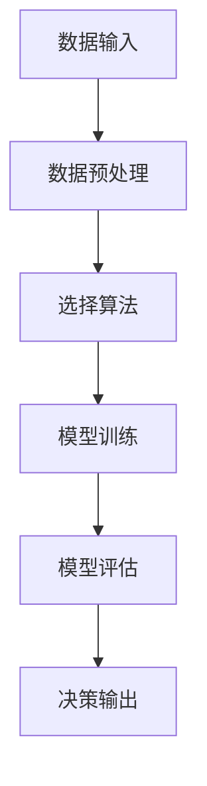
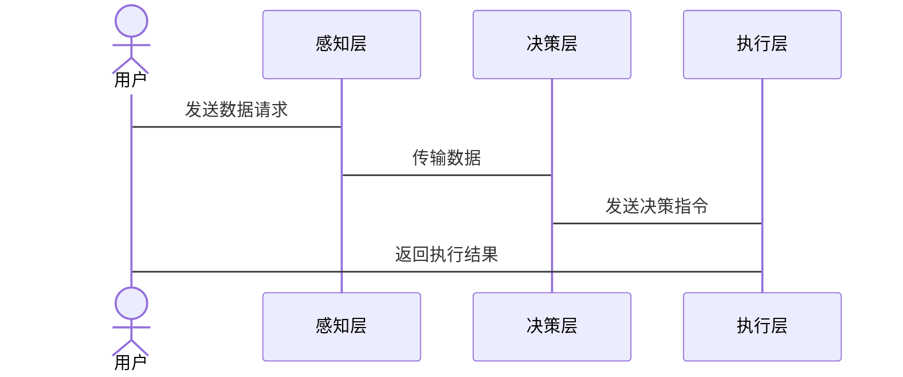

                 


# AI Agent在风险评估中的应用

## 关键词
AI Agent, 风险评估, 人工智能, 风险管理, 机器学习, 数据分析, 系统安全

## 摘要
随着人工智能技术的快速发展，AI Agent在风险评估中的应用日益广泛。本文将深入探讨AI Agent的核心概念、算法原理、系统架构及其在风险评估中的实际应用。通过结合理论与实践，分析AI Agent如何提升风险评估的效率和准确性，为读者提供全面而深入的技术解析。

---

## 正文

### 第1章 AI Agent与风险评估概述

#### 1.1 AI Agent的基本概念

- **1.1.1 AI Agent的定义**
  AI Agent（人工智能代理）是指能够感知环境、做出决策并执行任务的智能实体。它能够通过传感器获取信息，利用算法处理数据，并通过执行器与环境交互。

- **1.1.2 AI Agent的核心特征**
  - **自主性**：能够在没有外部干预的情况下运行。
  - **反应性**：能够实时感知环境并做出反应。
  - **学习能力**：通过数据和经验不断优化自身性能。

- **1.1.3 AI Agent在风险评估中的应用背景**
  AI Agent能够在复杂环境中快速处理大量数据，帮助识别潜在风险，从而在金融、医疗、交通等领域发挥重要作用。

#### 1.2 风险评估的基本概念

- **1.2.1 风险评估的定义**
  风险评估是指对潜在风险进行识别、分析和量化的过程，旨在制定有效的风险管理策略。

- **1.2.2 风险评估的主要方法**
  - **定量分析**：通过数据建模进行风险量化。
  - **定性分析**：通过专家判断进行风险描述。

- **1.2.3 风险评估在不同领域的应用**
  - **金融领域**：评估投资风险、信用风险。
  - **医疗领域**：评估患者风险、诊断准确性。
  - **交通领域**：评估交通事故风险、优化交通流量。

#### 1.3 AI Agent与风险评估的结合

- **1.3.1 AI Agent在风险评估中的优势**
  - **高效性**：能够快速处理大量数据，提高评估效率。
  - **准确性**：通过机器学习算法提高风险识别的准确性。

- **1.3.2 AI Agent与传统风险评估方法的对比**
  - **传统方法**：依赖人工判断，效率较低，易受主观因素影响。
  - **AI Agent方法**：利用数据驱动的算法，提供客观、高效的评估结果。

- **1.3.3 AI Agent在风险评估中的应用场景**
  - **金融领域**：预测市场波动、评估投资风险。
  - **医疗领域**：辅助诊断、预测患者风险。
  - **交通领域**：实时监控交通流量，预防事故风险。

#### 1.4 本章小结
本章介绍了AI Agent的基本概念和风险评估的基本方法，分析了AI Agent在风险评估中的优势和应用场景，为后续内容奠定了基础。

---

### 第2章 AI Agent的核心概念与原理

#### 2.1 AI Agent的组成部分

- **2.1.1 感知层**
  - 负责数据的采集和处理，包括传感器、摄像头等设备获取环境信息。
  - 示例：在金融领域，感知层可能通过API获取市场数据。

- **2.1.2 决策层**
  - 负责数据的分析和决策，利用算法处理数据并生成决策指令。
  - 示例：利用机器学习算法预测股票价格走势。

- **2.1.3 执行层**
  - 负责执行决策，通过执行器与环境交互。
  - 示例：自动交易系统根据预测结果执行买卖指令。

#### 2.2 AI Agent的工作原理

- **2.2.1 数据采集与处理**
  - 数据预处理：清洗、归一化、特征提取。
  - 示例：处理股票市场数据，提取有用的特征如开盘价、收盘价、成交量等。

- **2.2.2 模型构建与训练**
  - 选择合适的算法：如决策树、随机森林、神经网络等。
  - 示例：使用随机森林算法训练股票价格预测模型。

- **2.2.3 决策与执行**
  - 根据模型预测结果生成决策。
  - 示例：根据预测结果，决策买入或卖出股票。

#### 2.3 AI Agent与风险评估的核心联系

- **2.3.1 风险识别与AI Agent的感知能力**
  - AI Agent能够实时感知环境，帮助识别潜在风险。
  - 示例：在网络安全中，AI Agent通过实时监控网络流量，识别异常行为。

- **2.3.2 风险分析与AI Agent的决策能力**
  - AI Agent能够分析大量数据，提供风险评估结果。
  - 示例：在金融领域，AI Agent分析市场数据，评估投资风险。

- **2.3.3 风险应对与AI Agent的执行能力**
  - AI Agent能够根据风险评估结果，制定应对策略并执行。
  - 示例：在交通领域，AI Agent根据交通流量预测，优化信号灯控制。

#### 2.4 本章小结
本章详细介绍了AI Agent的组成部分和工作原理，分析了其在风险评估中的核心作用，为后续章节奠定了理论基础。

---

### 第3章 AI Agent在风险评估中的算法原理

#### 3.1 常见的AI Agent算法

- **3.1.1 基于概率模型的算法**
  - 示例：贝叶斯网络。
  - 应用场景：在医疗领域，评估患者患病风险。

- **3.1.2 基于决策树的算法**
  - 示例：ID3、C4.5算法。
  - 应用场景：在金融领域，评估客户信用风险。

- **3.1.3 基于神经网络的算法**
  - 示例：深度学习模型（如LSTM）。
  - 应用场景：在时间序列分析中，预测市场波动。

#### 3.2 算法流程图



#### 3.3 算法实现示例（Python代码）

```python
import pandas as pd
from sklearn.tree import DecisionTreeClassifier
from sklearn.metrics import accuracy_score

# 数据加载
data = pd.read_csv('risk_data.csv')
X = data.drop('label', axis=1)
y = data['label']

# 模型训练
model = DecisionTreeClassifier()
model.fit(X, y)

# 模型预测
y_pred = model.predict(X)

# 模型评估
print("准确率:", accuracy_score(y, y_pred))
```

#### 3.4 数学模型与公式

- **贝叶斯定理**
  $$ P(A|B) = \frac{P(B|A) \cdot P(A)}{P(B)} $$
  - 解释：用于计算在已知条件下某个事件发生的概率。

- **决策树模型**
  $$ Gini指数 = \sum_{i=1}^{n} P_i \cdot (1 - P_i) $$
  - 解释：用于选择决策树的分裂特征。

#### 3.5 本章小结
本章详细讲解了AI Agent在风险评估中常用的算法及其实现，通过流程图和代码示例，帮助读者理解算法的实现过程。

---

### 第4章 AI Agent的风险评估系统架构分析

#### 4.1 项目背景与目标

- **项目背景**：介绍项目的研究背景和意义。
- **项目目标**：构建一个基于AI Agent的风险评估系统，实现风险识别、评估和应对。

#### 4.2 系统功能设计

- **4.2.1 风险识别模块**
  - 功能：实时监控环境数据，识别潜在风险。
  - 示例：在网络安全中，监控网络流量，识别异常行为。

- **4.2.2 风险评估模块**
  - 功能：分析识别出的风险，评估其影响程度。
  - 示例：在金融领域，评估投资项目的信用风险。

- **4.2.3 风险应对模块**
  - 功能：根据评估结果，制定应对策略并执行。
  - 示例：在交通领域，优化信号灯控制以减少交通事故风险。

#### 4.3 系统架构设计


#### 4.4 系统交互设计



#### 4.5 本章小结
本章详细介绍了AI Agent风险评估系统的架构设计和功能模块，通过图表展示了系统的整体结构和交互流程。

---

### 第5章 AI Agent风险评估项目实战

#### 5.1 项目环境与工具安装

- **环境要求**：Python 3.8及以上版本，安装必要的库如scikit-learn、pandas、numpy。
- **工具安装**：
  ```bash
  pip install scikit-learn pandas numpy
  ```

#### 5.2 核心代码实现

```python
import numpy as np
import pandas as pd
from sklearn.ensemble import RandomForestClassifier

# 数据加载
data = pd.read_csv('risk_factors.csv')
X = data.drop('risk', axis=1)
y = data['risk']

# 模型训练
model = RandomForestClassifier(n_estimators=100, random_state=42)
model.fit(X, y)

# 预测与评估
y_pred = model.predict(X)
print("准确率:", model.score(X, y))
```

#### 5.3 案例分析与结果解读

- **案例分析**：以金融领域的信用风险评估为例，分析模型的预测结果。
- **结果解读**：解释模型预测的准确性及其在实际应用中的意义。

#### 5.4 项目小结
本章通过一个实际项目展示了AI Agent在风险评估中的应用，从环境配置到代码实现，再到结果分析，为读者提供了完整的实战指南。

---

### 第6章 AI Agent在风险评估中的最佳实践

#### 6.1 小结

- 总结全文内容，强调AI Agent在风险评估中的优势和应用价值。

#### 6.2 注意事项

- 数据质量：确保数据的准确性和完整性。
- 模型选择：根据具体场景选择合适的算法。
- 安全性：确保系统的安全性和数据的隐私保护。

#### 6.3 拓展阅读

- 推荐相关书籍和论文，供读者进一步学习。

---

## 作者

作者：AI天才研究院/AI Genius Institute & 禅与计算机程序设计艺术 /Zen And The Art of Computer Programming

---

**本文遵循[CC BY-NC-ND 4.0](https://creativecommons.org/licenses/by-nc-nd/4.0/)协议，转载请注明出处。**

