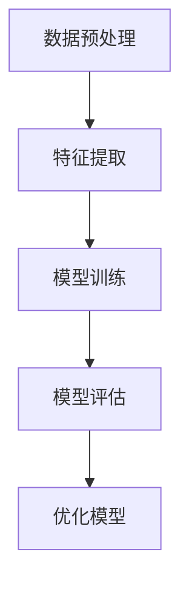
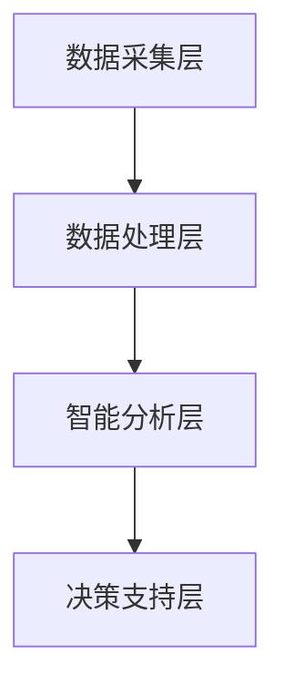

                 


# AI Agent在食品安全监管中的应用

**关键词：AI Agent，食品安全，监管，人工智能，算法**

**摘要：**  
本文探讨了AI Agent在食品安全监管中的应用，分析了AI Agent的基本概念、技术原理及其在食品生产、流通和应急响应等场景中的具体应用。通过系统架构设计、算法实现和项目实战，详细展示了如何利用AI技术提升食品安全监管的效率和精准度。文章最后总结了AI Agent在食品安全监管中的优势和未来发展方向。

---

## 第1章: AI Agent与食品安全监管概述

### 1.1 AI Agent的基本概念

AI Agent（人工智能代理）是指能够感知环境、自主决策并执行任务的智能体。它具备以下核心特征：
- **自主性**：能够在没有外部干预的情况下独立运行。
- **反应性**：能够实时感知环境变化并做出响应。
- **目标导向**：具有明确的目标，并通过行为实现这些目标。

AI Agent与传统监管方式的主要区别在于，前者能够通过机器学习、自然语言处理和计算机视觉等技术，实现智能化的监管过程。

### 1.2 食品安全监管的现状与挑战

食品安全监管的现状主要包括以下问题：
- **信息不对称**：监管部门难以及时获取食品生产和销售的全链条数据。
- **监管资源有限**：传统监管方式依赖大量的人力和物力，效率较低。
- **数据孤岛**：各部门之间的数据难以共享，导致监管效果不佳。

### 1.3 AI Agent在食品安全监管中的意义

AI Agent能够通过以下方式解决上述问题：
- **提高监管效率**：通过自动化数据采集和分析，减少人工干预。
- **降低监管成本**：通过智能化手段减少人力和时间成本。
- **提升监管精准度**：利用机器学习算法，精准识别问题点。

---

## 第2章: AI Agent的核心概念与技术原理

### 2.1 AI Agent的组成与功能

AI Agent的组成包括：
- **感知层**：负责采集环境中的数据，例如摄像头、传感器等。
- **决策层**：通过算法对数据进行分析，生成决策。
- **执行层**：根据决策结果执行具体的操作，例如发出警报、调整设备参数。

### 2.2 AI Agent的关键技术

- **机器学习**：用于从历史数据中学习模式，预测潜在风险。
- **自然语言处理**：用于分析监管文档和新闻报道，识别潜在问题。
- **计算机视觉**：用于图像识别，例如检测食品包装是否合规。

### 2.3 AI Agent的算法原理

以下是监督学习算法的简单流程图：



例如，使用支持向量机（SVM）进行分类任务的数学模型如下：

$$
\text{目标函数：} \quad \text{minimize} \quad \frac{1}{2}||\mathbf{w}||^2 + C \sum_{i=1}^{n} \xi_i
$$

$$
\text{约束条件：} \quad y_i (\mathbf{w} \cdot \mathbf{x}_i + b) \geq 1 - \xi_i, \quad \xi_i \geq 0
$$

---

## 第3章: AI Agent在食品安全监管中的应用场景

### 3.1 食品生产过程监控

- **生产线实时监测**：通过摄像头和传感器实时监控生产过程，检测异常情况。
- **质量检测与追溯**：利用机器学习模型分析生产数据，实现食品质量追溯。

### 3.2 食品流通与销售监管

- **食品供应链管理**：通过区块链技术实现供应链透明化，确保食品来源可追溯。
- **食品标签识别**：使用自然语言处理技术识别标签信息，判断是否合规。

### 3.3 食品安全事件应急响应

- **突发事件预警**：通过机器学习模型预测潜在风险，提前发出警报。
- **应急处理方案制定**：根据历史数据和当前情况，生成最优处理方案。

---

## 第4章: AI Agent的系统架构与设计

### 4.1 系统整体架构

以下是系统的分层架构设计图：



### 4.2 系统功能设计

- **数据采集模块**：负责采集生产、销售等环节的数据。
- **数据处理模块**：对数据进行清洗、转换和存储。
- **智能分析模块**：利用机器学习模型进行分析和预测。
- **决策支持模块**：根据分析结果生成决策建议。

### 4.3 系统接口设计

- **数据接口**：与其他系统（如区块链、传感器）进行数据交互。
- **用户接口**：提供给监管人员查看和操作的界面。
- **第三方服务接口**：与实验室、执法机构等外部服务对接。

---

## 第5章: AI Agent的算法实现与优化

### 5.1 算法实现基础

- **数据预处理**：清洗和标准化数据，确保模型输入的正确性。
- **模型训练**：使用训练数据训练模型，并评估模型性能。
- **模型优化**：通过调整超参数和优化算法提升模型性能。

### 5.2 常见算法实现

以下是监督学习算法的实现示例：

```python
from sklearn import svm

# 数据预处理
X = ...  # 特征矩阵
y = ...  # 标签向量

# 模型训练
model = svm.SVC()
model.fit(X, y)

# 模型预测
y_pred = model.predict(X_test)
```

---

## 第6章: AI Agent的项目实战

### 6.1 环境安装

- 安装必要的库：`scikit-learn`, `cv2`, `nltk`

### 6.2 核心代码实现

以下是食品标签识别的代码示例：

```python
import cv2
import numpy as np

# 读取图片
img = cv2.imread('label.jpg')

# 图像预处理
gray = cv2.cvtColor(img, cv2.COLOR_BGR2GRAY)
ret, binary = cv2.threshold(gray, 127, 255, cv2.THRESH_BINARY)

# 文本识别
text = cv2.tesseract.image_to_string(binary)
print(text)
```

### 6.3 案例分析

假设我们有一个食品标签识别的案例，通过上述代码可以提取标签信息，并判断其是否符合法规要求。

### 6.4 项目小结

通过项目实战，我们验证了AI Agent在食品安全监管中的有效性，同时也发现了需要进一步优化的地方，例如模型的泛化能力。

---

## 第7章: 最佳实践与未来展望

### 7.1 小结

本文详细介绍了AI Agent在食品安全监管中的应用，从理论到实践，展示了其在提高监管效率和精准度方面的巨大潜力。

### 7.2 注意事项

- 数据隐私和安全问题需要特别注意。
- 模型的可解释性和透明性是实际应用中的重要考量。

### 7.3 拓展阅读

- 《机器学习实战》
- 《深度学习》
- 《区块链技术与应用》

---

**作者：AI天才研究院**

