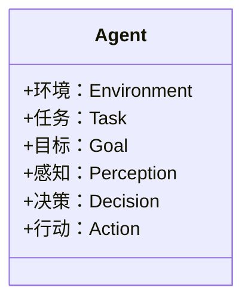
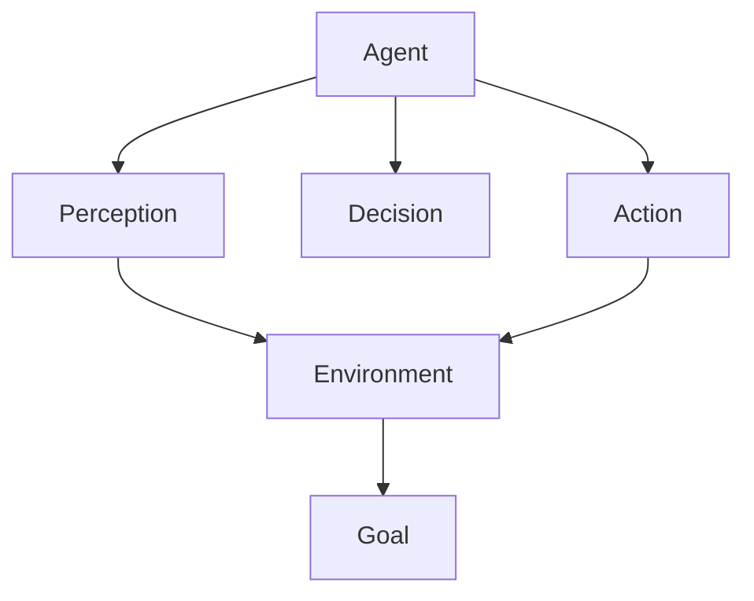
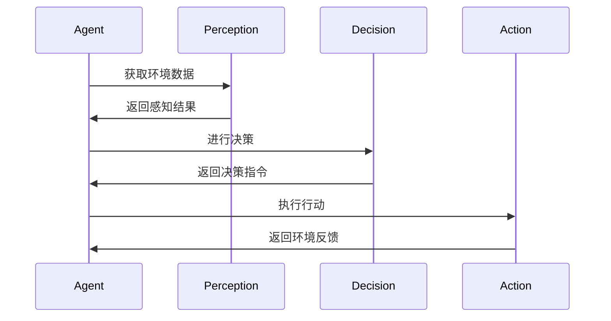

                 


# AI Agent基础概念：理解智能代理的核心

## 关键词：AI Agent, 智能代理, 核心原理, 算法模型, 系统架构, 实战案例

## 摘要：AI Agent（人工智能代理）是实现智能化系统的核心技术，本文从基础概念、核心原理、算法模型、系统架构到实战案例，全面解析AI Agent的设计与实现，帮助读者深入理解智能代理的核心机制。

---

# 第四章: AI Agent的系统分析与架构设计

## 第4章: AI Agent的系统分析与架构设计

### 4.1 系统分析

#### 4.1.1 问题场景介绍
在实际应用中，AI Agent通常需要处理复杂的环境和任务。例如，在智能客服系统中，AI Agent需要与用户交互，理解用户需求，并根据预设规则提供解决方案。

#### 4.1.2 项目介绍
本章将基于一个智能客服系统的案例，设计一个AI Agent来实现用户咨询的自动响应。

### 4.2 系统功能设计

#### 4.2.1 领域模型Mermaid类图


#### 4.2.2 系统架构设计


### 4.3 系统接口设计

#### 4.3.1 感知模块接口
- 输入：环境数据
- 输出：感知结果

#### 4.3.2 决策模块接口
- 输入：感知结果
- 输出：决策指令

#### 4.3.3 行动模块接口
- 输入：决策指令
- 输出：环境反馈

### 4.4 系统交互序列图



---

# 第五章: AI Agent的项目实战

## 第5章: AI Agent的项目实战

### 5.1 环境安装

#### 5.1.1 安装Python
```bash
python --version
pip install --upgrade pip
```

#### 5.1.2 安装依赖库
```bash
pip install numpy matplotlib scikit-learn
```

### 5.2 核心代码实现

#### 5.2.1 感知模块
```python
def感知环境(环境数据):
    # 实现感知逻辑
    return 感知结果
```

#### 5.2.2 决策模块
```python
def决策(感知结果):
    # 实现决策逻辑
    return 决策指令
```

#### 5.2.3 行动模块
```python
def执行行动(决策指令):
    # 实现行动逻辑
    return 环境反馈
```

### 5.3 案例分析

#### 5.3.1 项目实现
编写完整的AI Agent代码，实现一个简单的智能客服系统。

#### 5.3.2 代码解读
详细解读每部分代码的功能和实现逻辑。

#### 5.3.3 优化建议
根据实际运行结果，提出优化建议。

---

# 第六章: AI Agent的最佳实践与注意事项

## 第6章: AI Agent的最佳实践与注意事项

### 6.1 最佳实践

#### 6.1.1 数据质量
确保训练数据的多样性和代表性。

#### 6.1.2 算法选择
根据具体任务选择合适的算法。

#### 6.1.3 系统扩展性
设计可扩展的架构，方便后续功能的添加。

### 6.2 注意事项

#### 6.2.1 性能优化
关注算法的效率和资源消耗。

#### 6.2.2 安全性
确保系统具备良好的安全防护机制。

#### 6.2.3 可解释性
保持系统决策的可解释性，便于调试和优化。

### 6.3 拓展阅读

#### 6.3.1 推荐书籍
推荐几本关于AI Agent的经典书籍和论文。

#### 6.3.2 在线资源
提供一些在线学习资源和工具。

---

# 第七章: 总结与展望

## 第7章: 总结与展望

### 7.1 小结
回顾本文的主要内容，强调AI Agent的核心概念和实现要点。

### 7.2 注意事项
提醒读者在实际应用中注意的关键点。

### 7.3 拓展阅读
建议读者进一步学习和研究的方向。

---

# 作者：AI天才研究院/AI Genius Institute & 禅与计算机程序设计艺术 /Zen And The Art of Computer Programming

---

感谢您的阅读！希望本文能帮助您深入理解AI Agent的核心概念和实现方法。如果您有任何疑问或建议，请随时与我联系！

