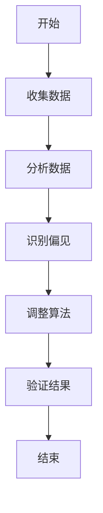
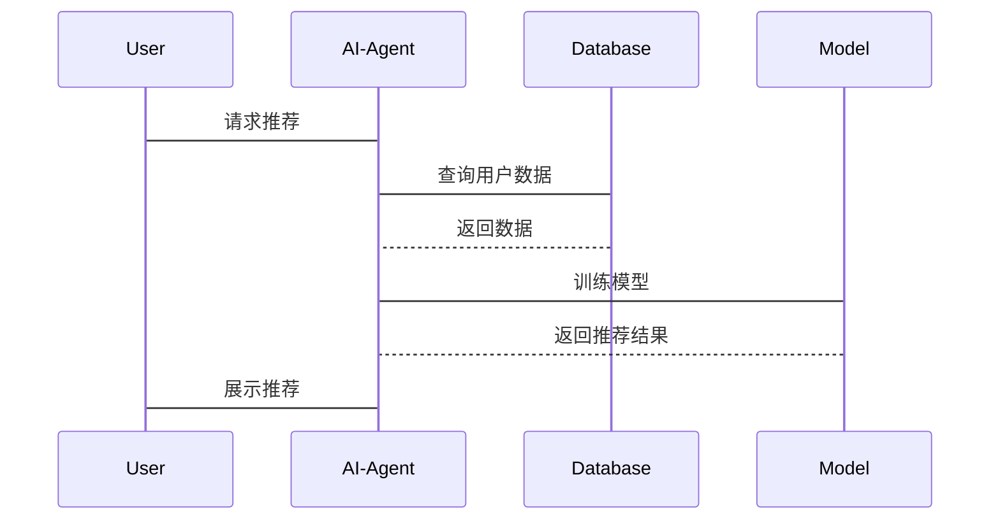
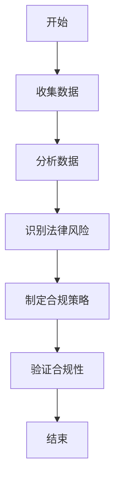
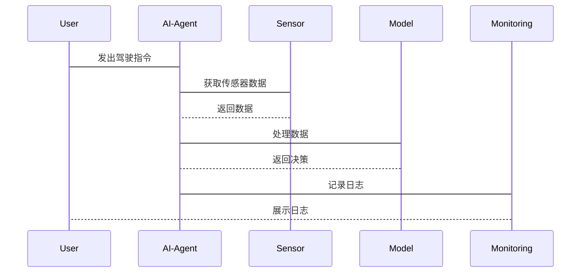

                 


# AI Agent 开发中的伦理考量与法律风险

> 关键词：AI Agent、伦理考量、法律风险、系统架构、项目实战

> 摘要：AI Agent作为人工智能领域的核心技术，其开发不仅需要考虑技术实现，还需关注伦理和法律问题。本文将详细探讨AI Agent开发中的伦理考量与法律风险，从背景介绍、核心概念、算法原理到系统设计和项目实战，全面解析这些问题，并提供解决方案和最佳实践。

---

## 第一部分: AI Agent 开发中的伦理考量与法律风险概述

### 第1章: AI Agent 的基本概念与背景介绍

#### 1.1 问题背景与问题描述

##### 1.1.1 AI Agent 的定义与核心概念
AI Agent（人工智能代理）是指能够感知环境、自主决策并执行任务的智能体。其核心概念包括：
- **自主性**：AI Agent能够独立决策，无需外部干预。
- **反应性**：能够实时感知环境变化并做出反应。
- **目标导向**：根据设定的目标执行任务。

##### 1.1.2 AI Agent 开发中的伦理问题
在AI Agent开发中，伦理问题主要涉及：
- **隐私保护**：数据收集和处理可能侵犯用户隐私。
- **责任归属**：当AI Agent出现问题时，责任归属不明确。
- **公平性**：算法可能存在的偏见可能导致不公平的结果。

##### 1.1.3 AI Agent 开发中的法律风险
法律风险包括：
- **数据合规性**：数据收集和使用需符合相关法律法规。
- **知识产权**：算法和数据的使用权可能引发法律纠纷。
- **产品责任**：AI Agent的行为可能导致法律责任。

#### 1.2 问题解决与边界外延

##### 1.2.1 AI Agent 开发中的伦理框架
伦理框架包括：
- **透明性**：确保AI Agent的行为可追溯和解释。
- **公正性**：避免算法偏见，确保决策的公正性。

##### 1.2.2 AI Agent 开发中的法律框架
法律框架包括：
- **数据保护法**：如GDPR（通用数据保护条例）。
- **产品责任法**：规定AI Agent开发者对产品缺陷负责。

##### 1.2.3 AI Agent 开发的边界与外延
AI Agent的边界包括：
- **功能范围**：明确AI Agent的功能和用途。
- **责任范围**：界定开发者和用户的责任分担。

#### 1.3 核心概念与联系

##### 1.3.1 伦理与法律的关系
- 伦理是法律的基础，法律是对伦理的规范和强制实施。

##### 1.3.2 AI Agent 开发中的伦理与法律核心要素
- **数据隐私**：保护用户数据不被滥用。
- **责任划分**：明确开发者和用户的法律责任。

##### 1.3.3 伦理与法律对 AI Agent 开发的影响
- 伦理影响：确保AI Agent的行为符合社会道德标准。
- 法律影响：确保AI Agent的行为符合法律法规。

#### 1.4 本章小结
本章介绍了AI Agent的基本概念，分析了开发中的伦理和法律问题，并探讨了它们之间的关系。

---

### 第2章: AI Agent 开发中的伦理考量

#### 2.1 伦理考量的核心概念

##### 2.1.1 伦理考量的定义
伦理考量是指在AI Agent开发过程中，确保其行为符合伦理标准。

##### 2.1.2 伦理考量的属性特征
- **可解释性**：AI Agent的行为需易于理解和解释。
- **公平性**：避免算法偏见，确保决策公平。

##### 2.1.3 伦理考量的ER实体关系图
```mermaid
erDiagram
    actor User {
        +string ID
        +string Name
    }
    role EthicalConsideration {
        +boolean Explainable
        +boolean Fairness
    }
    entity AI-Agent {
        +string ID
        +string Function
    }
    User --> EthicalConsideration
    EthicalConsideration --> AI-Agent
```

#### 2.2 伦理考量的算法原理

##### 2.2.1 伦理考量的算法流程图


##### 2.2.2 伦理考量的数学模型
- **公平性评估**：使用统计方法检测数据中的偏见。
- **可解释性评估**：通过模型解释技术（如LIME）评估模型的可解释性。

#### 2.3 伦理考量的系统分析与架构设计

##### 2.3.1 问题场景介绍
假设开发一个推荐系统AI Agent，需要考虑用户隐私和推荐的公平性。

##### 2.3.2 系统功能设计
- **数据收集**：收集用户行为数据。
- **数据处理**：清洗和预处理数据。
- **模型训练**：训练推荐模型。
- **模型评估**：评估模型的公平性和可解释性。

##### 2.3.3 系统架构设计
```mermaid
container {
    title 推荐系统架构
    AWS Cloud
    API Gateway
    AI-Agent
    User Interface
}
```

##### 2.3.4 系统接口设计
- **API接口**：定义数据输入和输出格式。
- **用户界面**：展示推荐结果和解释。

##### 2.3.5 系统交互设计


#### 2.4 项目实战

##### 2.4.1 环境安装
- 安装Python和必要的库（如scikit-learn、xgboost）。

##### 2.4.2 系统核心实现
```python
# 示例代码：公平性评估
from sklearn.metrics import accuracy_score
from imblearn.over_sampling import SMOTE

# 数据预处理
X_train, y_train = preprocess_data()

# 使用SMOTE解决类别不平衡问题
smote = SMOTE(random_state=42)
X_res, y_res = smote.fit_resample(X_train, y_train)

# 训练模型
model = train_model(X_res, y_res)

# 评估模型
accuracy = accuracy_score(y_test, model.predict(X_test))
print(f"Accuracy: {accuracy}")
```

##### 2.4.3 代码应用解读
- 使用SMOTE处理数据不平衡问题，确保模型的公平性。
- 通过准确率评估模型性能。

##### 2.4.4 实际案例分析
分析一个推荐系统的案例，讨论如何通过调整算法提高公平性和可解释性。

#### 2.5 本章小结
本章详细探讨了AI Agent开发中的伦理考量，包括核心概念、算法原理和系统设计。

---

### 第3章: AI Agent 开发中的法律风险

#### 3.1 法律风险的核心概念

##### 3.1.1 法律风险的定义
法律风险是指AI Agent开发过程中可能引发的法律问题。

##### 3.1.2 法律风险的属性特征
- **数据合规性**：数据收集和处理需符合相关法律。
- **产品责任**：AI Agent的行为可能引发法律责任。

##### 3.1.3 法律风险的ER实体关系图
```mermaid
erDiagram
    actor User {
        +string ID
        +string Name
    }
    role LegalRisk {
        +boolean DataCompliance
        +boolean ProductLiability
    }
    entity AI-Agent {
        +string ID
        +string Function
    }
    User --> LegalRisk
    LegalRisk --> AI-Agent
```

#### 3.2 法律风险的算法原理

##### 3.2.1 法律风险的算法流程图


##### 3.2.2 法律风险的数学模型
- **数据合规性评估**：通过统计方法检测数据是否符合隐私保护要求。
- **产品责任评估**：通过模型预测AI Agent的行为可能引发的责任问题。

#### 3.3 法律风险的系统分析与架构设计

##### 3.3.1 问题场景介绍
假设开发一个自动驾驶AI Agent，需考虑数据隐私和产品责任。

##### 3.3.2 系统功能设计
- **数据隐私保护**：加密数据存储和传输。
- **产品责任监控**：实时监控AI Agent的行为，记录日志。

##### 3.3.3 系统架构设计
```mermaid
container {
    title 自动驾驶系统架构
    AWS Cloud
    API Gateway
    AI-Agent
    User Interface
    Monitoring System
}
```

##### 3.3.4 系统接口设计
- **API接口**：定义数据接口和日志接口。
- **用户界面**：展示系统状态和日志信息。

##### 3.3.5 系统交互设计


#### 3.4 项目实战

##### 3.4.1 环境安装
- 安装Python和必要的库（如TensorFlow、Pandas）。

##### 3.4.2 系统核心实现
```python
# 示例代码：数据隐私保护
import hashlib

# 数据加密
def hash_data(data):
    return hashlib.sha256(data.encode()).hexdigest()

# 数据存储
hashed_data = hash_data("用户数据")
print(hashed_data)
```

##### 3.4.3 代码应用解读
- 使用哈希函数加密数据，确保数据隐私。
- 记录日志以监控AI Agent的行为。

##### 3.4.4 实际案例分析
分析自动驾驶系统，讨论如何通过数据加密和日志记录确保法律合规。

#### 3.5 本章小结
本章详细探讨了AI Agent开发中的法律风险，包括核心概念、算法原理和系统设计。

---

## 第四部分: 最佳实践与总结

### 4.1 伦理考量与法律风险的最佳实践

#### 4.1.1 伦理考量的注意事项
- **透明性**：确保用户了解AI Agent的行为。
- **用户同意**：在收集数据前获得用户同意。

#### 4.1.2 法律风险的注意事项
- **数据合规性**：确保数据处理符合相关法律。
- **产品责任**：建立责任分担机制。

#### 4.1.3 项目实战中的经验分享
- **持续监控**：定期检查模型的公平性和可解释性。
- **团队协作**：开发团队应包括法律和伦理专家。

### 4.2 小结与未来展望

#### 4.2.1 本章小结
本文详细探讨了AI Agent开发中的伦理考量与法律风险，从背景介绍到系统设计，全面解析了相关问题。

#### 4.2.2 未来展望
随着AI技术的发展，伦理和法律问题将更加复杂，未来需要更多的研究和合作。

### 4.3 拓展阅读

#### 4.3.1 推荐书目
- 《人工智能：法律与伦理》
- 《机器学习的法律挑战》

#### 4.3.2 在线资源
- AI法律与伦理相关的学术论文和研究报告。

---

## 作者

作者：AI天才研究院/AI Genius Institute & 禅与计算机程序设计艺术/Zen And The Art of Computer Programming

---

以上是《AI Agent开发中的伦理考量与法律风险》的完整内容，涵盖从背景介绍到项目实战的各个方面，希望对读者有所帮助。

