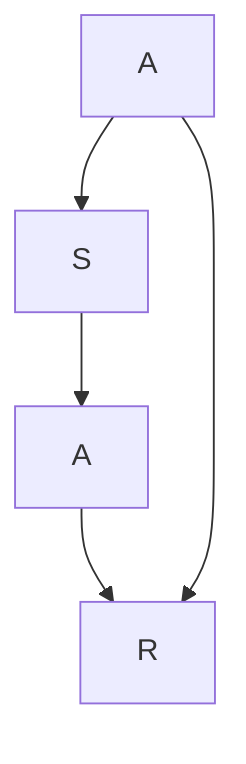
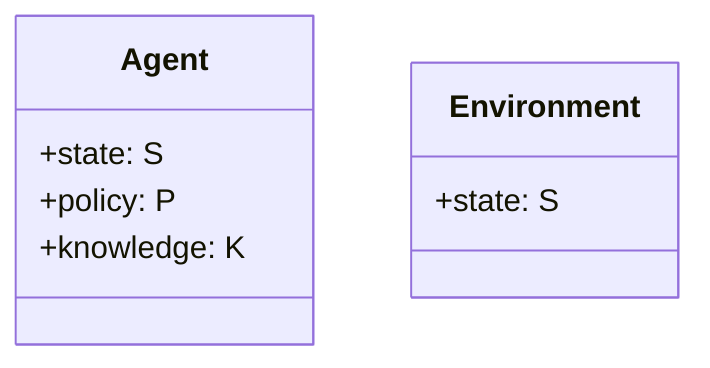
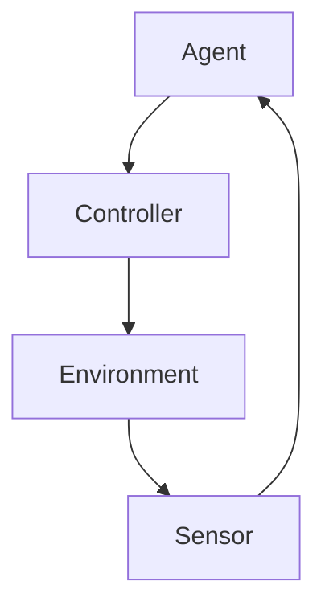

                 


# AI Agent开发中的常见挑战及对策

## 关键词：AI Agent, 人工智能, 强化学习, 系统架构, 项目实战

## 摘要：本文系统地探讨了AI Agent开发中的常见挑战，并提出了相应的对策。文章从AI Agent的核心概念、算法原理、系统架构设计、项目实战等多个维度进行了深入分析，结合实际案例和数学公式，为读者提供了全面的技术指导。

---

# 第一部分：AI Agent开发背景与核心概念

## 第1章：AI Agent的基本概念与问题背景

### 1.1 AI Agent的定义与特点

#### 1.1.1 AI Agent的定义
AI Agent（人工智能代理）是指在特定环境中能够感知并自主行动以实现目标的智能实体。它可以是一个软件程序、机器人或其他智能系统，具备以下核心特点：
- **自主性**：能够独立决策和行动。
- **反应性**：能够实时感知环境并做出反应。
- **目标导向性**：所有行动均以实现特定目标为导向。

#### 1.1.2 AI Agent的核心特点
- **环境感知**：通过传感器或其他输入方式感知外部环境。
- **自主决策**：基于感知信息，通过算法做出决策。
- **目标导向性**：所有行为均以实现目标为出发点。

#### 1.1.3 AI Agent的分类与应用场景
AI Agent可以根据不同的标准进行分类：
- **按智能水平**：分为弱人工智能（如语音助手）和强人工智能（具备人类水平的通用智能）。
- **按功能类型**：分为工具型AI Agent（如推荐系统）和社交型AI Agent（如虚拟助手）。

应用场景包括：
- **自动驾驶**：通过感知环境和决策系统实现自主驾驶。
- **智能客服**：通过自然语言处理技术为用户提供服务。
- **游戏AI**：在电子游戏中实现智能对手或队友。

### 1.2 AI Agent的问题背景

#### 1.2.1 当前AI Agent的开发现状
AI Agent的开发已经取得了显著进展，但仍然面临诸多挑战。例如，在复杂动态环境中实现高效的决策和行动仍然具有很大的难度。

#### 1.2.2 开发AI Agent的主要挑战
- **环境复杂性**：AI Agent需要处理高度动态和不确定的环境。
- **决策优化**：如何在有限时间内做出最优决策是一个难题。
- **数据依赖性**：AI Agent的性能严重依赖于训练数据的质量和数量。

#### 1.2.3 问题解决的目标与边界
开发AI Agent的目标是通过算法和系统设计，使其能够在特定环境中实现目标。边界包括：
- **环境限制**：AI Agent只能在其设计的环境中运行。
- **资源限制**：计算资源、数据资源等有限。

---

## 第2章：AI Agent的核心概念与联系

### 2.1核心概念原理

#### 2.1.1状态、动作、奖励的关系
在强化学习中，AI Agent通过与环境交互获得奖励，从而学习最优策略。状态（State）表示环境的当前情况，动作（Action）是AI Agent采取的行动，奖励（Reward）是对行动的反馈。

#### 2.1.2知识表示与推理机制
知识表示是AI Agent理解世界的基础。常用的知识表示方法包括：
- **语义网络**：通过节点和边表示概念及其关系。
- **逻辑推理**：通过逻辑规则进行推理。

#### 2.1.3目标驱动与环境交互
目标驱动是AI Agent行动的核心动力。环境交互包括：
- **输入感知**：通过传感器获取环境信息。
- **输出行动**：通过执行器作用于环境。

### 2.2核心概念对比表

#### 表2.1：AI Agent与传统AI的对比
| 特性         | AI Agent                     | 传统AI                     |
|--------------|------------------------------|----------------------------|
| 自主性       | 高                           | 低                         |
| 反应性       | 高                           | 低                         |
| 目标导向性   | 高                           | 低                         |

#### 表2.2：不同AI Agent类型特征对比
| 类型         | 工具型AI Agent            | 社交型AI Agent          |
|--------------|---------------------------|--------------------------|
| 功能         | 执行特定任务              | 与人类进行交互          |
| 智能水平     | 有限                      | 更高                     |

### 2.3ER实体关系图


---

## 第3章：AI Agent的算法原理与数学模型

### 3.1强化学习算法

#### 3.1.1Q-learning算法
Q-learning是一种经典的强化学习算法，通过不断更新Q值表来学习最优策略。

#### 3.1.2数学模型
$$ Q(s, a) = Q(s, a) + \alpha (r + \gamma \max Q(s', a') - Q(s, a)) $$

### 3.2监督学习与生成模型

#### 3.2.1监督学习流程
监督学习通过标注数据训练模型，使其能够对新数据进行分类或回归。

#### 3.2.2生成模型的数学公式
$$ p(x) = \frac{1}{Z} \exp(E(x)) $$

---

## 第4章：系统分析与架构设计

### 4.1问题场景介绍

#### 4.1.1AI Agent的应用场景
AI Agent可以在自动驾驶、智能客服、游戏AI等多个领域应用。

#### 4.1.2系统目标与范围
目标是设计一个高效的AI Agent，使其能够在特定环境中完成任务。

### 4.2系统功能设计

#### 4.2.1领域模型


### 4.3系统架构设计

#### 4.3.1架构图


---

## 第5章：项目实战

### 5.1环境安装

#### 5.1.1安装Python和必要的库
```bash
pip install numpy
pip install matplotlib
pip install gym
```

### 5.2系统核心实现源代码

#### 5.2.1强化学习代码示例
```python
import numpy as np

class Agent:
    def __init__(self, state_space, action_space):
        self.state_space = state_space
        self.action_space = action_space
        self.q_table = np.zeros((state_space, action_space))

    def act(self, state):
        # ε-greedy策略
        epsilon = 0.1
        if np.random.random() < epsilon:
            return np.random.randint(self.action_space)
        else:
            return np.argmax(self.q_table[state])

    def learn(self, state, action, reward, next_state):
        learning_rate = 0.1
        gamma = 0.99
        self.q_table[state][action] += learning_rate * (reward + gamma * np.max(self.q_table[next_state]) - self.q_table[state][action])
```

---

## 第6章：总结与展望

### 6.1总结
本文系统地探讨了AI Agent开发中的常见挑战及对策，从核心概念、算法原理、系统架构到项目实战进行了全面分析。

### 6.2展望
未来，AI Agent将在更多领域得到广泛应用，但也需要解决更多技术难题。

---

## 作者：AI天才研究院/AI Genius Institute & 禅与计算机程序设计艺术/Zen And The Art of Computer Programming

