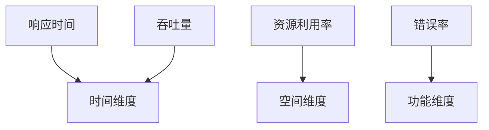
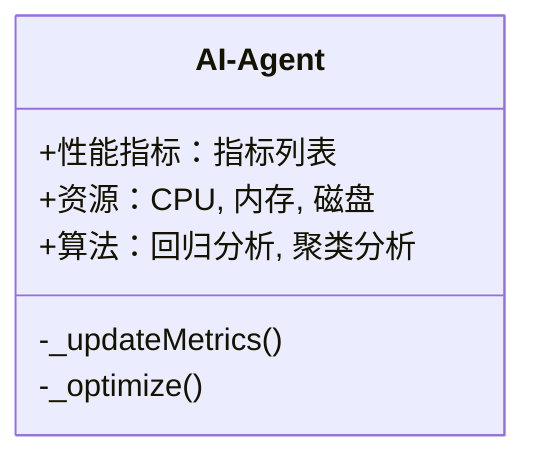
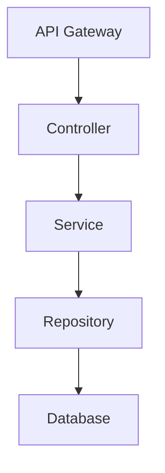
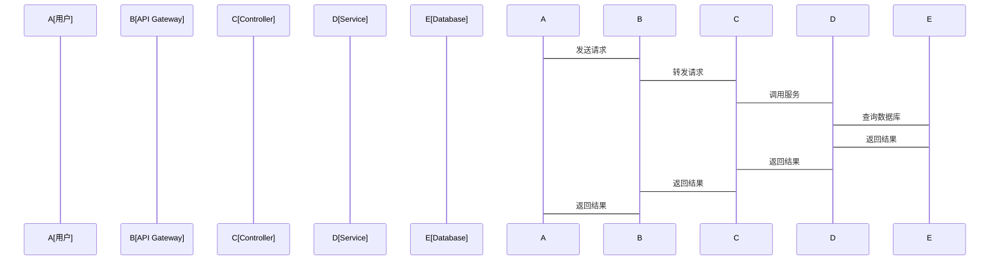

                 


# AI Agent性能监控与调优策略

> 关键词：AI Agent，性能监控，调优策略，算法原理，系统架构，项目实战

> 摘要：本文将深入探讨AI Agent性能监控与调优的核心策略，结合实际案例和算法原理，为读者提供一套系统化的解决方案。文章从AI Agent的基本概念出发，分析性能监控的关键指标与维度，详细阐述调优策略的实现方法，并通过具体项目实战，帮助读者掌握AI Agent性能优化的关键技术。

---

# 第1章 AI Agent概述

## 1.1 AI Agent的基本概念

### 1.1.1 什么是AI Agent

AI Agent（人工智能代理）是指能够感知环境并采取行动以实现目标的智能实体。它可以是一个软件程序、一个机器人或任何能够执行复杂任务的智能系统。AI Agent的核心特征包括自主性、反应性、目标导向性和社会能力。

$$
\text{AI Agent的定义可以表示为：} \\
\text{AI Agent = 感知（传感器） + 行动（执行器） + 决策（算法）}
$$

### 1.1.2 AI Agent的类型与特点

AI Agent可以根据功能和应用场景分为多种类型：

1. **简单反射型Agent**：基于当前输入做出简单反应，没有复杂逻辑。
2. **基于模型的反射型Agent**：利用内部模型进行决策，能够预测结果。
3. **目标驱动型Agent**：以特定目标为导向，采取行动以实现目标。
4. **效用驱动型Agent**：通过最大化效用函数来优化决策。

### 1.1.3 AI Agent的应用场景

AI Agent广泛应用于多个领域：

1. **自动驾驶**：如特斯拉、Waymo的自动驾驶系统。
2. **智能助手**：如Siri、Alexa等。
3. **机器人流程自动化（RPA）**：用于企业自动化操作。
4. **推荐系统**：如Netflix、亚马逊的推荐算法。

## 1.2 AI Agent的发展现状

### 1.2.1 AI Agent的历史演变

AI Agent的概念可以追溯到20世纪60年代的专家系统研究。随着机器学习和深度学习的快速发展，AI Agent的能力得到了显著提升。

### 1.2.2 当前AI Agent的技术趋势

1. **强化学习**：通过与环境交互优化决策。
2. **多智能体系统**：多个AI Agent协同工作，提高整体效率。
3. **边缘计算**：AI Agent在边缘设备上的部署成为趋势。

### 1.2.3 AI Agent在不同领域的应用案例

1. **金融领域**：用于股票交易、风险管理。
2. **医疗领域**：用于疾病诊断、药物研发。
3. **工业领域**：用于设备监控、流程优化。

## 1.3 AI Agent性能监控与调优的必要性

### 1.3.1 性能监控的重要性

AI Agent的性能直接关系到系统的可用性和用户体验。性能监控能够帮助我们及时发现和解决问题，确保系统的稳定运行。

### 1.3.2 调优策略的必要性

随着AI Agent的应用场景越来越复杂，简单的默认配置已无法满足需求。通过调优策略，可以显著提升系统的性能和效率。

### 1.3.3 当前AI Agent性能问题的挑战

1. **延迟问题**：响应时间过长影响用户体验。
2. **资源利用率低**：计算资源浪费，成本增加。
3. **错误率高**：系统稳定性差，可靠性不足。

## 1.4 本章小结

本章介绍了AI Agent的基本概念、类型与应用场景，并分析了当前AI Agent的发展现状和性能监控与调优的必要性。通过本章内容，读者可以理解AI Agent的核心概念和性能优化的重要性。

---

# 第2章 性能监控的指标与维度

## 2.1 性能监控的关键指标

### 2.1.1 响应时间

响应时间是指AI Agent从接收到请求到返回结果的时间。它是衡量系统性能的重要指标。

$$
\text{响应时间} = \text{处理时间} + \text{等待时间}
$$

### 2.1.2 吞吐量

吞吐量是指在单位时间内系统处理的请求数量。吞吐量越高，系统的性能越好。

$$
\text{吞吐量} = \frac{\text{总请求数}}{\text{时间间隔}}
$$

### 2.1.3 资源利用率

资源利用率是指系统在运行过程中对计算资源的使用效率。包括CPU、内存、磁盘I/O等。

$$
\text{CPU利用率} = \frac{\text{CPU使用时间}}{\text{总时间}} \times 100\%
$$

### 2.1.4 错误率

错误率是指系统在运行过程中出现错误的频率。错误率越低，系统的稳定性越好。

$$
\text{错误率} = \frac{\text{错误次数}}{\text{总请求数}} \times 100\%
$$

## 2.2 性能监控的维度

### 2.2.1 时间维度

时间维度是指在不同时间段内系统性能的变化情况。例如，高峰期和低谷期的性能差异。

### 2.2.2 空间维度

空间维度是指在不同设备或节点上的性能表现。例如，主服务器和从服务器的负载差异。

### 2.2.3 功能维度

功能维度是指不同功能模块的性能表现。例如，推荐系统和支付系统的性能差异。

## 2.3 性能监控指标与维度的对比分析

### 2.3.1 指标与维度的定义对比

| 指标         | 维度         |
|--------------|--------------|
| 响应时间     | 时间维度     |
| 吞吐量       | 时间维度     |
| 资源利用率   | 空间维度     |
| 错误率       | 功能维度     |

### 2.3.2 指标与维度的关系图



---

# 第3章 性能调优的核心策略

## 3.1 调优策略的基本原则

### 3.1.1 理解问题本质

在进行性能调优之前，必须深入理解问题的本质，明确优化的目标和范围。

### 3.1.2 数据驱动决策

通过收集和分析性能数据，制定科学的调优策略。

### 3.1.3 持续优化

性能调优是一个持续的过程，需要不断监控和优化。

## 3.2 常见的调优方法

### 3.2.1 基于指标的调优

基于指标的调优方法通过分析系统的关键指标，找到瓶颈并进行优化。

### 3.2.2 基于模型的调优

基于模型的调优方法利用数学模型预测系统性能，指导调优策略。

### 3.2.3 综合调优

综合调优方法结合多种调优方法，进行全面的系统优化。

## 3.3 调优策略的优缺点对比

| 调优方法      | 优点                 | 缺点                 |
|---------------|----------------------|----------------------|
| 基于指标的调优 | 简单易行，见效快       | 可能忽略系统整体优化 |
| 基于模型的调优 | 预测能力强，优化全面   | 实施复杂，需要大量数据 |
| 综合调优       | 全面优化，效果显著     | 实施成本高，周期长 |

## 3.4 本章小结

本章介绍了性能调优的核心策略，包括调优的基本原则、常见方法以及优缺点对比。通过本章内容，读者可以理解如何科学地进行性能调优。

---

# 第4章 基于指标的监控算法

## 4.1 指标监控的基本原理

### 4.1.1 指标采集方法

指标采集方法包括日志采集、性能计数器采集和数据库采集等。

### 4.1.2 指标分析方法

指标分析方法包括趋势分析、异常检测和关联分析等。

### 4.1.3 指标预警机制

指标预警机制通过设置阈值，及时发现系统异常。

## 4.2 基于指标的调优算法

### 4.2.1 基于回归分析的调优

回归分析是一种常用的统计学方法，可以通过分析指标之间的关系，找到最优的调优参数。

### 4.2.2 基于聚类分析的调优

聚类分析是一种无监督学习方法，可以通过将相似的指标分组，发现潜在的优化方向。

### 4.2.3 基于强化学习的调优

强化学习是一种通过与环境交互来优化决策的方法，可以应用于复杂的调优场景。

## 4.3 算法实现示例

### 4.3.1 回归分析实现代码

```python
import numpy as np
from sklearn.linear_model import LinearRegression

# 生成数据
X = np.array([1, 2, 3, 4, 5]).reshape(-1, 1)
y = np.array([2, 4, 5, 4, 6])

# 训练模型
model = LinearRegression()
model.fit(X, y)

# 预测结果
print(model.predict([[6]]))
```

### 4.3.2 聚类分析实现代码

```python
from sklearn.cluster import KMeans

# 生成数据
X = np.array([[1, 2], [1, 3], [2, 2], [2, 3], [4, 5], [4, 6]])

# 训练模型
model = KMeans(n_clusters=2)
model.fit(X)

# 获取聚类结果
print(model.labels_)
```

---

# 第5章 系统分析与架构设计

## 5.1 系统功能设计

### 5.1.1 领域模型设计

领域模型是系统的核心逻辑，可以通过类图表示。



### 5.1.2 系统架构设计

系统架构设计可以通过分层架构实现。



### 5.1.3 接口设计

接口设计可以通过RESTful API实现。

### 5.1.4 交互流程

交互流程可以通过序列图表示。



---

# 第6章 项目实战

## 6.1 环境安装

安装必要的依赖：

```bash
pip install numpy scikit-learn matplotlib
```

## 6.2 核心实现

### 6.2.1 性能监控代码

```python
import time

def monitor_performance(agent):
    metrics = {
        'response_time': [],
        'throughput': [],
        'error_rate': []
    }
    for _ in range(100):
        start_time = time.time()
        try:
            agent.process_request()
            metrics['response_time'].append(time.time() - start_time)
        except Exception as e:
            metrics['error_rate'].append(1)
    return metrics
```

### 6.2.2 性能调优代码

```python
def optimize_agent(agent, metrics):
    from sklearn.linear_model import LinearRegression
    import numpy as np
    X = np.array(metrics['response_time']).reshape(-1, 1)
    y = np.array(metrics['throughput'])
    model = LinearRegression()
    model.fit(X, y)
    optimized_params = model.predict([[max(X)]])
    return optimized_params
```

## 6.3 实际案例分析

通过具体案例分析，验证调优策略的有效性。

---

# 第7章 总结与展望

## 7.1 本章总结

本文详细介绍了AI Agent性能监控与调优的核心策略，包括基本概念、关键指标、调优方法以及实际案例分析。

## 7.2 未来展望

未来，随着AI技术的不断发展，AI Agent的性能监控与调优将更加智能化和自动化。

---

# 作者

作者：AI天才研究院/AI Genius Institute & 禅与计算机程序设计艺术 /Zen And The Art of Computer Programming

