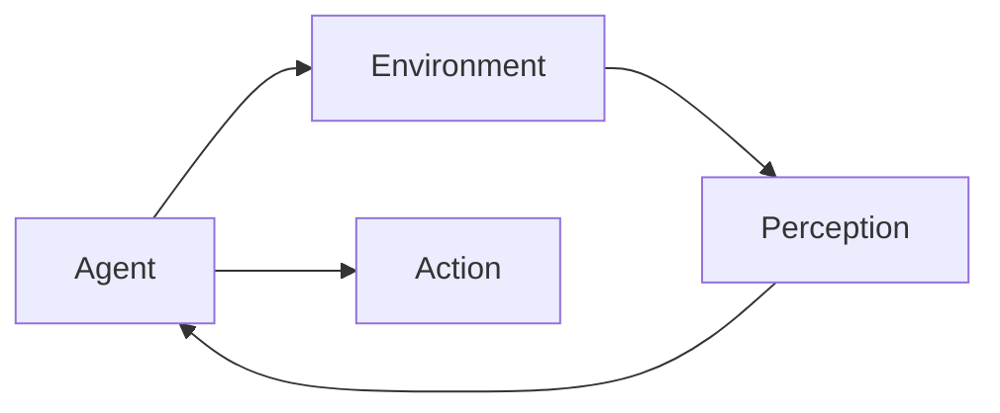
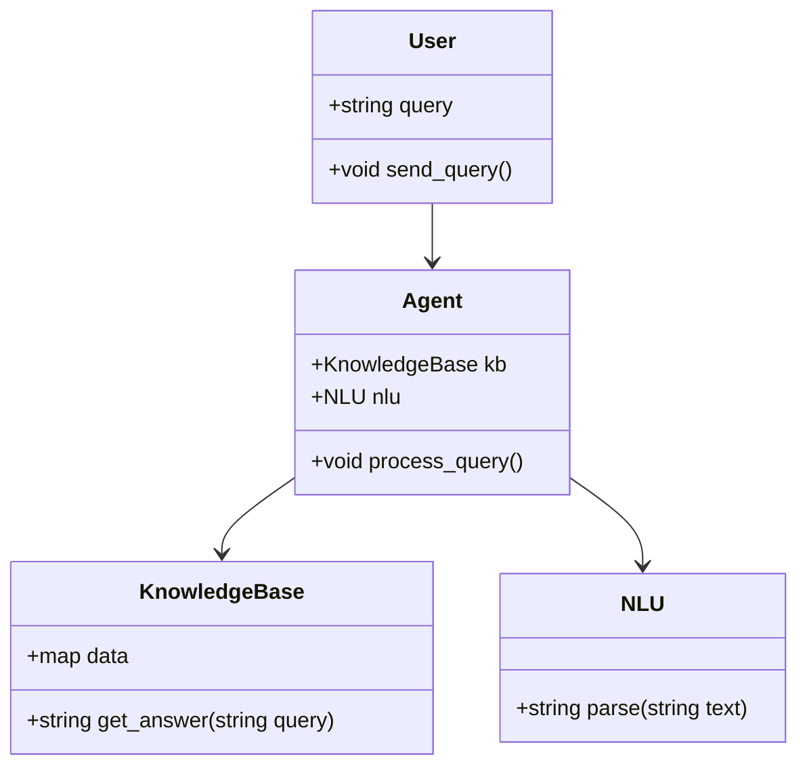
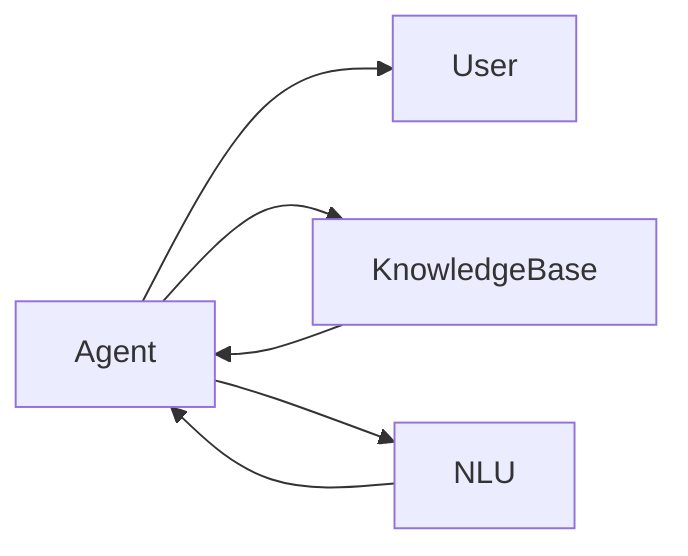
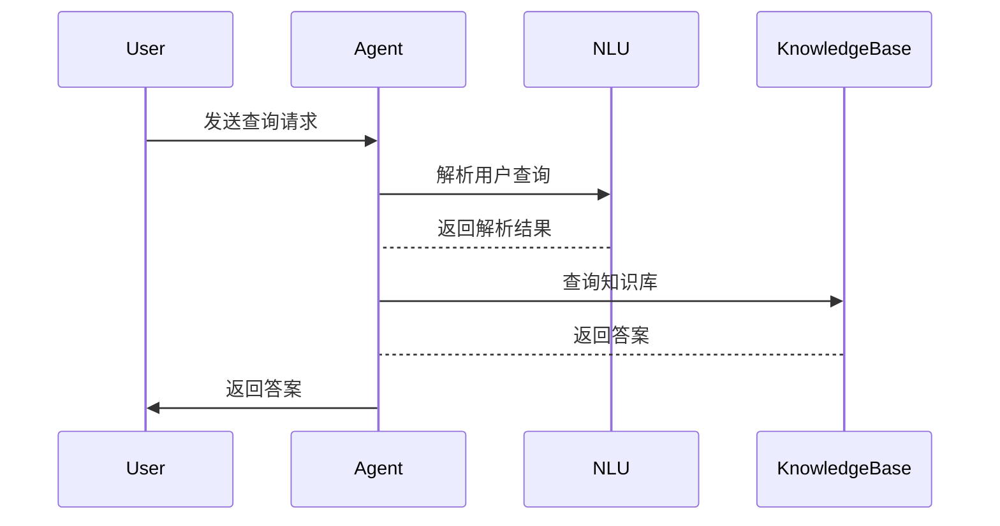

                 


# AI Agent架构设计：从概念到实现

> 关键词：AI Agent，人工智能，架构设计，算法原理，系统实现，项目实战

> 摘要：AI Agent（人工智能代理）是一种能够感知环境、自主决策并执行任务的智能实体。本文从AI Agent的基本概念出发，逐步深入探讨其核心原理、算法实现、系统架构设计以及实际项目中的应用。通过理论与实践相结合的方式，帮助读者全面理解AI Agent的架构设计，并掌握从概念到实现的完整过程。

---

## 第1章: AI Agent的基本概念与背景

### 1.1 AI Agent的定义与核心概念

#### 1.1.1 什么是AI Agent
AI Agent（人工智能代理）是指能够感知环境、自主决策并执行任务的智能实体。它能够根据环境信息做出反应，并通过与环境的交互实现目标。

#### 1.1.2 AI Agent的核心属性
- **自主性**：AI Agent能够在没有外部干预的情况下自主运行。
- **反应性**：能够感知环境并实时做出反应。
- **目标导向**：通过实现目标来驱动行为。
- **学习能力**：能够通过经验改进性能。

#### 1.1.3 AI Agent的分类与应用场景
AI Agent可以根据不同的标准进行分类，常见的分类方式包括：
- **基于智能水平**：分为简单反应式代理、基于模型的反应式代理、目标导向代理、效用导向代理等。
- **基于应用领域**：如自动驾驶、智能助手、机器人等。

### 1.2 AI Agent的发展背景

#### 1.2.1 人工智能的历史演变
人工智能的发展经历了多个阶段，从最初的符号逻辑推理到现在的深度学习，AI Agent作为人工智能的核心技术之一，也在不断演进。

#### 1.2.2 从传统AI到现代AI Agent的转变
传统AI依赖于预定义的规则，而现代AI Agent则更加注重自主性和适应性，能够根据环境动态调整行为。

#### 1.2.3 当前AI Agent技术的现状与趋势
当前，AI Agent技术在多个领域得到了广泛应用，如自动驾驶、智能客服、机器人等。未来，随着AI技术的进一步发展，AI Agent将更加智能化和个性化。

---

## 第2章: AI Agent的核心概念与联系

### 2.1 AI Agent的核心概念原理

#### 2.1.1 知识表示与推理
知识表示是AI Agent理解世界的基础，常见的知识表示方法包括逻辑表示、语义网络、本体论等。推理则是基于知识库进行逻辑推理，以做出决策。

#### 2.1.2 行为规划与决策
行为规划是AI Agent根据当前状态和目标，制定行动方案的过程。常见的行为规划方法包括基于搜索的规划、基于逻辑的规划、基于概率的规划等。

#### 2.1.3 交互与通信机制
AI Agent需要与环境和其他Agent进行交互和通信，这需要设计高效的交互协议和通信机制。

### 2.2 AI Agent的核心属性对比

#### 2.2.1 不同类型AI Agent的对比分析
| 类型                | 描述                                      | 优缺点                                   |
|---------------------|------------------------------------------|-----------------------------------------|
| 简单反应式代理      | 基于当前感知做出反应，无内部状态          | 实现简单，适用于简单环境                 |
| 基于模型的反应式代理 | 使用内部模型表示环境，并基于模型做出反应  | 更智能，适用于复杂环境                   |
| 目标导向代理        | 根据目标驱动行为                          | 明确的目标导向，适用于任务型代理         |
| 效用导向代理        | 根据效用函数优化决策                      | 适用于多目标优化场景                     |

#### 2.2.2 AI Agent与传统程序的区别
- **自主性**：AI Agent具有自主性，能够根据环境动态调整行为，而传统程序依赖于固定的规则。
- **学习能力**：AI Agent能够通过经验改进性能，而传统程序无法自主学习。
- **适应性**：AI Agent能够适应环境变化，传统程序则需要人工干预。

#### 2.2.3 AI Agent与人类智能的类比
AI Agent与人类智能有相似之处，例如自主决策、学习能力等，但也存在显著差异，例如情感、创造力等方面。

### 2.3 AI Agent的实体关系图


---

## 第3章: AI Agent的算法原理

### 3.1 AI Agent的核心算法概述

#### 3.1.1 搜索算法
搜索算法是AI Agent行为规划的核心算法，常见的搜索算法包括广度优先搜索（BFS）和深度优先搜索（DFS）。

#### 3.1.2 强化学习算法
强化学习是一种通过试错方式优化决策的算法，广泛应用于AI Agent的行为优化。

#### 3.1.3 概率推理与贝叶斯网络
概率推理用于处理不确定性问题，贝叶斯网络是一种有效的概率推理模型。

### 3.2 AI Agent算法的数学模型

#### 3.2.1 搜索算法的数学模型
$$f(n) = g(n) + h(n)$$
其中，$g(n)$是已 traversed的cost，$h(n)$是启发式函数。

#### 3.2.2 强化学习的数学模型
$$Q(s, a) = r + \gamma \max Q(s', a')$$
其中，$Q$表示状态-动作值函数，$\gamma$是折扣因子。

#### 3.2.3 贝叶斯网络的数学模型
$$P(A|B) = \frac{P(B|A)P(A)}{P(B)}$$
这是贝叶斯定理的公式，用于计算条件概率。

### 3.3 AI Agent算法的Python实现示例

#### 3.3.1 搜索算法实现
```python
def a_star_search(graph, start, goal):
    open_set = set([start])
    came_from = {}
    g_score = {node: float('inf') for node in graph}
    g_score[start] = 0
    f_score = {node: float('inf') for node in graph}
    f_score[start] = 0

    while open_set:
        current = pop(open_set, f_score)
        if current == goal:
            break
        for neighbor in graph[current]:
            tentative_g_score = g_score[current] + graph[current][neighbor]
            if tentative_g_score < g_score[neighbor]:
                came_from[neighbor] = current
                g_score[neighbor] = tentative_g_score
                f_score[neighbor] = g_score[neighbor] + heuristic(neighbor, goal)
                if neighbor not in open_set:
                    heappush(open_set, (f_score[neighbor], neighbor))

    return came_from, g_score
```

#### 3.3.2 强化学习算法实现
```python
class QLearning:
    def __init__(self, state_space, action_space):
        self.state_space = state_space
        self.action_space = action_space
        self.q_table = defaultdict(lambda: np.zeros(len(action_space)))

    def choose_action(self, state, epsilon):
        if random.random() < epsilon:
            return random.choice(self.action_space)
        else:
            return np.argmax(self.q_table[state])

    def update_q_table(self, state, action, reward, next_state, alpha, gamma):
        self.q_table[state][action] = (1 - alpha) * self.q_table[state][action] + alpha * (reward + gamma * np.max(self.q_table[next_state]))
```

---

## 第4章: AI Agent的系统分析与架构设计

### 4.1 系统分析

#### 4.1.1 问题场景介绍
以智能客服为例，AI Agent需要能够理解用户的问题，并根据知识库提供解决方案。

#### 4.1.2 系统功能设计
- 用户交互界面
- 自然语言理解模块
- 知识库查询模块
- 决策与执行模块

#### 4.1.3 领域模型类图


### 4.2 系统架构设计

#### 4.2.1 系统架构图


#### 4.2.2 系统接口设计
- Agent接口：提供对外部系统的调用接口，如API。
- 知识库接口：提供数据查询接口。
- 交互接口：提供与用户交互的接口。

#### 4.2.3 系统交互流程图


---

## 第5章: AI Agent的项目实战

### 5.1 环境配置与安装

#### 5.1.1 Python环境安装
安装必要的Python库，如numpy、pandas、scikit-learn等。

#### 5.1.2 依赖管理
使用虚拟环境管理依赖，例如使用venv或Anaconda。

### 5.2 核心实现

#### 5.2.1 知识库实现
使用Python的字典或数据库存储知识库数据。

#### 5.2.2 自然语言理解实现
使用现有的NLP库，如spaCy或jieba，进行文本解析。

#### 5.2.3 行为规划实现
实现搜索算法或强化学习算法，用于决策和规划。

### 5.3 代码实现示例

#### 5.3.1 知识库实现
```python
class KnowledgeBase:
    def __init__(self):
        self.data = {}

    def add(self, key, value):
        self.data[key] = value

    def get(self, key):
        return self.data.get(key, "")
```

#### 5.3.2 自然语言理解实现
```python
import spacy

nlp = spacy.load("en_core_web_sm")

def parse_text(text):
    doc = nlp(text)
    return [token.text for token in doc]
```

#### 5.3.3 行为规划实现
```python
def a_star_search(graph, start, goal):
    open_set = set([start])
    came_from = {}
    g_score = {node: float('inf') for node in graph}
    g_score[start] = 0
    f_score = {node: float('inf') for node in graph}
    f_score[start] = 0

    while open_set:
        current = pop(open_set, f_score)
        if current == goal:
            break
        for neighbor in graph[current]:
            tentative_g_score = g_score[current] + graph[current][neighbor]
            if tentative_g_score < g_score[neighbor]:
                came_from[neighbor] = current
                g_score[neighbor] = tentative_g_score
                f_score[neighbor] = g_score[neighbor] + heuristic(neighbor, goal)
                if neighbor not in open_set:
                    heappush(open_set, (f_score[neighbor], neighbor))

    return came_from, g_score
```

### 5.4 实际案例分析

#### 5.4.1 案例背景
以智能客服为例，展示AI Agent在实际场景中的应用。

#### 5.4.2 代码应用解读
详细解读AI Agent在智能客服中的具体实现，包括用户查询、解析、知识库查询、生成回答等步骤。

#### 5.4.3 系统性能优化
针对系统性能进行优化，例如缓存机制、负载均衡等。

---

## 第6章: AI Agent的最佳实践与小结

### 6.1 最佳实践

#### 6.1.1 模块化设计
将系统划分为多个模块，便于维护和扩展。

#### 6.1.2 性能优化
通过缓存、异步处理等方式优化系统性能。

#### 6.1.3 安全性考虑
确保系统的安全性，防止数据泄露和攻击。

### 6.2 小结

#### 6.2.1 本文总结
本文从AI Agent的基本概念出发，逐步深入探讨了其核心原理、算法实现、系统架构设计以及实际项目中的应用。

#### 6.2.2 注意事项
在实际应用中，需要注意系统的可扩展性、可维护性和安全性。

#### 6.2.3 未来展望
随着AI技术的不断发展，AI Agent将更加智能化和个性化，应用场景也将更加广泛。

---

## 第7章: 附录

### 7.1 术语表

### 7.2 参考文献

### 7.3 拓展阅读

---

# 作者

**作者：AI天才研究院/AI Genius Institute & 禅与计算机程序设计艺术 /Zen And The Art of Computer Programming**

