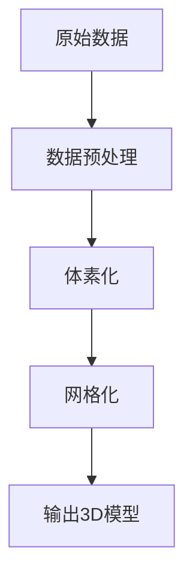
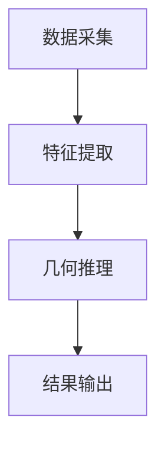

                 


---

# AI Agent的3D场景重建能力实现

> **关键词**：AI Agent, 3D场景重建, 点云处理, 深度学习, 几何建模

> **摘要**：  
本文将探讨AI Agent在3D场景重建中的实现方法，涵盖基本概念、算法原理、系统架构设计以及项目实战。通过详细分析点云、网格、体素等核心概念，结合深度学习算法和数学模型，展示如何构建高效的3D场景重建系统。文章还将通过具体案例，讲解如何在实际项目中应用这些技术，并总结最佳实践和未来研究方向。

---

## 第一部分: 引言

### 1.1 背景与意义  
3D场景重建是计算机视觉和人工智能领域的重要研究方向，广泛应用于游戏开发、虚拟现实、自动驾驶等领域。AI Agent通过感知环境并生成3D模型，能够显著提升这些应用的效率和精度。

### 1.2 问题描述  
如何利用AI Agent实现高效的3D场景重建？本文将从数据处理、算法选择和系统架构三个层面展开讨论。

---

## 第二部分: 3D场景重建的基本概念与应用

### 2.1 核心概念  
- **点云（Point Cloud）**：由三维空间中的点组成，常用于表示物体表面或场景结构。  
- **网格（Mesh）**：由顶点、边和面构成的几何模型，适合用于渲染和交互。  
- **体素（Voxel）**：类似于图像中的像素，用于表示空间中的小立方体，适用于体积计算。  

### 2.2 应用领域  
- **游戏开发**：快速生成虚拟场景。  
- **虚拟现实**：构建真实感环境。  
- **自动驾驶**：通过3D重建提高环境感知能力。  

---

## 第三部分: 3D场景重建的核心概念与联系

### 3.1 点云与网格的对比  
| 特性    | 点云                  | 网格                  |
|---------|-----------------------|-----------------------|
| 表示方式 | 离散点                | 顶点、边、面          |
| 优点    | 稠密性高，适合细节重建 | 光滑性好，适合渲染    |
| 缺点    | 计算复杂               | 细节表现能力有限      |

### 3.2 体素化与网格化的流程图  


---

## 第四部分: 3D场景重建的算法原理与数学模型

### 4.1 点云处理算法  
- **体素化**：将点云转换为体素网格，便于后续处理。  
- **上采样与下采样**：调整点云密度，优化计算效率。  
- **特征提取**：通过深度学习提取点云的几何和语义特征。  

### 4.2 深度学习重建算法  
- **基于点网的重建**：通过神经网络生成点云的三维结构。  
- **基于网格的重建**：利用卷积神经网络生成网格模型。  
- **基于图像分割的重建**：通过分割图像生成3D模型。  

### 4.3 数学模型  
- **点云的坐标表示**：  
  $$ x_i = (x, y, z) $$  
- **体素的体积表示**：  
  $$ V = \sum_{i=1}^{n} v_i $$  

---

## 第五部分: 系统架构设计

### 5.1 系统功能模块  
- **数据采集**：获取场景数据。  
- **特征提取**：提取点云特征。  
- **几何推理**：生成3D模型。  
- **结果输出**：输出重建模型。  

### 5.2 系统架构图  


---

## 第六部分: 项目实战

### 6.1 环境安装  
- **Python**：3.8+  
- **深度学习框架**：TensorFlow或PyTorch  
- **可视化工具**：Matplotlib或Open3D  

### 6.2 核心代码实现  
```python
import numpy as np
from open3d import *

def reconstruct_3dScene(points):
    # 数据预处理
    pcd = PointCloud(points)
    # 点云上采样
    pcd_up = pcd.voxel_down_sample(0.05)
    # 特征提取
    features = extract_features(pcd_up)
    # 几何推理
    mesh = create_mesh(features)
    return mesh

# 示例数据
points = np.random.rand(1000, 3)
# 调用重建函数
mesh = reconstruct_3dScene(points)
# 可视化
draw_mesh(mesh)
```

---

## 第七部分: 总结与展望

### 7.1 最佳实践  
- 数据质量对重建效果至关重要。  
- 选择合适的算法和工具，优化计算效率。  

### 7.2 小结  
本文系统介绍了AI Agent在3D场景重建中的实现方法，从概念到算法，再到系统设计，为读者提供了全面的指导。

### 7.3 未来展望  
随着深度学习和计算能力的提升，3D场景重建将更加高效和智能化，为更多领域带来变革。

---

**作者**：AI天才研究院 & 禅与计算机程序设计艺术

