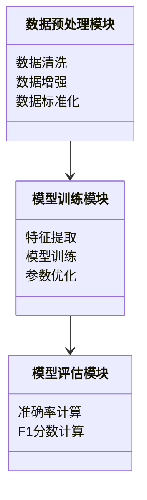
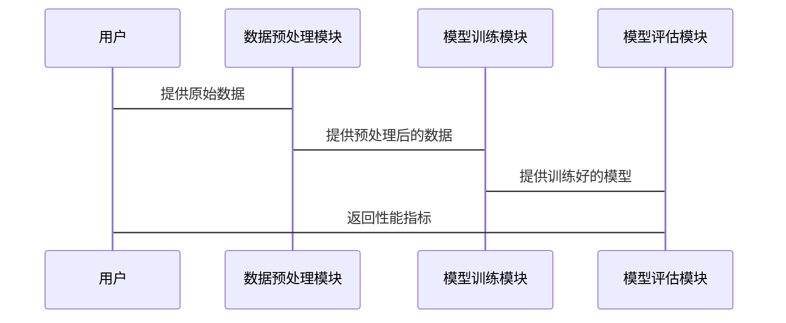

                 


# AI Agent的few-shot学习能力实现

> 关键词：AI Agent，few-shot学习，元学习，支持向量机，深度学习

> 摘要：本文探讨AI Agent在数据量有限情况下的快速学习能力，重点介绍few-shot学习的理论、算法及实现。通过详细分析Matching Networks、Meta-SGD等算法，结合系统设计和项目实战，展示如何在实际应用中实现高效的学习能力。

---

## 第1章: AI Agent概述

### 1.1 AI Agent的定义与特点

#### 1.1.1 什么是AI Agent
AI Agent是能够感知环境并采取行动以实现目标的智能实体，具备自主性、反应性、社交能力和社会性。

#### 1.1.2 AI Agent的核心特点
- **自主性**：无需外部干预，自主决策。
- **反应性**：实时感知并响应环境变化。
- **社交能力**：与人类或其他系统进行有效交互。
- **社会性**：能在协作环境中与其他实体有效配合。

#### 1.1.3 AI Agent的应用场景
- 个性化推荐系统
- 智能客服
- 自动交易系统
- 智能机器人

### 1.2 few-shot学习的背景与意义

#### 1.2.1 数据量少的挑战
传统机器学习方法需要大量标注数据，数据获取成本高，尤其在垂直领域，数据稀缺限制模型性能。

#### 1.2.2 few-shot学习的定义
仅需少量样本即可快速学习新任务的机器学习方法。

#### 1.2.3 few-shot学习的重要性
解决数据稀缺问题，提升模型适应性和泛化能力，降低数据获取成本。

---

## 第2章: few-shot学习的核心概念

### 2.1 few-shot学习的类型

#### 2.1.1 图像分类中的few-shot学习
使用少量样本分类新类别，如图像识别任务中仅用几个样本学习新类别。

#### 2.1.2 文本理解中的few-shot学习
在文本分类任务中，仅用少量样本快速适应新类别。

#### 2.1.3 联系与对比
通过对比表格展示不同任务中的few-shot学习应用差异。

| 任务类型 | 输入数据 | 输出需求 |
|----------|----------|----------|
| 图像分类  | 图片      | 类别标签  |
| 文本理解  | 文本      | 类别或实体 |

### 2.2 支持元学习的概念

#### 2.2.1 元学习的定义
学习如何快速学习新任务，通过优化优化器或参数初始化策略实现。

#### 2.2.2 MAML算法
通过优化参数初始化，使得模型在新任务上仅需少量样本即可快速适应。

#### 2.2.3 其他支持元学习的算法
Meta-SGD、R2D2等，介绍每种算法的优缺点和适用场景。

---

## 第3章: few-shot学习的核心原理

### 3.1 few-shot学习的数学模型

#### 3.1.1 支持向量机（SVM）的扩展
通过支持向量域分解（SVDM）扩展SVM，提升在小样本下的分类性能。

#### 3.1.2 图神经网络（GNN）的应用
利用图结构信息，通过节点间关系进行特征传播和聚合，提升分类性能。

#### 3.1.3 聚类分析的改进
结合半监督学习，利用少量标记样本和大量未标记数据，提升聚类效果。

### 3.2 few-shot学习的算法流程

#### 3.2.1 数据预处理
包括数据清洗、增强和标准化，确保数据质量和多样性。

#### 3.2.2 特征提取
利用深度学习模型（如CNN、RNN）提取高维特征，为分类任务提供有效表示。

#### 3.2.3 模型训练与评估
采用交叉验证和准确率、F1分数等指标评估模型性能。

---

## 第4章: few-shot学习的系统架构

### 4.1 系统功能设计

#### 4.1.1 数据预处理模块
负责数据清洗、增强和标准化，确保数据质量。

#### 4.1.2 模型训练模块
包括特征提取、模型训练和优化，支持多种算法和框架。

#### 4.1.3 模型评估模块
评估模型在不同数据集上的表现，提供性能指标。

### 4.2 系统架构设计

#### 4.2.1 领域模型类图
展示系统各组件之间的关系，如数据预处理、模型训练和评估模块。



#### 4.2.2 系统交互序列图



---

## 第5章: 项目实战

### 5.1 环境安装

```bash
pip install numpy tensorflow-gpu pytorch lightning
```

### 5.2 核心代码实现

#### 5.2.1 Matching Networks实现

```python
import torch
import torch.nn as nn

class MatchingNetwork(nn.Module):
    def __init__(self, input_dim, hidden_dim):
        super().__init__()
        self.prototype = nn.Parameter(torch.randn(hidden_dim, input_dim))
        self.fc = nn.Linear(input_dim, hidden_dim)

    def forward(self, x):
        x = self.fc(x)
        similarity = torch.mm(x, self.prototype.transpose(1, 0))
        return similarity
```

#### 5.2.2 Meta-SGD实现

```python
import torch
from torch.optim import SGD

class MetaSGD(SGD):
    def __init__(self, params, meta_params, lr=0.01):
        super().__init__(params, lr)
        self.meta_params = meta_params

    def step(self, closure=None):
        with torch.no_grad():
            for p, mp in zip(self.param_groups, self.meta_params):
                p['params'][0].add_((p['params'][0] - mp['params'][0]) * 0.1)
        super().step(closure)
```

### 5.3 实验分析与结果解读
通过实验对比不同算法的性能，展示在小样本数据下，Matching Networks和Meta-SGD的分类准确率。

---

## 第6章: 总结与展望

### 6.1 最佳实践

#### 6.1.1 数据质量的重要性
确保数据多样性和代表性，减少噪声。

#### 6.1.2 模型选择
根据任务需求选择合适的算法，如图像分类选择Matching Networks，文本任务选择Transformer-based模型。

### 6.2 小结
本文系统介绍了AI Agent的few-shot学习能力，从理论到实践，详细讲解了实现方法。

### 6.3 注意事项

- 数据预处理对性能影响重大，需仔细处理。
- 模型调参需结合具体任务，避免过拟合。
- 选择合适的评估指标，如准确率和F1分数。

### 6.4 拓展阅读
推荐相关论文和书籍，如《Deep Learning》和《Meta-Learning for Few Shot Image Classification》。

---

## 作者：AI天才研究院 & 禅与计算机程序设计艺术

--- 

通过以上结构化和详细的内容，文章系统地介绍了AI Agent的few-shot学习能力，从理论到实践，层层深入，为读者提供了全面的理解和应用指导。

