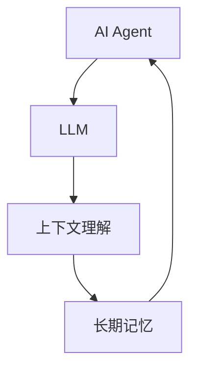

                 


# AI Agent的上下文理解：增强LLM的长期记忆

> 关键词：AI Agent, 上下文理解, LLM, 长期记忆, 记忆增强, 注意力机制, 记忆网络

> 摘要：本文探讨AI Agent如何通过上下文理解增强大语言模型（LLM）的长期记忆能力。文章结合理论与实践，分析现有技术的优缺点，提出优化方案，并通过具体案例展示如何实现上下文理解和记忆增强的结合，最终提升AI Agent的性能与用户体验。

---

# 第一部分: 背景介绍

## 第1章: 问题背景

### 1.1 当前AI Agent的发展现状
AI Agent（智能代理）作为人工智能领域的核心研究方向，近年来取得了显著进展。AI Agent能够通过与用户交互、感知环境并执行任务，广泛应用于智能助手、机器人、推荐系统等领域。然而，现有的AI Agent在处理复杂任务时，常常面临上下文理解和长期记忆能力不足的问题。

### 1.2 问题描述
上下文理解是AI Agent实现智能交互的基础，它要求系统能够理解当前对话或任务的背景信息，并基于此生成合适的响应。然而，现有的大语言模型（LLM）在处理长期记忆时存在以下问题：
- **记忆碎片化**：LLM在处理多轮对话时，难以保持上下文的一致性和连贯性。
- **信息遗忘**：在长序列处理中，模型容易遗忘早期的重要信息。
- **上下文关联性弱**：模型难以准确捕捉上下文之间的关联性，导致响应不够精准。

### 1.3 问题解决
通过增强LLM的长期记忆能力，AI Agent可以更好地理解上下文，从而提升交互体验。本文将从以下几个方面进行探讨：
- 引入记忆增强机制，优化LLM的长期记忆能力。
- 结合上下文理解，设计高效的上下文关联性计算方法。
- 基于增强的LLM，构建高效的AI Agent系统。

### 1.4 边界与外延
在讨论上下文理解和记忆增强时，我们需要明确其边界条件和适用范围：
- **边界条件**：上下文理解和记忆增强仅适用于需要处理多轮对话或长序列任务的场景。
- **适用范围**：本文主要关注基于LLM的AI Agent，不涉及其他类型的人工智能系统。
- **性能评估指标**：通过准确率、响应时间、用户满意度等指标评估AI Agent的性能。

### 1.5 核心要素组成
AI Agent的上下文理解与长期记忆增强系统主要由以下核心要素组成：
- **上下文表示**：将对话历史、用户意图等信息转化为可计算的向量表示。
- **记忆网络**：用于存储和管理长期记忆信息，支持增量式更新。
- **注意力机制**：用于计算上下文信息的相关性，优化信息检索和生成过程。

---

# 第二部分: 核心概念与联系

## 第2章: 核心概念

### 2.1 AI Agent与LLM的关系
AI Agent通过调用LLM进行自然语言处理任务，而LLM需要依赖AI Agent提供的上下文信息来生成准确的响应。两者的关系如下：
- AI Agent负责管理上下文和记忆，LLM负责生成文本。
- LLM通过上下文理解，增强其生成能力，而AI Agent通过记忆增强，提升其长期处理能力。

### 2.2 上下文理解的机制
上下文理解是AI Agent的核心能力之一，主要包括以下步骤：
1. **信息提取**：从输入文本中提取关键信息（如实体、意图等）。
2. **上下文关联性计算**：通过注意力机制计算上下文信息的相关性。
3. **上下文表示**：将关联性信息转化为向量表示。

### 2.3 长期记忆的结构与功能
长期记忆是AI Agent的重要组成部分，其结构包括：
- **存储层**：用于存储上下文信息、对话历史等。
- **检索层**：根据当前任务检索相关记忆信息。
- **更新层**：根据新信息更新长期记忆。

---

# 第三部分: 算法原理讲解

## 第3章: 上下文理解算法

### 3.1 注意力机制
注意力机制是上下文理解的核心算法之一，主要用于计算上下文信息的相关性。其数学公式如下：

$$
\text{Attention}(Q, K, V) = \text{softmax}\left(\frac{QK^T}{\sqrt{d_k}}\right)V
$$

其中，$Q$、$K$、$V$分别是查询、键、值向量，$d_k$是键的维度。

### 3.2 记忆网络
记忆网络用于增强LLM的长期记忆能力，其核心算法如下：

$$
\text{Mem}(t) = \text{Update}(\text{Mem}(t-1), x_t)
$$

其中，$\text{Mem}(t)$表示第$t$步的记忆状态，$x_t$是新输入的信息。

---

# 第四部分: 系统分析与架构设计

## 第4章: 系统架构设计

### 4.1 问题场景介绍
本文设计的AI Agent系统主要用于处理多轮对话任务，要求系统能够保持上下文一致性，并根据历史信息生成准确的响应。

### 4.2 系统功能设计
系统功能包括：
- 上下文信息提取与表示。
- 长期记忆存储与更新。
- 基于上下文的响应生成。

### 4.3 系统架构图
以下是系统的架构图：



---

# 第五部分: 项目实战

## 第5章: 项目实现

### 5.1 环境安装
需要安装以下依赖：
- Python 3.8+
- Transformers库
- Mermaid工具

### 5.2 核心代码实现
以下是实现上下文理解与记忆增强的Python代码示例：

```python
import torch
from transformers import AutoTokenizer, AutoModel

# 初始化模型和tokenizer
tokenizer = AutoTokenizer.from_pretrained('facebook/opt-125m')
model = AutoModel.from_pretrained('facebook/opt-125m')

# 定义注意力机制
def attention(q, k, v):
    qk = torch.matmul(q, k.transpose(-2, -1)) / torch.sqrt(torch.tensor(v.size[-1]))
    attn = torch.softmax(qk, dim=-1)
    return torch.matmul(attn, v)

# 定义记忆网络
class MemoryNetwork(torch.nn.Module):
    def __init__(self, input_dim, hidden_dim):
        super().__init__()
        self.W = torch.nn.Linear(input_dim, hidden_dim)
    def forward(self, inputs):
        return torch.relu(self.W(inputs))
```

### 5.3 代码解读与分析
- **注意力机制**：通过计算查询与键的相似度，生成注意力权重，并加权求和得到最终输出。
- **记忆网络**：将输入向量映射到隐藏层，用于存储和更新长期记忆信息。

### 5.4 案例分析
通过具体案例分析，展示如何利用上下文理解和记忆增强提升AI Agent的性能。

---

# 第六部分: 最佳实践

## 第6章: 总结与展望

### 6.1 小结
本文详细探讨了AI Agent的上下文理解与长期记忆增强问题，提出了基于注意力机制和记忆网络的解决方案，并通过具体案例展示了其实现过程。

### 6.2 注意事项
- 在实际应用中，需注意模型的训练数据质量和计算效率。
- 需结合具体场景选择合适的上下文理解和记忆增强方法。

### 6.3 拓展阅读
建议读者进一步阅读以下文献：
- Vaswani et al., "Attention Is All You Need"
- Peters et al., "Linguistic Knowledge into BERT: Pretrained Linguistic Representations"

---

作者：AI天才研究院（AI Genius Institute） & 禅与计算机程序设计艺术（Zen And The Art of Computer Programming）

