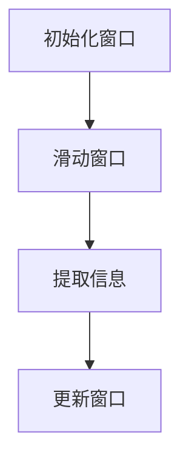
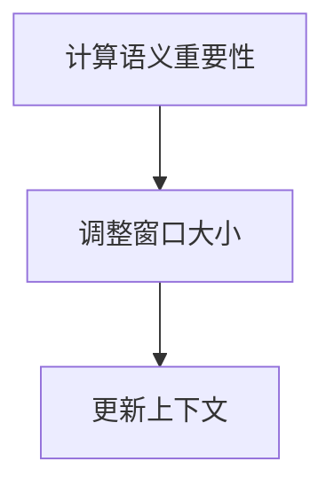
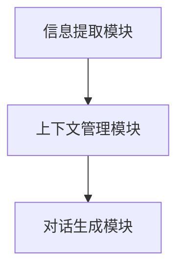
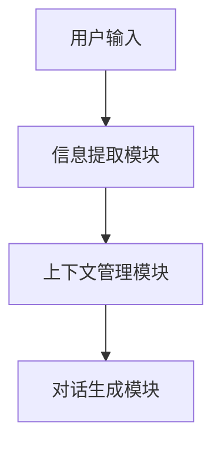

                 

# AI Agent的上下文窗口优化：提高长对话理解能力

> 关键词：AI Agent, 上下文窗口, 长对话理解, 优化算法, 注意力机制

> 摘要：本文深入探讨了AI Agent在长对话中的上下文窗口优化问题，分析了传统窗口机制的局限性，并提出了基于注意力机制的优化方法。通过系统架构设计、算法实现和项目实战，全面展示了如何提高长对话理解能力，为AI Agent的性能优化提供了理论和实践指导。

---

# 第一部分: AI Agent的上下文窗口优化基础

## 第1章: 上下文窗口优化的背景与问题

### 1.1 什么是AI Agent的上下文窗口

#### 1.1.1 上下文窗口的定义与作用

上下文窗口是指在AI Agent处理对话时，系统选择关注的对话历史片段。它的作用是帮助模型聚焦于与当前对话相关的部分信息，从而提高理解和生成的准确性。上下文窗口的选择直接影响AI Agent的表现。

#### 1.1.2 上下文窗口在长对话中的重要性

在长对话中，信息量大，上下文关系复杂。如果窗口过大，计算资源消耗增加；窗口过小，可能导致信息遗漏。优化上下文窗口可以有效平衡计算效率和理解准确率。

#### 1.1.3 上下文窗口的边界与外延

上下文窗口的边界通常由对话的历史长度决定，外延则涉及信息提取、语义理解和生成策略。

### 1.2 长对话理解中的问题与挑战

#### 1.2.1 长对话中的信息丢失问题

传统滑动窗口可能忽略重要的上下文信息，导致理解错误。

#### 1.2.2 上下文窗口过大的计算开销

过大的窗口会增加模型计算负担，影响实时响应。

#### 1.2.3 上下文窗口过小的信息遗漏

窗口过小可能导致模型忽略关键信息，生成不连贯的回答。

### 1.3 上下文窗口优化的目标与意义

#### 1.3.1 提高长对话理解的准确性

优化窗口选择，突出关键信息，提升语义理解。

#### 1.3.2 降低计算资源消耗

动态调整窗口大小，减少计算量，提升效率。

#### 1.3.3 提升用户体验

通过优化上下文窗口，提供更流畅、自然的对话体验。

---

## 第2章: 上下文窗口优化的核心概念

### 2.1 上下文窗口的原理与机制

#### 2.1.1 滑动窗口机制

滑动窗口按固定大小滚动，提取历史信息。但其固定性可能导致信息遗漏。

#### 2.1.2 固定窗口机制

固定窗口大小，但可能无法适应对话内容的变化。

#### 2.1.3 动态调整窗口大小的策略

根据对话内容动态调整窗口大小，平衡信息量和计算资源。

### 2.2 上下文窗口与记忆机制的关系

#### 2.2.1 基于记忆的上下文窗口

引入外部记忆模块，存储重要信息，辅助上下文处理。

#### 2.2.2 基于注意力机制的上下文处理

注意力机制通过权重分配，突出关键信息，优化信息提取。

#### 2.2.3 记忆网络与上下文窗口的结合

记忆网络与上下文窗口结合，增强信息存储和检索能力。

### 2.3 上下文窗口优化的核心要素

#### 2.3.1 窗口大小的选择策略

根据对话主题和复杂度动态调整窗口大小。

#### 2.3.2 窗口内容的筛选方法

基于语义重要性筛选关键信息，减少冗余。

#### 2.3.3 窗口更新的频率与时机

根据对话进展实时更新窗口，保持上下文的相关性。

---

## 第3章: 上下文窗口优化的算法原理

### 3.1 滑动窗口算法

#### 3.1.1 滑动窗口的基本原理

窗口按固定步长滑动，提取连续历史片段。

#### 3.1.2 滑动窗口的实现步骤

初始化窗口，滑动窗口，提取信息，更新窗口。

#### 3.1.3 滑动窗口的优缺点分析

优点：简单高效；缺点：可能忽略重要信息。

#### 滑动窗口算法流程图

### 3.2 基于注意力机制的上下文优化

#### 3.2.1 注意力机制的原理

通过计算每个位置的权重，突出关键信息。

#### 3.2.2 基于注意力机制的上下文窗口优化算法

结合注意力权重，动态调整窗口内容。

#### 3.2.3 注意力机制的改进方法

引入位置编码，增强语义理解。

### 3.3 动态调整窗口大小的算法

#### 3.3.1 动态窗口大小调整的策略

根据对话主题和语义重要性调整窗口大小。

#### 3.3.2 动态窗口调整的实现步骤

计算语义重要性，调整窗口大小，更新上下文。

#### 3.3.3 动态窗口调整的优化方法

引入语义分析模型，提升调整精度。

#### 动态窗口调整算法流程图

### 3.4 数学模型与公式

#### 滑动窗口模型

滑动窗口的数学表示为：

$$
W_t = W_{t-1} + 1
$$

其中，$W_t$ 表示第t时刻的窗口。

#### 基于注意力机制的模型

注意力机制的权重计算公式为：

$$
\alpha_i = \frac{e^{score(i)}}{\sum_{j} e^{score(j)}}
$$

其中，$score(i)$ 表示第i个位置的得分。

---

## 第4章: 上下文窗口优化的系统架构与设计

### 4.1 系统架构设计

#### 4.1.1 系统功能设计

包括信息提取、上下文管理、对话生成三个模块。

#### 4.1.2 系统架构图

### 4.2 接口设计

#### 4.2.1 系统接口

定义上下文窗口调整的接口规范。

#### 4.2.2 交互流程图

### 4.3 项目实战

#### 4.3.1 环境安装

安装必要的库，如TensorFlow、PyTorch。

#### 4.3.2 核心实现代码

实现上下文窗口优化的算法，如动态调整窗口大小。

#### 4.3.3 代码应用解读与分析

通过代码分析，展示算法实现细节。

#### 4.3.4 实际案例分析

通过具体案例，展示优化效果。

---

## 第5章: 上下文窗口优化的最佳实践

### 5.1 优化策略

#### 5.1.1 动态调整窗口大小

根据对话内容实时调整窗口大小。

#### 5.1.2 结合领域知识

利用领域知识，优化上下文窗口选择。

### 5.2 实践中的注意事项

确保计算效率，避免资源消耗过大。

### 5.3 未来研究方向

探索更高效的上下文处理方法。

---

# 第六部分: 总结与展望

通过本文的深入探讨，我们了解了AI Agent上下文窗口优化的重要性和实现方法。未来，随着技术的发展，上下文窗口优化将更加智能化和个性化，为长对话理解带来更大的提升。

---

作者：AI天才研究院 & 禅与计算机程序设计艺术

