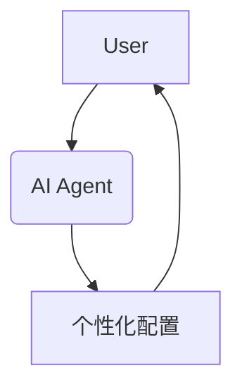
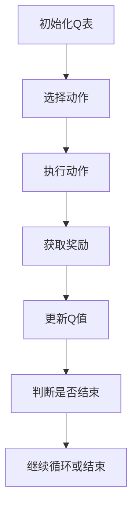
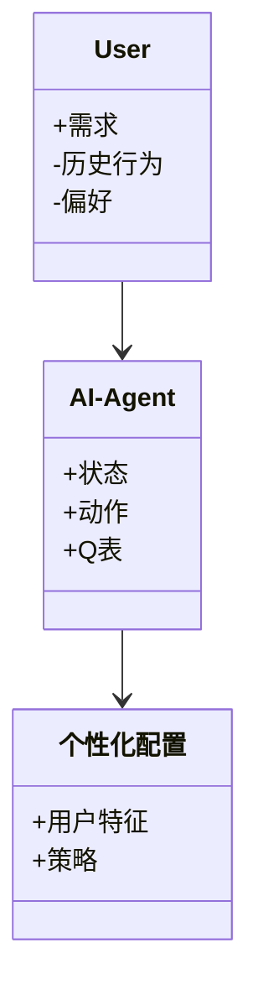
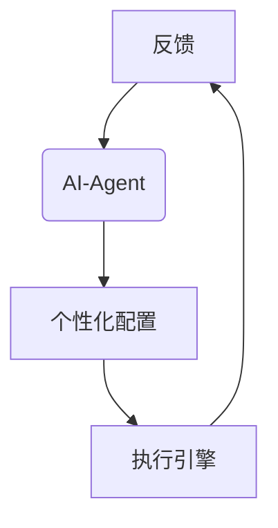
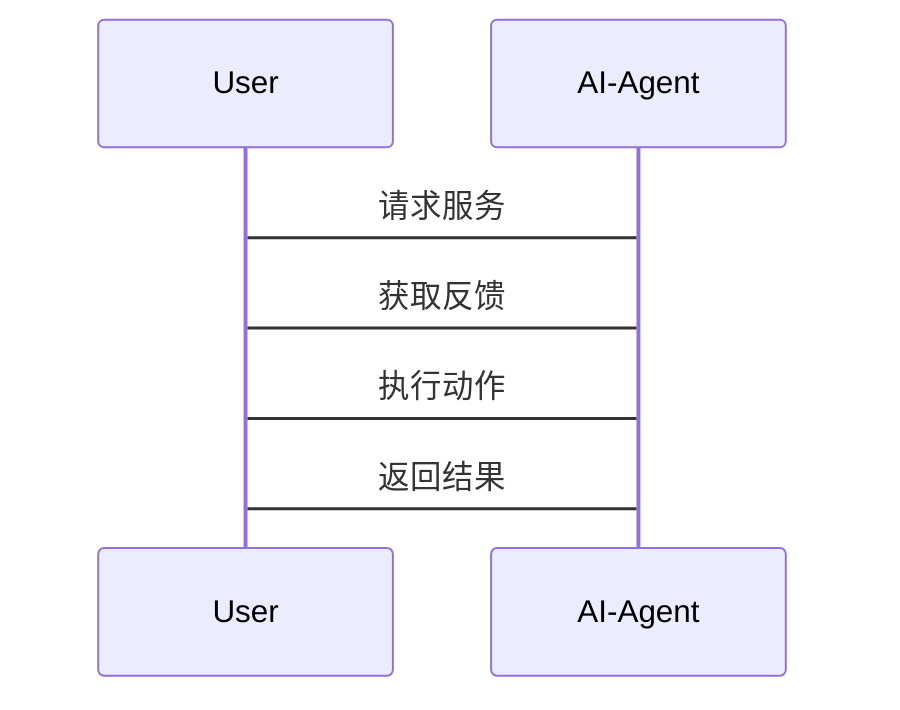
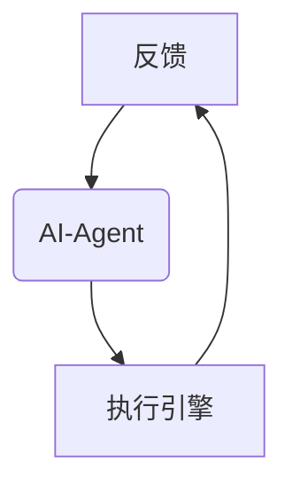

                 


# AI Agent的个性化与定制化实现

## 关键词：
AI Agent、个性化、定制化、机器学习、强化学习、系统架构

## 摘要：
AI Agent的个性化与定制化实现是当前人工智能领域的重要研究方向。本文将从AI Agent的基本概念出发，探讨个性化与定制化的需求背景，详细分析其核心原理，结合强化学习算法，通过系统架构设计和实际项目案例，展示如何实现个性化与定制化的AI Agent。文章最后总结了实现中的关键点和注意事项，为读者提供全面的指导。

---

# 第1章: AI Agent 的背景与概念

## 1.1 AI Agent 的基本概念

### 1.1.1 什么是 AI Agent
AI Agent（人工智能代理）是指能够感知环境、做出决策并执行任务的智能实体。它能够通过与用户的交互或环境的反馈，自主地完成特定目标。

### 1.1.2 AI Agent 的核心特征
- **自主性**：能够在没有外部干预的情况下运行。
- **反应性**：能够实时感知环境并做出反应。
- **目标导向**：通过优化目标函数来实现特定目标。
- **学习能力**：能够通过经验改进自身的性能。

### 1.1.3 AI Agent 的应用场景
- **智能助手**：如 Siri、Alexa，帮助用户完成日常任务。
- **推荐系统**：根据用户行为推荐个性化内容。
- **自动驾驶**：通过感知环境实现自主驾驶。

---

## 1.2 个性化与定制化的需求背景

### 1.2.1 个性化需求的兴起
随着人工智能技术的发展，用户对个性化服务的需求日益增长。个性化不仅提升了用户体验，还能够提高产品的市场竞争力。

### 1.2.2 定制化 AI Agent 的必要性
用户的需求千差万别，通用的AI Agent难以满足所有用户的个性化需求。因此，定制化的AI Agent能够为用户提供更精准的服务。

### 1.2.3 个性化与定制化的区别与联系
个性化强调根据用户的偏好进行调整，而定制化则是根据具体需求进行量身打造。两者相辅相成，共同实现用户的个性化需求。

---

## 1.3 当前 AI Agent 的发展现状

### 1.3.1 知名 AI Agent 产品概述
- **Siri**：苹果公司的智能助手，支持语音交互和任务执行。
- **AlphaGo**：由DeepMind开发，通过强化学习在围棋领域取得突破。
- **特斯拉自动驾驶**：通过环境感知和决策实现自动驾驶功能。

### 1.3.2 个性化与定制化在 AI Agent 中的应用实例
- **推荐系统**：根据用户的喜好推荐内容。
- **智能助手**：根据用户的习惯优化服务流程。

### 1.3.3 未来发展趋势
AI Agent将更加智能化和个性化，通过深度学习和强化学习不断提升性能，满足用户的多样化需求。

---

# 第2章: AI Agent 的核心概念与联系

## 2.1 AI Agent 的核心原理

### 2.1.1 感知模块
AI Agent通过传感器或数据输入感知环境，获取必要的信息。

### 2.1.2 决策模块
基于感知的信息，AI Agent通过算法做出决策，选择最优动作。

### 2.1.3 执行模块
将决策结果转化为具体动作，执行任务并反馈结果。

## 2.2 定制化与个性化的核心要素

### 2.2.1 用户需求分析
通过数据采集和分析，了解用户的个性化需求。

### 2.2.2 数据采集与处理
收集用户行为数据，进行清洗、预处理和特征提取。

### 2.2.3 算法选择与优化
根据需求选择合适的算法，并通过调参优化性能。

## 2.3 核心概念的联系

### 2.3.1 用户需求与 AI Agent 的匹配关系
用户需求驱动AI Agent的行为，AI Agent通过反馈优化服务。

### 2.3.2 数据、算法与个性化输出的关联
数据为个性化提供依据，算法实现个性化，输出满足用户需求。

### 2.3.3 定制化过程中的动态调整机制
根据用户反馈实时调整AI Agent的行为，确保服务的精准性。

---

## 2.3.4 用户与 AI Agent 的关系图



---

# 第3章: AI Agent 的算法原理

## 3.1 算法原理概述

### 3.1.1 基于强化学习的个性化推荐
通过强化学习算法，AI Agent能够根据用户反馈不断优化推荐策略。

### 3.1.2 基于监督学习的定制化模型训练
利用监督学习算法，训练个性化模型，满足用户的特定需求。

### 3.1.3 混合算法在个性化实现中的应用
结合强化学习和监督学习，实现更精准的个性化服务。

---

## 3.2 强化学习算法的实现流程

### 3.2.1 状态空间的定义
状态空间是AI Agent所处环境的所有可能状态的集合。

### 3.2.2 动作空间的构建
动作空间是AI Agent在每个状态下可以执行的所有动作的集合。

### 3.2.3 奖励机制的设计
奖励机制用于衡量AI Agent的行为是否符合预期目标。

---

## 3.3 算法实现的数学模型

### 3.3.1 Q-learning 算法的数学公式
$$ Q(s,a) = (1-\alpha) Q(s,a) + \alpha (r + \max Q(s',a')) $$

其中：
- \( Q(s,a) \) 表示状态 \( s \) 和动作 \( a \) 的Q值。
- \( \alpha \) 是学习率。
- \( r \) 是奖励值。
- \( \max Q(s',a') \) 是下一个状态的最大Q值。

### 3.3.2 策略梯度算法的优化目标
$$ \theta_{t+1} = \theta_t + \alpha (r \nabla_\theta \log \pi_\theta(a|s)) $$

其中：
- \( \theta \) 是参数向量。
- \( \alpha \) 是学习率。
- \( r \) 是奖励值。
- \( \nabla_\theta \log \pi_\theta(a|s) \) 是策略梯度。

---

## 3.4 强化学习算法的实现流程图



---

## 3.5 个性化推荐系统的实现代码

```python
import numpy as np
import random

class AI-Agent:
    def __init__(self, state_space, action_space):
        self.state_space = state_space
        self.action_space = action_space
        self.Q = np.zeros((state_space, action_space))

    def choose_action(self, state, epsilon=0.1):
        if random.random() < epsilon:
            return random.randint(0, self.action_space - 1)
        return np.argmax(self.Q[state, :])

    def update_Q(self, state, action, reward, next_state, gamma=0.99):
        self.Q[state, action] = self.Q[state, action] + \
            gamma * (reward + np.max(self.Q[next_state, :]) - self.Q[state, action])

# 示例代码
agent = AI-Agent(5, 3)
state = 0
action = agent.choose_action(state)
next_state = ...  # 根据动作和环境反馈得到下一个状态
reward = ...  # 环境给予的奖励
agent.update_Q(state, action, reward, next_state)
```

---

# 第4章: AI Agent 的系统架构与设计

## 4.1 系统架构设计

### 4.1.1 系统功能模块
- **用户需求分析模块**：收集用户需求并进行分析。
- **个性化配置模块**：根据用户需求生成个性化配置。
- **执行引擎模块**：根据配置执行具体任务。

### 4.1.2 系统功能设计



---

## 4.2 系统架构设计图



---

## 4.3 系统接口设计

### 4.3.1 接口描述
- **输入接口**：接收用户的请求和环境反馈。
- **输出接口**：输出AI Agent的动作和结果。

### 4.3.2 接口交互流程



---

## 4.4 系统交互流程图



---

# 第5章: 项目实战

## 5.1 环境安装与配置

### 5.1.1 安装必要的库
```bash
pip install numpy matplotlib
```

### 5.1.2 环境配置
设置随机种子，确保实验结果可重复。

---

## 5.2 系统核心实现

### 5.2.1 核心代码实现

```python
import numpy as np
import random

def main():
    # 初始化参数
    state_space = 5
    action_space = 3
    agent = AI-Agent(state_space, action_space)
    epsilon = 0.1
    gamma = 0.99

    # 训练过程
    for episode in range(1000):
        state = random.randint(0, state_space-1)
        action = agent.choose_action(state, epsilon)
        next_state = ...  # 根据动作和环境反馈得到下一个状态
        reward = ...  # 环境给予的奖励
        agent.update_Q(state, action, reward, next_state, gamma)

if __name__ == "__main__":
    main()
```

---

## 5.3 代码解读与分析

### 5.3.1 代码功能解读
- 初始化AI Agent，定义状态空间和动作空间。
- 在每个训练 episode 中，随机选择一个初始状态。
- 根据 epsilon-greedy 策略选择动作，执行动作并更新Q表。

### 5.3.2 代码优化建议
- 增加经验回放机制，提升训练效率。
- 调整学习率和折扣因子，优化算法性能。

---

## 5.4 实际案例分析

### 5.4.1 案例背景
以个性化推荐系统为例，展示如何实现一个定制化的推荐引擎。

### 5.4.2 案例实现

```python
import numpy as np

def recommend(user_id, items):
    # 获取用户偏好
    user_preferences = get_user_preferences(user_id)
    # 计算推荐得分
    scores = {item: np.dot(user_preferences, item_features[item]) for item in items}
    # 排序并返回Top-N推荐
    return sorted(scores.items(), key=lambda x: -x[1])[:5]

recommend(123, items_list)
```

### 5.4.3 案例分析
通过分析推荐结果，评估算法的性能，并根据反馈不断优化推荐策略。

---

## 5.5 项目小结

### 5.5.1 项目总结
实现了一个定制化的AI Agent，能够根据用户需求动态调整推荐策略。

### 5.5.2 成功经验
- 算法选择得当。
- 数据处理高效。
- 系统架构合理。

### 5.5.3 可能的问题
- 数据稀疏性问题。
- 算法收敛速度慢。
- 系统扩展性不足。

---

# 第6章: 最佳实践与小结

## 6.1 实现中的关键点

### 6.1.1 数据多样性
确保数据多样性，避免过拟合。

### 6.1.2 算法选择
根据需求选择合适的算法，避免使用过时的方法。

### 6.1.3 系统优化
优化系统架构，提升性能和扩展性。

---

## 6.2 注意事项

### 6.2.1 数据安全
确保用户数据的安全性，避免泄露。

### 6.2.2 算法透明度
保持算法的透明度，便于调试和优化。

### 6.2.3 系统稳定性
确保系统的稳定性，避免因故障导致服务中断。

---

## 6.3 拓展阅读

### 6.3.1 推荐书籍
- 《强化学习（Deep Reinforcement Learning）》
- 《机器学习实战》

### 6.3.2 在线资源
- [AI Agent 开源项目](https://github.com/...)
- [强化学习教程](https://www.tutorialspoint.com/)

---

# 作者：AI天才研究院 & 禅与计算机程序设计艺术

---

通过本文的详细讲解，读者可以深入了解AI Agent的个性化与定制化实现，并通过实际案例掌握相关技术。希望本文能够为读者提供有价值的参考和启发，帮助他们在AI Agent领域取得更大的进展。

