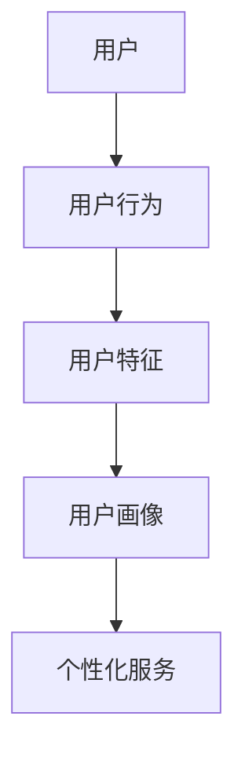
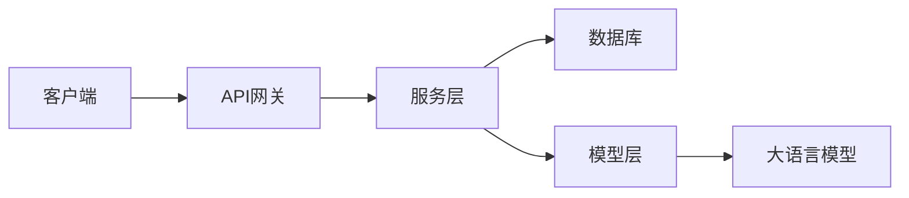

                 

# AI Agent的个性化：基于LLM的用户画像构建

> 关键词：AI Agent, 用户画像, 大语言模型, 个性化服务, 机器学习

> 摘要：本文探讨了基于大语言模型（LLM）的AI Agent个性化服务中的用户画像构建方法。从理论基础到算法实现，详细分析了如何利用LLM技术构建精准的用户画像，并结合实际案例展示了其在个性化服务中的应用。

---

## 第一部分: AI Agent个性化与用户画像构建背景

### 第1章: AI Agent与个性化概述

#### 1.1 AI Agent的基本概念
- **AI Agent**（人工智能代理）是指能够感知环境、自主决策并执行任务的智能实体。它可以是一个软件程序，也可以是一个物理设备，其核心目标是通过智能化手段为用户提供高效、个性化的服务。
- **个性化服务**是AI Agent的核心价值所在，它通过分析用户的行为、偏好和需求，提供定制化的解决方案。例如，智能音箱可以根据用户的习惯推荐音乐，智能助手可以根据用户的日程安排提醒重要事项。
- **用户画像**是个性化服务的基础。它通过收集和分析用户的行为数据，构建出一个全面、动态的用户信息模型，帮助AI Agent更好地理解和满足用户需求。

#### 1.2 基于LLM的AI Agent发展现状
- **大语言模型（LLM）**的崛起为AI Agent的个性化能力提供了强大的技术支持。LLM能够处理海量文本数据，理解上下文，并生成自然流畅的语言，这使其成为构建智能对话系统和个性化推荐系统的理想工具。
- **基于LLM的AI Agent的优势**包括：
  1. **强大的自然语言处理能力**：能够理解用户的意图和情感。
  2. **动态适应能力**：可以根据用户反馈实时调整响应策略。
  3. **跨领域应用**：适用于客服、教育、医疗等多个领域。
- **技术挑战**包括数据隐私、模型训练成本高以及如何平衡个性化与通用性等问题。

### 第2章: 用户画像构建的背景与意义

#### 2.1 用户画像的定义与分类
- **用户画像是**对用户行为、偏好、特征等信息的综合描述，通常以数据结构或图表的形式呈现。它不仅是用户身份的数字化表达，也是个性化服务的核心依据。
- **用户画像的分类**可以基于数据来源、应用场景和时间维度进行划分：
  1. **基于数据来源**：包括用户行为数据、用户属性数据、用户反馈数据等。
  2. **基于应用场景**：如电商用户画像、社交网络用户画像、教育领域用户画像等。
  3. **基于时间维度**：静态用户画像是基于历史数据构建的，而动态用户画像是实时更新的。
- **用户画像与个性化服务的关系**是密不可分的。个性化服务需要基于用户画像进行精准推荐，而用户画像是通过个性化服务不断优化和更新的。

#### 2.2 基于LLM的用户画像构建背景
- **LLM在用户画像中的优势**：大语言模型能够从大量文本数据中提取用户的兴趣、情感和意图，从而构建更全面、更精准的用户画像。
- **当前用户画像构建的技术挑战**包括数据隐私问题、数据质量和模型的可解释性问题。
- **基于LLM的用户画像构建的创新点**：通过结合自然语言处理技术，将用户的文本行为数据（如聊天记录、社交媒体互动）与传统数据（如点击行为、购买记录）相结合，构建更丰富的用户画像。

---

## 第二部分: 基于LLM的用户画像构建核心概念与联系

### 第3章: LLM与用户画像的关系

#### 3.1 LLM的基本原理
- **大语言模型的训练目标**是通过最大化条件概率来预测下一个词。公式如下：
  $$P(w_{n}|w_{1}, w_{2}, ..., w_{n-1})$$
  其中，$w_i$ 表示第i个词。
- **LLM的输出特性**：生成的文本具有连贯性、相关性和可解释性。这些特性使其非常适合用于用户意图识别和画像构建。
- **LLM在用户画像中的应用潜力**：通过分析用户的语言行为（如对话记录、评论），提取用户的兴趣、情感和需求，从而丰富用户画像的信息维度。

#### 3.2 用户画像构建的核心要素
- **用户画像的维度**：通常包括用户的基本属性（如年龄、性别）、行为特征（如浏览频率、点击路径）、兴趣偏好（如喜欢的品类、主题）和情感倾向（如积极、消极）。
- **用户行为数据与画像构建的关系**：行为数据是构建用户画像的主要来源，通过分析用户的行为轨迹，可以推断出用户的兴趣和需求。
- **用户画像的动态更新机制**：用户的行为和偏好是动态变化的，因此用户画像是一个动态更新的过程，需要实时跟踪用户的最新行为并调整画像内容。

#### 3.3 基于LLM的用户画像构建的实体关系图

---

## 第三部分: 基于LLM的用户画像构建算法原理

### 第4章: LLM的训练与优化

#### 4.1 LLM的训练目标
- **概率最大化目标**：通过最大化条件概率来优化模型参数。公式如下：
  $$\text{Loss} = -\sum_{i=1}^{n} \log p(w_i | w_{i-1}, \ldots, w_1)$$
  其中，$w_i$ 表示第i个词，$p(w_i | w_{i-1}, \ldots, w_1)$ 表示在给定前缀的情况下生成词$w_i$的概率。
- **交叉熵损失函数**：是常用的损失函数，用于衡量模型预测值与真实值之间的差异。
- **模型优化**：通过反向传播算法（如梯度下降）优化模型参数，降低损失函数值。

#### 4.2 基于LLM的用户画像构建算法
- **用户数据的预处理**：包括数据清洗、特征提取和数据增强。例如，将用户的文本行为数据进行分词、去除停用词，并转化为数值表示。
- **模型训练**：将用户数据输入到预训练的LLM中，进行微调（Fine-tuning）。例如，使用用户的对话记录训练模型，使其能够更好地理解用户的意图。
- **用户画像生成**：通过分析模型的输出，提取用户的兴趣、情感和需求，构建用户画像。

---

## 第四部分: 基于LLM的用户画像构建系统设计

### 第5章: 系统功能设计

#### 5.1 系统功能模块
- **数据采集模块**：负责收集用户的文本行为数据，如聊天记录、评论、搜索关键词等。
- **数据处理模块**：对采集到的数据进行清洗、标注和转换，生成适合模型训练的格式。
- **模型训练模块**：基于LLM进行用户画像的构建，输出用户画像数据。
- **个性化服务模块**：根据用户画像提供个性化推荐、智能对话等服务。

#### 5.2 系统架构设计

---

## 第五部分: 项目实战

### 第6章: 项目实现

#### 6.1 环境安装
- 安装必要的Python库，如`transformers`、`torch`等。
- 配置GPU环境，加速模型训练。

#### 6.2 核心功能实现
- **用户数据预处理**：将用户的文本数据进行分词、去停用词和向量化处理。
- **模型训练**：使用预训练的LLM进行微调，构建用户画像。
- **个性化推荐**：根据用户画像生成个性化推荐结果。

#### 6.3 实际案例分析
- 以电商场景为例，展示如何基于用户画构建个性化推荐系统。

---

## 第六部分: 总结与展望

### 第7章: 总结

- **文章小结**：本文详细探讨了基于LLM的用户画像构建方法，从理论到实践，全面分析了其在AI Agent个性化服务中的应用。
- **注意事项**：在实际应用中，需要注意数据隐私保护、模型的可解释性和系统的可扩展性问题。
- **拓展阅读**：推荐进一步学习大语言模型的微调技术、用户画像的动态更新方法以及个性化推荐算法。

---

作者：AI天才研究院/AI Genius Institute & 禅与计算机程序设计艺术 /Zen And The Art of Computer Programming

