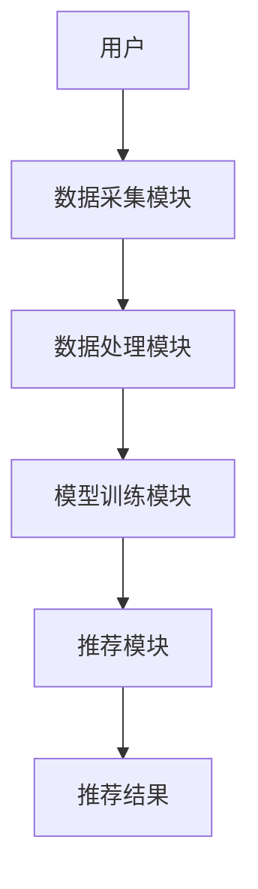
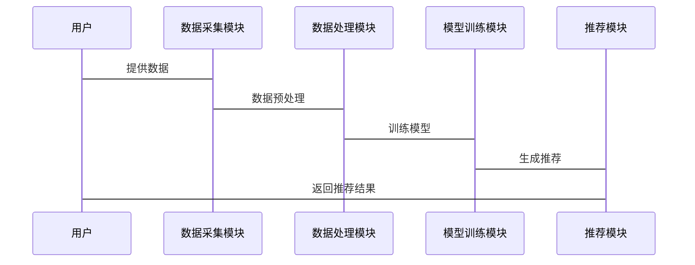

                 


```markdown
# AI Agent的个性化：用户画像与偏好学习

> 关键词：AI Agent, 用户画像, 偏好学习, 个性化推荐, 机器学习, 人工智能, 数据分析

> 摘要：本文深入探讨了AI Agent的个性化实现，重点分析了用户画像和偏好学习的核心原理与应用方法。通过详细的技术分析和实际案例，本文揭示了如何利用用户画像和偏好学习技术构建高效的个性化AI Agent系统，为开发者和研究人员提供了理论与实践的双重指导。

---

# 第1章: AI Agent的个性化需求与背景

## 1.1 AI Agent的基本概念

### 1.1.1 AI Agent的定义
AI Agent（人工智能代理）是一种能够感知环境、执行任务并做出决策的智能实体。它可以是一个软件程序、一个机器人，甚至是嵌入在设备中的算法。

### 1.1.2 AI Agent的核心特点
- **自主性**：能够独立决策和行动。
- **反应性**：能够实时感知环境变化并做出反应。
- **学习能力**：能够通过数据和经验提升自身的性能。
- **社交能力**：能够与其他Agent或用户进行交互。

### 1.1.3 AI Agent的应用场景
- **推荐系统**：为用户提供个性化的内容推荐。
- **智能助手**：如Siri、Alexa等，帮助用户完成日常任务。
- **自动驾驶**：通过感知环境和决策系统实现自主驾驶。

---

## 1.2 用户画像与偏好学习的背景

### 1.2.1 用户画像的定义
用户画像是通过对用户行为、属性等数据的分析，构建出的用户特征模型。它能够帮助AI Agent更好地理解用户需求。

### 1.2.2 偏好学习的定义
偏好学习是一种通过学习用户行为或反馈，推断出用户偏好的过程。它是实现个性化推荐的核心技术。

### 1.2.3 AI Agent中的个性化需求
- **动态适应**：用户的偏好可能会随时间变化。
- **个性化推荐**：基于用户画像和偏好，提供精准的内容或服务。
- **高效决策**：通过用户画像和偏好，快速做出符合用户需求的决策。

---

# 第2章: 用户画像的构建与分析

## 2.1 用户数据的采集与处理

### 2.1.1 数据来源
- **用户行为数据**：用户的点击、浏览、购买等行为。
- **用户属性数据**：用户的年龄、性别、职业等信息。
- **外部数据**：通过第三方API获取的用户信息。

### 2.1.2 数据预处理
- **数据清洗**：处理缺失值、异常值。
- **数据转换**：将非结构化数据转换为结构化数据。
- **数据标准化**：对数据进行归一化处理。

### 2.1.3 数据存储
- **数据库存储**：使用关系型数据库或NoSQL数据库存储用户数据。
- **数据仓库**：将数据存入数据仓库，便于后续分析。

---

## 2.2 用户特征的提取与建模

### 2.2.1 用户行为分析
- **行为频率**：用户在特定时间段内的行为频率。
- **行为模式**：用户在不同场景下的行为习惯。
- **行为序列**：用户的操作顺序。

### 2.2.2 用户属性分析
- **基本属性**：性别、年龄、地区等。
- **兴趣属性**：用户的兴趣爱好、消费习惯。

### 2.2.3 用户画像的构建
- **画像构建步骤**：
  1. 数据采集与预处理。
  2. 特征提取与选择。
  3. 模型训练与优化。
  4. 画像可视化与验证。

---

## 2.3 用户画像的可视化与应用

### 2.3.1 可视化工具
- **图表工具**：如Tableau、Power BI。
- **机器学习库**：如scikit-learn、TensorFlow。

### 2.3.2 应用场景
- **精准营销**：根据用户画像制定营销策略。
- **个性化推荐**：基于用户画像推荐相关内容。
- **用户体验优化**：通过用户画像改善产品设计。

---

## 2.4 本章小结

---

# 第3章: 偏好学习的原理与方法

## 3.1 偏好学习的定义与特点

### 3.1.1 偏好学习的定义
偏好学习是通过学习用户的偏好信息，推断出用户的决策偏好。

### 3.1.2 偏好学习的特点
- **动态性**：用户偏好可能随时间变化。
- **多样性**：不同用户可能有不同的偏好。
- **复杂性**：偏好可能涉及多个维度。

---

## 3.2 偏好表示与建模

### 3.2.1 偏好表示方法
- **显式表示**：直接通过标签或评分表示偏好。
- **隐式表示**：通过用户行为推断偏好。

### 3.2.2 偏好建模方法
- **基于协同过滤的偏好建模**：
  - **用户-物品矩阵**：构建用户与物品的交互矩阵。
  - **相似度计算**：使用余弦相似度或Jaccard系数计算用户相似度。

- **基于内容的偏好建模**：
  - **文本分析**：通过NLP技术分析物品内容。
  - **特征匹配**：根据用户偏好特征匹配相关物品。

### 3.2.3 偏好学习的数学模型

#### 3.2.3.1 协同过滤模型
$$ sim(i, j) = \frac{\sum_{k} (r_{ik} - \bar{r_i})(r_{jk} - \bar{r_j})}{\sqrt{\sum_{k} (r_{ik} - \bar{r_i})^2} \cdot \sqrt{\sum_{k} (r_{jk} - \bar{r_j})^2}} $$

#### 3.2.3.2 基于矩阵分解的偏好建模
$$ X = U \cdot V^T $$

---

## 3.3 偏好学习的算法实现

### 3.3.1 算法选择
- **基于相似度的推荐算法**：如余弦相似度、Jaccard系数。
- **基于矩阵分解的推荐算法**：如协同过滤、矩阵奇异值分解（SVD）。

### 3.3.2 算法实现步骤
1. **数据预处理**：处理缺失值、归一化。
2. **特征提取**：提取用户和物品的特征向量。
3. **模型训练**：训练偏好建模的数学模型。
4. **偏好预测**：根据模型预测用户的偏好。

---

## 3.4 本章小结

---

# 第4章: 用户画像与偏好学习的融合

## 4.1 融合方法概述

### 4.1.1 融合目标
通过结合用户画像和偏好学习，提升AI Agent的个性化能力。

### 4.1.2 融合策略
- **特征增强**：将偏好特征加入用户画像中。
- **联合建模**：构建跨领域的联合模型。

---

## 4.2 融合方法的具体实现

### 4.2.1 基于协同过滤的融合方法
1. **构建用户画像**：提取用户的基本属性和行为特征。
2. **构建偏好模型**：基于协同过滤算法构建偏好模型。
3. **融合策略**：将用户画像和偏好模型的结果进行融合，生成最终的个性化推荐。

### 4.2.2 基于深度学习的融合方法
1. **构建深度学习模型**：如神经网络、循环神经网络。
2. **特征嵌入**：将用户画像和偏好特征嵌入到模型中。
3. **模型训练**：通过反向传播算法训练模型。
4. **结果预测**：通过模型预测用户的偏好。

---

## 4.3 实验与结果分析

### 4.3.1 实验设计
- **数据集选择**：选择合适的用户数据集。
- **实验指标**：如准确率、召回率、F1值。

### 4.3.2 实验结果
- **融合方法的效果对比**：比较不同融合方法的性能。
- **模型的鲁棒性分析**：分析模型在不同数据量下的表现。

---

## 4.4 本章小结

---

# 第5章: 个性化推荐系统实现

## 5.1 推荐系统的构建

### 5.1.1 推荐系统的类型
- **基于内容的推荐**：根据物品的属性推荐。
- **基于协同过滤的推荐**：根据用户行为推荐。
- **混合推荐**：结合多种推荐方法。

### 5.1.2 推荐系统的实现步骤
1. **数据预处理**：清洗和归一化数据。
2. **特征提取**：提取用户和物品的特征。
3. **模型训练**：训练推荐模型。
4. **结果预测**：生成推荐列表。

---

## 5.2 基于用户画像的推荐实现

### 5.2.1 推荐策略
- **基于用户属性的推荐**：根据用户的性别、年龄等属性推荐。
- **基于用户行为的推荐**：根据用户的浏览、点击行为推荐。

### 5.2.2 实现代码示例
```python
def recommend(user_id):
    # 获取用户画像
    user_profile = get_user_profile(user_id)
    # 获取用户偏好
    user_preference = get_user_preference(user_id)
    # 基于画像和偏好生成推荐列表
    recommendations = generate_recommendations(user_profile, user_preference)
    return recommendations
```

---

## 5.3 基于偏好的推荐实现

### 5.3.1 推荐策略
- **基于相似用户的推荐**：找到与当前用户相似的用户，推荐他们喜欢的内容。
- **基于物品特征的推荐**：根据物品的特征和用户偏好推荐。

### 5.3.2 实现代码示例
```python
def get_similar_users(user_id):
    # 获取用户画像
    user_profile = get_user_profile(user_id)
    # 计算相似用户
    similar_users = find_similar_users(user_profile)
    return similar_users
```

---

## 5.4 实验与结果分析

### 5.4.1 实验设计
- **实验目标**：比较不同推荐方法的性能。
- **实验指标**：准确率、召回率、F1值。

### 5.4.2 实验结果
- **推荐方法的效果对比**：比较基于用户画像和基于偏好的推荐方法的性能。
- **模型的稳定性分析**：分析模型在不同数据量下的表现。

---

## 5.5 本章小结

---

# 第6章: 系统架构与实现

## 6.1 系统架构设计

### 6.1.1 系统功能模块
- **数据采集模块**：采集用户数据。
- **数据处理模块**：处理和预处理数据。
- **模型训练模块**：训练用户画像和偏好模型。
- **推荐模块**：生成个性化推荐。

### 6.1.2 系统架构图


---

## 6.2 系统实现细节

### 6.2.1 数据预处理实现
- **数据清洗**：处理缺失值、异常值。
- **数据转换**：将非结构化数据转换为结构化数据。

### 6.2.2 模型训练实现
- **特征提取**：使用TF-IDF提取文本特征。
- **模型训练**：使用随机森林、梯度提升树等模型训练用户画像和偏好模型。

---

## 6.3 系统接口设计

### 6.3.1 接口定义
- **数据接口**：数据采集模块与数据处理模块之间的接口。
- **模型接口**：模型训练模块与推荐模块之间的接口。

### 6.3.2 接口实现
```python
# 数据接口
def get_user_data():
    # 返回用户数据
    pass

# 模型接口
def get_recommendations(user_id):
    # 返回推荐结果
    pass
```

---

## 6.4 系统交互流程

### 6.4.1 交互流程图


---

## 6.5 本章小结

---

# 第7章: 项目实战与案例分析

## 7.1 项目背景

### 7.1.1 项目目标
构建一个基于用户画像和偏好学习的个性化推荐系统。

### 7.1.2 项目需求
- **数据采集**：收集用户行为数据和属性数据。
- **数据处理**：清洗和预处理数据。
- **模型训练**：训练用户画像和偏好模型。
- **推荐生成**：生成个性化推荐列表。

---

## 7.2 项目实现

### 7.2.1 环境安装
```bash
pip install numpy pandas scikit-learn matplotlib
```

### 7.2.2 核心代码实现
```python
# 用户画像构建
def build_user_profile(users):
    # 提取用户属性和行为特征
    profiles = []
    for user in users:
        profile = {
            'age': user.age,
            'gender': user.gender,
            'interests': user.interests
        }
        profiles.append(profile)
    return profiles

# 偏好模型训练
def train_preference_model(profiles):
    # 使用机器学习模型训练偏好模型
    model = ...
    model.fit(profiles)
    return model

# 个性化推荐
def generate_recommendations(user_id, model):
    # 根据用户ID和模型生成推荐
    recommendations = model.predict(user_id)
    return recommendations
```

---

## 7.3 案例分析

### 7.3.1 案例背景
假设我们有一个电商网站，需要为用户推荐商品。

### 7.3.2 数据分析
- **用户数据**：用户的年龄、性别、购买历史。
- **商品数据**：商品的类别、价格、评价。

### 7.3.3 实施步骤
1. **数据采集**：收集用户的基本信息和购买记录。
2. **数据处理**：清洗数据，处理缺失值。
3. **模型训练**：训练用户画像和偏好模型。
4. **推荐生成**：根据模型生成个性化推荐列表。

---

## 7.4 本章小结

---

# 第8章: 总结与展望

## 8.1 本文总结
本文详细探讨了AI Agent的个性化实现，重点分析了用户画像和偏好学习的核心原理与应用方法。通过理论分析和实际案例，揭示了如何利用这些技术构建高效的个性化推荐系统。

---

## 8.2 未来展望
- **模型优化**：探索更高效的用户画像和偏好学习方法。
- **多模态数据融合**：结合文本、图像等多种数据源，提升推荐效果。
- **实时推荐**：研究实时推荐的技术和方法。

---

# 作者：AI天才研究院 & 禅与计算机程序设计艺术

---

**注：以上内容为完整的技术博客文章框架，实际撰写时需要根据具体需求补充详细内容，确保每章节都有丰富的技术细节和案例分析。**
```

