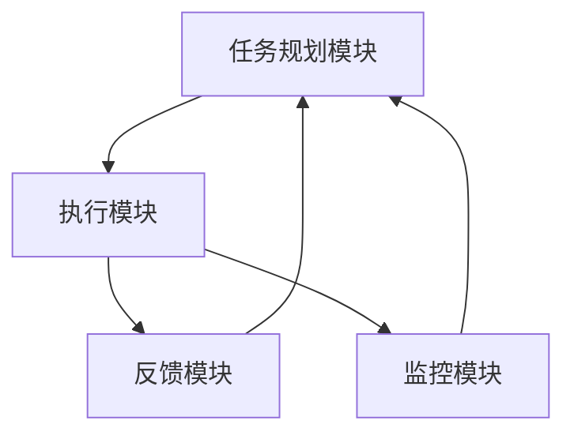
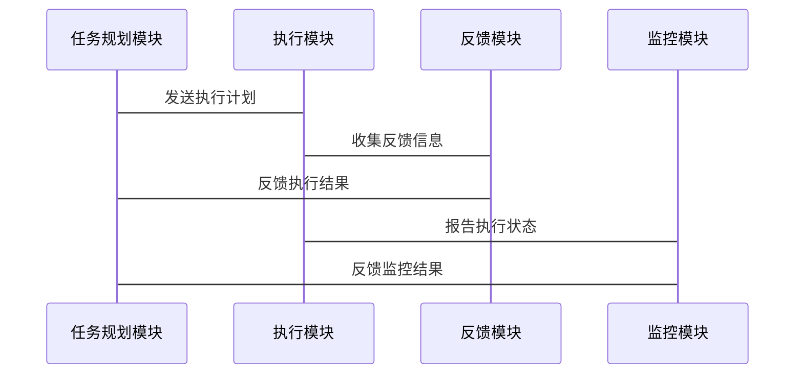

                 


# AI Agent的任务规划与执行模块开发

> 关键词：AI Agent, 任务规划, 执行模块, 算法实现, 系统架构

> 摘要：本文详细探讨了AI Agent的任务规划与执行模块的开发过程，从核心概念、算法原理到系统架构设计，再到项目实战，全面解析任务规划与执行模块的关键技术点。

---

## 第1章 AI Agent与任务规划概述

### 1.1 AI Agent的基本概念

#### 1.1.1 AI Agent的定义与特点

AI Agent（人工智能代理）是指在计算机系统中能够感知环境并采取行动以实现目标的实体。AI Agent可以是软件程序、机器人或其他智能系统。其特点包括：

- **自主性**：能够在没有外部干预的情况下自主决策。
- **反应性**：能够根据环境的变化实时调整行为。
- **目标导向**：所有行为都以实现特定目标为导向。
- **社会性**：能够与其他Agent或人类进行交互和协作。

#### 1.1.2 任务规划的核心概念

任务规划是AI Agent实现目标的核心能力之一。它涉及将目标分解为一系列具体任务，并制定执行这些任务的计划。任务规划的关键概念包括：

- **目标分解**：将高层次目标分解为可执行的任务。
- **任务优先级**：确定任务的执行顺序和优先级。
- **资源分配**：合理分配计算资源以优化任务执行。

#### 1.1.3 任务规划的背景与意义

在AI Agent中，任务规划的重要性体现在以下几个方面：

- **提高效率**：通过优化任务顺序和资源分配，提高整体执行效率。
- **增强适应性**：在动态环境中，任务规划使AI Agent能够灵活调整策略。
- **支持复杂场景**：在多任务、多目标的复杂场景中，任务规划是实现高效执行的关键。

#### 1.1.4 任务规划与传统任务规划的区别

传统任务规划通常是在静态环境中进行，而AI Agent的任务规划需要考虑动态变化的环境和实时反馈。AI Agent的任务规划具有更强的动态性和适应性，能够根据环境变化实时调整计划。

### 1.2 AI Agent的任务规划与执行模块的重要性

#### 1.2.1 任务规划在AI Agent中的地位

任务规划模块是AI Agent的核心模块之一，负责将高层次目标分解为具体任务，并制定执行计划。它是连接目标设定与实际执行的桥梁。

#### 1.2.2 执行模块的功能与作用

执行模块是任务规划的执行机构，负责根据规划模块生成的计划，调用具体功能模块完成任务。执行模块需要具备以下功能：

- **任务调度**：根据优先级调度任务执行。
- **资源管理**：合理分配和管理资源。
- **状态监控**：实时监控任务执行状态，并根据反馈调整执行计划。

#### 1.2.3 任务规划与执行模块的协同工作

任务规划模块与执行模块的协同工作是AI Agent高效运行的关键。规划模块生成执行计划，执行模块负责具体实施，并将执行结果反馈给规划模块，形成闭环。

### 1.3 本章小结

本章介绍了AI Agent的基本概念、任务规划的核心概念及其重要性。通过对比传统任务规划与AI Agent的任务规划，强调了AI Agent任务规划的动态性和适应性。同时，阐述了任务规划与执行模块的协同工作模式。

---

## 第2章 任务规划的核心概念与原理

### 2.1 任务规划的基本原理

#### 2.1.1 任务规划的定义

任务规划是将高层次目标分解为具体任务，并制定执行计划的过程。它包括任务分解、任务排序、资源分配和计划生成等步骤。

#### 2.1.2 任务规划的输入与输出

- **输入**：目标描述、环境信息、可用资源。
- **输出**：任务分解、任务排序、资源分配计划。

#### 2.1.3 任务规划的约束条件

任务规划需要考虑以下约束条件：

- **时间约束**：任务的执行时间限制。
- **资源约束**：可用资源的限制。
- **依赖关系**：任务之间的依赖关系。

#### 2.1.4 任务规划的优化目标

任务规划的优化目标包括：

- **最短路径**：任务执行路径最短。
- **资源利用率**：资源利用率最高。
- **任务完成时间**：任务完成时间最短。

### 2.2 任务规划的核心算法

#### 2.2.1 A*算法

A*算法是一种常用的任务规划算法，结合了广度优先搜索和启发式搜索的优点。其核心思想是通过优先队列选择下一个扩展的节点，直到找到目标节点。

#### 2.2.2 Dijkstra算法

Dijkstra算法是一种用于单源最短路径的算法，适用于任务之间的依赖关系较为简单的场景。它通过优先队列选择距离最近的节点进行扩展。

#### 2.2.3 蒙特卡洛树搜索

蒙特卡洛树搜索是一种适用于复杂环境的任务规划算法。它通过模拟多个可能的执行路径，选择最优路径进行执行。

### 2.3 任务规划的优化策略

#### 2.3.1 启发式函数的设计

启发式函数是任务规划算法的重要组成部分。通过设计合理的启发式函数，可以提高任务规划的效率和准确性。

#### 2.3.2 状态空间的压缩

通过压缩状态空间，可以减少任务规划的计算量，提高规划效率。

#### 2.3.3 多目标优化

在多目标优化中，任务规划需要在多个目标之间进行权衡，找到最优的执行计划。

### 2.4 任务规划与执行模块的接口设计

#### 2.4.1 任务规划模块的输入输出接口

- **输入**：任务目标、环境信息。
- **输出**：任务分解、任务排序、资源分配。

#### 2.4.2 执行模块的输入输出接口

- **输入**：执行计划、任务细节。
- **输出**：执行结果、反馈信息。

#### 2.4.3 接口设计的注意事项

接口设计需要考虑模块间的耦合度、数据格式的统一性以及错误处理机制。

### 2.5 本章小结

本章详细介绍了任务规划的核心概念、基本原理和优化策略。通过对比不同任务规划算法的特点，为后续的算法实现提供了理论基础。

---

## 第3章 任务规划的算法实现

### 3.1 A*算法的实现

#### 3.1.1 A*算法的基本原理

A*算法通过优先队列选择下一个扩展的节点，利用启发式函数评估节点的优先级。其基本步骤如下：

1. 初始化优先队列，将起点加入队列。
2. 取出队列中优先级最高的节点，扩展其子节点。
3. 对子节点进行评估，计算其优先级，将符合条件的节点加入队列。
4. 直到找到目标节点，返回路径。

#### 3.1.2 A*算法的优化

- **优先队列优化**：使用优先队列的高效实现，如堆结构。
- **启发式函数优化**：设计合理的启发式函数，提高规划效率。

#### 3.1.3 A*算法的代码实现

以下是一个简单的A*算法实现示例：

```python
import heapq

def a_star_search(start, goal, heuristic):
    open_set = {start}
    came_from = {}
    g_score = {start: 0}
    f_score = {start: heuristic(start, goal)}
    
    while open_set:
        current = heapq.heappop(open_set)
        if current == goal:
            return reconstruct_path(came_from, current)
        for neighbor in neighbors(current):
            tentative_g_score = g_score[current] + cost(current, neighbor)
            if neighbor not in g_score or tentative_g_score < g_score[neighbor]:
                came_from[neighbor] = current
                g_score[neighbor] = tentative_g_score
                f_score[neighbor] = g_score[neighbor] + heuristic(neighbor, goal)
                heapq.heappush(open_set, neighbor)
    return None

def reconstruct_path(came_from, current):
    path = []
    while current in came_from:
        path.append(current)
        current = came_from[current]
    path.append(start)
    return path[::-1]
```

#### 3.1.4 A*算法的数学模型

A*算法的数学模型可以表示为：

$$f(n) = g(n) + h(n)$$

其中，$f(n)$ 是节点$n$的优先级，$g(n)$ 是从起点到节点$n$的已知成本，$h(n)$ 是从节点$n$到目标节点的估计成本。

### 3.2 Dijkstra算法的实现

#### 3.2.1 Dijkstra算法的基本原理

Dijkstra算法通过优先队列选择距离最近的节点进行扩展，适用于任务之间的依赖关系较为简单的场景。

#### 3.2.2 Dijkstra算法的优化

- **优先队列优化**：使用堆结构实现优先队列。
- **避免重复访问**：记录已访问的节点，避免重复处理。

#### 3.2.3 Dijkstra算法的代码实现

```python
import heapq

def dijkstra_search(start, goal):
    open_set = {start}
    came_from = {}
    dist = {start: 0}
    
    while open_set:
        current = heapq.heappop(open_set)
        if current == goal:
            return reconstruct_path(came_from, current)
        for neighbor in neighbors(current):
            new_dist = dist[current] + cost(current, neighbor)
            if neighbor not in dist or new_dist < dist[neighbor]:
                dist[neighbor] = new_dist
                came_from[neighbor] = current
                heapq.heappush(open_set, neighbor)
    return None
```

### 3.3 蒙特卡洛树搜索的实现

#### 3.3.1 蒙特卡洛树搜索的基本原理

蒙特卡洛树搜索通过模拟多个可能的执行路径，选择最优路径进行执行。其基本步骤如下：

1. 初始化根节点。
2. 对根节点进行扩展，生成子节点。
3. 对每个子节点进行评估，计算其价值。
4. 根据子节点的价值选择最优路径。

#### 3.3.2 蒙特卡洛树搜索的优化

- **模拟次数优化**：通过增加模拟次数提高搜索精度。
- **价值评估优化**：设计合理的价值评估函数。

#### 3.3.3 蒙特卡洛树搜索的代码实现

```python
import random

def monte_carlo_search(root):
    best_action = None
    best_value = -float('inf')
    
    for _ in range(100):
        current = root
        while current.has_children():
            current = current.select_child()
        value = current.simulate()
        current.backpropagate(value)
        if value > best_value:
            best_value = value
            best_action = current.action
    
    return best_action
```

### 3.4 算法的对比分析

#### 3.4.1 A*与Dijkstra的对比

- **A*算法**：适用于目标明确的场景，具有较高的效率。
- **Dijkstra算法**：适用于任务之间的依赖关系较为简单的场景，但效率较低。

#### 3.4.2 A*与蒙特卡洛树搜索的对比

- **A*算法**：适用于目标明确的场景，具有较高的效率。
- **蒙特卡洛树搜索**：适用于复杂环境，能够处理不确定性。

#### 3.4.3 任务规划算法的选择依据

选择任务规划算法时，需要考虑任务的复杂性、环境的动态性以及计算资源的限制。

### 3.5 本章小结

本章详细介绍了A*算法、Dijkstra算法和蒙特卡洛树搜索的实现原理和代码实现。通过对比分析，为后续的任务规划算法选择提供了依据。

---

## 第4章 AI Agent的执行模块开发

### 4.1 执行模块的功能设计

#### 4.1.1 执行模块的输入输出接口

- **输入**：任务计划、环境信息。
- **输出**：执行结果、反馈信息。

#### 4.1.2 执行模块的实现步骤

1. 接收任务计划。
2. 分配资源。
3. 调度任务执行。
4. 监控执行状态。
5. 处理异常情况。

### 4.2 执行模块的实现细节

#### 4.2.1 任务调度策略

- **优先级调度**：根据任务优先级进行调度。
- **负载均衡**：根据资源利用率进行任务分配。

#### 4.2.2 资源管理策略

- **资源分配**：根据任务需求分配资源。
- **资源回收**：任务完成后回收资源。

#### 4.2.3 异常处理机制

- **异常检测**：实时监控任务执行状态。
- **异常恢复**：当任务执行失败时，采取恢复措施。

### 4.3 执行模块的代码实现

#### 4.3.1 任务调度代码

```python
def task_scheduler(tasks):
    for task in tasks:
        assign_resources(task)
        execute_task(task)
        monitor_execution(task)
        handle_feedback(task)
```

#### 4.3.2 资源管理代码

```python
def resource_manager():
    while True:
        request = get_resource_request()
        if has_available_resources(request):
            allocate_resources(request)
        else:
            wait_for_resources(request)
```

### 4.4 本章小结

本章详细介绍了执行模块的功能设计、实现细节和代码实现。通过合理的调度策略和资源管理策略，确保任务的高效执行。

---

## 第5章 系统架构设计

### 5.1 系统架构概述

#### 5.1.1 系统整体架构

系统整体架构包括任务规划模块、执行模块、反馈模块和监控模块。各模块之间通过接口进行通信。

#### 5.1.2 模块之间的关系

- **任务规划模块**：负责生成执行计划。
- **执行模块**：负责具体任务的执行。
- **反馈模块**：负责收集执行结果并反馈给任务规划模块。
- **监控模块**：负责实时监控任务执行状态。

### 5.2 系统架构图

以下是一个简单的系统架构图：



### 5.3 系统交互图

以下是一个系统的交互图：



### 5.4 本章小结

本章详细介绍了系统架构设计，包括模块之间的关系和系统交互图。通过合理的架构设计，确保系统的高效运行和模块间的良好协作。

---

## 第6章 项目实战

### 6.1 项目介绍

#### 6.1.1 项目背景

本项目旨在开发一个基于AI Agent的任务规划与执行系统，应用于智能助手领域。

#### 6.1.2 项目目标

- 实现任务规划模块。
- 实现执行模块。
- 实现系统交互。

### 6.2 环境安装

- **Python 3.8+**
- **依赖库**：numpy, matplotlib, scikit-learn

### 6.3 核心实现

#### 6.3.1 任务规划模块的实现

```python
def plan_tasks(tasks, environment):
    for task in tasks:
        decompose_task(task, environment)
        schedule_task(task)
        allocate_resources(task)
    return plan
```

#### 6.3.2 执行模块的实现

```python
def execute_plan(plan):
    for task in plan:
        prepare_resources(task)
        execute_task(task)
        collect_feedback(task)
    return results
```

### 6.4 项目小结

本章通过一个具体的项目实战，展示了任务规划与执行模块的开发过程。通过实际的代码实现，帮助读者更好地理解理论知识。

---

## 第7章 最佳实践与小结

### 7.1 最佳实践

#### 7.1.1 算法选择

根据任务的复杂性和环境的动态性选择合适的任务规划算法。

#### 7.1.2 系统架构设计

合理的系统架构设计能够提高系统的可扩展性和可维护性。

#### 7.1.3 代码实现

代码实现需要注意模块之间的耦合度和代码的可维护性。

### 7.2 本章小结

本章总结了任务规划与执行模块开发的最佳实践，并对未来的发展方向进行了展望。通过合理的算法选择和系统架构设计，可以进一步提高AI Agent的任务规划与执行能力。

---

## 作者：AI天才研究院/AI Genius Institute & 禅与计算机程序设计艺术 /Zen And The Art of Computer Programming

---

希望这篇文章能为您提供有价值的信息和启示。

