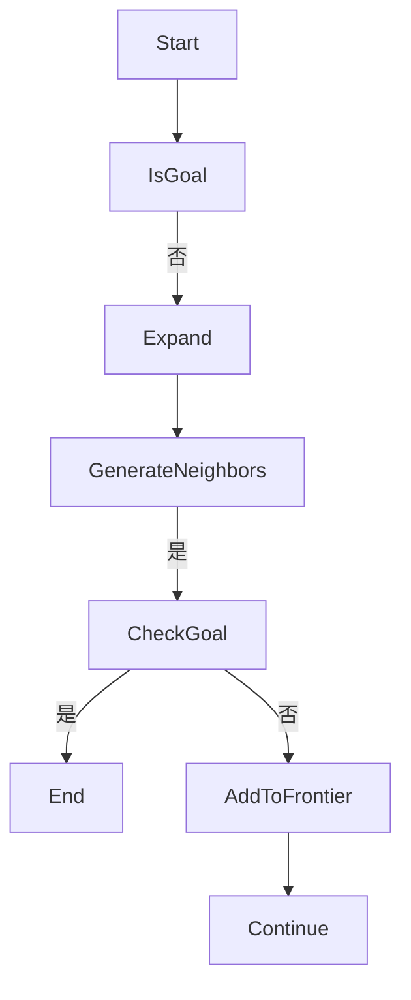
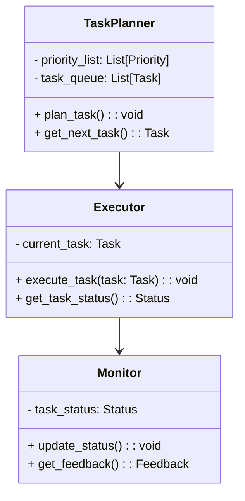
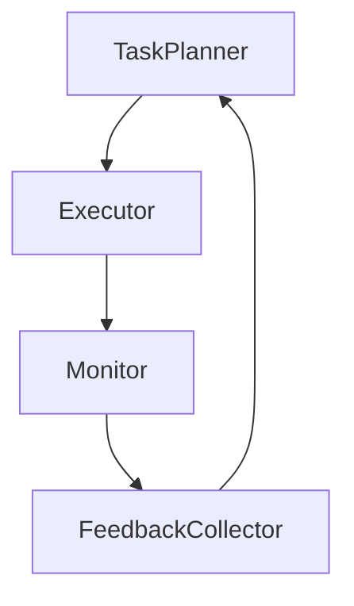
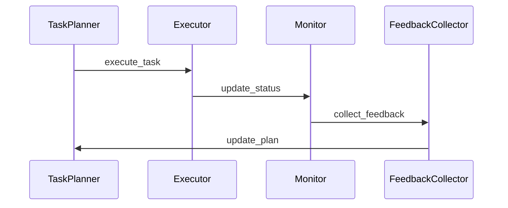

                 


```markdown
# AI Agent的任务规划与执行模块设计

> 关键词：AI Agent, 任务规划, 执行模块, 算法设计, 系统架构

> 摘要：本文系统地探讨了AI Agent的任务规划与执行模块的设计与实现。从基础概念到算法原理，从系统架构到项目实战，文章详细分析了任务规划与执行模块的核心要素、算法实现、系统设计以及实际应用。文章通过丰富的实例和详细的代码示例，帮助读者深入理解AI Agent任务规划与执行的原理和实践。

---

# 第1章: AI Agent任务规划与执行模块概述

## 1.1 AI Agent的基本概念
### 1.1.1 AI Agent的定义
AI Agent（智能体）是指能够感知环境、自主决策并执行任务的智能系统。它具备以下核心特征：
- **自主性**：无需外部干预，自主完成任务。
- **反应性**：能够实时感知环境并做出反应。
- **目标导向性**：基于目标进行决策和规划。

### 1.1.2 任务规划与执行模块的重要性
任务规划与执行模块是AI Agent的核心组成部分，负责将目标分解为具体任务，并制定执行计划。其重要性体现在：
- **提高效率**：通过合理的任务分解和调度，提升整体执行效率。
- **增强适应性**：在动态环境中灵活调整任务执行顺序。
- **确保目标达成**：通过精确的规划和执行，确保最终目标的实现。

### 1.1.3 模块的边界与外延
任务规划与执行模块的边界包括：
- **输入**：任务目标、环境信息。
- **输出**：任务执行计划、执行结果。
- **外部依赖**：环境感知模块、执行模块。

## 1.2 任务规划与执行模块的核心作用
### 1.2.1 任务分解
将复杂目标分解为多个子任务，例如：
- **全局目标**：完成一份季度报告。
- **子任务**：收集数据、撰写内容、校对修改。

### 1.2.2 任务优先级排序
根据任务的重要性和紧急性进行排序，例如：
- **紧急任务**：立即需要完成的任务。
- **重要任务**：对整体目标影响较大的任务。

### 1.2.3 任务调度
根据优先级和资源分配情况，制定任务执行顺序，例如：
- **资源约束**：任务执行需考虑CPU、内存等资源限制。
- **时间约束**：任务需在特定时间内完成。

## 1.3 本章小结
本章从AI Agent的基本概念出发，详细介绍了任务规划与执行模块的核心作用，包括任务分解、优先级排序和调度等内容，为后续章节奠定了基础。

---

# 第2章: 任务规划与执行模块的核心概念

## 2.1 任务分解的核心原理
### 2.1.1 分层任务网络（HTN）
HTN规划是一种自顶向下分解任务的方法，例如：
- **顶层任务**：完成项目交付。
- **子任务**：完成需求分析、设计文档撰写等。

### 2.1.2 分层任务网络的数学模型
任务分解的层次化结构可以用树状结构表示，例如：
$$
\text{项目交付} \rightarrow \{ \text{需求分析}, \text{设计文档撰写} \}
$$

## 2.2 任务优先级排序的实现方法
### 2.2.1 基于权重的排序方法
通过为每个任务分配权重，计算综合优先级，例如：
$$
\text{优先级} = \sum_{i=1}^{n} w_i \cdot t_i
$$
其中，\(w_i\)为任务权重，\(t_i\)为任务属性。

### 2.2.2 基于动态优先级的排序方法
在动态环境中，优先级随环境变化而调整，例如：
- **紧急任务优先**：优先处理紧急任务。
- **重要任务优先**：优先处理重要任务。

## 2.3 任务调度的核心机制
### 2.3.1 基于贪心算法的调度
贪心算法通过局部最优选择全局最优，例如：
- **先到先处理**：按照任务到达时间排序。
- **优先级调度**：按照任务优先级排序。

### 2.3.2 基于回溯算法的调度
回溯算法通过试探法寻找最优解，例如：
- **深度优先搜索**：尝试所有可能的调度组合，找到最优解。
- **广度优先搜索**：按层遍历所有可能的调度组合。

## 2.4 本章小结
本章详细探讨了任务分解、优先级排序和调度的核心概念，为后续算法实现奠定了理论基础。

---

# 第3章: 任务规划算法的数学模型与实现

## 3.1 A*算法的数学模型
### 3.1.1 启发函数设计
A*算法的启发函数 \(h(n)\) 衡量节点 \(n\) 到目标节点的剩余成本，例如：
$$
h(n) = \text{曼哈顿距离}(n, \text{目标节点})
$$

### 3.1.2 搜索空间建模
A*算法将任务空间建模为图结构，例如：
- **节点**：任务状态。
- **边**：任务转换。

### 3.1.3 优化策略
- **优先队列**：按优先级选择下一个节点。
- **剪枝策略**：避免重复访问节点。

## 3.2 基于A*算法的任务规划实现
### 3.2.1 算法实现步骤


### 3.2.2 Python代码实现
```python
import heapq

def a_star_search(graph, start, goal):
    open_set = {start}
    came_from = {}
    g_score = {start: 0}
    f_score = {start: heuristic(start, goal)}

    while open_set:
        current = heapq.heappop(open_set)
        if current == goal:
            return reconstruct_path(came_from, current)
        for neighbor in graph.neighbors(current):
            tentative_g_score = g_score[current] + graph.weight(current, neighbor)
            if neighbor not in g_score or tentative_g_score < g_score[neighbor]:
                came_from[neighbor] = current
                g_score[neighbor] = tentative_g_score
                f_score[neighbor] = g_score[neighbor] + heuristic(neighbor, goal)
                heapq.heappush(open_set, neighbor)
    return None

def heuristic(n, goal):
    return abs(n.x - goal.x) + abs(n.y - goal.y)
```

## 3.3 本章小结
本章详细分析了A*算法的数学模型，并通过Python代码实现，展示了任务规划算法的具体实现步骤和优化策略。

---

# 第4章: 任务执行的监控与反馈机制

## 4.1 监控模块的核心功能
### 4.1.1 任务状态跟踪
通过状态机模型跟踪任务执行状态，例如：
- **未执行**：任务尚未开始。
- **执行中**：任务正在执行。
- **已完成**：任务执行完毕。

### 4.1.2 资源使用监控
监控任务执行过程中的资源使用情况，例如：
- **CPU使用率**：任务占用的CPU资源。
- **内存使用率**：任务占用的内存资源。

## 4.2 反馈机制的实现方法
### 4.2.1 基于反馈的调整策略
根据执行反馈动态调整任务执行计划，例如：
- **优先级调整**：根据任务执行情况调整优先级。
- **资源分配调整**：根据资源使用情况调整资源分配。

### 4.2.2 基于强化学习的反馈机制
通过强化学习算法优化任务执行策略，例如：
- **奖励函数**：定义奖励函数，指导智能体做出最优决策。
- **动作空间**：定义可能的动作，例如调整优先级、分配资源等。

## 4.3 本章小结
本章详细探讨了任务执行的监控与反馈机制，介绍了监控模块的核心功能和反馈机制的实现方法。

---

# 第5章: 任务规划与执行模块的系统架构设计

## 5.1 领域模型类图


## 5.2 系统架构图


## 5.3 接口设计
### 5.3.1 接口定义
- **计划接口**：`plan_task()`。
- **执行接口**：`execute_task()`。
- **反馈接口**：`get_feedback()`。

### 5.3.2 交互序列图


## 5.4 本章小结
本章通过类图和序列图展示了任务规划与执行模块的系统架构设计，详细描述了各个组件之间的交互关系。

---

# 第6章: 任务规划与执行模块的项目实战

## 6.1 环境安装
### 6.1.1 Python环境配置
安装必要的Python库，例如：
- `numpy`：用于数值计算。
- `networkx`：用于图结构处理。
- `mermaid`：用于绘制图表。

### 6.1.2 系统依赖安装
安装系统依赖，例如：
- `graphviz`：用于生成图结构。
- `pip`：用于安装Python库。

## 6.2 核心代码实现
### 6.2.1 任务规划模块
```python
from dataclasses import dataclass

@dataclass
class Task:
    id: int
    name: str
    priority: int
    status: str

class TaskPlanner:
    def __init__(self):
        self.tasks = []

    def add_task(self, task: Task):
        self.tasks.append(task)

    def get_next_task(self) -> Task:
        # 根据优先级选择任务
        return max(self.tasks, key=lambda x: x.priority)
```

### 6.2.2 执行模块
```python
class Executor:
    def __init__(self):
        self.current_task = None

    def execute_task(self, task: Task):
        self.current_task = task
        print(f"Executing task: {task.name}")

    def get_status(self) -> str:
        return self.current_task.status if self.current_task else "idle"
```

## 6.3 案例分析
### 6.3.1 案例背景
假设我们需要完成一个季度报告，任务分解如下：
- **任务1**：收集数据。
- **任务2**：撰写分析。
- **任务3**：校对报告。

### 6.3.2 执行过程
1. **任务规划**：根据优先级，优先执行任务1。
2. **任务执行**：执行任务1，收集数据。
3. **反馈机制**：任务1完成后，反馈给任务规划模块。
4. **任务调度**：任务规划模块调度任务2和任务3。

## 6.4 本章小结
本章通过具体的项目实战，展示了任务规划与执行模块的实际应用，详细讲解了核心代码实现和案例分析。

---

# 第7章: 任务规划与执行模块的最佳实践

## 7.1 关键技术总结
### 7.1.1 任务分解方法
- **层次化分解**：适用于复杂任务。
- **并行分解**：适用于资源充足的情况。

### 7.1.2 优先级排序策略
- **静态优先级**：适用于任务优先级固定的情况。
- **动态优先级**：适用于任务优先级变化的情况。

## 7.2 系统设计建议
### 7.2.1 模块化设计
- **松耦合设计**：模块之间解耦，便于维护。
- **高内聚设计**：每个模块功能单一，职责明确。

### 7.2.2 可扩展性设计
- **插件式设计**：便于扩展功能。
- **模块化设计**：便于新增功能模块。

## 7.3 实施中的注意事项
### 7.3.1 性能优化
- **算法优化**：选择高效的算法。
- **资源优化**：合理分配资源。

### 7.3.2 可靠性保障
- **错误处理**：完善的错误处理机制。
- **容错设计**：具备容错能力。

## 7.4 拓展阅读
### 7.4.1 建议阅读的书籍
- 《人工智能：一种现代的方法》。
- 《算法导论》。

### 7.4.2 建议学习的课程
- AI Agent设计与实现。
- 任务规划算法与应用。

## 7.5 本章小结
本章总结了任务规划与执行模块设计中的关键技术，并给出了系统设计建议和实施注意事项，同时推荐了相关的拓展阅读内容。

---

# 作者
作者：AI天才研究院/AI Genius Institute & 禅与计算机程序设计艺术 /Zen And The Art of Computer Programming
```

