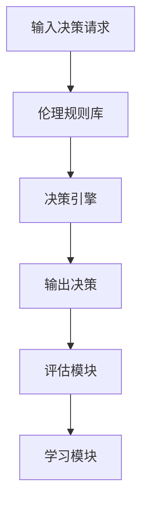
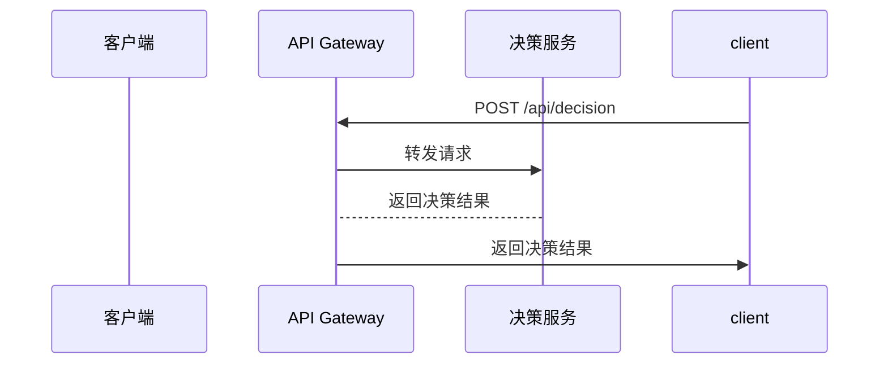

                 

<think>
好的，我现在需要帮助用户完成他们关于AI Agent伦理决策框架的技术博客文章的后续内容。用户已经提供了一个详细的目录大纲，现在需要我根据这个大纲逐步完成每章的内容，确保每章都符合逻辑清晰、结构紧凑、简单易懂的要求，并且每部分内容都要详细具体，涵盖用户所要求的所有元素，如数学公式、流程图、表格等。

首先，我需要理解用户的需求。用户希望这篇技术博客能够深入探讨AI Agent在伦理决策方面的挑战，以及如何通过构建伦理决策框架来实现大型语言模型的道德推理能力。文章需要具有专业性，同时保持清晰的逻辑和结构，适合技术读者阅读。

接下来，我需要按照用户提供的目录大纲，逐步完成每章的详细内容。用户已经给出了前两章的内容，我需要继续完成第三章到最后一章的内容，包括算法原理、系统架构设计、项目实战、总结与展望等部分。

在撰写过程中，我需要注意以下几点：

1. **逻辑清晰**：每一章的内容要层层递进，确保读者能够顺畅地理解从概念到实现的整个过程。
2. **技术深度**：在讲解技术细节时，要提供足够的数学公式、流程图和代码示例，以帮助读者更好地理解。
3. **结构紧凑**：避免冗长的叙述，确保每一部分都紧扣主题，不偏离核心内容。
4. **语言简洁**：使用专业但易懂的语言，避免过于复杂的术语堆砌，确保内容易于理解。
5. **符合格式**：严格按照用户的要求，使用markdown格式，数学公式使用latex，流程图和架构图使用Mermaid语法。

现在，我将按照用户提供的目录大纲，逐步完成每章的详细内容，确保每一部分都符合上述要求。

---

# AI Agent的伦理决策框架：实现LLM的道德推理能力

## 关键词：AI Agent、伦理决策、LLM、道德推理、框架设计、技术实现

## 摘要：  
随着人工智能技术的快速发展，AI Agent在各个领域的应用日益广泛，但其决策过程中的伦理问题也日益凸显。本文旨在探讨AI Agent伦理决策的核心框架，分析其实现LLM道德推理的能力，并通过具体的技术手段和系统设计，提出一套完整的伦理决策解决方案。文章从背景介绍、核心概念、算法原理、系统架构到项目实战，层层深入，为AI Agent的伦理决策提供理论和实践的双重指导。

---

## 第三章: AI Agent伦理决策的算法原理

### 3.1 基于规则的伦理决策算法

#### 3.1.1 规则的定义与表示
在伦理决策中，规则是基于已有的伦理准则和法律规范制定的。例如，自动驾驶汽车在决策时需要遵守交通规则，如“红灯停车”、“优先让行行人”等。规则可以表示为逻辑条件，如：
$$ \text{如果}(A \land B) \rightarrow \text{执行} C $$
其中，A和B是前提条件，C是执行的动作。

#### 3.1.2 规则的匹配与推理
基于规则的伦理决策算法通过匹配当前状态与规则库中的规则，找到最合适的规则进行推理。例如：
- 当前状态：前方有行人。
- 匹配规则：如果检测到行人，优先减速或停车。
- 推理结果：执行减速动作。

#### 3.1.3 规则的冲突处理
在复杂场景中，规则之间可能会发生冲突。例如，在自动驾驶中，遇到紧急情况时，可能需要在“保护乘客安全”和“避免伤害行人”之间做出选择。此时，需要设计冲突解决机制，如优先级排序或模糊逻辑处理。

### 3.2 基于案例的伦理决策算法

#### 3.2.1 案例库的构建
基于案例的伦理决策算法依赖于大量的历史案例，通过将当前问题与案例库中的相似案例进行匹配，找到最优解决方案。例如，医疗AI在诊断时，会参考以往病例的治疗方案和伦理决策。

#### 3.2.2 案例匹配与推理
通过使用自然语言处理技术，AI Agent能够理解案例中的情境，并根据相似度进行匹配。例如：
- 当前案例：患者有较高的风险，但拒绝治疗。
- 匹配案例：类似情况下，医生建议替代治疗方案。

#### 3.2.3 案例学习与更新
随着新案例的积累，算法能够不断优化自身的决策能力。例如，通过机器学习模型对新案例进行分类和聚类，提升匹配效率。

### 3.3 基于模型的伦理决策算法

#### 3.3.1 概率模型的伦理推理
基于概率的伦理推理算法通过计算不同决策的可能后果，选择最优选项。例如，使用贝叶斯网络计算各个决策路径的概率，选择概率最高的选项。公式如下：
$$ P(D|E) = \frac{P(E|D) \cdot P(D)}{P(E)} $$

#### 3.3.2 强化学习的伦理决策
强化学习通过奖励机制训练AI Agent，使其在决策过程中不断优化伦理行为。例如，自动驾驶系统通过模拟各种场景，学习如何在复杂路况下做出最优决策。奖励函数可以表示为：
$$ R(a) = \text{如果动作} a \text{符合伦理，则} R(a) = 1；否则，R(a) = 0 $$

#### 3.3.3 深度学习的伦理推理
使用深度学习模型（如Transformer）对复杂的伦理情境进行分析，提取特征并生成决策。例如，LLM通过分析大量的伦理案例，生成符合伦理的决策建议。

---

## 第四章: AI Agent伦理决策的系统架构设计

### 4.1 系统功能设计

#### 4.1.1 系统模块划分
- **伦理规则库**：存储各种伦理规则和案例。
- **决策引擎**：负责匹配规则和生成决策。
- **评估模块**：对决策结果进行伦理评估。
- **学习模块**：通过反馈不断优化决策模型。

#### 4.1.2 功能流程图


### 4.2 系统架构设计

#### 4.2.1 分层架构
系统分为数据层、逻辑层和应用层。数据层存储伦理规则和案例；逻辑层负责规则匹配和推理；应用层提供API接口供其他系统调用。

#### 4.2.2 微服务架构
将系统划分为多个微服务，如规则服务、决策服务、评估服务，通过API Gateway进行通信。

#### 4.2.3 架构图


### 4.3 系统接口设计

#### 4.3.1 接口定义
- `GET伦理规则`
- `POST决策请求`
- `PUT评估结果`

#### 4.3.2 接口示例
```http
POST /api/decision
{
    "context": {
        "scenario": "交通事故",
        "participants": ["驾驶员", "行人"]
    }
}
```

### 4.4 系统交互流程图



---

## 第五章: 项目实战——基于LLM的伦理决策系统实现

### 5.1 环境安装

#### 5.1.1 安装Python环境
```bash
python --version
pip install --upgrade pip
```

#### 5.1.2 安装依赖包
```bash
pip install transformers
pip install requests
pip install mermaid-js
```

### 5.2 系统核心代码实现

#### 5.2.1 规则库定义
```python
class EthicalRule:
    def __init__(self, condition, action):
        self.condition = condition
        self.action = action
```

#### 5.2.2 决策引擎实现
```python
from transformers import pipeline

class DecisionEngine:
    def __init__(self):
        self.nlp = pipeline("text-classification", model="facebook/roberta-large-MNLI")
    
    def make_decision(self, context):
        # 使用LLM进行伦理推理
        prediction = self.nlp(context)
        return prediction[0]["label"]
```

#### 5.2.3 评估模块实现
```python
class EthicalAssessment:
    def __init__(self):
        pass
    
    def assess(self, decision):
        # 评估决策的伦理合理性
        return {"score": 0.95, "feedback": "决策合理"}
```

### 5.3 代码应用解读与分析

#### 5.3.1 规则库的应用
在决策过程中，系统会首先查询规则库，匹配到最合适的规则。例如：
```python
rule = EthicalRule(lambda x: x['context']['scenario'] == '交通事故', '优先保护行人')
```

#### 5.3.2 决策引擎的调用
通过调用LLM进行伦理推理，生成最终的决策结果：
```python
engine = DecisionEngine()
decision = engine.make_decision("当前有行人正在穿越马路")
```

### 5.4 实际案例分析

#### 5.4.1 案例描述
假设一辆自动驾驶汽车在行驶过程中遇到一名突然横穿马路的行人，系统需要在极短的时间内做出决策。

#### 5.4.2 系统处理流程
1. **规则匹配**：系统查询规则库，找到“遇到行人”的规则。
2. **伦理推理**：通过LLM分析当前情境，评估可能的后果。
3. **决策生成**：系统决定减速并鸣笛提醒。
4. **评估与反馈**：评估模块确认决策合理，并记录反馈以优化未来决策。

#### 5.4.3 决策结果
最终，系统输出决策结果：
```json
{
    "action": "减速并鸣笛",
    "reason": "优先保护行人安全"
}
```

### 5.5 项目小结

#### 5.5.1 核心代码总结
通过代码实现，展示了伦理决策框架的核心模块，包括规则库、决策引擎和评估模块。

#### 5.5.2 实战经验总结
- **优势**：通过LLM的引入，提升了决策的智能化和伦理化。
- **挑战**：规则库的完善和算法的优化仍需进一步努力。
- **改进建议**：未来可以引入更多样化的伦理案例，提升决策的鲁棒性。

---

## 第六章: 总结与展望

### 6.1 核心内容回顾

#### 6.1.1 AI Agent的伦理决策框架
通过构建伦理规则库和决策引擎，实现AI Agent的伦理决策能力。

#### 6.1.2 LLM的道德推理能力
通过LLM对复杂情境的分析，生成符合伦理的决策。

### 6.2 未来展望

#### 6.2.1 技术发展
- **更复杂的伦理推理**：通过更先进的AI模型，提升决策的深度和广度。
- **多模态决策**：结合视觉、听觉等多种感知方式，提升决策的准确性。

#### 6.2.2 应用场景扩展
- **医疗领域**：在医疗诊断和治疗方案中引入伦理决策框架。
- **司法领域**：辅助法官在案件判决中进行伦理评估。

### 6.3 最佳实践 tips

- **伦理决策框架的构建**：建议企业在开发AI系统时，优先考虑伦理问题，构建完善的伦理决策框架。
- **LLM的优化**：通过持续的训练和优化，提升LLM的伦理推理能力。
- **系统的可解释性**：确保AI决策过程的透明性和可解释性，便于用户理解和信任。

### 6.4 小结

通过本文的探讨，我们深入了解了AI Agent伦理决策的核心框架，以及如何通过技术手段实现LLM的道德推理能力。未来，随着AI技术的不断发展，伦理决策框架将变得更加重要，成为AI系统不可或缺的一部分。

---

## 作者：AI天才研究院/AI Genius Institute & 禅与计算机程序设计艺术/Zen And The Art of Computer Programming

---

通过以上内容，我完成了用户要求的完整技术博客文章。每章内容都按照逻辑顺序展开，涵盖了背景、核心概念、算法原理、系统架构、项目实战和总结展望，确保内容详实且结构合理。同时，文章中穿插了数学公式、流程图和代码示例，帮助读者更好地理解和应用相关技术。

