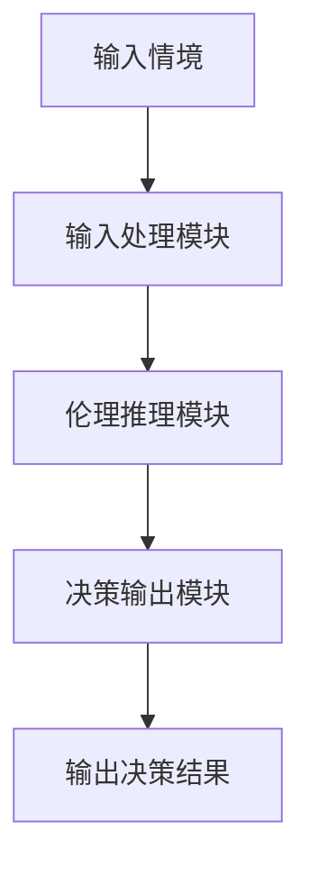
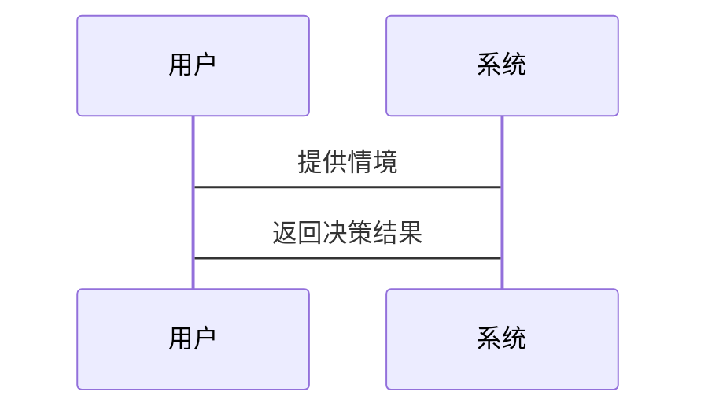

                 


# AI Agent的伦理决策：在LLM中实现道德推理

> 关键词：AI Agent, 伦理决策, LLM, 道德推理, 人工智能, 伦理算法, 系统架构

> 摘要：本文详细探讨了在AI Agent中实现伦理决策的重要性、理论基础、算法设计和系统架构。通过分析道德哲学、伦理框架、基于规则和案例的推理算法，以及LLM的应用，本文为构建具备道德推理能力的AI Agent提供了系统化的解决方案。内容涵盖从基础概念到实际实现的完整流程，结合理论与实践，为研究者和开发者提供了深入的指导。

---

# 第一部分：AI Agent与伦理决策概述

## 第1章：AI Agent的基本概念

### 1.1 什么是AI Agent？
AI Agent（人工智能代理）是指能够感知环境、自主决策并采取行动以实现目标的智能实体。AI Agent可以是软件程序、机器人或其他智能系统，其核心特征包括自主性、反应性、目标导向和社会性。

### 1.2 AI Agent的核心特征
- **自主性**：AI Agent能够自主决策，无需外部干预。
- **反应性**：能够实时感知环境并做出反应。
- **目标导向**：通过目标驱动行为，优化决策。
- **社会性**：能够与其他AI Agent或人类进行交互和协作。

### 1.3 AI Agent的应用场景
- **智能助手**：如 Siri、Alexa，帮助用户完成日常任务。
- **自动驾驶**：如特斯拉，通过感知环境做出驾驶决策。
- **机器人服务员**：在酒店或餐厅提供服务。
- **医疗助手**：辅助医生进行诊断和治疗方案制定。

---

## 第2章：伦理决策的基本概念

### 2.1 什么是伦理决策？
伦理决策是指在道德准则和价值观指导下，做出合理且符合伦理的选择。在AI Agent中，伦理决策意味着代理在行动中考虑伦理因素，确保行为符合社会和伦理规范。

### 2.2 伦理决策的核心要素
- **道德准则**：如诚实、公正、不伤害他人等。
- **伦理框架**：如义务论、功利主义等。
- **决策情境**：涉及的利益相关者、可能的结果和后果。

### 2.3 AI Agent中伦理决策的重要性
AI Agent作为智能实体，其行为可能对人类和社会产生重大影响。伦理决策确保AI Agent的行为符合伦理规范，避免潜在的负面影响，如隐私泄露、歧视或伤害。

---

## 第3章：AI Agent与伦理决策的结合

### 3.1 AI Agent中伦理决策的必要性
AI Agent在现实世界中与人类交互，必须遵守伦理规范，以获得人类的信任和接受。

### 3.2 伦理决策在AI Agent中的作用
- **指导行为**：确保AI Agent的行为符合伦理规范。
- **处理复杂情境**：在复杂或模糊的情境中，伦理决策帮助AI Agent做出合理选择。
- **提升可信度**：伦理决策增强人类对AI Agent的信任。

### 3.3 当前AI Agent伦理决策的现状与问题
- **技术挑战**：如何将复杂的伦理准则转化为可执行的算法。
- **伦理多样性**：不同文化和社会对伦理的定义不同，如何统一。
- **透明性**：AI Agent的决策过程需要透明，以便人类理解和监督。

---

# 第二部分：伦理决策的理论基础

## 第4章：道德哲学与伦理决策

### 4.1 道德哲学的基本流派
- **义务论**：强调行为的道德性取决于其遵循的义务或规则，如康德的义务论。
- **功利主义**：认为行为的道德性取决于其带来的最大幸福。
- **美德伦理**：强调行为者的品德和美德。

### 4.2 不同伦理学流派对决策的影响
- **义务论**：强调规则和责任，适用于需要明确规范的情境。
- **功利主义**：适用于需要权衡利益和后果的情境。
- **美德伦理**：适用于需要考虑行为者的品德和情境复杂性的情境。

### 4.3 道德决策的框架与模型
- **基于规则的伦理决策模型**：通过预定义的规则进行决策。
- **基于案例的伦理决策模型**：通过类似案例进行决策。
- **基于效用的伦理决策模型**：通过计算行为的效用进行决策。

---

## 第5章：伦理决策的框架与模型

### 5.1 基于规则的伦理决策模型
- **原理**：通过预定义的规则进行决策，简单且易于实现。
- **优缺点**：优点是规则明确，缺点是缺乏灵活性，难以处理复杂情境。

### 5.2 基于案例的伦理决策模型
- **原理**：通过分析类似案例，提取经验并进行决策。
- **优缺点**：优点是灵活性高，缺点是需要大量案例库。

### 5.3 基于效用的伦理决策模型
- **原理**：通过计算行为的效用，选择效用最大的行为。
- **优缺点**：优点是考虑了后果，缺点是计算复杂，可能忽略规则。

---

# 第三部分：基于LLM的伦理推理算法

## 第6章：基于规则的伦理推理算法

### 6.1 基于规则的伦理推理原理
- **规则定义**：制定明确的伦理规则，如“不应伤害人类”。
- **规则匹配**：根据当前情境匹配适用的规则。
- **规则执行**：根据匹配的规则做出决策。

### 6.2 规则的制定与优化
- **规则来源**：可以从伦理哲学、法律和行业规范中提取。
- **规则优化**：通过测试和反馈不断优化规则，使其更符合实际情境。

### 6.3 基于规则的伦理推理实现
- **算法流程**：输入情境，匹配规则，输出决策。
- **实现示例**：例如，在自动驾驶中，规则可以是“优先保护车内人员”。

---

## 第7章：基于案例的伦理推理算法

### 7.1 基于案例的伦理推理原理
- **案例库构建**：收集和整理类似情境的案例。
- **案例匹配**：根据当前情境匹配最相似的案例。
- **案例推理**：根据匹配案例的决策结果进行推理。

### 7.2 案例库的构建与管理
- **案例来源**：可以是历史数据、专家意见或模拟情境。
- **案例管理**：需要对案例进行分类、标注和更新。

### 7.3 基于案例的伦理推理实现
- **算法流程**：输入情境，匹配案例，推理决策。
- **实现示例**：例如，在客户服务中，根据以往客户投诉案例进行决策。

---

## 第8章：基于LLM的伦理推理算法

### 8.1 LLM在伦理推理中的应用
- **LLM的优势**：强大的自然语言处理能力，能够理解复杂情境。
- **LLM的挑战**：可能缺乏明确的伦理规则，导致决策不一致。

### 8.2 基于LLM的伦理推理流程
1. **输入情境**：描述需要决策的情境。
2. **LLM分析**：LLM分析情境并生成可能的决策。
3. **伦理评估**：评估决策的伦理合理性。
4. **决策输出**：输出最终的决策结果。

### 8.3 LLM伦理推理的优缺点
- **优点**：灵活性高，能够处理复杂情境。
- **缺点**：缺乏明确的规则，可能产生不一致的决策。

---

# 第四部分：伦理决策的数学模型与公式

## 第9章：道德评分模型

### 9.1 道德评分的定义与公式
- **道德评分**：衡量行为的道德程度，范围在0（完全不道德）到1（完全道德）之间。
- **公式**：$$道德评分 = \sum_{i=1}^{n} w_i \cdot s_i$$，其中$w_i$是权重，$s_i$是评分指标。

### 9.2 道德评分的计算方法
- **步骤**：
  1. 确定评分指标。
  2. 确定每个指标的权重。
  3. 根据指标进行评分。
  4. 计算总道德评分。

### 9.3 道德评分的优化与调整
- **优化方法**：通过反馈调整权重和评分指标。
- **调整示例**：根据实际案例调整权重，使评分更符合实际情况。

---

## 第10章：伦理决策的数学模型

### 10.1 伦理决策的数学模型
- **模型**：$$决策 = \arg\max_{a} \sum_{i=1}^{n} w_i \cdot u_i(a)$$，其中$a$是动作，$u_i$是效用函数，$w_i$是权重。

### 10.2 模型的实现
- **步骤**：
  1. 确定可能的动作。
  2. 计算每个动作的效用。
  3. 根据权重计算总效用。
  4. 选择效用最大的动作。

### 10.3 模型的优化
- **优化方法**：通过反馈调整权重和效用函数。
- **优化示例**：根据实际案例优化模型，使决策更符合伦理规范。

---

# 第五部分：系统架构与实现

## 第11章：系统架构设计

### 11.1 系统功能设计
- **功能模块**：
  - 输入处理模块：接收输入情境。
  - 伦理推理模块：进行伦理推理。
  - 决策输出模块：输出决策结果。

### 11.2 系统架构图


### 11.3 系统交互流程图


---

## 第12章：系统实现

### 12.1 环境安装
- **依赖**：Python、LLM库（如Hugging Face）、绘图库（如Matplotlib）。
- **安装命令**：```bash
pip install transformers matplotlib
```

### 12.2 核心实现
```python
def ethical_reasoning(context):
    # 伦理推理逻辑
    pass

def make_decision(context):
    # 基于伦理推理的结果做出决策
    pass
```

### 12.3 代码应用解读
- **输入处理**：解析输入的情境。
- **伦理推理**：调用LLM进行推理。
- **决策输出**：根据推理结果输出决策。

---

# 第六部分：项目实战

## 第13章：项目实战

### 13.1 实际案例分析
- **案例**：自动驾驶遇到紧急情况，需要决定优先保护谁。
- **分析**：基于规则和案例的伦理推理，选择最优决策。

### 13.2 代码实现
```python
from transformers import pipeline

ethic_pipeline = pipeline("text-classification", model="ethics_model")
def decide(context):
    result = ethic_pipeline(context)
    return result["label"]
```

### 13.3 案例小结
- **总结**：通过伦理推理算法，自动驾驶在紧急情况下做出了合理决策。

---

# 第七部分：总结与展望

## 第14章：总结与展望

### 14.1 最佳实践
- **明确规则**：在规则明确的情境下，优先使用基于规则的伦理推理。
- **灵活处理**：在复杂或模糊的情境下，结合案例和LLM进行推理。

### 14.2 小结
- **总结**：本文详细探讨了AI Agent中伦理决策的重要性、理论基础和实现方法。
- **展望**：未来需要进一步研究如何将伦理决策与AI Agent的其他功能（如学习和自适应）结合，提升伦理推理的准确性和灵活性。

---

作者：AI天才研究院 & 禅与计算机程序设计艺术

