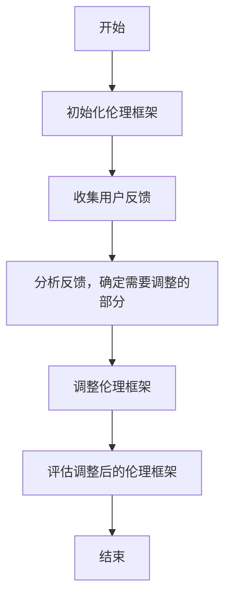
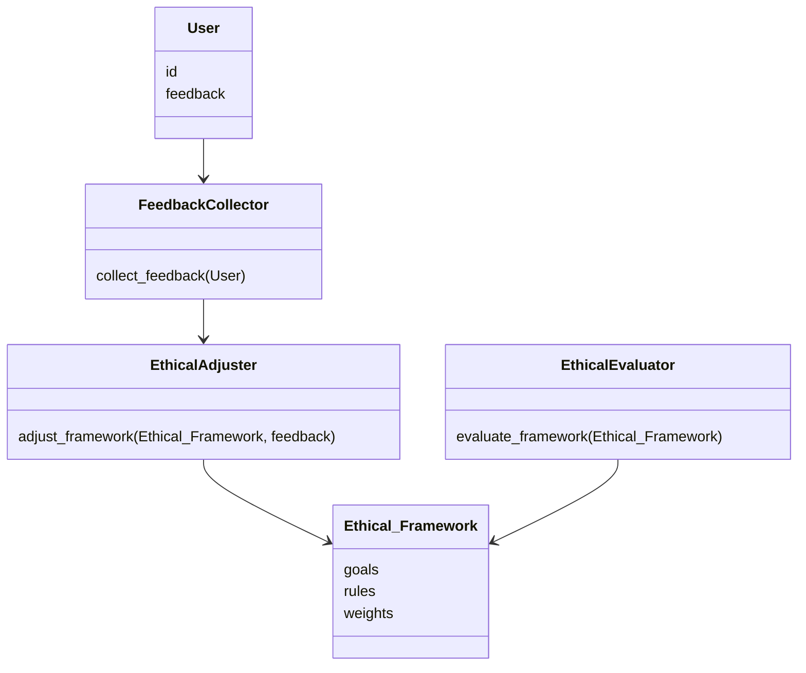
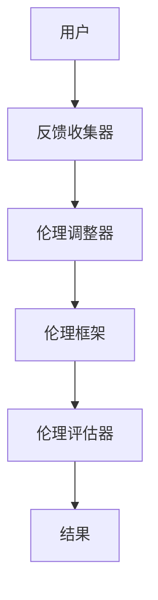

                 


# AI Agent的伦理学习机制：动态调整LLM的道德框架

> 关键词：AI Agent, 伦理学习机制, LLM道德框架, 动态调整, 伦理决策

> 摘要：本文探讨AI Agent的伦理学习机制，特别是如何动态调整LLM的道德框架。通过背景介绍、核心概念、算法原理、系统架构和项目实战，详细阐述伦理学习机制的实现原理、动态调整方法、系统设计和实际应用。文章最后总结最佳实践和未来方向。

---

## 第一部分: AI Agent的伦理学习机制背景介绍

### 第1章: 问题背景与概念结构

#### 1.1 问题背景

##### 1.1.1 AI Agent的快速发展与挑战

AI Agent（智能体）近年来在各个领域得到了广泛应用。从自动驾驶汽车到智能助手（如Siri、Alexa），再到企业级的决策支持系统，AI Agent的能力和影响力不断扩大。然而，随着AI Agent的应用场景越来越复杂，其在决策过程中面临的伦理问题也逐渐显现。例如，在自动驾驶中，AI Agent需要在紧急情况下做出决策，这可能涉及到生命的选择；在医疗AI中，AI Agent需要权衡不同治疗方案的优缺点，这可能涉及到患者的生命和利益。

##### 1.1.2 LLM在AI Agent中的角色与局限性

大型语言模型（LLM，Large Language Model）是当前AI Agent的核心技术之一。LLM通过自然语言处理技术，能够理解人类的语言并生成符合语境的回复。然而，LLM本身并不具备伦理判断能力，它只是根据训练数据生成内容。这就意味着，AI Agent需要一个额外的机制来赋予LLM以伦理判断能力，使其能够根据具体情况做出符合伦理的决策。

##### 1.1.3 伦理学习机制的必要性与重要性

为了使AI Agent能够在复杂的现实环境中做出正确的伦理决策，必须引入伦理学习机制。这种机制能够动态调整LLM的道德框架，使其在不同的场景下能够灵活地适应伦理要求的变化。例如，在医疗AI中，不同的患者可能有不同的伦理偏好，AI Agent需要能够根据具体情况动态调整其道德框架，以满足不同患者的需求。

#### 1.2 问题描述

##### 1.2.1 AI Agent决策中的伦理问题

AI Agent在决策过程中可能面临多种伦理问题。例如，在自动驾驶中，AI Agent需要在紧急情况下做出决策，这涉及到生命的选择；在司法辅助系统中，AI Agent需要根据法律和伦理标准做出判决建议。这些决策可能对个人、社会甚至整个生态系统产生重大影响。

##### 1.2.2 LLM道德框架的动态调整需求

LLM本身不具备伦理判断能力，因此需要一个动态调整的机制来赋予其伦理判断能力。这种机制需要能够根据具体场景和需求，动态调整LLM的道德框架，使其能够在不同的环境中做出符合伦理的决策。

##### 1.2.3 伦理学习机制的核心问题

伦理学习机制的核心问题是如何动态调整LLM的道德框架。这需要解决以下几个问题：
- 如何定义和表示伦理框架？
- 如何根据具体场景动态调整伦理框架？
- 如何确保伦理框架的调整符合伦理规范？

#### 1.3 问题解决与边界

##### 1.3.1 伦理学习机制的目标与范围

伦理学习机制的目标是通过动态调整LLM的道德框架，使其能够在不同场景下做出符合伦理的决策。其范围包括：
- 伦理框架的定义与表示
- 伦理框架的动态调整方法
- 伦理框架的验证与评估

##### 1.3.2 LLM道德框架的动态调整边界

LLM道德框架的动态调整需要在一定的边界内进行。例如：
- 调整的范围：道德框架的哪些部分可以调整？
- 调整的频率：道德框架需要多频繁地进行调整？
- 调整的依据：道德框架的调整依据哪些信息？

##### 1.3.3 伦理学习机制的实现路径

伦理学习机制的实现路径包括：
- 建立伦理框架的表示模型
- 开发动态调整算法
- 设计验证与评估方法

#### 1.4 概念结构与核心要素

##### 1.4.1 AI Agent的伦理学习机制框架

AI Agent的伦理学习机制框架包括以下几个核心要素：
- 伦理框架表示：将伦理框架表示为某种形式，例如知识图谱或规则集。
- 动态调整算法：根据具体场景动态调整伦理框架。
- 伦理评估：对调整后的伦理框架进行评估，确保其符合伦理规范。

##### 1.4.2 LLM道德框架的核心要素

LLM道德框架的核心要素包括：
- 伦理目标：LLM需要实现的目标，例如“保护人类生命”。
- 伦理规则：具体的伦理规则，例如“在紧急情况下优先保护儿童”。
- 伦理权重：不同伦理目标的优先级。

##### 1.4.3 伦理学习机制与LLM的交互关系

伦理学习机制与LLM的交互关系如下：
- 伦理学习机制向LLM提供伦理框架。
- LLM根据伦理框架生成符合伦理的决策。
- 根据反馈，伦理学习机制动态调整伦理框架。

---

## 第二部分: 核心概念与联系

### 第2章: 核心概念与联系

#### 2.1 伦理学习机制的核心原理

##### 2.1.1 伦理学习机制的定义与属性

伦理学习机制是一种能够动态调整LLM道德框架的机制。其核心属性包括：
- 动态性：能够根据具体场景动态调整伦理框架。
- 可解释性：调整过程和结果能够被人类理解。
- 灵活性：能够适应不同场景的伦理要求。

##### 2.1.2 伦理学习机制的关键特征对比

| 特性 | 伦理学习机制 | LLM道德框架 |
|------|--------------|-------------|
| 动态性 | 支持动态调整 | 静态或动态 |
| 可解释性 | 高 | 低 |
| 灵活性 | 高 | 中 |

##### 2.1.3 伦理学习机制的数学模型

伦理学习机制的数学模型可以表示为：
$$
f(e, s) = \theta
$$
其中，$e$表示伦理框架，$s$表示具体场景，$\theta$表示调整后的伦理框架。

---

#### 2.2 LLM道德框架的动态调整机制

##### 2.2.1 LLM道德框架的定义与构成

LLM道德框架的构成包括：
- 伦理目标：LLM需要实现的目标，例如“保护人类生命”。
- 伦理规则：具体的伦理规则，例如“在紧急情况下优先保护儿童”。
- 伦理权重：不同伦理目标的优先级。

##### 2.2.2 动态调整的核心原理

动态调整的核心原理是基于反馈机制。通过收集用户的反馈，系统能够不断优化伦理框架。

##### 2.2.3 伦理框架的动态调整流程

1. 收集用户反馈。
2. 分析反馈，确定需要调整的伦理框架部分。
3. 调整伦理框架。
4. 重新评估伦理框架的有效性。

---

## 第三部分: 算法原理讲解

### 第3章: 算法原理讲解

#### 3.1 伦理学习机制的算法流程

##### 3.1.1 算法流程图



##### 3.1.2 算法实现代码示例

```python
def adjust_moral_framework(feedback):
    # 分析反馈
    analysis = analyze_feedback(feedback)
    # 确定需要调整的部分
    parts_to_adjust = identify_parts_to_adjust(analysis)
    # 调整伦理框架
    new_framework = adjust_framework(parts_to_adjust)
    return new_framework
```

##### 3.1.3 算法的数学模型与公式

伦理框架调整的数学模型可以表示为：
$$
\theta_{new} = \theta_{old} + \alpha \cdot \Delta\theta
$$
其中，$\alpha$是调整系数，$\Delta\theta$是调整量。

---

## 第四部分: 系统分析与架构设计方案

### 第4章: 系统分析与架构设计方案

#### 4.1 问题场景介绍

本系统旨在解决AI Agent在复杂场景下的伦理决策问题。通过动态调整LLM的道德框架，使其能够根据具体场景做出符合伦理的决策。

#### 4.2 系统功能设计

##### 4.2.1 系统功能需求

系统功能需求包括：
- 收集用户反馈。
- 动态调整伦理框架。
- 评估调整后的伦理框架。

##### 4.2.2 系统功能的领域模型类图



##### 4.2.3 系统架构图



---

## 第五部分: 项目实战

### 第5章: 项目实战

#### 5.1 环境安装与配置

```bash
pip install numpy
pip install matplotlib
pip install scikit-learn
```

#### 5.2 核心代码实现

```python
import numpy as np

def adjust_framework(current_framework, feedback):
    # 分析反馈
    analysis = analyze(feedback)
    # 确定调整量
    delta = calculate_delta(analysis)
    # 调整框架
    new_framework = current_framework + delta
    return new_framework

def analyze(feedback):
    # 简单的分析方法
    return feedback['score']

def calculate_delta(analysis):
    return np.array([analysis, analysis])

# 示例用法
initial_framework = np.array([0.5, 0.3, 0.2])
feedback = {'score': 0.8}
new_framework = adjust_framework(initial_framework, feedback)
print(new_framework)
```

---

## 第六部分: 总结

### 6.1 最佳实践

- 定期评估伦理框架的有效性。
- 根据反馈动态调整伦理框架。
- 确保伦理框架的调整过程透明可解释。

### 6.2 小结

本文详细探讨了AI Agent的伦理学习机制，特别是如何动态调整LLM的道德框架。通过背景介绍、核心概念、算法原理、系统架构和项目实战，本文为实现AI Agent的伦理决策提供了理论和实践指导。

### 6.3 注意事项

- 数据隐私：确保用户反馈的隐私安全。
- 算法优化：不断优化伦理框架调整算法，提高调整的准确性和效率。

### 6.4 拓展阅读

- 推荐阅读《Ethics in AI: A Comprehensive Guide》和《Dynamic Ethical Frameworks for AI Systems》。

---

## 作者

作者：AI天才研究院/AI Genius Institute & 禅与计算机程序设计艺术 /Zen And The Art of Computer Programming

---

# 结语

AI Agent的伦理学习机制是实现AI系统伦理决策的核心技术。通过动态调整LLM的道德框架，AI Agent能够在复杂场景下做出符合伦理的决策。本文通过系统的分析和实践，为实现AI Agent的伦理决策提供了理论和实践指导。未来，随着技术的发展，伦理学习机制将在更多领域得到应用，为人类社会的发展做出更大贡献。

