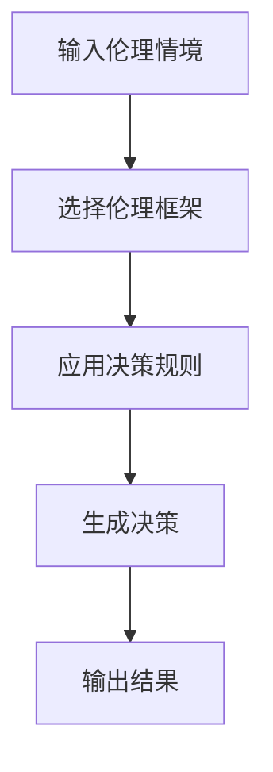
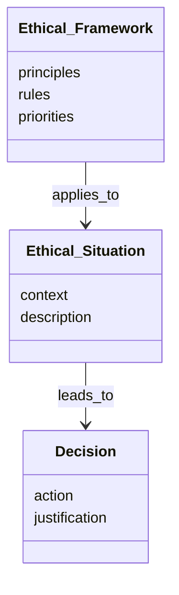
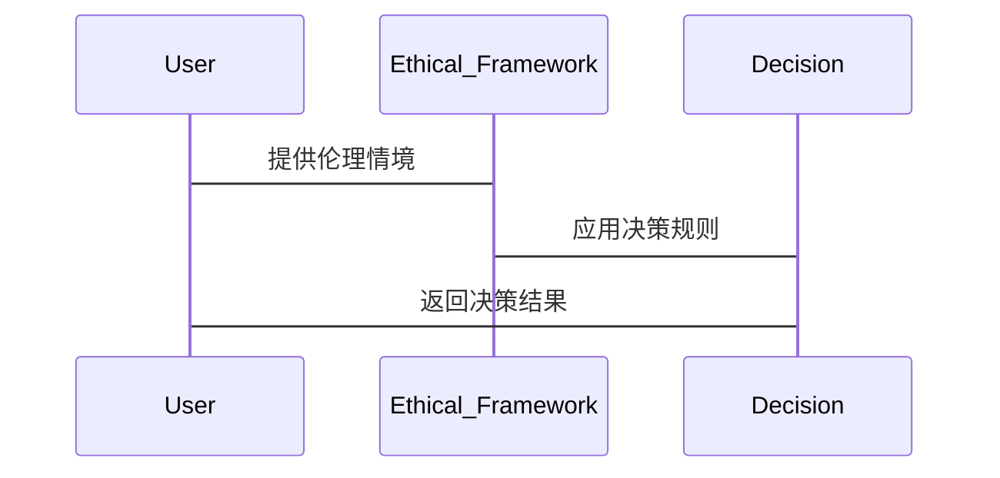

                 


# AI Agent的伦理学习：在LLM中植入道德决策框架

> 关键词：AI Agent，伦理学习，大语言模型，道德决策框架，伦理决策，LLM

> 摘要：本文探讨了在大语言模型（LLM）中植入道德决策框架的必要性与实现方法，分析了伦理学习的核心概念、算法原理和系统架构，并通过实际案例展示了如何在AI Agent中实现伦理决策。

---

## 第一部分: AI Agent的伦理学习基础

### 第1章: AI Agent与伦理学习概述

#### 1.1 AI Agent的基本概念

- **1.1.1 AI Agent的定义与特点**
  - AI Agent是指具有自主决策能力的智能体，能够感知环境并采取行动以实现目标。
  - 其特点包括自主性、反应性、目标导向和社会交互性。

- **1.1.2 伦理在AI Agent中的重要性**
  - AI Agent的决策可能影响人类社会，因此需要遵循伦理规范。
  - 伦理决策有助于提升AI Agent的可信度和用户满意度。

- **1.1.3 AI Agent与人类伦理的异同点**
  - AI Agent的决策基于数据和模型，而人类决策涉及情感和主观判断。
  - 两者都需要考虑伦理原则，但AI Agent的伦理决策需要通过算法实现。

#### 1.2 大语言模型（LLM）的基本原理

- **1.2.1 LLM的定义与技术特点**
  - LLM是基于深度学习的自然语言处理模型，具有强大的文本生成和理解能力。
  - 技术特点包括大规模数据训练、自注意力机制和生成式输出。

- **1.2.2 LLM在AI Agent中的应用现状**
  - LLM常用于对话生成、信息检索和决策支持。
  - 然而，LLM本身并不具备伦理判断能力，需要额外的伦理框架进行约束。

- **1.2.3 LLM的伦理挑战与机遇**
  - 挑战：LLM可能生成有害信息，缺乏伦理判断能力。
  - 机遇：通过伦理框架约束，LLM可以辅助AI Agent做出更合理的决策。

#### 1.3 伦理学习的核心概念

- **1.3.1 伦理决策的基本原理**
  - 伦理决策基于预定义的伦理原则和价值观。
  - 决策过程需要考虑利益相关者的需求和潜在风险。

- **1.3.2 道德框架的分类与对比**
  - 道德框架可以分为义务论、功利主义和美德伦理等。
  - 不同框架适用于不同的伦理情境。

- **1.3.3 伦理学习的实现方式**
  - 基于规则的伦理学习：通过预定义规则进行决策。
  - 基于学习的伦理学习：通过数据训练模型，使其自动学习伦理原则。

---

### 第2章: AI Agent伦理学习的背景与问题

#### 2.1 当前AI Agent发展的伦理困境

- **2.1.1 AI Agent决策的不可解释性**
  - AI Agent的决策过程往往缺乏透明性，导致用户难以理解其行为。
  - 这使得AI Agent在医疗、法律等领域应用时面临信任问题。

- **2.1.2 AI Agent的偏见与公平性问题**
  - 训练数据中的偏见可能导致AI Agent产生不公平的决策。
  - 如何消除偏见是伦理学习的重要内容。

- **2.1.3 AI Agent的滥用风险**
  - AI Agent可能被用于恶意目的，如传播虚假信息或进行欺诈。

#### 2.2 伦理学习在AI Agent中的必要性

- **2.2.1 提高决策透明度的需求**
  - 通过伦理学习，AI Agent可以提供更透明的决策依据。
  - 这有助于提升用户对AI Agent的信任。

- **2.2.2 增强伦理判断能力的必要性**
  - 伦理学习使AI Agent能够理解并遵循伦理原则。
  - 这使其在复杂情境中做出更合理的决策。

- **2.2.3 伦理学习对社会信任的影响**
  - 通过伦理学习，AI Agent可以减少对人类社会的负面影响。
  - 这有助于推动AI技术的广泛应用。

#### 2.3 伦理学习的边界与外延

- **2.3.1 伦理学习的适用范围**
  - 伦理学习适用于所有需要伦理判断的领域，如医疗、法律和教育。
  - 不同领域可能需要不同的伦理框架。

- **2.3.2 伦理学习的局限性**
  - 伦理框架可能无法涵盖所有复杂的伦理情境。
  - 道德决策可能因文化差异而有所不同。

- **2.3.3 伦理学习与其他AI技术的关系**
  - 伦理学习与自然语言处理、机器学习等技术密切相关。
  - 它是实现AI Agent全面能力的重要组成部分。

---

### 第3章: 伦理决策框架的核心要素

#### 3.1 伦理决策框架的构成

- **3.1.1 伦理原则与价值观的定义**
  - 伦理原则包括诚实、公正、尊重和责任。
  - 价值观是指社会普遍认可的价值导向。

- **3.1.2 决策规则与优先级的设定**
  - 决策规则是基于伦理原则制定的具体规则。
  - 优先级决定了在冲突情况下如何权衡不同原则。

- **3.1.3 伦理情境的识别与分类**
  - 需要识别AI Agent可能面临的伦理情境。
  - 对这些情境进行分类，以便制定相应的决策规则。

#### 3.2 伦理框架的属性特征对比

- **3.2.1 不同伦理框架的对比表格**
  | 伦理框架 | 基础原则 | 决策规则 | 适用场景 |
  |----------|----------|----------|----------|
  | 功利主义 | 最大化效用 | 最优化计算 | 社会公益 |
  | 义务论   | 遵守义务 | 基于规则 | 个人责任 |
  | 美德伦理 | 培养美德 | 基于案例 | 个体行为 |

- **3.2.2 伦理框架的优缺点分析**
  - 功利主义的优点是计算明确，缺点是忽视个体权益。
  - 义务论的优点是规则明确，缺点是灵活性不足。
  - 美德伦理的优点是适应性强，缺点是难以量化。

- **3.2.3 伦理框架的适用场景**
  - 功利主义适用于公共政策制定。
  - 义务论适用于法律领域。
  - 美德伦理适用于个体行为指导。

#### 3.3 伦理决策框架的ER实体关系图

```mermaid
erDiagram
    class Ethical_Framework {
        id
        principle
        rule
        priority
    }
    class Ethical_Situation {
        id
        description
        context
    }
    class Decision {
        id
        action
        justification
    }
    Ethical_Framework --|> Ethical_Situation : applies_to
    Ethical_Situation --|> Decision : leads_to
```

---

### 第4章: 伦理学习的算法原理

#### 4.1 伦理决策的数学模型

- **4.1.1 基于效用的伦理决策模型**
  - 模型公式：$$\text{效用} = \sum_{i=1}^{n} w_i x_i$$
  - 其中，\(w_i\)是权重，\(x_i\)是决策因素。

- **4.1.2 基于规则的伦理决策模型**
  - 模型公式：$$\text{决策} = \sum_{i=1}^{m} r_i x_i$$
  - \(r_i\)是规则的判断条件。

- **4.1.3 基于学习的伦理决策模型**
  - 使用深度学习模型，通过训练数据学习伦理原则。

#### 4.2 伦理学习的算法实现

- **4.2.1 基于LLM的伦理决策流程图**



- **4.2.2 伦理学习的Python源代码**

```python
def ethical_decision(ethics_framework, situation):
    if ethics_framework == 'utilitarian':
        return max_utility(situation)
    elif ethics_framework == 'deontological':
        return follow_duty(situation)
    elif ethics_framework == 'virtue':
        return demonstrate_virtue(situation)
    else:
        raise ValueError("Invalid ethics framework")
```

---

## 第五章: 系统分析与架构设计

### 5.1 伦理学习系统的应用场景

- **5.1.1 医疗领域**
  - AI Agent辅助医生制定治疗方案。
  - 需要遵循患者隐私和医疗伦理。

- **5.1.2 法律领域**
  - AI Agent辅助律师分析法律案例。
  - 需要遵循法律规范和职业道德。

- **5.1.3 金融领域**
  - AI Agent辅助投资决策。
  - 需要遵循金融监管和道德准则。

### 5.2 伦理学习系统的功能设计

- **5.2.1 领域模型的Mermaid类图**



- **5.2.2 系统架构设计的Mermaid架构图**

```mermaid
container Ethical_Framework {
    module Ethics_FrameworkLoader
    module Ethics_FrameworkValidator
    module Ethics_FrameworkApplier
}

container Ethical_Situation {
    module SituationAnalyzer
    module SituationValidator
    module SituationDescriber
}

container Decision {
    module DecisionGenerator
    module DecisionValidator
    module DecisionOutputter
}

Ethical_Framework --|> Ethical_Situation : Analyze Situation
Ethical_Situation --|> Decision : Generate Decision
```

- **5.2.3 系统接口设计**
  - 输入接口：接收伦理情境和决策参数。
  - 输出接口：返回决策结果和伦理评估。

- **5.2.4 系统交互的Mermaid序列图**



---

## 第六章: 项目实战

### 6.1 环境安装

- **6.1.1 安装Python和相关库**
  - 安装Python 3.8及以上版本。
  - 安装`mermaid`、`matplotlib`等可视化库。

### 6.2 系统核心实现

- **6.2.1 实现伦理框架加载器**

```python
class Ethics_FrameworkLoader:
    def load_framework(self, framework_type):
        if framework_type == 'utilitarian':
            return Utilitarian_Framework()
        elif framework_type == 'deontological':
            return Deontological_Framework()
        elif framework_type == '

