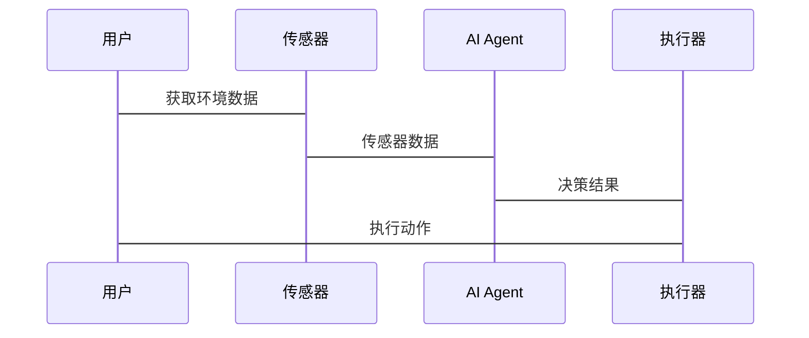

                 


# 《AI Agent的伦理设计：原则与实践》

---

## 关键词：AI Agent, 伦理设计, 人工智能, 责任归属, 可解释性, 透明性

---

## 摘要：  
AI Agent的伦理设计是人工智能领域的重要课题。随着AI Agent在各个领域的广泛应用，其伦理问题日益凸显。本文从AI Agent的基本概念出发，探讨其伦理设计的核心原则、算法实现、系统架构以及实际案例，旨在为AI Agent的开发者和研究者提供理论与实践相结合的指导。通过分析伦理设计的挑战与解决方案，本文为构建符合伦理规范的AI Agent提供了系统的思考框架。

---

## 第一部分：AI Agent的伦理设计背景与概述

### 第1章：AI Agent的伦理设计概述

#### 1.1 AI Agent的基本概念
- **1.1.1 什么是AI Agent**
  - AI Agent的定义：AI Agent是一种智能体，能够感知环境并采取行动以实现目标。
  - AI Agent的特点：自主性、反应性、目标导向、社交能力。
  - AI Agent的分类：简单反射型、基于规则的、基于模型的、目标驱动的、学习型。

- **1.1.2 AI Agent的应用场景**
  - 例如：自动驾驶、智能助手（如Siri、Alexa）、推荐系统、医疗诊断辅助系统。

- **1.1.3 AI Agent的发展趋势**
  - 多智能体系统（MAS）、人机协作、可解释性AI（XAI）。

#### 1.2 AI Agent伦理设计的背景
- **1.2.1 人工智能的快速发展与伦理问题**
  - 技术进步带来的伦理挑战：算法偏见、数据隐私、决策责任。
- **1.2.2 AI Agent在社会中的角色与影响**
  - AI Agent对社会结构的影响：就业、隐私、伦理决策。
- **1.2.3 伦理设计的重要性与必要性**
  - 避免伦理风险、提升用户信任、符合法律法规。

---

### 第2章：AI Agent的伦理问题与挑战

#### 2.1 伦理问题的定义与分类
- **2.1.1 伦理问题的定义**
  - 伦理问题：涉及道德准则和价值观的决策问题。
- **2.1.2 伦理问题的分类**
  - 数据隐私：如何处理用户数据。
  - 决策责任：AI Agent的决策失误由谁负责。
  - 算法偏见：AI系统中的偏见来源与影响。
  - 社会影响：AI Agent对社会结构和人类就业的影响。

#### 2.2 AI Agent伦理设计的核心挑战
- **2.2.1 伦理决策的复杂性**
  - 多利益相关者的权衡：例如自动驾驶汽车在事故中的决策。
- **2.2.2 伦理规范的多样性**
  - 不同文化、地区、法律体系下的伦理标准差异。
- **2.2.3 伦理设计的可实施性**
  - 伦理原则如何转化为具体的设计规范和算法实现。

---

## 第二部分：AI Agent的伦理设计原则

### 第3章：AI Agent的伦理设计原则

#### 3.1 伦理设计的基本原则
- **3.1.1 可解释性原则**
  - 为什么重要：确保用户和监管机构能够理解AI Agent的决策过程。
  - 实现方法：通过日志记录、解释生成模块提供决策依据。

- **3.1.2 透明性原则**
  - 为什么重要：增强用户信任，便于发现和纠正错误。
  - 实现方法：公开算法和数据来源，提供决策透明度。

- **3.1.3 责任归属原则**
  - 为什么重要：明确AI Agent决策的责任方，便于追责和改进。
  - 实现方法：设计责任分配机制，记录决策过程。

#### 3.2 伦理设计的其他原则
- **3.2.1 公平性原则**
  - 为什么重要：确保AI Agent在决策中不歧视特定群体。
  - 实现方法：通过数据清洗和算法优化减少偏见。

- **3.2.2 数据隐私原则**
  - 为什么重要：保护用户数据不被滥用。
  - 实现方法：采用数据加密、匿名化处理。

- **3.2.3 社会责任原则**
  - 为什么重要：AI Agent应符合社会价值观和法律法规。
  - 实现方法：融入法律合规性检查，确保决策符合伦理规范。

---

### 第4章：AI Agent的伦理设计核心原则对比

#### 4.1 核心伦理设计原则的对比分析
- 使用表格对比可解释性、透明性、责任归属、公平性、数据隐私、社会责任等原则的核心特征和实现方法。

| **原则**       | **核心特征**                     | **实现方法**                                                                 |
|-----------------|----------------------------------|-----------------------------------------------------------------------------|
| 可解释性        | 决策过程可被理解和解释           | 提供决策日志、可视化工具                                                     |
| 透明性          | 算法和数据来源公开透明           | 公开算法文档，提供数据来源说明                                             |
| 责任归属        | 明确决策的责任主体               | 设计责任分配机制，记录决策过程                                             |
| 公平性          | 决策不歧视特定群体               | 数据清洗、算法优化                                                         |
| 数据隐私        | 用户数据得到保护                | 数据加密、匿名化处理                                                       |
| 社会责任        | 符合社会价值观和法律法规          | 积极参与伦理审查，确保决策符合法律规范                                   |

#### 4.2 伦理设计原则的ER图展示
- 使用Mermaid绘制伦理设计原则的实体关系图，展示各原则之间的相互作用和依赖关系。

```mermaid
erDiagram
    principles[伦理设计原则] {
        可解释性<-- 决策过程
        透明性<-- 算法和数据
        责任归属<-- 决策责任
        公平性<-- 数据处理
        数据隐私<-- 数据安全
        社会责任<-- 社会规范
    }
    principles --> 实现方法
```

---

## 第三部分：AI Agent的伦理设计算法实现

### 第5章：AI Agent的伦理设计算法实现

#### 5.1 伦理决策算法概述
- **5.1.1 基于规则的伦理决策算法**
  - 算法流程：通过预定义规则进行决策，适用于简单场景。
  - 例如：自动驾驶中的紧急刹车逻辑。

- **5.1.2 基于学习的伦理决策算法**
  - 算法流程：通过机器学习模型进行预测和优化，适用于复杂场景。
  - 例如：医疗诊断中的病例分类。

#### 5.2 伦理决策算法的实现步骤
- **5.2.1 算法选择**
  - 根据场景选择合适的伦理决策算法。
- **5.2.2 数据准备**
  - 收集和清洗伦理相关数据。
- **5.2.3 模型训练**
  - 使用伦理数据训练机器学习模型。
- **5.2.4 模型评估**
  - 评估模型的伦理表现，包括公平性、透明性等指标。

#### 5.3 基于规则的伦理决策算法实现
- 使用Python代码实现基于规则的伦理决策算法，例如自动驾驶中的紧急情况处理逻辑。

```python
def ethical_decision_making_agent(sensors, state):
    # 传感器数据处理
    obstacle_detected = sensors['obstacle']
    speed = state['speed']
    
    # 基于规则的决策
    if obstacle_detected and speed > 10:
        return '刹车'
    elif obstacle_detected:
        return '减速'
    else:
        return '继续行驶'
```

---

### 第6章：AI Agent的伦理设计数学模型

#### 6.1 伦理决策的数学模型
- **6.1.1 基于概率的伦理决策模型**
  - 使用贝叶斯网络进行决策概率计算。
  - 例如：计算自动驾驶在紧急情况下采取某种行动的概率。

$$ P(\text{决策} | \text{状态}) = \frac{P(\text{状态} | \text{决策}) \cdot P(\text{决策})}{P(\text{状态})} $$

- **6.1.2 基于逻辑的伦理决策模型**
  - 使用逻辑推理进行决策。
  - 例如：医疗诊断中的逻辑规则应用。

$$ \text{如果} \, P > 0.8 \, \text{且} \, Q = \text{true} \, \text{，则} \, \text{采取行动} $$

---

### 第7章：AI Agent的伦理设计系统架构

#### 7.1 系统功能设计
- **7.1.1 问题场景介绍**
  - 例如：自动驾驶汽车在遇到紧急情况时的决策系统。
- **7.1.2 系统功能需求**
  - 感知环境、伦理决策、执行动作。

#### 7.2 系统架构设计
- 使用Mermaid绘制系统架构图，展示AI Agent的各个模块及其交互关系。


---

### 第8章：AI Agent的伦理设计接口与交互

#### 8.1 系统接口设计
- **8.1.1 接口定义**
  - 输入：传感器数据、环境状态。
  - 输出：决策结果。
- **8.1.2 接口实现**
  - 使用REST API或消息队列进行通信。

#### 8.2 系统交互流程
- 使用Mermaid绘制交互序列图，展示AI Agent与外部系统的交互流程。



---

## 第四部分：AI Agent的伦理设计项目实战

### 第9章：AI Agent的伦理设计项目实战

#### 9.1 项目背景与目标
- **9.1.1 项目背景**
  - 例如：开发一个公平的招聘推荐系统。
- **9.1.2 项目目标**
  - 实现公平、透明的推荐算法，减少性别和种族偏见。

#### 9.2 项目环境安装
- **9.2.1 开发工具**
  - Python、Jupyter Notebook、TensorFlow、Scikit-learn。
- **9.2.2 数据准备**
  - 收集和清洗招聘数据，包括职位申请、候选人的特征信息。

#### 9.3 项目核心实现
- **9.3.1 数据清洗**
  - 删除偏见数据，平衡不同群体的样本数量。
- **9.3.2 模型训练**
  - 使用机器学习模型训练推荐系统。
- **9.3.3 模型评估**
  - 评估模型的公平性、透明性和可解释性。

#### 9.4 项目代码实现
- 使用Python代码实现公平的推荐算法，例如基于规则的推荐系统。

```python
def fair_recommendation(users, items):
    # 数据清洗
    cleaned_users = remove_biased_data(users)
    cleaned_items = preprocess_items(items)
    
    # 基于规则的推荐
    recommendations = []
    for user in cleaned_users:
        for item in cleaned_items:
            if user偏好的特征 in item:
                recommendations.append((user, item))
    
    return recommendations
```

---

### 第10章：项目实战案例分析

#### 10.1 案例分析
- **10.1.1 案例背景**
  - 例如：自动驾驶汽车在雨天遇到行人和动物时的决策。
- **10.1.2 案例分析**
  - 评估不同决策方案的伦理影响，选择最优方案。
- **10.1.3 案例总结**
  - 总结经验教训，优化伦理设计。

---

## 第五部分：AI Agent的伦理设计最佳实践

### 第11章：AI Agent的伦理设计最佳实践

#### 11.1 伦理设计的注意事项
- **11.1.1 定期伦理审查**
  - 定期检查算法和数据，确保符合伦理标准。
- **11.1.2 用户教育与反馈**
  - 提供用户教育材料，收集用户反馈，持续优化系统。

#### 11.2 伦理设计的小结
- 总结本文的核心内容，强调伦理设计的重要性。

---

### 第12章：AI Agent的伦理设计未来趋势

#### 12.1 未来发展趋势
- **12.1.1 可解释性AI（XAI）**
  - 提高AI系统的可解释性，增强用户信任。
- **12.1.2 伦理AI框架**
  - 开发统一的伦理AI框架，规范AI Agent的设计和应用。

#### 12.2 拓展阅读
- 推荐相关书籍、论文和资源，供读者深入学习。

---

## 作者信息

作者：AI天才研究院/AI Genius Institute & 禅与计算机程序设计艺术 /Zen And The Art of Computer Programming

