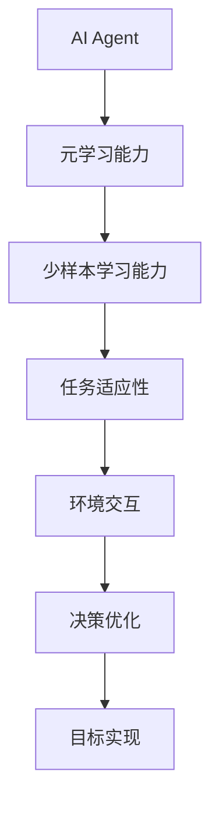
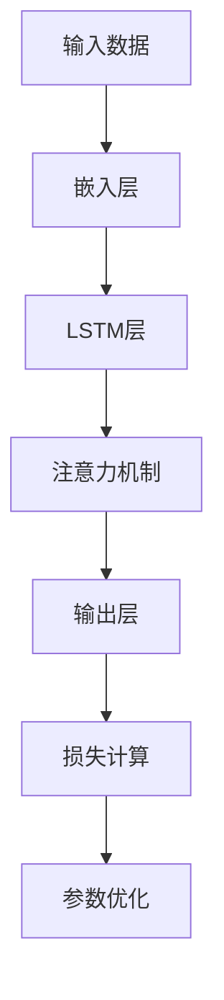
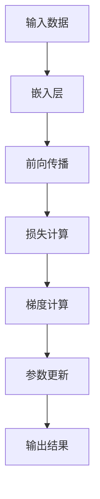
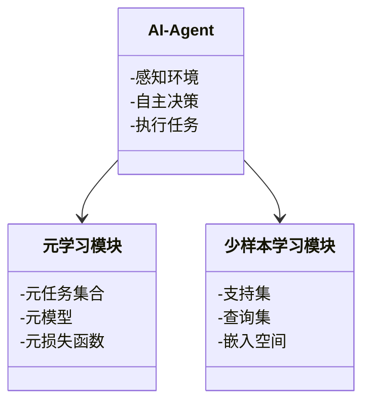
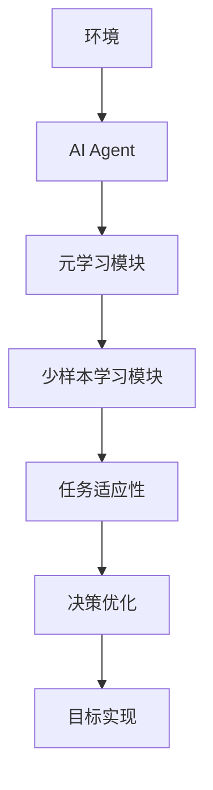
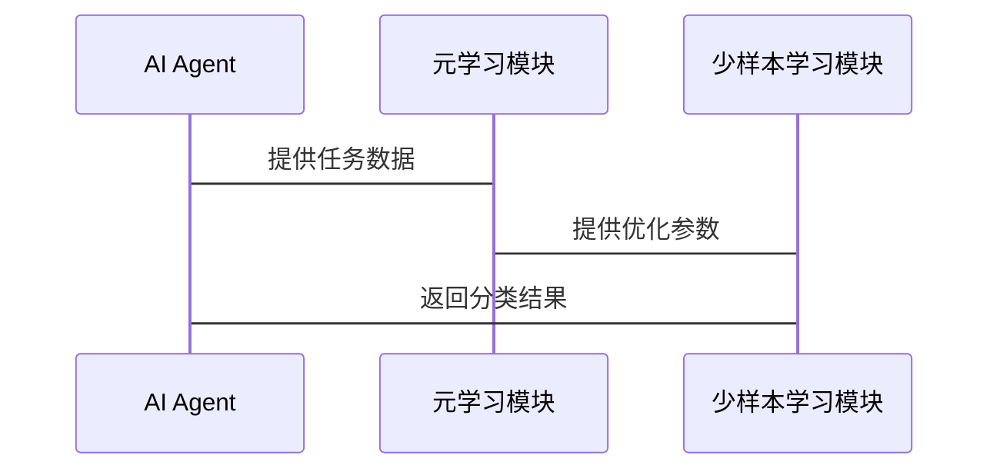

                 


# AI Agent的元学习与少样本学习能力

> 关键词：AI Agent，元学习，少样本学习，Meta-LSTM，MAML，深度学习

> 摘要：本文探讨AI Agent如何通过元学习和少样本学习技术提升自身能力，详细分析了元学习与少样本学习的核心原理、算法实现、系统架构及实际应用场景。通过案例分析和代码实现，深入剖析了Meta-LSTM和MAML等典型算法，并提出了实际应用中的注意事项与优化建议。

---

# 第一部分: AI Agent的元学习与少样本学习背景介绍

## 第1章: AI Agent的元学习与少样本学习概述

### 1.1 AI Agent的基本概念

#### 1.1.1 AI Agent的定义
AI Agent（人工智能代理）是一种能够感知环境、自主决策并执行任务的智能实体。它可以是一个软件程序、机器人或其他智能系统，核心目标是通过感知和行动与环境交互，以实现特定目标。

#### 1.1.2 AI Agent的核心功能与特点
- **自主性**：能够在没有外部干预的情况下独立运作。
- **反应性**：能够实时感知环境并做出反应。
- **目标导向性**：所有行为都围绕实现特定目标展开。
- **学习能力**：能够通过经验或数据优化自身的决策过程。

#### 1.1.3 AI Agent的应用场景与挑战
- **应用场景**：智能助手、自动驾驶、机器人控制、智能推荐系统等。
- **主要挑战**：复杂环境中的决策优化、实时性要求、数据获取的难度以及学习算法的效率。

### 1.2 元学习与少样本学习的背景

#### 1.2.1 元学习的定义与特点
- **定义**：元学习（Meta-Learning）是一种学习方法，目标是使模型能够快速适应新任务，而不是在特定任务上进行大量训练。
- **特点**：通用性、高效性、适应性。

#### 1.2.2 少样本学习的定义与特点
- **定义**：少样本学习（Few-shot Learning）是指在仅使用少量样本的情况下，模型仍能进行有效学习和分类。
- **特点**：数据效率高、适用于小数据集、依赖特征提取能力强的模型。

#### 1.2.3 元学习与少样本学习的结合
- **结合方式**：元学习用于优化少样本学习模型的参数，使其能够快速适应不同任务。
- **优势**：通过元学习，少样本学习模型能够在有限的数据下实现高性能。

### 1.3 问题背景与问题描述

#### 1.3.1 数据获取的挑战
- 数据获取成本高。
- 数据标注耗时耗力。
- 数据量不足时模型性能受限。

#### 1.3.2 少样本学习的核心问题
- 如何在仅少量样本的情况下，实现高精度分类或预测。
- 如何提升模型的泛化能力。

#### 1.3.3 元学习在AI Agent中的作用
- 提供快速适应新任务的能力。
- 优化模型的参数，使其更高效地进行学习。

### 1.4 问题解决与边界

#### 1.4.1 元学习如何解决少样本学习问题
- 通过元学习，模型能够快速调整参数，适应新任务。
- 元学习预训练的模型可以作为少样本学习的初始化参数。

#### 1.4.2 AI Agent的元学习能力边界
- 元学习适用于任务之间的关系较为密切的情况。
- 当任务差异较大时，元学习的效果可能受限。

#### 1.4.3 少样本学习的应用边界
- 适用于数据量较小的任务。
- 对特征提取能力要求较高。

### 1.5 概念结构与核心要素

#### 1.5.1 元学习的核心要素
- **元任务**：多个任务的集合，用于训练元学习模型。
- **元模型**：能够快速适应新任务的模型。
- **元损失函数**：用于优化元模型的损失函数。

#### 1.5.2 少样本学习的核心要素
- **支持集**：用于训练的少量样本。
- **查询集**：需要进行预测的样本。
- **嵌入空间**：将样本映射到低维空间，便于分类。

#### 1.5.3 AI Agent的元学习与少样本学习的结合
- **结合方式**：通过元学习预训练，提升少样本学习的性能。
- **应用场景**：在需要快速适应新任务的环境中，结合元学习和少样本学习，提升AI Agent的效率和性能。

---

# 第二部分: 核心概念与联系

## 第2章: 核心概念与联系

### 2.1 元学习与少样本学习的核心原理

#### 2.1.1 元学习的原理
- 元学习通过在多个任务上预训练模型，使其能够快速适应新任务。
- 元学习的核心是优化模型的参数，使其具有良好的泛化能力。

#### 2.1.2 少样本学习的原理
- 少样本学习通过在少量样本上进行训练，利用模型的特征提取能力进行分类。
- 少样本学习依赖于强大的特征提取能力和模型的泛化能力。

#### 2.1.3 元学习与少样本学习的联系
- 元学习为少样本学习提供了高效的参数初始化方式。
- 少样本学习为元学习提供了快速适应新任务的场景。

### 2.2 核心概念对比

#### 2.2.1 元学习与传统机器学习的对比

| 对比维度      | 元学习                          | 传统机器学习                      |
|---------------|---------------------------------|------------------------------------|
| 数据需求      | 通常需要多个任务，少量数据      | 需要大量数据                      |
| 适应性        | 能够快速适应新任务              | 需要重新训练                      |
| 计算效率      | 计算效率较高                    | 计算效率较低                      |

#### 2.2.2 少样本学习与传统监督学习的对比

| 对比维度      | 少样本学习                      | 传统监督学习                      |
|---------------|--------------------------------|------------------------------------|
| 数据需求      | 数据量小                        | 数据量大                          |
| 计算效率      | 计算效率较高                    | 计算效率较低                      |
| 泛化能力      | 泛化能力较强                    | 泛化能力一般                      |

#### 2.2.3 元学习与少样本学习的对比

| 对比维度      | 元学习                          | 少样本学习                      |
|---------------|---------------------------------|------------------------------------|
| 数据需求      | 需要多个任务，少量数据          | 数据量小                        |
| 适应性        | 能够快速适应新任务              | 适用于新任务                    |
| 计算效率      | 计算效率较高                    | 计算效率较高                      |

### 2.3 实体关系图



---

# 第三部分: 算法原理讲解

## 第3章: 算法原理讲解

### 3.1 典型算法分析

#### 3.1.1 Meta-LSTM算法

##### 算法原理
Meta-LSTM是一种基于循环神经网络的元学习算法，通过在多个任务上训练模型，使其能够快速适应新任务。

##### 算法流程图



##### 核心代码实现

```python
import torch
import torch.nn as nn
import torch.optim as optim

class MetaLSTM(nn.Module):
    def __init__(self, input_size, hidden_size, output_size):
        super(MetaLSTM, self).__init__()
        self.lstm = nn.LSTM(input_size, hidden_size, batch_first=True)
        self.fc = nn.Linear(hidden_size, output_size)
    
    def forward(self, x):
        out, _ = self.lstm(x)
        out = self.fc(out[:, -1, :])
        return out

# 示例用法
model = MetaLSTM(input_size=10, hidden_size=20, output_size=5)
optimizer = optim.Adam(model.parameters(), lr=0.001)
criterion = nn.CrossEntropyLoss()

for batch in batches:
    inputs, labels = batch
    outputs = model(inputs)
    loss = criterion(outputs, labels)
    loss.backward()
    optimizer.step()
```

##### 数学模型与公式
- LSTM的更新公式：
  $$ \tanh(gate) = \sigma(W_{x}x + W_{h}h) $$
  其中，$\sigma$表示sigmoid函数。

- 注意力机制：
  $$ \alpha_i = \frac{\exp(s_i)}{\sum_j \exp(s_j)} $$
  其中，$s_i$是第i个任务的相似度得分。

#### 3.1.2 MAML算法

##### 算法原理
MAML（Meta-Automated Learning）是一种基于梯度的元学习算法，通过在多个任务上优化模型的参数，使其能够快速适应新任务。

##### 算法流程图



##### 核心代码实现

```python
import torch
import torch.nn as nn
import torch.optim as optim

class MAML(nn.Module):
    def __init__(self, input_size, hidden_size, output_size):
        super(MAML, self).__init__()
        self.fc1 = nn.Linear(input_size, hidden_size)
        self.fc2 = nn.Linear(hidden_size, output_size)
    
    def forward(self, x):
        x = torch.relu(self.fc1(x))
        x = self.fc2(x)
        return x

# 示例用法
model = MAML(input_size=10, hidden_size=20, output_size=5)
optimizer = optim.Adam(model.parameters(), lr=0.001)
criterion = nn.CrossEntropyLoss()

for batch in batches:
    inputs, labels = batch
    outputs = model(inputs)
    loss = criterion(outputs, labels)
    loss.backward()
    optimizer.step()
```

##### 数学模型与公式
- MAML的优化目标：
  $$ \min_{\theta} \sum_{i=1}^{N} L_i(f_{\theta}(x_i), y_i) + \lambda \|\theta - \theta_0\|^2 $$
  其中，$\theta_0$是初始化参数，$\lambda$是正则化系数。

---

# 第四部分: 系统分析与架构设计方案

## 第4章: 系统分析与架构设计方案

### 4.1 问题场景介绍
AI Agent在实际应用中，需要快速适应不同环境和任务，元学习和少样本学习为其提供了高效的解决方案。

### 4.2 系统功能设计

#### 4.2.1 领域模型设计



#### 4.2.2 系统架构设计



### 4.3 系统接口设计

#### 4.3.1 元学习模块接口
- 输入：多个任务的数据集。
- 输出：优化后的模型参数。

#### 4.3.2 少样本学习模块接口
- 输入：支持集和查询集。
- 输出：分类结果。

### 4.4 系统交互流程



---

# 第五部分: 项目实战

## 第5章: 项目实战

### 5.1 环境安装

```bash
pip install torch
pip install matplotlib
pip install numpy
```

### 5.2 系统核心实现

#### 5.2.1 元学习模块实现

```python
import torch
import torch.nn as nn
import torch.optim as optim

class MetaLearningModule(nn.Module):
    def __init__(self, input_size, hidden_size, output_size):
        super(MetaLearningModule, self).__init__()
        self.fc1 = nn.Linear(input_size, hidden_size)
        self.fc2 = nn.Linear(hidden_size, output_size)
    
    def forward(self, x):
        x = torch.relu(self.fc1(x))
        x = self.fc2(x)
        return x

# 示例用法
model = MetaLearningModule(input_size=10, hidden_size=20, output_size=5)
optimizer = optim.Adam(model.parameters(), lr=0.001)
criterion = nn.CrossEntropyLoss()

for batch in batches:
    inputs, labels = batch
    outputs = model(inputs)
    loss = criterion(outputs, labels)
    loss.backward()
    optimizer.step()
```

#### 5.2.2 少样本学习模块实现

```python
import torch
import torch.nn as nn
import torch.optim as optim

class FewShotLearningModule(nn.Module):
    def __init__(self, input_size, hidden_size, output_size):
        super(FewShotLearningModule, self).__init__()
        self.fc1 = nn.Linear(input_size, hidden_size)
        self.fc2 = nn.Linear(hidden_size, output_size)
    
    def forward(self, x):
        x = torch.relu(self.fc1(x))
        x = self.fc2(x)
        return x

# 示例用法
model = FewShotLearningModule(input_size=10, hidden_size=20, output_size=5)
optimizer = optim.Adam(model.parameters(), lr=0.001)
criterion = nn.CrossEntropyLoss()

for batch in batches:
    inputs, labels = batch
    outputs = model(inputs)
    loss = criterion(outputs, labels)
    loss.backward()
    optimizer.step()
```

### 5.3 案例分析

#### 5.3.1 元学习在图像分类中的应用

```python
import torch
import torch.nn as nn
import torch.optim as optim
import torchvision
from torchvision import datasets, transforms

# 数据预处理
transform = transforms.Compose([
    transforms.Resize(32),
    transforms.ToTensor(),
    transforms.Normalize((0.5, 0.5, 0.5), (0.5, 0.5, 0.5))
])

# 加载数据集
train_dataset = datasets.CIFAR10(root='./data', train=True, download=True, transform=transform)
test_dataset = datasets.CIFAR10(root='./data', train=False, download=True, transform=transform)

# 定义模型
model = MetaLearningModule(input_size=3*32*32, hidden_size=128, output_size=10)

# 定义优化器和损失函数
optimizer = optim.Adam(model.parameters(), lr=0.001)
criterion = nn.CrossEntropyLoss()

# 训练模型
for epoch in range(10):
    for batch in train_loader:
        inputs, labels = batch
        outputs = model(inputs)
        loss = criterion(outputs, labels)
        loss.backward()
        optimizer.step()

# 测试模型
model.eval()
correct = 0
total = 0
with torch.no_grad():
    for batch in test_loader:
        inputs, labels = batch
        outputs = model(inputs)
        predicted = torch.argmax(outputs.data, 1)
        correct += (predicted == labels).sum().item()
        total += labels.size(0)

print('Accuracy: {}%'.format(100 * correct / total))
```

### 5.4 项目总结

#### 5.4.1 成功经验
- 元学习和少样本学习的结合能够显著提升AI Agent的适应性。
- 合适的模型架构和优化策略是关键。

#### 5.4.2 常见问题
- 数据量不足时，模型性能受限。
- 模型的泛化能力有待进一步提升。

---

# 第六部分: 最佳实践

## 第6章: 最佳实践

### 6.1 小结

- 元学习和少样本学习的结合为AI Agent提供了强大的能力。
- 通过合理选择算法和模型架构，能够显著提升性能。

### 6.2 注意事项

- 数据预处理和特征提取是关键。
- 模型的泛化能力需要重点关注。
- 训练过程中的超参数调优不可忽视。

### 6.3 拓展阅读

- 《Meta-Learning: A Survey》
- 《Few-shot Learning: A Review》
- 《Deep Learning for Visual Recognition》

---

# 作者：AI天才研究院/AI Genius Institute & 禅与计算机程序设计艺术 /Zen And The Art of Computer Programming

---

以上是《AI Agent的元学习与少样本学习能力》的完整目录和文章内容，希望对您有所帮助！

