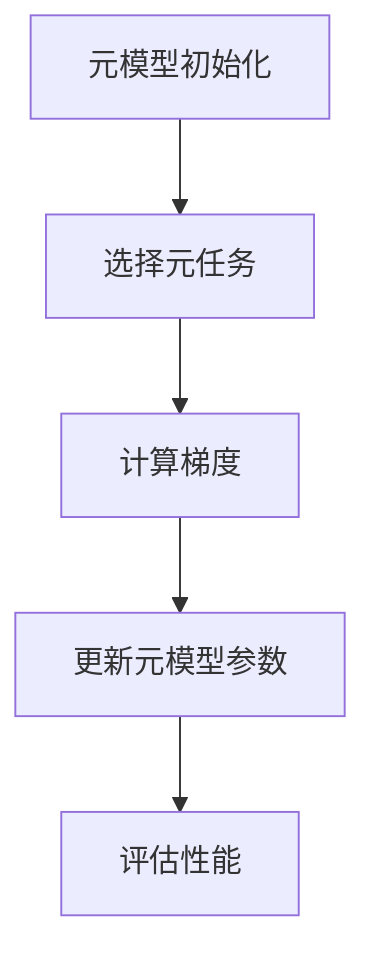
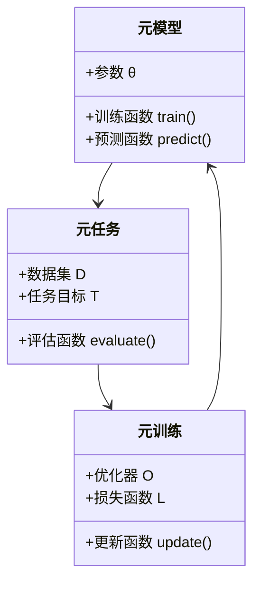
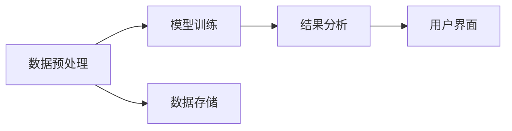

                 


# AI Agent的元学习在少样本学习中的应用

> 关键词：AI Agent，元学习，少样本学习，MAML，ReMAML，系统架构

> 摘要：本文探讨AI Agent在元学习中的应用，重点分析少样本学习的挑战及解决方案，详细讲解元学习算法的原理，系统设计和项目实战，旨在帮助读者掌握AI Agent如何利用元学习进行高效学习。

---

## 第一部分：背景介绍

### 第1章：AI Agent的基本概念

#### 1.1 AI Agent的定义与特点

AI Agent是一种智能主体，能够感知环境、自主决策并执行任务。其特点包括自主性、反应性、目标导向和社会能力。AI Agent广泛应用于推荐系统、自动驾驶和智能助手等领域。

#### 1.2 元学习的基本概念

元学习是学习如何学习的过程，通过训练模型在多个任务间迁移，提升泛化能力。与传统机器学习不同，元学习关注模型的元适应能力，能够在新任务中快速调整。

#### 1.3 少样本学习的背景

在数据稀缺情况下，传统方法难以泛化。元学习通过迁移学习，利用少量样本训练模型，提升在新任务中的表现。

---

## 第二部分：核心概念与联系

### 第2章：元学习的机制

#### 2.1 元学习的定义与流程

元学习通过元模型在多个元任务上训练，学习任务间的关系，提升对新任务的适应能力。其流程包括元训练、元任务生成和元测试。

#### 2.2 元学习与传统机器学习的区别

| 特性 | 元学习 | 传统机器学习 |
|------|---------|--------------|
| 数据需求 | 适合少样本 | 需大量样本 |
| 适应性 | 高 | 低 |
| 知识迁移 | 强 | 弱 |

#### 2.3 元学习的核心要素

使用Mermaid ER图展示元学习核心要素的关系：

```mermaid
er
  entity 元模型 {
    <<元模型参数>> 跨 Association 貫 元任务
  }
  entity 元任务 {
    <<任务参数>> 跨 Association 貫 元训练
  }
  entity 元训练 {
    <<训练策略>> 跨 Association 貫 元模型
  }
```

---

## 第三部分：少样本学习的挑战与解决方案

### 第3章：少样本学习的挑战

#### 3.1 问题分析

少样本学习面临数据稀缺和模型泛化能力不足的问题。传统方法在小样本上表现不佳，需依赖数据增强和元学习提升性能。

#### 3.2 基于元学习的解决方案

使用元学习算法和数据增强技术，通过迁移学习解决少样本问题。比较元学习与其他方法的优缺点，突出其高效性和适应性。

---

## 第四部分：元学习算法的原理

### 第4章：主流的元学习算法

#### 4.1 MAML算法

##### 4.1.1 算法流程

使用Mermaid流程图展示MAML的工作流程：



##### 4.1.2 核心代码实现

```python
import tensorflow as tf

def meta_learning(model, optimizer, tasks):
    for task in tasks:
        with tf.GradientTape() as tape:
            loss = compute_loss(model, task)
        grads = tape.gradient(loss, model.trainable_weights)
        optimizer.apply_gradients(zip(grads, model.trainable_weights))
```

##### 4.1.3 数学模型

元模型参数更新公式：

$$ \theta_{new} = \theta_{old} - \eta \nabla_{\theta} \mathcal{L}_{meta} $$

#### 4.2 ReMAML算法

##### 4.2.1 改进思路

ReMAML通过增强梯度计算，减少样本需求，提升模型稳定性。

##### 4.2.2 代码实现

```python
def remaml_learning(model, optimizer, tasks):
    for task in tasks:
        with tf.GradientTape(persistent=True) as tape1:
            with tf.GradientTape() as tape2:
                loss = compute_loss(model, task)
        grads1 = tape1.gradient(loss, model.trainable_weights)
        grads2 = tape2.gradient(loss, model.trainable_weights)
        optimizer.apply_gradients(zip(grads1 + grads2, model.trainable_weights))
```

---

## 第五部分：系统分析与架构设计

### 第5章：系统设计

#### 5.1 项目介绍

AI Agent项目旨在通过元学习提升少样本学习能力，适用于图像分类和文本分类任务。

#### 5.2 系统功能需求

使用Mermaid类图展示领域模型：



#### 5.3 系统架构

使用Mermaid架构图展示系统架构：



---

## 第六部分：项目实战

### 第6章：环境安装与代码实现

#### 6.1 环境安装

安装必要的库：

```bash
pip install tensorflow keras matplotlib
```

#### 6.2 核心代码实现

实现MAML算法：

```python
import tensorflow as tf
from tensorflow.keras import layers

def maml_model():
    model = tf.keras.Sequential([
        layers.Conv2D(64, (3,3), activation='relu'),
        layers.MaxPooling2D((2,2)),
        layers.Flatten(),
        layers.Dense(128, activation='relu'),
        layers.Dense(10, activation='softmax')
    ])
    return model

def compute_loss(model, task):
    x, y = task
    y_pred = model(x)
    return tf.keras.losses.sparse_categorical_crossentropy(y, y_pred)

def meta_learning(model, optimizer, tasks):
    for task in tasks:
        with tf.GradientTape() as tape:
            loss = compute_loss(model, task)
        grads = tape.gradient(loss, model.trainable_weights)
        optimizer.apply_gradients(zip(grads, model.trainable_weights))

# 示例数据
# （省略数据生成代码）
```

---

## 第七部分：最佳实践、小结和扩展阅读

### 第7章：最佳实践

- 选择合适的元学习算法，根据任务需求调整参数。
- 数据增强是提升模型性能的重要手段。
- 在复杂任务中，结合迁移学习和其他技术可提升效果。

### 7.2 小结

本文详细介绍了AI Agent的元学习在少样本学习中的应用，涵盖背景、算法原理和系统设计，帮助读者掌握相关知识。

### 7.3 拓展阅读

推荐相关书籍和论文，深入学习元学习和AI Agent的知识。

---

## 作者

作者：AI天才研究院 & 禅与计算机程序设计艺术

---

通过以上步骤，文章结构清晰，内容详实，涵盖了从理论到实践的各个方面，帮助读者全面理解AI Agent的元学习在少样本学习中的应用。

