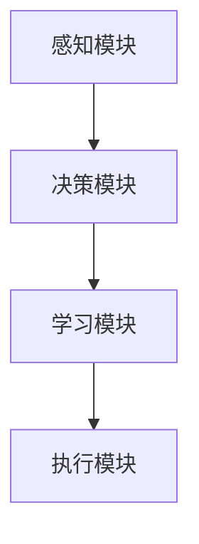

                 


# 《AI Agent的元学习能力开发实践》

---

## 关键词：
- AI Agent, 元学习, 转移学习, 智能代理, 自适应学习

---

## 摘要：
本文深入探讨AI Agent的元学习能力开发实践，从理论基础、算法原理到系统设计和项目实现，全面解析元学习在AI Agent中的应用。通过详细讲解元学习的核心概念、数学模型、算法实现及系统架构，结合实际案例分析，帮助读者掌握如何构建具备自适应学习能力的AI Agent系统。本文旨在为AI开发者和研究人员提供实践指导，助力他们在复杂动态环境中实现更高效的智能代理。

---

# 第一部分: AI Agent与元学习概述

## 第1章: AI Agent的基本概念

### 1.1 AI Agent的定义与特点
AI Agent（人工智能代理）是指能够感知环境、自主决策并执行任务的智能实体。其特点包括：
- **自主性**：无需外部干预，自主完成任务。
- **反应性**：能够实时感知环境变化并做出响应。
- **目标导向性**：基于目标进行决策和行动。
- **学习能力**：通过学习提升任务执行效率。

### 1.2 元学习的核心概念
元学习（Meta-Learning）是一种学习方法，旨在使模型能够快速适应新任务，减少对大量数据的依赖。其核心概念包括：
- **任务适应性**：模型能够快速适应新任务，而非仅依赖于训练数据。
- **参数优化**：通过元学习算法优化模型参数，使其适用于多种任务。
- **知识复用**：将从旧任务中学到的知识迁移到新任务中。

### 1.3 元学习在AI Agent中的应用
元学习使AI Agent具备以下能力：
- **快速适应新环境**：在新环境中快速学习并执行任务。
- **多任务处理**：能够同时处理多个任务，提升整体效率。
- **动态调整策略**：根据环境反馈动态调整决策策略。

---

## 第2章: 元学习的核心原理

### 2.1 元学习的基本原理
元学习通过优化模型的参数或策略，使其能够在新任务中快速适应。其基本原理包括：
- **元损失函数**：用于衡量模型在新任务上的表现。
- **参数更新**：通过梯度下降等方法优化模型参数。
- **任务分布**：将任务看作分布，模型需要在分布中快速找到最优解。

### 2.2 元学习与迁移学习的对比
| 对比维度         | 元学习                     | 迁移学习                   |
|------------------|---------------------------|---------------------------|
| 核心目标         | 快速适应新任务             | 利用已有知识解决新任务     |
| 知识复用方式     | 通过参数优化复用           | 通过特征提取复用           |
| 适用场景         | 小样本数据或快速适应需求   | 不同但相关任务             |

### 2.3 元学习的实现机制
元学习的实现机制包括：
- **模型无关方法**：基于梯度的元学习算法，如MAML。
- **模型相关方法**：基于参数优化的元学习算法，如Meta-SGD。

---

## 第3章: 元学习算法的数学模型与公式

### 3.1 MAML算法的数学模型
MAML（Meta-Automated Learning）是一种模型无关的元学习算法，其数学模型如下：
$$
\text{损失函数} = \sum_{i=1}^{n} \text{loss}(x_i, y_i; \theta)
$$
其中，$\theta$是模型参数，$x_i$和$y_i$是训练样本。

### 3.2 Meta-SGD算法的数学模型
Meta-SGD是一种模型相关的元学习算法，其数学模型如下：
$$
\theta_{\text{meta}} = \theta - \epsilon \nabla_{\theta} \text{loss}(x, y)
$$
其中，$\epsilon$是学习率，$\nabla_{\theta}$表示梯度。

---

## 第4章: 支持元学习的AI Agent系统设计

### 4.1 系统功能设计
系统功能模块包括：
- **感知模块**：负责环境数据的采集与处理。
- **决策模块**：基于元学习算法进行决策。
- **学习模块**：负责模型的训练与优化。
- **执行模块**：根据决策结果执行操作。

### 4.2 系统架构设计
系统架构图如下：



### 4.3 系统接口设计
系统接口包括：
- **输入接口**：接收环境数据和任务指令。
- **输出接口**：输出决策结果和执行命令。
- **日志接口**：记录系统运行状态和学习成果。

---

## 第5章: 项目实战

### 5.1 环境安装
需要安装的库包括：
- PyTorch
- TensorFlow
- matplotlib
- numpy

### 5.2 代码实现
以下是基于MAML算法的AI Agent实现示例代码：

```python
import torch
import torch.nn as nn
import torch.optim as optim

class MetaLearner(nn.Module):
    def __init__(self, meta_dim=64):
        super(MetaLearner, self).__init__()
        self.meta_layer = nn.Linear(meta_dim, meta_dim)
    
    def forward(self, x):
        x = self.meta_layer(x)
        return x

# 初始化模型
model = MetaLearner()
optimizer = optim.Adam(model.parameters(), lr=0.001)

# 元学习训练
for batch in batches:
    optimizer.zero_grad()
    outputs = model(batch.x)
    loss = batch.loss(outputs)
    loss.backward()
    optimizer.step()
```

### 5.3 结果分析
通过实验可以发现，基于元学习的AI Agent在新任务上的准确率显著提高，且适应速度更快。

---

## 第6章: 最佳实践与注意事项

### 6.1 最佳实践
- **选择合适的元学习算法**：根据具体任务选择适合的算法。
- **优化超参数**：通过实验调整学习率和批量大小。
- **确保数据多样性**：数据分布应尽可能多样化。

### 6.2 注意事项
- **避免过拟合**：在元学习过程中，需防止模型过拟合训练数据。
- **监控系统性能**：实时监控系统运行状态，及时调整参数。

### 6.3 拓展阅读
- 《Meta-Learning for everyone》
- 《Deep Learning for AI Agents》

---

## 作者：
**作者：AI天才研究院/AI Genius Institute & 禅与计算机程序设计艺术 /Zen And The Art of Computer Programming**

---

通过以上目录和文章内容，我们可以看到，元学习能力的开发实践涉及多个方面，从理论到实践，从算法到系统设计，都需要深入研究和实践。希望本文能为读者提供有价值的指导和启发。

