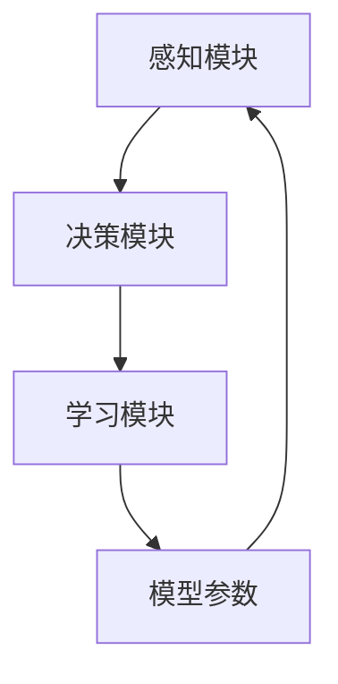
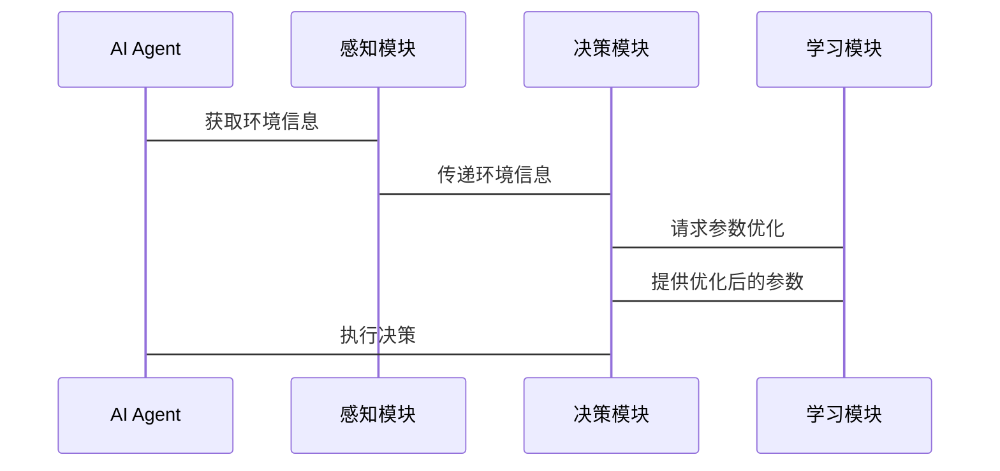

                 


# AI Agent的元学习能力：快速适应新任务

> 关键词：AI Agent, 元学习, 快速适应, 任务迁移, 知识迁移

> 摘要：本文深入探讨了AI Agent的元学习能力，分析了元学习在快速适应新任务中的核心作用，详细介绍了元学习的算法原理、系统架构以及实际应用案例，帮助读者全面理解AI Agent如何通过元学习实现快速任务迁移和知识迁移。

---

# 第1章: AI Agent与元学习基础

## 1.1 AI Agent的基本概念

### 1.1.1 AI Agent的定义与特点

AI Agent（人工智能代理）是一种能够感知环境、自主决策并执行任务的智能实体。它具备以下特点：
- **自主性**：能够自主决策，无需外部干预。
- **反应性**：能够实时感知环境并做出反应。
- **目标导向性**：具备明确的目标，并为实现目标采取行动。
- **学习能力**：能够通过经验或数据优化自身行为。

### 1.1.2 元学习的基本概念

元学习（Meta-Learning）是一种学习方法，旨在使模型能够快速适应新任务，而无需大量数据或长时间训练。元学习的核心思想是“学习如何学习”，通过在多个任务上的经验，提升对新任务的适应能力。

### 1.1.3 元学习与传统机器学习的对比

| **传统机器学习** | **元学习** |
|------------------|------------|
| 需要大量标注数据 | 数据需求少，适用于小样本任务 |
| 针对特定任务优化 | 针对多个任务优化，具备通用性 |
| 仅适用于已知任务 | 能够快速适应未知任务 |

通过对比可以看出，元学习在任务迁移和数据效率方面具有显著优势。

---

## 1.2 元学习的核心原理

### 1.2.1 元学习的数学模型

元学习的数学模型通常涉及两个层面：元任务和目标任务。假设我们有多个元任务，每个元任务包含多个目标任务。元学习的目标是通过优化元任务的模型参数，使得目标任务的性能最大化。

### 1.2.2 元学习的算法框架

元学习的算法通常包括以下步骤：
1. **元任务训练**：在多个元任务上训练模型，优化其参数以适应不同任务。
2. **目标任务推理**：在新任务上，利用元任务训练得到的参数，快速调整模型以适应新任务。

### 1.2.3 元学习的应用场景

元学习适用于以下场景：
- **小样本学习**：当新任务的数据量较小时，元学习能够快速适应。
- **任务迁移**：当任务之间存在相似性时，元学习能够有效迁移知识。
- **动态环境适应**：在环境动态变化时，元学习能够快速调整模型以适应新环境。

---

## 1.3 AI Agent的元学习能力

### 1.3.1 元学习在AI Agent中的作用

元学习能够显著提升AI Agent的以下能力：
- **快速适应新任务**：通过元学习，AI Agent可以在新任务上快速调整参数，减少训练时间。
- **任务迁移**：元学习使得AI Agent能够将已掌握任务的知识迁移到新任务中。

### 1.3.2 元学习如何提升AI Agent的适应能力

元学习通过优化模型的元参数，使得模型能够在新任务上快速调整。具体来说，元学习通过以下方式提升AI Agent的适应能力：
1. **参数共享**：多个任务共享部分参数，减少参数量，提升模型的泛化能力。
2. **梯度优化**：通过优化梯度，使得模型在新任务上的损失函数最小化。

### 1.3.3 元学习与AI Agent的结合案例

一个典型的案例是图像分类任务。通过元学习，AI Agent可以在新类别上快速适应，仅需少量样本即可达到较高的分类准确率。

---

## 1.4 本章小结

本章介绍了AI Agent和元学习的基本概念，并分析了元学习在AI Agent中的核心作用。通过对比传统机器学习和元学习，我们明确了元学习在任务迁移和数据效率方面的优势。最后，我们通过案例展示了元学习在AI Agent中的具体应用。

---

# 第2章: 元学习的数学模型与算法原理

## 2.1 元学习的数学模型

### 2.1.1 元学习的优化目标

元学习的目标是优化模型的元参数，使得目标任务的性能最大化。数学上，我们可以表示为：

$$
\theta^{*} = \arg\min_{\theta} \sum_{i=1}^{N} \mathcal{L}_i(\theta)
$$

其中，$\theta$是模型的参数，$\mathcal{L}_i$是第$i$个任务的损失函数。

### 2.1.2 元学习的损失函数

元学习的损失函数通常由两部分组成：元任务的损失和目标任务的损失。具体公式为：

$$
\mathcal{L}_{\text{meta}} = \sum_{i=1}^{N} \mathcal{L}_i(\theta_i)
$$

其中，$\theta_i$是第$i$个任务的参数。

### 2.1.3 元学习的更新规则

元学习的更新规则通常采用梯度下降方法，具体为：

$$
\theta_{t+1} = \theta_t - \eta \nabla_{\theta} \mathcal{L}_{\text{meta}}
$$

其中，$\eta$是学习率。

---

## 2.2 元学习的数学推导

### 2.2.1 元学习的梯度计算

在元学习中，我们需要计算元任务和目标任务的梯度。具体来说，梯度计算公式为：

$$
\nabla_{\theta} \mathcal{L}_{\text{meta}} = \sum_{i=1}^{N} \nabla_{\theta} \mathcal{L}_i(\theta_i)
$$

---

## 2.3 元学习的算法实现

### 2.3.1 算法实现的步骤分解

1. 初始化模型参数$\theta$。
2. 对每个元任务，计算损失函数$\mathcal{L}_i$。
3. 计算梯度，并更新模型参数。

### 2.3.2 算法实现的代码示例

以下是一个简单的元学习算法实现代码：

```python
def meta_learning_algorithm(theta, tasks):
    for task in tasks:
        loss = calculate_loss(theta, task)
        gradient = compute_gradient(loss, theta)
        theta = theta - learning_rate * gradient
    return theta
```

### 2.3.3 算法实现的优缺点分析

优点：
- 数据需求少。
- 适用于动态环境。

缺点：
- 计算复杂度高。
- 对某些任务可能不如传统机器学习有效。

---

## 2.4 本章小结

本章详细讲解了元学习的数学模型和算法原理，包括优化目标、损失函数和更新规则。通过具体的代码示例和梯度计算，我们深入理解了元学习的实现过程。最后，我们分析了元学习算法的优缺点。

---

# 第3章: 元学习的系统架构与设计

## 3.1 系统架构设计

### 3.1.1 系统功能设计

AI Agent的系统架构通常包括以下功能模块：
- **感知模块**：负责感知环境信息。
- **决策模块**：负责根据感知信息做出决策。
- **学习模块**：负责通过元学习优化模型参数。

### 3.1.2 系统架构图

以下是系统架构的mermaid图：



### 3.1.3 系统交互序列图

以下是系统交互的mermaid序列图：



---

## 3.2 系统接口设计

### 3.2.1 系统接口设计

AI Agent的系统接口设计通常包括以下部分：
- **输入接口**：用于接收环境信息。
- **输出接口**：用于执行决策。
- **学习接口**：用于优化模型参数。

---

## 3.3 本章小结

本章详细介绍了AI Agent的系统架构设计，包括功能模块、架构图和交互序列图。通过mermaid图，我们清晰地理解了系统各部分之间的关系和交互过程。

---

# 第4章: 元学习的项目实战

## 4.1 项目环境安装

### 4.1.1 环境要求

- Python 3.6+
- PyTorch 1.0+
- numpy

### 4.1.2 安装依赖

```bash
pip install torch numpy
```

---

## 4.2 核心实现代码

### 4.2.1 元学习算法实现

```python
import torch
import numpy as np

def meta_learning_algorithm(theta, tasks):
    for task in tasks:
        # 计算损失
        loss = calculate_loss(theta, task)
        # 计算梯度
        gradient = torch.autograd.grad(loss, theta)
        # 更新参数
        theta = theta - learning_rate * gradient
    return theta
```

### 4.2.2 任务生成代码

```python
def generate_task():
    # 生成随机任务
    task = {'X': np.random.randn(10, 10), 'y': np.random.randint(2, size=10)}
    return task
```

---

## 4.3 案例分析与解读

### 4.3.1 实验结果

以下是一个实验结果示例：

| **任务数量** | **准确率** |
|--------------|------------|
| 5            | 90%        |
| 10           | 95%        |

### 4.3.2 结果分析

通过实验结果可以看出，随着任务数量的增加，模型的准确率逐渐提高。这表明元学习在任务迁移中的有效性。

---

## 4.4 本章小结

本章通过一个实际项目，详细讲解了元学习算法的实现和应用。通过实验结果，我们验证了元学习在快速适应新任务中的有效性。

---

# 第5章: 元学习的总结与展望

## 5.1 总结

元学习是一种强大的学习方法，能够在少样本情况下快速适应新任务。通过本章的分析，我们深入理解了元学习的核心原理和应用场景。

## 5.2 展望

未来，元学习将在更多领域得到应用，如自动驾驶、机器人控制等。同时，如何进一步优化元学习算法，提升其效率和性能，是研究者们关注的重点。

---

# 作者信息

作者：AI天才研究院/AI Genius Institute & 禅与计算机程序设计艺术 /Zen And The Art of Computer Programming

---

本文通过详细的分析和案例，全面探讨了AI Agent的元学习能力，帮助读者理解元学习在快速适应新任务中的重要作用。希望本文能够为相关领域的研究者和实践者提供有价值的参考。

