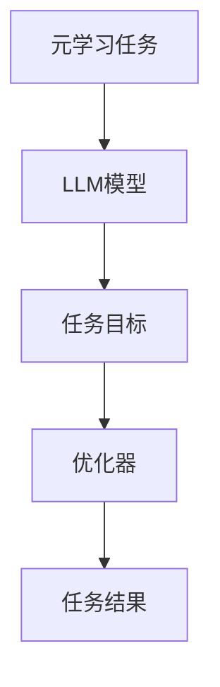
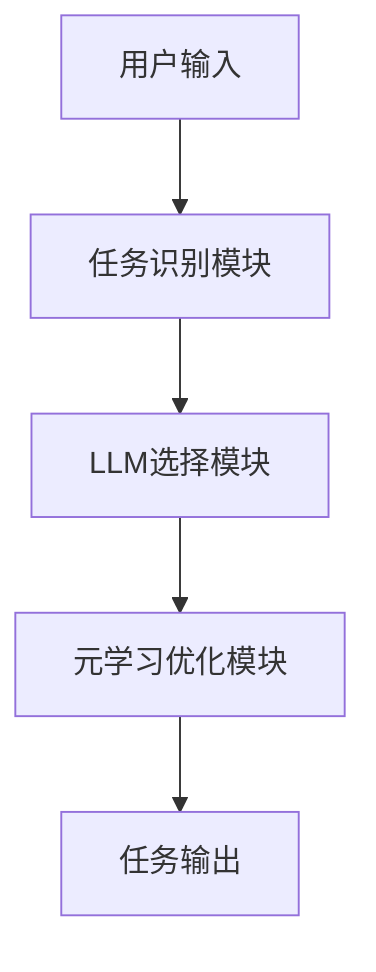

                 


# AI Agent的元学习：快速适应新任务的LLM

> 关键词：元学习，大语言模型，AI Agent，快速适应，任务迁移

> 摘要：本文深入探讨了AI Agent在元学习中的应用，特别是如何通过大语言模型（LLM）实现快速适应新任务。文章从元学习的基本原理出发，结合LLM的特性，详细分析了元学习与LLM的结合方式，以及在实际场景中的应用。通过数学公式、流程图和代码示例，本文为读者提供了全面的技术视角，帮助理解如何利用元学习提升AI Agent的任务适应能力。

---

## 第1章 AI Agent与元学习概述

### 1.1 问题背景与描述

传统AI模型在面对新任务时，通常需要大量的数据和时间进行重新训练，这在实际应用中效率低下。例如，当一个图像分类模型需要适应新的类别时，可能需要重新收集和标注数千张图片，这不仅耗时，还成本高昂。

元学习的目标是让模型能够在新任务上快速适应，通过学习如何学习，从而减少对新数据的依赖。AI Agent作为智能体，需要在动态环境中执行多种任务，元学习为其提供了快速调整策略的能力。

### 1.2 元学习的核心概念

元学习是一种通过学习如何学习的方法，其核心在于优化模型的优化过程。与传统机器学习不同，元学习不仅关注最终的预测结果，还关注模型如何调整自身以适应新任务。

元学习的关键在于其元优化器，它通过优化模型的优化过程，使得模型能够在新任务上快速收敛。这种机制类似于人类的学习过程，即通过总结经验，快速适应新环境。

### 1.3 大语言模型的背景

大语言模型（LLM）如GPT-3、PaLM等，具有强大的上下文理解和生成能力。LLM的核心优势在于其参数规模和预训练能力，使其能够在各种任务上表现出色，无需额外的数据标注。

AI Agent结合LLM，可以利用LLM的自然语言理解和生成能力，快速理解任务描述，并生成相应的执行策略。元学习的引入，进一步提升了AI Agent的任务适应能力，使其能够在新任务上快速调整策略。

### 1.4 本章小结

本章介绍了元学习的基本原理和AI Agent的需求背景，重点分析了元学习与LLM的结合方式。通过理解元学习的核心概念，我们可以更好地利用LLM的能力，提升AI Agent的任务适应性。

---

## 第2章 元学习与大语言模型的关系

### 2.1 元学习的核心原理

元学习的核心在于通过优化优化过程来提升模型的泛化能力。具体来说，元学习算法通过在多个任务上训练模型，使得模型能够快速适应新任务。

元学习的数学模型通常包括两个优化过程：元优化和任务优化。元优化负责调整模型的参数，使其能够快速适应新任务；任务优化则在具体任务上进行微调。

### 2.2 大语言模型的特性

LLM具有以下关键特性：
- **大规模参数**：通常包含 billions级别的参数，能够捕获复杂的语言模式。
- **上下文理解**：能够通过上下文理解任务需求，并生成相应的输出。
- **可微调性**：可以在少量数据上进行微调，快速适应新任务。

### 2.3 元学习与LLM的结合

元学习与LLM的结合主要体现在以下方面：
- **快速适应**：通过元学习，LLM可以在新任务上快速调整其输出策略。
- **任务多样性**：元学习能够处理多种任务类型，包括分类、生成等，提升了AI Agent的灵活性。
- **协同优化**：元学习优化了LLM的优化过程，使其在新任务上的表现更加高效。

### 2.4 核心概念对比表

| 对比项        | 传统机器学习         | 元学习             |
|---------------|----------------------|--------------------|
| 数据需求      | 高                  | 低                 |
| 任务适应性    | 弱                  | 强                 |
| 训练时间      | 长                  | 短                 |

### 2.5 ER实体关系图



---

## 第3章 元学习算法原理

### 3.1 元学习算法概述

元学习算法通常包括以下步骤：
1. 初始化模型参数。
2. 在多个任务上训练模型，生成候选策略。
3. 通过元优化器优化模型参数，使得候选策略在新任务上表现最优。

### 3.2 基于梯度的元学习算法

#### MAML算法原理

MAML通过在多个任务上进行梯度下降，使得模型能够快速适应新任务。具体步骤如下：

1. 在任务i上，计算梯度$$\nabla_\theta L_i$$。
2. 使用该梯度更新模型参数$$\theta = \theta - \eta \nabla_\theta L_i$$。
3. 在所有任务上进行上述操作，最终得到优化后的参数。

#### Meta-SGD算法原理

Meta-SGD通过共享的优化器来更新模型参数，具体步骤如下：

1. 在任务i上，计算梯度$$\nabla_\theta L_i$$。
2. 使用共享的优化器$$\theta = \theta - \eta \nabla_\theta L_i$$。
3. 在所有任务上进行上述操作，最终得到优化后的参数。

### 3.3 元学习的数学模型

元学习的损失函数通常包括两个部分：任务损失和元损失。具体公式如下：

$$
L = \lambda L_{task} + (1-\lambda) L_{meta}
$$

其中，$$L_{task}$$是具体任务的损失，$$L_{meta}$$是元损失，用于衡量模型在新任务上的适应能力。

---

## 第4章 系统分析与架构设计

### 4.1 问题场景介绍

AI Agent需要在动态环境中执行多种任务，例如对话生成、文本摘要等。通过元学习，AI Agent可以在新任务上快速调整策略，提升性能。

### 4.2 系统功能设计

系统功能设计包括以下部分：
- **任务识别**：识别新任务的需求。
- **模型选择**：选择适合的LLM模型。
- **任务优化**：通过元学习优化模型参数。

### 4.3 系统架构设计

系统架构设计如下：



### 4.4 系统接口设计

系统接口设计包括以下部分：
- **输入接口**：接收用户输入的任务描述。
- **输出接口**：输出优化后的任务结果。
- **元学习接口**：与LLM模型进行交互，优化模型参数。

---

## 第5章 项目实战

### 5.1 环境安装

安装所需的库：
```bash
pip install transformers torch
```

### 5.2 核心代码实现

```python
import torch
from transformers import AutoTokenizer, AutoModelForCausalLM

# 初始化模型和tokenizer
model_name = "gpt2-large"
tokenizer = AutoTokenizer.from_pretrained(model_name)
model = AutoModelForCausalLM.from_pretrained(model_name)

# 定义元学习优化器
class MetaOptimizer:
    def __init__(self, model):
        self.model = model
        self.optimizer = torch.optim.Adam(model.parameters(), lr=1e-2)
    
    def step(self, loss):
        self.optimizer.zero_grad()
        loss.backward()
        self.optimizer.step()

# 元学习训练
def meta_train():
    optimizer = MetaOptimizer(model)
    for batch in batches:
        optimizer.zero_grad()
        loss = calculate_loss(batch)
        optimizer.step(loss)
```

### 5.3 代码解读与分析

上述代码展示了元学习的基本训练流程，包括模型初始化、元优化器定义和训练循环。通过元优化器，模型能够在新任务上快速调整参数。

### 5.4 实际案例分析

以文本摘要任务为例，假设我们有一个新的领域，例如医学摘要。通过元学习，模型可以在少量数据上快速适应新领域，生成准确的摘要。

---

## 第6章 总结与展望

### 6.1 最佳实践 tips

- 在实际应用中，建议先进行小样本测试，验证元学习的效果。
- 定期更新模型参数，保持模型的适应能力。

### 6.2 小结

本文详细探讨了AI Agent的元学习方法，特别是如何利用大语言模型快速适应新任务。通过数学公式、流程图和代码示例，我们展示了元学习的核心原理和实际应用。

### 6.3 注意事项

- 元学习的效果依赖于任务的相似性，任务越相似，效果越好。
- 需要注意模型的泛化能力，避免过拟合。

### 6.4 拓展阅读

推荐阅读《Meta-Learning: A Survey》和《Large Language Models: A Comprehensive Survey》。

---

作者：AI天才研究院

