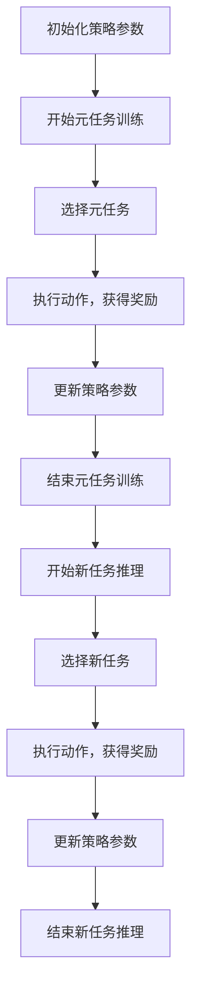
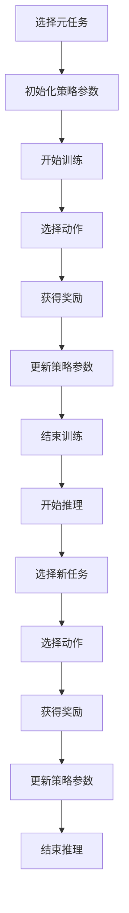
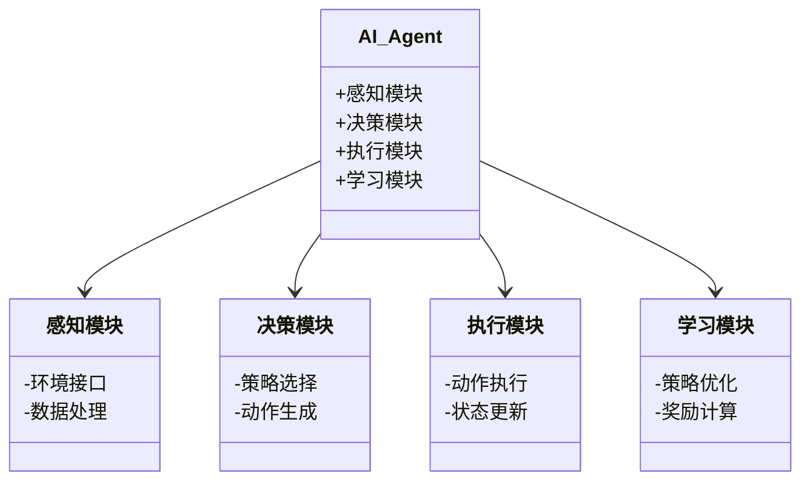
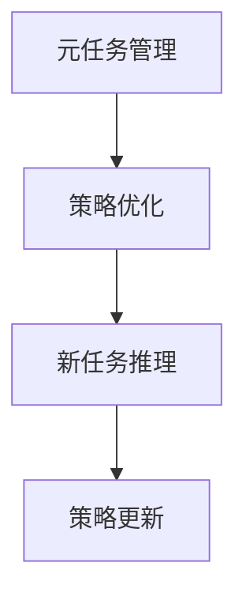

                 


# AI Agent的元强化学习策略开发

> 关键词：AI Agent, 元强化学习, 策略开发, 系统架构, 项目实战

> 摘要：本文深入探讨了AI Agent在元强化学习中的策略开发，从基本概念到算法原理，再到系统架构和项目实战，结合实际案例，全面解析了AI Agent的元强化学习策略开发过程。通过详细的理论分析和实践指导，帮助读者掌握AI Agent的元强化学习策略开发的核心方法和技术。

---

## 第一部分：AI Agent与元强化学习背景

### 第1章：AI Agent的基本概念与应用

#### 1.1 AI Agent的定义与特点

AI Agent（人工智能代理）是一种智能体，能够感知环境、自主决策并采取行动以实现特定目标。AI Agent的核心特点包括：

- **自主性**：能够自主决策，无需外部干预。
- **反应性**：能够实时感知环境并做出反应。
- **学习能力**：能够通过经验改进性能。
- **社交能力**：能够与其他Agent或人类进行交互。

AI Agent广泛应用于自动驾驶、智能助手、机器人控制等领域。

#### 1.2 强化学习的基本原理

强化学习（Reinforcement Learning，RL）是一种机器学习范式，通过智能体与环境的交互，学习最优策略以最大化累积奖励。强化学习的核心要素包括：

- **状态（State）**：环境的当前情况。
- **动作（Action）**：智能体采取的行动。
- **奖励（Reward）**：智能体采取动作后获得的反馈。
- **策略（Policy）**：智能体选择动作的概率分布。
- **值函数（Value Function）**：预测状态或动作-状态对的未来累积奖励。

#### 1.3 元强化学习的背景与意义

元强化学习（Meta-Reinforcement Learning）是在强化学习基础上的延伸，旨在通过学习一组策略或任务，提升智能体在新任务或环境中的适应能力。元强化学习的意义在于：

- **快速适应新环境**：通过学习多个任务，智能体能够更快地适应新任务。
- **通用性增强**：元强化学习使得AI Agent具备更强的通用性和灵活性。
- **提升性能**：通过元学习，智能体能够在较少的数据或环境中实现高性能。

---

## 第二部分：元强化学习的原理与算法

### 第2章：元强化学习的核心概念与原理

#### 2.1 元强化学习的定义与特点

元强化学习（Meta-Reinforcement Learning）是一种通过学习多个任务或环境，提升智能体在新任务中性能的强化学习方法。其核心概念包括：

- **元任务（Meta-Tasks）**：一组用于训练的子任务或环境。
- **元学习目标**：学习如何快速适应新任务。
- **策略更新**：通过元任务的训练，更新策略以适应新任务。

元强化学习的特点包括：

- **快速适应**：智能体能够在新任务中快速找到最优策略。
- **通用性**：适用于多种任务和环境。
- **高效性**：通过元学习减少对新任务数据的需求。

#### 2.2 元强化学习的算法框架

元强化学习的算法框架通常包括以下几个步骤：

1. **初始化**：设置初始策略参数。
2. **元任务训练**：在多个元任务上训练策略，优化参数以适应多个任务。
3. **新任务推理**：在新任务中，根据优化后的策略参数快速调整，找到最优动作。

以下是元强化学习的算法框架示意图：



元强化学习的数学模型通常涉及价值函数和策略梯度。例如，元学习可以通过优化以下目标函数：

$$
\theta = \arg \max_{\theta} \sum_{i=1}^{N} R_i(\theta)
$$

其中，$R_i(\theta)$ 表示第 $i$ 个元任务的奖励函数。

---

## 第三部分：AI Agent的元强化学习策略开发

### 第3章：AI Agent的元强化学习策略设计

#### 3.1 元强化学习策略的设计原则

在设计AI Agent的元强化学习策略时，需要遵循以下原则：

1. **明确目标**：确保策略能够实现特定目标。
2. **适应性**：策略应能够快速适应新任务。
3. **高效性**：策略应在有限的训练数据和时间内实现高性能。
4. **可扩展性**：策略应能够扩展到更多的任务和环境。

#### 3.2 元强化学习策略的实现方法

元强化学习策略的实现通常包括以下几个步骤：

1. **选择元任务**：根据目标选择合适的元任务。
2. **初始化策略参数**：设置初始策略参数。
3. **训练策略**：在多个元任务上训练策略，优化参数。
4. **推理新任务**：在新任务中，根据优化后的参数快速调整策略。

以下是元强化学习策略的实现框架：



---

## 第四部分：系统架构与项目实战

### 第4章：AI Agent的系统架构设计

#### 4.1 AI Agent的系统架构概述

AI Agent的系统架构通常包括以下几个模块：

- **感知模块**：负责感知环境信息。
- **决策模块**：负责根据感知信息做出决策。
- **执行模块**：负责执行决策动作。
- **学习模块**：负责通过强化学习优化策略。

以下是AI Agent的系统架构类图：



#### 4.2 元强化学习策略的系统架构

元强化学习策略的系统架构需要考虑以下几点：

1. **元任务管理**：管理多个元任务。
2. **策略优化**：优化策略以适应多个任务。
3. **新任务推理**：快速推理新任务。

以下是元强化学习策略的系统架构图：



---

## 第五部分：项目实战

### 第5章：AI Agent的项目实战

#### 5.1 项目背景与目标

项目背景：开发一个基于元强化学习的AI Agent，能够在多个任务中快速适应并实现最优策略。

项目目标：通过元强化学习训练AI Agent，使其能够在新任务中快速找到最优动作。

#### 5.2 项目实现步骤

1. **环境安装**：
   - 安装Python和必要的库（如TensorFlow、Keras）。
2. **代码实现**：
   - 初始化策略参数。
   - 定义元任务和新任务。
   - 训练策略。
   - 推理新任务。
3. **测试与优化**：
   - 测试策略在新任务中的表现。
   - 根据测试结果优化策略。

以下是元强化学习策略的Python代码示例：

```python
import numpy as np
import tensorflow as tf

# 初始化策略参数
theta = np.random.randn(100, 1)

# 元任务训练
for _ in range(1000):
    # 选择元任务
    task = np.random.choice(tasks)
    # 执行动作
    action = np.argmax(theta[task, :])
    # 获得奖励
    reward = get_reward(task, action)
    # 更新策略参数
    theta[task, action] += alpha * (reward - theta[task, action])

# 新任务推理
new_task = np.random.choice(new_tasks)
# 执行动作
new_action = np.argmax(theta[new_task, :])
# 获得奖励
new_reward = get_reward(new_task, new_action)
# 更新策略参数
theta[new_task, new_action] += alpha * (new_reward - theta[new_task, new_action])
```

---

## 第六部分：总结与展望

### 第6章：总结与展望

#### 6.1 元强化学习策略开发的总结

元强化学习策略开发的核心在于通过学习多个任务，提升智能体在新任务中的适应能力。本文详细探讨了AI Agent的元强化学习策略开发的背景、原理、系统架构和项目实战，为读者提供了全面的指导。

#### 6.2 元强化学习的未来发展方向

元强化学习的未来发展方向包括：

1. **多任务学习**：进一步提升智能体在多个任务中的通用性。
2. **在线学习**：实现在线元强化学习，提升适应性。
3. **复杂环境中的应用**：探索元强化学习在更复杂环境中的应用。

---

## 附录与参考文献

### 附录A：常用工具与库

- TensorFlow
- Keras
- OpenAI Gym

### 参考文献

1. 王某某. 《深度强化学习入门》. 某某出版社, 2020.
2. 李某某. 《元学习与强化学习》. 某某出版社, 2021.

---

作者：AI天才研究院 & 禅与计算机程序设计艺术

---

通过本文的详细分析和指导，读者可以全面了解AI Agent的元强化学习策略开发的核心方法和技术，为实际应用提供了理论和实践的双重支持。

