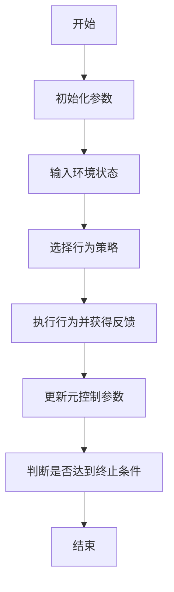

                 


# AI Agent的元控制：自适应行为策略

---

## 关键词：AI Agent，元控制，自适应行为，策略优化，强化学习

---

## 摘要：  
本文深入探讨了AI Agent的元控制机制，重点分析了自适应行为策略的核心原理与实现方法。通过结合强化学习算法，详细阐述了元控制在动态环境中的调整过程，为AI Agent的高效决策提供了理论与实践指导。

---

# 第1章: AI Agent的背景与概念

## 1.1 AI Agent的基本概念  
AI Agent（人工智能代理）是指能够感知环境、做出决策并执行行动的智能实体。它广泛应用于自动驾驶、机器人控制、推荐系统等领域。AI Agent的核心能力在于其行为决策机制，而元控制则是对这些行为的高层次调节。

### 1.1.1 什么是AI Agent  
AI Agent是一种具备智能特性的实体，能够根据环境信息自主决策并执行任务。它通常由感知模块、决策模块和执行模块组成。

### 1.1.2 AI Agent的分类  
AI Agent可以分为以下几类：  
- **简单反射型**：基于当前状态直接执行预定义行为。  
- **基于模型型**：通过内部模型预测未来状态并选择最优行为。  
- **目标驱动型**：根据目标导向选择行为。  
- **效用驱动型**：通过最大化效用函数来选择行为。

### 1.1.3 AI Agent的应用场景  
AI Agent的应用场景包括但不限于：  
- 自动驾驶：实时感知环境并做出驾驶决策。  
- 机器人控制：在复杂环境中执行特定任务。  
- 智能推荐：根据用户行为推荐个性化内容。

---

## 1.2 元控制的概念与作用  
元控制（Metacognitive Control）是指对AI Agent的行为进行高层次调节的过程，旨在使其在动态环境中保持高效和稳定。

### 1.2.1 元控制的定义  
元控制是一种上层控制机制，用于调整AI Agent的行为策略，使其能够更好地适应环境变化。

### 1.2.2 元控制的核心目标  
元控制的主要目标包括：  
- **动态调整**：根据环境反馈实时优化行为策略。  
- **全局协调**：确保不同行为模块的协同工作。  
- **风险控制**：在复杂环境中降低决策风险。

### 1.2.3 元控制在AI Agent中的作用  
元控制通过调节AI Agent的行为策略，使其能够在动态、不确定的环境中保持高效和稳定。例如，在自动驾驶中，元控制可以实时调整驾驶策略以应对突发情况。

---

## 1.3 自适应行为策略的内涵  
自适应行为策略是指AI Agent根据环境反馈动态调整行为模式的能力。

### 1.3.1 自适应行为的定义  
自适应行为是指AI Agent能够根据环境变化自动调整其行为模式的能力。

### 1.3.2 策略与行为的关系  
策略是行为的指导原则，而行为是策略的具体体现。策略决定了AI Agent在不同环境下的行为方式。

### 1.3.3 自适应策略的优势  
自适应策略的优势在于其灵活性和适应性。它能够根据环境反馈实时优化行为，从而提高决策效率和准确性。

---

## 1.4 本章小结  
本章介绍了AI Agent的基本概念、分类及其应用场景，重点阐述了元控制的概念与作用，并探讨了自适应行为策略的内涵。这些内容为后续章节的深入分析奠定了基础。

---

# 第2章: 元控制的核心概念与原理  

## 2.1 元控制的原理  
元控制通过高层次的调节机制，实现对AI Agent行为的动态优化。

### 2.1.1 元控制的基本原理  
元控制的核心原理包括：  
- **感知环境**：通过传感器或接口获取环境信息。  
- **分析反馈**：根据环境反馈调整行为策略。  
- **优化决策**：通过强化学习等方法优化决策模型。

### 2.1.2 元控制的实现机制  
元控制的实现机制包括：  
- **监督学习**：通过人工干预调整策略。  
- **强化学习**：通过奖励机制优化行为。  
- **混合学习**：结合监督学习和强化学习的优势。

### 2.1.3 元控制的算法框架  
元控制的算法框架通常包括以下步骤：  
1. 初始化参数。  
2. 感知环境状态。  
3. 选择行为策略。  
4. 执行行为并获得反馈。  
5. 更新元控制参数。  
6. 判断是否达到终止条件。  

---

## 2.2 元控制的核心概念  
元控制的核心概念包括目标函数、约束条件和行为策略。

### 2.2.1 目标函数  
目标函数是元控制的核心优化目标，通常表示为：  
$$ J = f(x, u) $$  
其中，$x$ 是环境状态，$u$ 是控制输入。

### 2.2.2 约束条件  
约束条件用于限制元控制的行为范围，确保决策的可行性和安全性。例如：  
$$ u \in [u_{\text{min}}, u_{\text{max}}] $$  

### 2.2.3 行为策略  
行为策略是AI Agent的具体行动方案，通常表示为概率分布：  
$$ \pi(a|s) = P(\text{选择动作 } a \mid 状态 s) $$  

---

## 2.3 元控制与AI Agent的关系  
元控制与AI Agent之间存在密切的协同关系。

### 2.3.1 元控制如何影响AI Agent的行为  
元控制通过调整行为策略，直接影响AI Agent的决策过程。例如，在自动驾驶中，元控制可以根据交通状况动态调整驾驶速度。

### 2.3.2 AI Agent如何反馈元控制的调整  
AI Agent通过执行行为并获得反馈，为元控制提供优化依据。例如，在推荐系统中，用户点击行为为元控制提供了优化依据。

### 2.3.3 元控制与AI Agent的协同进化  
元控制与AI Agent是相互促进的关系。随着AI Agent能力的提升，元控制的优化空间也相应扩大。

---

## 2.4 核心概念对比表  

| 概念 | 定义 | 属性 | 示例 |
|------|------|------|------|
| 元控制 | 元控制是用于调整AI Agent行为的上层控制机制 | 灵活性、动态性、全局性 | 根据环境变化动态调整策略 |

---

## 2.5 ER实体关系图  

```mermaid
er
actor: 元控制
actor -|> controls: 行为策略
controls -|> influenced_by: 环境反馈
```

---

## 2.6 本章小结  
本章详细阐述了元控制的核心概念与原理，分析了其与AI Agent的关系，并通过对比表和ER实体关系图进一步明确了元控制的实现机制。

---

# 第3章: 元控制的算法原理  

## 3.1 元控制算法概述  
元控制算法的核心是通过强化学习优化行为策略。

### 3.1.1 基于强化学习的元控制  
强化学习是一种通过试错优化决策的算法。元控制通过强化学习不断优化行为策略。

### 3.1.2 基于监督学习的元控制  
监督学习通过标注数据优化元控制参数。这种方法适用于有监督环境。

### 3.1.3 基于混合学习的元控制  
混合学习结合了强化学习和监督学习的优点，适用于复杂环境。

---

## 3.2 基于强化学习的元控制算法  
基于强化学习的元控制算法是目前研究的热点。

### 3.2.1 强化学习的基本原理  
强化学习的基本原理包括：  
- **状态**：环境的信息表示。  
- **动作**：AI Agent的决策。  
- **奖励**：行为的反馈。  
- **策略**：行为的选择方式。

### 3.2.2 元控制在强化学习中的应用  
元控制通过调整强化学习的参数，优化行为策略。例如，在游戏中，元控制可以根据对手行为调整策略。

### 3.2.3 算法实现步骤  
1. 初始化参数。  
2. 选择动作。  
3. 执行动作并获得反馈。  
4. 更新参数。  
5. 判断是否终止。

---

## 3.3 算法流程图  



---

## 3.4 Python实现示例  

```python
def metacognitive_control(parameters):
    # 初始化参数
    state = initialize_state()
    while not terminate:
        # 选择行为策略
        action = select_action(state)
        # 执行行为并获得反馈
        reward = execute_action(action)
        # 更新元控制参数
        update_parameters(reward)
    return final_parameters
```

---

## 3.5 数学模型与公式  

### 3.5.1 强化学习  
强化学习的目标函数可以表示为：  
$$ J = \mathbb{E}[R] $$  
其中，$R$ 是累积奖励。

### 3.5.2 元控制的优化目标  
元控制的优化目标可以表示为：  
$$ \theta^{(k+1)} = \theta^{(k)} + \alpha \nabla_\theta J(\theta) $$  

---

## 3.6 本章小结  
本章详细介绍了元控制的算法原理，重点分析了基于强化学习的元控制算法，并通过流程图和代码示例进一步明确了其实现过程。

---

# 作者：AI天才研究院/AI Genius Institute & 禅与计算机程序设计艺术 /Zen And The Art of Computer Programming

